# HOI4 Mod Setup combined planning package

This file combines the authoritative planning documents, prompts, schemas, examples, diagrams, living skills, subagents, GitHub templates, source audits, and validation notes. Repository-template duplicates and binary UI references are omitted.


---

## File: `README.md`

# HOI4 Mod Setup

HOI4 Mod Setup prepares a new or existing Hearts of Iron IV mod for development in Codex. It creates the launcher files, project structure, Codex instructions, selected workflows, and local validation needed to begin work without manual setup.

> **Status:** in development. Public builds will be published through GitHub Releases after the transaction, recovery, security, and platform gates pass.

## What you need

- Windows or macOS
- Hearts of Iron IV installed or a chosen local mod workspace
- a ChatGPT account with Codex access
- the official Codex client installed with App Server support
- internet access while signing in and downloading selected workflow components

HOI4 Mod Setup uses the Codex access included with the signed-in ChatGPT account. It does not ask for an OpenAI API key.

## New mods

Describe the mod in plain language. Codex proposes the project identity and setup, including:

- mod display name
- stable project ID
- script prefix and namespace
- short project description
- descriptor tags
- initial folder profile
- project-specific `AGENTS.md`
- recommended skills, subagents, and components

Every proposal is editable. Deterministic validation checks paths, identifier syntax, collisions, descriptor structure, and file safety before anything is written.

After approval, the app creates and validates:

- `<mod_project>/descriptor.mod`
- `<HOI4 user mod directory>/<project_id>.mod`
- `<mod_project>/thumbnail.png`
- the selected HOI4 folder scaffold
- `AGENTS.md`
- selected `.agents/skills/`
- selected `.codex/agents/`
- `.codex/config.toml`
- `<mod_project>/paradox_wiki/`
- selected documentation, scripts, validators, and templates
- `.hoi4-mod-setup/installation-lock.json`

The generated thumbnail is a replaceable local placeholder. Updates never overwrite a replacement silently.

## Existing mods

The app first runs a bounded read-only scanner over the selected project and approved companion paths. It detects descriptors, launcher registration, folder structure, Git state, identifiers, namespaces, naming patterns, localisation conventions, documentation, skills, subagents, Codex configuration, MCP configuration, and conflicts.

Codex then interprets the approved scan evidence and proposes project-specific conventions and installation choices. Findings remain separated as **Detected**, **Suggested by Codex**, and **Confirmed**.

## ChatGPT sign-in

The app opens the official ChatGPT sign-in flow through the local Codex App Server. Codex manages and refreshes its own authentication. HOI4 Mod Setup does not read, copy, store, or log ChatGPT tokens.

A browser flow is used by default. A device-code flow is available when the browser callback cannot complete. Signing out removes the active Codex session through the same official interface.

Setup analysis requires an authenticated ChatGPT session. Local recovery and rollback remain available when signed out.

## Safe installation and updates

No project file changes before dry-run approval. Every installation uses preflight, exact source resolution, selective download, checksum verification, dry-run review, backup, staging, validation, apply, post-install checks, readiness, and a rollback record.

Modified files receive a comparison and an explicit keep, replace, merge, rename, or skip choice. The same project can later be updated, repaired, reinstalled, rolled back, or have managed components removed.

## Optional workflows

### 3D models

The optional 3D workflow requires `MESHY_API_KEY`. The key stays in Windows Credential Manager or macOS Keychain and is injected only into the process that needs it. A missing key leaves the 3D workflow incomplete without blocking the normal mod setup.

### LoRA and ComfyUI portraits

Version 1 records interest only. It does not install or modify ComfyUI, models, LoRAs, Python environments, GPU software, or drivers.

## Privacy and security

- no telemetry in version 1
- no OpenAI API key field
- ChatGPT tokens remain owned by Codex
- approved text excerpts only are sent for semantic analysis
- secrets, binaries, Git objects, and credential stores are excluded
- downloads resolve to an exact source revision and are checked with SHA-256
- external commands appear in the dry run before execution
- user-modified files are never replaced silently

## Help, security, and contributing

Use [GitHub Issues](../../issues) for reproducible bugs and feature requests. Remove private paths, project content, and credentials before posting evidence.

Report vulnerabilities through [SECURITY.md](SECURITY.md). Contributor setup and Git instructions are in [CONTRIBUTING.md](CONTRIBUTING.md) and [DEVELOPMENT.md](DEVELOPMENT.md).

## License

A formal open-source license must be selected before the first public source release. The current decision record is in [LICENSE_SELECTION.md](LICENSE_SELECTION.md).

---

## File: `PACKAGE_README.md`

# HOI4 Mod Setup planning package

This package contains the implementation plan, schemas, examples, UI references, open-source repository files, coding prompts, `AGENTS.md`, living development skills, and bounded subagent templates for HOI4 Mod Setup.

The root `README.md` is deliberately user-facing. Contributor and package-maintainer material lives in separate files.

## Main contents

- `README.md`: user-facing application README
- `AGENTS.md`: application repository rules for Codex
- `GOAL_PROMPT.md`: standalone compact implementation goal
- `CONTRIBUTING.md`: contribution and Git workflow
- `DEVELOPMENT.md`: local development setup
- `RELEASING.md`: release and artifact publication
- `SECURITY.md`: vulnerability reporting and security expectations
- `CODE_OF_CONDUCT.md`: contributor conduct
- `CHANGELOG.md`: release-visible change history
- `LICENSE_SELECTION.md`: open-source license decision gate
- `.agents/skills/`: ten living development skill templates
- `.codex/agents/`: nine narrow project subagent templates
- `.github/`: issue forms, pull request template, CODEOWNERS, Dependabot, CI, security, and release workflows
- `docs/`: requirements, architecture, GitHub workflow, skills, subagents, testing, roadmap, risks, and prompts
- `schemas/`: JSON Schemas for project and transaction data
- `examples/`: validated example payloads
- `diagrams/`: Mermaid diagrams
- `ui-references/`: 17 full-resolution minimal desktop screen references
- `source-audit/`: source inventories and verification limits
- `scripts/`: repository template and secret-pattern validation
- `HOI4_MOD_SETUP_COMBINED.md`: combined text version
- `CHECKSUMS.sha256`: package-content checksums

## Important source decisions

- Workflow source repository: `klimPaskov/Agentic-HOI4-Modding`
- Inspected planning revision: `599497ea2f93612d9094461c6fde114fc87a5c0f`
- The application never clones the complete workflow source repository
- Latest and pinned modes record exact source commits
- The wiki installs under `<mod_project>/paradox_wiki/`
- Credentials stay outside the project repository
- Optional 3D and LoRA states never block core readiness
- Every mutation uses a staged and reversible transaction
- The desktop UI uses seven grouped phases and progressive disclosure
- The application source repository is designed for public GitHub development
- Repo-local skills are updated with the implementation

## Suggested reading order

1. `README.md`
2. `AGENTS.md`
3. `GOAL_PROMPT.md`
4. `docs/01_product_requirements.md`
5. `docs/02_user_flows.md`
6. `docs/03_scanner_design.md`
7. `docs/04_remote_repository_manifest.md`
8. `docs/14_transaction_rollback.md`
9. `docs/17_ui_accessibility.md`
10. `docs/26_open_source_github_workflow.md`
11. `docs/27_repo_local_skill_strategy.md`
12. `docs/28_agents_subagent_architecture.md`
13. `docs/30_codex_chatgpt_authentication.md`
14. `docs/24_coding_agent_prompt.md`
15. `docs/22_acceptance_criteria.md`

## Validation

From the extracted package root:

```bash
python -m pip install jsonschema PyYAML
python scripts/validate_repository_templates.py
python scripts/check_committed_secrets.py
sha256sum -c CHECKSUMS.sha256
```

The checksum file excludes itself and generated ZIP containers.

## Revision 3 additions

This revision makes ChatGPT-managed Codex authentication a core setup requirement and makes Codex responsible for every semantic project proposal. It also formalizes the launcher-ready new-mod output, including both `.mod` descriptors and the replaceable thumbnail placeholder.

## Revision 4 additions

This revision makes ChatGPT-authenticated Codex analysis mandatory for semantic setup, adds the official App Server integration contract, and promotes both descriptors plus `thumbnail.png` to first-class generated and lock-managed artifacts.

---

## File: `AGENTS.md`

# HOI4 Mod Setup repository instructions

This file governs development of the **HOI4 Mod Setup** desktop application. It does not govern a Hearts of Iron IV mod that the application prepares. The application may generate or adapt an `AGENTS.md` inside a target mod project, but that generated file is a separate artifact with separate ownership.

## 1. Product promise

HOI4 Mod Setup prepares a new or existing Hearts of Iron IV mod for agentic development in Codex.

Every implementation must preserve these promises:

- inspect before changing an existing project
- create a launcher-discoverable, game-loadable new project with both descriptors and a valid placeholder thumbnail
- keep deterministic facts separate from required Codex semantic proposals until the user confirms them
- never clone the complete Agentic HOI4 Modding source repository
- resolve latest mode to an exact commit before downloading files
- support immutable pinned commit or release installs
- download only selected manifest-declared files
- verify downloaded content before apply
- never overwrite a user-modified file silently
- keep credentials outside the target project and installation lock
- use staged, journaled, reversible transactions
- keep optional workflows non-blocking for core Codex readiness
- show honest unsupported and incomplete states
- keep the desktop interface restrained and task-focused
- support Windows and macOS without inventing unsupported platform routes

The source planning package, accepted architecture decisions, schemas, and tests are part of the product contract. A change that weakens one of these promises requires an explicit design decision and matching documentation.

## 2. Required reading

For a first implementation pass or a broad architectural change, read:

1. `README.md`
2. `GOAL_PROMPT.md`
3. `docs/01_product_requirements.md`
4. `docs/02_user_flows.md`
5. `docs/03_scanner_design.md`
6. `docs/04_remote_repository_manifest.md`
7. `docs/09_component_dependency_model.md`
8. `docs/10_merge_conflict_rules.md`
9. `docs/13_security_model.md`
10. `docs/14_transaction_rollback.md`
11. `docs/16_platform_architecture.md`
12. `docs/17_ui_accessibility.md`
13. `docs/20_testing_strategy.md`
14. `docs/22_acceptance_criteria.md`
15. `docs/26_open_source_github_workflow.md`
16. `docs/27_repo_local_skill_strategy.md`
17. `docs/28_agents_subagent_architecture.md`
18. `docs/30_codex_chatgpt_authentication.md` when authentication or analysis is involved
19. the repo-local skill that owns the current task

For a bounded change, read the owning skill and the directly relevant design documents. Do not scan unrelated source trees or generated artifacts when exact files are already known.

## 3. Source-of-truth order

Use this precedence when sources disagree:

1. explicit user instruction for the current task
2. accepted product requirement or architecture decision
3. JSON Schema and transaction invariants
4. owning repo-local skill
5. implementation tests and current verified behavior
6. general documentation
7. examples and UI references

Examples are not allowed to override schemas or security rules. Current implementation is evidence of behavior, not automatic approval to change the intended product.

## 4. Architecture boundary

The planned architecture is a Tauri desktop shell with a Rust core and a TypeScript React interface.

The Rust side owns:

- filesystem access
- path normalization and containment
- project scanning
- descriptor parsing and rendering
- source resolution and downloads
- manifest validation
- hashing and cache integrity
- merge planning
- transaction journal, backup, apply, resume, and rollback
- credential store integration
- external process allowlisting and execution
- Git operations
- MCP health checks
- readiness evaluation
- platform adapters

The React side owns:

- wizard navigation
- editable review state
- evidence and preview presentation
- conflict comparison interaction
- progress presentation
- readiness presentation
- accessible keyboard and screen-reader behavior

The UI must not perform direct filesystem writes, run external commands, access credentials, or decide whether a transaction is safe. It calls typed Tauri commands and renders returned state.

Keep core domain logic independent from UI components and platform APIs. Platform-specific code belongs behind explicit interfaces. Test the core with fake filesystem, source, credential, process, Git, and clock adapters.

## 5. Repository source rules

Use `https://github.com/klimPaskov/Agentic-HOI4-Modding` as the live workflow source.

The application must:

- resolve the repository default branch in latest mode
- resolve an exact commit before reading the install manifest
- use one revision for the manifest and all selected source files
- support exact commit and release pinning
- selectively fetch manifest-declared files or bundles
- verify SHA-256 before staging
- retain source revision and hash evidence in the installation plan and lock
- reject path traversal, duplicate destinations, platform mismatches, unsupported manifest majors, and checksum mismatch

The application must not:

- clone the complete workflow source repository
- search the computer for a local checkout
- mix files from different revisions
- trust filenames or remote redirects as integrity proof
- invent missing wiki provenance, license data, package names, commands, MCP servers, or platform support

Use `hoi4-mod-setup-source-manifest` for changes to this surface.

## 5A. ChatGPT authentication and Codex App Server

ChatGPT sign-in is a core prerequisite for Create, Import, Update, and Repair planning. Use the official local `codex app-server` process over stdio JSONL. Do not implement an OpenAI API key field or an application-owned OAuth service.

Required behavior:

- complete the App Server initialize handshake before account or thread requests
- read account state with `account/read`
- accept the normal product path only when the account type is `chatgpt`
- start browser login with `account/login/start` using `type = chatgpt`
- offer `chatgptDeviceCode` when the browser callback cannot complete
- wait for login completion and account update notifications
- use `account/logout` for sign-out
- let Codex own token persistence and refresh
- never inspect, copy, persist, or log ChatGPT tokens
- never write email, account ID, plan type, usage, or rate limits into a project or installation lock
- do not use the experimental externally managed token mode
- do not hardcode a model name for the normal path

Every semantic turn uses a dedicated thread, read-only sandboxing, approved inputs, and the current `codex-analysis` output schema. Codex proposes names, IDs, namespaces, descriptions, tags, folder profiles, project instructions, and component choices. Deterministic Rust validates and renders the final bytes after user confirmation.

Codex cannot write project files during analysis, approve a transaction, resolve conflicts automatically, or pass readiness checks. Missing authentication or usage availability blocks new planning. Recovery, rollback, backup inspection, and managed removal remain locally available while signed out.

Use `hoi4-mod-setup-codex-integration` for changes to this boundary.

## 6. Existing project scanner

The existing-project scan is read-only. It may read the selected project root and explicitly approved external descriptor paths. It must not create cache markers, temporary files, Git locks, or transaction folders inside the project during scan. The scanner is deterministic Rust code and owns all observable facts. Required Codex semantic analysis runs only after ChatGPT-managed authentication, receives only approved inputs, returns schema-validated proposals, and performs no writes.

Every finding needs:

- stable finding ID
- category
- status
- confidence
- evidence paths and excerpts or hashes
- proposed value or action
- editable user decision
- blocking or non-blocking severity

Low confidence is a visible state. Do not turn a guess into a detected fact. Label values as `Detected`, `Suggested by Codex`, or `Confirmed`. Codex proposals never override descriptor validity, hashes, paths, encoding, Git state, file existence, identifier validity, collisions, or other deterministic evidence.

Use `hoi4-mod-setup-project-scanner` for scanner changes.

## 7. Transaction contract

Every project mutation uses this ordered transaction:

1. preflight
2. repository source resolution
3. selective download
4. checksum verification
5. dry-run review
6. backup
7. staging
8. validation
9. apply
10. post-install checks
11. readiness report
12. rollback record

No shortcut may bypass backup, staging validation, or journal persistence. A successful lock file is written only after final verification.

Operations must be:

- deterministic
- idempotent where practical
- checkpointed
- resumable or explicitly roll-backable
- root-contained
- hash-aware
- safe under interruption

Fault injection at every stage and operation boundary is required for transaction changes.

Use `hoi4-mod-setup-transactions` for changes to plans, apply, recovery, repair, rollback, reinstall, or managed removal.

## 8. Merge and ownership rules

Managed content has one of four ownership types:

- `managed`
- `merged`
- `generated`
- `external`

Never silently replace a locally modified file. Compare base, local, and incoming content where a base exists. Offer only valid actions from keep, replace, merge, rename, and skip.

Binary files never use text merge. TOML and JSON use structured merge. `AGENTS.md` uses three-way merge plus project adaptation. A merge result must validate before apply.

## 9. Credential and process rules

Secrets belong in Windows Credential Manager or macOS Keychain. The project stores only a non-secret credential reference.

Never write a secret to:

- project files
- `.env` files generated by the app
- logs
- manifests
- installation plans
- installation locks
- crash reports
- analytics
- screenshots
- process previews
- Git history

Pass credentials only to an allowlisted child process through a scoped environment. Redact both known values and credential-shaped output before persistence or display.

Run processes through argument arrays. Do not construct shell command strings from user or manifest input. Show command, working directory, environment variable names, network access, expected writes, and privilege needs in dry run. Never display secret values.

Use `hoi4-mod-setup-security` for this surface.

## 10. Optional workflow rules

The 3D setup question must be exactly:

**Do you want to set up the 3D models workflow?**

A missing or invalid `MESHY_API_KEY` leaves the optional workflow incomplete and keeps core setup usable. Derive packages, commands, versions, adapters, Blender integration, and health checks from verified repository files. Do not invent a macOS route for a Windows-only repository workflow.

The portrait workflow question must be exactly:

**Do you want to set up LoRAs and ComfyUI for portrait generation?**

Version 1 records interest only. It must not download, install, configure, or modify ComfyUI, models, LoRAs, Python environments, GPU software, or drivers. It never reports installed or ready.

## 11. UI rules

Use the seven grouped phases:

- Project
- Review
- Components
- Integrations
- Git
- Install
- Ready

Each screen should normally contain:

- one title
- zero or one short supporting sentence
- one focal task
- no more than two visible content regions
- persistent Back and primary action controls where applicable

Hide evidence, full file lists, hashes, dependency graphs, logs, and advanced settings behind progressive disclosure. Do not explain obvious controls or repeat the same fact in several places.

The merge conflict screen may show more detail because the comparison is the task.

Meet WCAG 2.2 AA, complete keyboard operation, visible focus, reduced motion, non-color status cues, and 200 percent scaling.

Use `hoi4-mod-setup-ui-accessibility` for interface work.

## 12. Testing and validation

Use the repository scripts as the stable command surface. Do not make contributors memorize internal package commands that a script can own.

The expected test layers are:

- Rust unit and property tests
- parser and schema fuzzing
- integration tests with fake GitHub, filesystem, credential, process, and Git adapters
- transaction fault injection
- Windows and macOS end-to-end tests
- security tests
- UI accessibility and visual regression tests
- performance tests on small, medium, and very large projects

A change is incomplete when the relevant failure path is untested. Happy-path screenshots are not transaction, security, or recovery evidence.

Use `hoi4-mod-setup-testing` for test architecture and release-gate changes.

## 13. Open-source repository rules

Keep `README.md` user-facing. Contributor setup belongs in `CONTRIBUTING.md` and `DEVELOPMENT.md`. Release maintenance belongs in `RELEASING.md`. Security reporting belongs in `SECURITY.md`.

Use pull requests for `main`. Keep changes focused. Update documentation and the owning skill in the same pull request when behavior, commands, file locations, invariants, validation, or common failure modes change.

Do not commit:

- real credentials
- private mod projects
- signing keys or certificates
- notarization credentials
- generated release packages
- transaction backups
- local caches
- unredacted logs

Use `hoi4-mod-setup-open-source-release` for GitHub workflow, dependency update, release, packaging, and community-health changes.

## 14. Living skill contract

Repo-local skills are maintained implementation memory. They are not frozen templates.

Update the owning skill in the same pull request when a change introduces or alters:

- a repeated workflow
- an invariant
- a command
- a source path
- a schema or migration rule
- a platform difference
- a validation step
- a common failure and recovery method
- a security boundary
- a handoff format

Do not add one-off ticket details, temporary debugging context, or feature-specific prose to a general skill.

Before completion, run the skill ownership check described in `.agents/skills/hoi4-mod-setup-skill-maintenance/SKILL.md`.

## 15. Subagent routing

All custom subagents are spawned with `fork_context=false`. The parent prompt must contain the exact scope, files, constraints, accepted decisions, and handoff path.

Use:

- `hoi4setup_codex_integration_auditor` for ChatGPT authentication, App Server, structured analysis, and data-boundary audits
- `hoi4setup_source_manifest_auditor` for source, manifest, selective download, and wiki distribution audits
- `hoi4setup_scanner_auditor` for read-only scan evidence and classification audits
- `hoi4setup_transaction_recovery_auditor` for journal, apply, recovery, rollback, and fault-injection audits
- `hoi4setup_security_auditor` for credentials, process execution, filesystem containment, redaction, and supply-chain audits
- `hoi4setup_ui_accessibility_auditor` for bounded UI and accessibility audits or narrow fixes
- `hoi4setup_platform_release_auditor` for Windows, macOS, signing, notarization, packaging, and release evidence
- `hoi4setup_documentation_curator` for documentation-only consistency work
- `hoi4setup_skill_maintainer` for repo-local skill creation and updates

Subagents do not own final completion. The parent reviews every handoff and reruns the relevant final tests.

## 16. Completion report

For meaningful work, report:

- files changed
- product surfaces changed
- schemas or migrations changed
- security and credential impact
- transaction and rollback impact
- platform impact
- tests and fault scenarios run
- UI evidence when visible behavior changed
- documentation updated
- skills updated or a reason no skill update was needed
- subagent handoffs reviewed
- blockers, unsupported routes, and simplifications

Do not claim completion because the app builds or a single happy path works. Completion means the accepted behavior, failure handling, documentation, and relevant tests agree.

## 17. Codex integration completion gate

A task that changes authentication or semantic analysis is incomplete until browser login, device-code login, cancellation, logout, usage limits, App Server interruption, output-schema rejection, redaction, and no-secret persistence are covered by tests. Run `hoi4setup_codex_integration_auditor` before the parent claims the integration is complete.

---

## File: `GOAL_PROMPT.md`

# HOI4 Mod Setup goal prompt

Build **HOI4 Mod Setup**, an open-source Windows and macOS desktop wizard that creates launcher-ready Hearts of Iron IV mods and prepares new or existing projects for Codex development.

Read all supplied project instructions and references. Keep `README.md` user-facing.

All AI work must use the user's Codex subscription through ChatGPT sign-in via the local Codex app-server. Implement managed login, logout, and process supervision. Codex owns authentication. Never request an OpenAI API key, copy the auth cache, bill through the application, or switch providers.

Use Codex for natural-language interpretation, identity, namespaces, descriptor metadata, project profile, component selection, existing-project analysis, and AGENTS adaptation. Run analysis read-only with approved evidence. Require schema-valid output labelled Detected, Suggested by Codex, or Confirmed. Suggestions cannot write files or enter an installation plan before confirmation.

Create the project deterministically after confirmation. Generate and validate `<mod_project>/descriptor.mod`, `<HOI4 user mod directory>/<project_id>.mod`, a replaceable `<mod_project>/thumbnail.png`, the selected folder profile, a mod README, and selected workflow files. Preview these artifacts. Never fabricate a Workshop ID or silently overwrite a replaced thumbnail.

Use `https://github.com/klimPaskov/Agentic-HOI4-Modding` through a versioned manifest. Never clone it, require a checkout, or search for one. Latest mode resolves an exact commit. Pinned mode uses an immutable revision. Selectively download and SHA-256 verify every selected component and the offline wiki. Install the wiki at `<mod_project>/paradox_wiki/`. Do not invent dependencies, commands, support, provenance, or licensing.

Existing projects receive a bounded read-only scan of descriptors, launcher state, thumbnail, structure, Git, identifiers, naming, localisation, workflow files, Codex, MCP, paths, and conflicts. Send only approved text evidence to Codex and review findings in small groups.

Ask exactly **Do you want to set up the 3D models workflow?** Store the Meshy key in the OS vault, expose it only as `MESHY_API_KEY`, derive requirements from verified repository files, and keep a missing key non-blocking. Do not invent a macOS route.

Ask exactly **Do you want to set up LoRAs and ComfyUI for portrait generation?** Version 1 records interest only and installs nothing.

Never overwrite modified files silently. Compare base, local, and incoming versions. Offer keep, replace, merge, rename, or skip where valid. Use the full 12-stage journaled, staged, validated, reversible transaction. Recover from interruption and write the lock only after final verification.

Support update, repair, reinstall, rollback, managed removal, Codex reanalysis, Git initialize or preserve, `.gitignore` merge, branch choice, optional initial commit, and optional remote. Never create an online repository or push without separate approval.

Readiness verifies authenticated Codex, launcher artifacts, confirmed identity, structure, workflows, MCP, wiki, Git, hashes, conflicts, dependencies, and optional workflow states. Enable Open in Codex only when core checks pass. Recovery and rollback remain available while signed out.

Use the minimal dark seven-phase UI with compact authentication, one focal task per screen, keyboard navigation, WCAG 2.2 AA, reduced motion, and 200 percent scaling.

Implement a Rust core behind Tauri with a React TypeScript UI. Add app-server contract tests, migrations, property tests, fuzzing, fault injection, security, accessibility, and platform end-to-end coverage. Maintain the public GitHub repository, root AGENTS, living skills, and bounded subagents. Satisfy every acceptance criterion. Do not claim completion with unresolved authentication, launcher, recovery, platform, security, docs, or skill work.

---

## File: `CONTRIBUTING.md`

# Contributing to HOI4 Mod Setup

Thank you for helping build HOI4 Mod Setup. Contributions should preserve its main promises: read before write, no silent overwrite, exact source identity, secrets outside projects, reversible transactions, honest optional states, and a restrained desktop interface.

## Before starting

1. Read `README.md` for the user-facing product boundary.
2. Read `DEVELOPMENT.md` for the local toolchain.
3. Read the relevant documents under `docs/`.
4. Read `AGENTS.md` and the repo-local skill that owns the surface under `.agents/skills/`.
5. Search existing issues and pull requests before opening duplicate work.

## Git setup

Fork the repository when you do not have direct write access, then clone your fork:

```bash
git clone https://github.com/<your-account>/HOI4-Mod-Setup.git
cd HOI4-Mod-Setup
git remote add upstream https://github.com/klimPaskov/HOI4-Mod-Setup.git
git fetch --all --prune
```

Contributors with direct access may clone the canonical repository and use `origin` as the shared remote.

## Branches

Create one branch per focused change from the latest `main`:

```bash
git switch main
git pull --ff-only
git switch -c feat/short-description
```

Use these prefixes:

- `feat/` for user-visible capabilities
- `fix/` for defects
- `security/` for security hardening
- `refactor/` for behavior-preserving restructuring
- `test/` for test-only work
- `docs/` for documentation
- `chore/` for tooling and maintenance

Do not commit directly to `main`. Do not combine unrelated cleanup with a feature or fix.

## Commit messages

Use Conventional Commit style:

```text
feat(scanner): detect nested launcher descriptors
fix(transaction): preserve journal after interrupted apply
docs(readme): clarify supported release packages
test(security): cover symlink swap during staging
```

A commit should describe one coherent change. Use `git add -p` to avoid staging unrelated files.

## Keeping a branch current

Before opening or updating a pull request:

```bash
git fetch upstream
git rebase upstream/main
```

Resolve conflicts locally, rerun the required checks, then push the branch. Do not force-push shared branches. A force push to your own review branch is acceptable only with `--force-with-lease` and after checking that nobody else is using it.

## Pull requests

A pull request must include:

- the user or maintainer problem being solved
- the chosen design and important tradeoffs
- files and systems changed
- tests run and meaningful skipped tests
- screenshots for visible UI changes
- schema, migration, lock, or transaction impact
- security and credential impact
- documentation and skill updates
- known limitations and follow-up work

Keep pull requests reviewable. Split a large change by stable architectural boundary when each part can be merged safely.

## Required checks

Run the commands defined by the repository scripts. The planned baseline is:

```bash
corepack enable
pnpm install --frozen-lockfile
pnpm lint
pnpm typecheck
pnpm test
cargo fmt --check
cargo clippy --workspace --all-targets --all-features -- -D warnings
cargo test --workspace
```

UI changes also require the visual and accessibility checks defined in `docs/20_testing_strategy.md`. Transaction, merge, credential, source-resolution, and filesystem changes require the relevant fault or security suites.

## Skill maintenance

When a contribution changes a repeated workflow, command, invariant, file location, validation step, or common failure mode, update the owning repo-local skill in the same pull request. Do not put one-off feature decisions into general skills.

The meta workflow is defined in `.agents/skills/hoi4-mod-setup-skill-maintenance/SKILL.md` and `docs/27_repo_local_skill_strategy.md`.

## Agent and subagent workflow

The root `AGENTS.md` is authoritative for Codex work in this repository. Use the owning skill for recurring workflows. Spawn project subagents only when their narrow audit or documentation role materially improves confidence. Every subagent uses `fork_context=false` and receives explicit files, constraints, allowed writes, tests, and handoff path.

The parent contributor or agent reviews every subagent handoff and remains responsible for the pull request.

## Documentation

Keep the root `README.md` user-facing. Do not add build commands, branch policy, internal architecture, or contributor-only troubleshooting to it. Put those details in `CONTRIBUTING.md`, `DEVELOPMENT.md`, `RELEASING.md`, or `docs/`.

Update documentation in the same pull request when behavior, commands, configuration, schema, security policy, supported platforms, or release behavior changes.

## Security

Never commit real credentials, private project data, signing keys, Apple notarization credentials, Windows certificate material, or unredacted logs. Follow `SECURITY.md` for vulnerability reports.

## Merge policy

`main` should require a pull request, passing required checks, and review. Squash merge is the preferred default for ordinary contributions. Preserve a multi-commit history only when the commits are intentionally reviewable and useful independently.

---

## File: `DEVELOPMENT.md`

# Development setup

This document is for contributors building HOI4 Mod Setup from source. End users should use `README.md` and official GitHub Releases.

## Planned toolchain

- Git
- Node.js 22 or the version declared by the repository toolchain file
- Corepack and pnpm
- stable Rust toolchain
- Tauri platform prerequisites
- Python 3.13 or the version declared by repository automation for planning and schema validation

The repository must pin or declare tool versions before implementation depends on them. Do not copy a temporary local version into contributor instructions.

## Clone and prepare

```bash
git clone https://github.com/klimPaskov/HOI4-Mod-Setup.git
cd HOI4-Mod-Setup
corepack enable
pnpm install --frozen-lockfile
rustup update stable
rustup default stable
rustup component add rustfmt clippy
```

Read `AGENTS.md` before coding. Then read the repo-local skill that owns the current work.

## Planned source responsibilities

- React and TypeScript render the desktop wizard and editable review state.
- Tauri commands provide a typed boundary between the UI and Rust.
- Rust core modules own source resolution, scanning, merging, transactions, credentials, Git, MCP health, and readiness.
- Platform adapters own Windows and macOS differences.
- Schemas define persisted project, plan, lock, journal, scan, conflict, and readiness data.
- Tests use fake adapters so safety behavior can run without modifying real projects or using paid services.

The exact folder layout should be recorded in AGENTS and the owning skills after the source scaffold is accepted.

## Development commands

The repository should expose stable scripts for normal work:

```bash
pnpm lint
pnpm typecheck
pnpm test
pnpm test:e2e
pnpm tauri dev
cargo fmt --check
cargo clippy --workspace --all-targets --all-features -- -D warnings
cargo test --workspace
```

Transaction fault tests, security tests, accessibility tests, and release verification should also have repository-owned commands. Update this file and the owning skill when command names change.

## Planning and template validation

Before application source exists, or after changing planning, GitHub, AGENTS, skills, subagents, schemas, or examples:

```bash
python -m pip install jsonschema PyYAML
python scripts/validate_repository_templates.py
python scripts/check_committed_secrets.py
```

## Test projects

Use synthetic fixtures and temporary directories. Do not use a private personal mod as the only reproduction.

Fixtures should cover:

- clean new project
- established existing project
- malformed descriptors
- nested Git repositories
- dirty Git state
- pre-existing AGENTS, skills, subagents, Codex, and MCP configuration
- local modifications to managed files
- symlinks, junctions, case collisions, locked files, and cloud-synced folders
- large projects and large wiki trees

Never commit a real `MESHY_API_KEY` or a paid-provider response containing private data.

## Agent workflow

Repo-local skills under `.agents/skills/` are living workflow documentation. Update the owning skill in the same pull request when commands, paths, invariants, platform behavior, validation, or common recovery steps change.

Narrow subagents under `.codex/agents/` can audit source manifests, scans, transactions, security, UI, platforms, docs, or skills. They use `fork_context=false`, explicit scope, and handoffs under `docs/development/handoffs/`.

## UI development

Use the seven-phase navigation and minimal screen references. Do not turn developer diagnostics into permanent visible panels. Test keyboard behavior, focus order, screen readers, reduced motion, long paths, 200 percent scaling, and platform-specific file pickers.

## Platform work

Windows and macOS adapters must be tested on their actual platforms. Do not mark a route supported based only on compilation or similarity to another operating system.

Signing, notarization, credential stores, filesystem links, application paths, and Open in Codex behavior need clean-machine evidence.

## Git hooks

Local hooks may run formatting and quick tests, but repository correctness must not depend on an uncommitted local hook. CI remains the shared gate.

## Troubleshooting

When a command fails:

1. record the exact command and tool versions
2. determine whether the failure is source, dependency, platform, fixture, or environment related
3. reduce it to a synthetic reproduction
4. add a regression test when the failure belongs to the repository
5. update the owning skill when the recovery method is reusable

Do not put private absolute paths or secrets into issues or logs.

## Codex App Server development

A compatible official Codex installation is required for real authentication and semantic-analysis tests. Verify `codex app-server` before starting the desktop app. Ordinary CI uses redacted protocol fixtures and never uses a real ChatGPT credential.

Do not add tokens or account exports to `.env`, fixtures, snapshots, or logs. Manual authentication tests use a developer-owned ChatGPT account outside CI.

## Required auth fixtures

Development uses a fake App Server for normal tests. Real-account tests are opt-in and must not run in CI. The fake covers browser login, device code, account updates, usage limits, schema-valid turns, malformed turns, process exit, and redacted logs.

---

## File: `RELEASING.md`

# Release process

This process covers publishing HOI4 Mod Setup itself. It is separate from the Git features that the app configures inside users' mod projects.

## Versioning

Use semantic versions and tags in the form `vMAJOR.MINOR.PATCH`.

- Major: incompatible project-lock, manifest, transaction, or user-workflow changes
- Minor: backward-compatible features
- Patch: backward-compatible fixes and security hardening

Pre-releases use identifiers such as `v0.3.0-beta.1`.

## Release preparation

1. Confirm all required checks pass on Windows and macOS.
2. Confirm schema migrations and rollback behavior.
3. Confirm the remote workflow manifest is compatible with the application release.
4. Confirm user-facing README, release notes, support status, and known limitations.
5. Confirm every bundled dependency and notice required by the selected license policy.
6. Confirm no credentials or private paths are present in artifacts, logs, source maps, or debug symbols.
7. Update the changelog and version through the repository-owned release script.
8. Update affected repo-local skills when release, signing, packaging, or validation steps changed.

## Tag and build

Create the release through a reviewed release pull request. After merge, create an annotated tag from the verified `main` commit:

```bash
git switch main
git pull --ff-only
git tag -a vX.Y.Z -m "HOI4 Mod Setup vX.Y.Z"
git push origin vX.Y.Z
```

The tag workflow should build from that exact commit. Release jobs must not modify source and then publish uncommitted output.

## Required artifacts

- Windows signed installer or signed application package
- macOS signed and notarized application package for each supported architecture
- SHA-256 checksum file
- software bill of materials when the release pipeline supports it
- release notes
- source archive produced by GitHub from the tag
- signatures or provenance attestations when enabled

## Publication gate

Publish a draft release first. Verify installation, launch, update metadata, credential behavior, and artifact hashes on clean test machines. Promote the draft only after both platform owners approve.

## Rollback and withdrawal

Do not move or reuse a published tag. If an artifact is wrong, withdraw the release, publish a clear notice, fix the source, and create a new version. A security withdrawal follows `SECURITY.md` and the private advisory process.

## GitHub release environment

Use protected GitHub environments for stable release credentials. The release workflow must receive only the minimum platform-specific secrets and permissions required for its job. Fork pull requests never receive these secrets.

The repository-owned `pnpm release:build` and `pnpm release:verify` scripts are the stable automation surface. Implement and document them before enabling tag publication. When their behavior changes, update this file and `hoi4-mod-setup-open-source-release` in the same pull request.

## Public source gate

Do not publish the first public source release until `LICENSE` exists, third-party notices are reviewed, the user-facing README names the license, and the repository security and contribution files are active on the default branch.

## Codex integration release gate

Before a public build, verify compatible App Server startup, browser login, device-code fallback, logout, rate-limit handling, read-only analysis, output-schema rejection, redaction, no account data in project artifacts, and offline recovery. Do not use a real ChatGPT credential in public CI logs or release artifacts.

## Launcher and authentication artifact gate

Before publishing, test clean ChatGPT browser and device-code login, signed-out recovery, usage-limit handling, App Server interruption, output-schema rejection, and account-data redaction. Build fresh launcher-ready mods on Windows and macOS and verify both descriptors, the external path, thumbnail decoding, modification preservation, repair, and rollback.

---

## File: `SECURITY.md`

# Security policy

HOI4 Mod Setup reads and writes development repositories, downloads workflow files, manages optional credentials, and can run verified external tools. Security reports should be handled privately.

## Reporting a vulnerability

Use GitHub private vulnerability reporting when it is enabled for the repository. If it is unavailable, use the private security contact listed in the repository profile or release notes.

Do not open a public issue for:

- credential exposure
- path traversal or link escape
- arbitrary command execution
- unsafe archive extraction
- signature, checksum, or manifest bypass
- rollback data loss
- unintended overwrite of user files
- update-channel compromise
- release signing or notarization compromise

Include a concise reproduction, affected version, platform, impact, and any safe proof-of-concept files. Remove API keys, access tokens, private repository contents, usernames, and unnecessary absolute paths.

## Response expectations

Maintainers should acknowledge a report, reproduce it in a private branch, classify affected releases, prepare a fix and regression test, and coordinate disclosure. Exact response timelines should be published once the maintainer team and support capacity are known.

## Supported versions

Before the first stable release, only the latest published preview may receive security fixes. After stable release, the project should publish a support table here.

## Security requirements for contributions

- No secrets in source, tests, logs, fixtures, screenshots, examples, lock files, or crash reports
- No shell-string command construction for untrusted values
- Exact source revision and SHA-256 verification
- Root containment and symlink or junction defense
- Safe archive extraction limits
- Explicit transaction rollback evidence
- Credential store use instead of project configuration
- GitHub Actions permissions minimized per job
- Third-party actions pinned to reviewed immutable revisions before production use
- Release credentials limited to protected environments

## Public repository configuration

Enable private vulnerability reporting before the first public release. Keep the public issue forms free of vulnerability intake. Set default GitHub Actions permissions to read-only and grant release write permission only to the draft-release job.

The readable action tags in this planning package are templates. Review and pin production third-party actions to immutable revisions before stable release.

## ChatGPT authentication

HOI4 Mod Setup delegates authentication to Codex App Server. Reports involving copied tokens, account leakage, protocol logs with login URLs or device codes, API-key fallback, or semantic-analysis write access are security issues and should be reported privately.

## Codex token ownership

Codex owns ChatGPT token persistence and refresh. Reports should treat any application read, copy, log, support-bundle inclusion, project serialization, or lock serialization of Codex tokens as a security defect. The normal product has no OpenAI API-key fallback.

---

## File: `CODE_OF_CONDUCT.md`

# Contributor code of conduct

HOI4 Mod Setup welcomes constructive contributions from users and developers with different levels of experience.

Contributors are expected to:

- discuss ideas and reviews respectfully
- criticize code and design without attacking people
- provide reproducible evidence for technical claims
- avoid harassment, discrimination, threats, and deliberate disruption
- respect private security reports and user data
- accept maintainers' responsibility for scope, safety, and release decisions

Project spaces include issues, pull requests, discussions, reviews, release channels, and community spaces operated for this project.

Report conduct problems privately to the maintainer contact published by the repository. Maintainers may edit, hide, lock, or remove disruptive content and may restrict participation when necessary to protect the project and its contributors.

---

## File: `CHANGELOG.md`

# Changelog

All notable changes to HOI4 Mod Setup should be recorded here. The project follows semantic versioning once public releases begin.

## Unreleased

### Added

- Initial product and architecture planning package
- User-facing README and contributor documentation
- Open-source GitHub workflow templates
- Repo-local AGENTS, ten living skills, and nine bounded subagent templates
- ChatGPT-managed Codex App Server authentication and analysis contract
- Launcher-ready generation for both descriptors and `thumbnail.png`

### Changed

- All semantic project identity and convention proposals use the user’s ChatGPT Codex access
- Desktop UI references use a restrained seven-phase wizard with progressive disclosure
- Scan, plan, lock, project-state, and readiness schemas record the Codex and launcher boundaries

### Security

- Codex owns ChatGPT tokens and refresh
- No OpenAI API key or external-token fallback exists in the core product
- Account identity and usage data stay out of projects and locks
- Downloads resolve to exact source revisions and require SHA-256 verification

---

## File: `LICENSE_SELECTION.md`

# Open-source license decision

HOI4 Mod Setup needs a real `LICENSE` file before its first public source release. A public repository without an explicit license does not grant contributors and users the permissions expected from open-source software.

## Recommended decision

Choose one license after reviewing dependency compatibility and the desired contribution model.

| License | Useful when | Main consideration |
| --- | --- | --- |
| Apache License 2.0 | The project wants a permissive license with an explicit patent grant | Longer notice and attribution requirements |
| MIT License | The project wants a short permissive license | No explicit patent grant language |
| Mozilla Public License 2.0 | The project wants file-level copyleft while allowing larger combined works | Modified covered files must remain under MPL 2.0 |

The planning package does not choose a license on the maintainer's behalf.

## Release gate

Before the repository is described as released open source:

1. Add the selected license as `LICENSE` using the official unmodified text.
2. Update the `License` section in `README.md`.
3. Review all direct dependencies and bundled assets for compatible terms.
4. Add required third-party notices.
5. Include license and notice files in source and binary distributions.
6. Record the decision in an accepted architecture or governance note.

---

## File: `VALIDATION_REPORT.md`

# Validation report

## Result

The revision 4 planning package passed the package and repository-template integrity checks.

## Verified package contract

- ChatGPT sign-in is required for Create, Import, Update, and Repair planning.
- Semantic work uses the local Codex App Server and the user's ChatGPT-managed Codex access.
- The normal product has no OpenAI API key field, provider selector, or externally managed ChatGPT token path.
- Codex proposes semantic fields and returns schema-constrained output.
- Deterministic Rust validates facts, identifiers, paths, conflicts, descriptors, PNGs, plans, transactions, and readiness.
- New-project output includes the internal `descriptor.mod`, the external `<project_id>.mod`, a replaceable `thumbnail.png`, and the selected initial folder scaffold.
- Launcher and thumbnail files are included in plans, locks, conflicts, rollback records, and readiness evidence.
- Signed-out recovery, rollback, backup inspection, and managed removal remain locally usable.

## Automated validation performed

| Check | Result |
| --- | --- |
| Full package validator | Pass, Validated 12 integrity groups for full planning package. |
| Repository-template validator | Pass, Validated 12 integrity groups for repository template. |
| Secret-pattern scan | Pass, No committed secret patterns found. |
| JSON Schemas | Pass, 9 schemas parsed and 10 examples validated by the package validator |
| Subagent TOML | Pass, 9 files parsed |
| Living skill frontmatter and update triggers | Pass, 10 skills checked |
| Goal prompt | Pass, 3920 characters and all mirrors match |
| GitHub YAML | Pass, parsed by the package validator |
| User-facing README boundary | Pass |
| Markdown style | Pass, no em dash characters or semicolons |
| Mermaid source inventory | Pass, 10 diagram files present |
| UI references | Pass, 17 full-resolution PNG files retained |
| Frontend typecheck, lint, unit, accessibility, browser smoke | Pass |
| Cargo formatting and committed-secret scan | Pass |

## Manual implementation gates retained

The workspace now contains the Rust runtime core, ChatGPT/Codex App Server boundary, React/Tauri UI, and staged transaction implementation. It does not claim native packaging, live external integration, signing, notarization, launcher discovery, or clean-machine evidence until those gates run on supported hosts.

Runtime completion still requires:

- App Server protocol and authentication contract tests against the installed Codex version
- browser and device-code login tests
- Windows and macOS launcher-path integration tests
- generated descriptor and PNG fixture tests
- transaction interruption and rollback tests
- release signing and notarization evidence
- live HOI4 launcher discovery tests
- a journaled rollback boundary for high-impact optional external bootstrap actions when the source does not declare one

## Source verification limits

The supplied project Markdown, TOML, and CSV sources were previously loaded and indexed for this planning package. The live workflow repository was inspected at commit `27128a7b311d728a959afff7238a9aeeb9987f2b`. Its checked-in manifest still declares evidence for an older commit; the workspace uses an exact-revision bundled bootstrap manifest until upstream publication is corrected.

The body of every offline wiki article and every binary wiki or visual-reference asset was not individually inspected. Formal wiki licensing evidence was not verified. Those limits remain recorded in `docs/00_source_audit.md`.

---

## File: `docs/00_source_audit.md`

# Source audit and verification record

## Audit scope

This planning package uses two evidence sets:

1. The project files supplied with the request, including all Markdown skills, all supplied subagent TOML files, the project instruction file, the mechanics guide, and the current event, cluster, and scenario catalog CSV snapshots.
2. The live `klimPaskov/Agentic-HOI4-Modding` repository resolved to commit `599497ea2f93612d9094461c6fde114fc87a5c0f` on `main` on 25 July 2026.

Machine-readable inventories are in `source-audit/uploaded_sources_inventory.json` and `source-audit/live_repository_inventory.json`.

## Fully read and processed

The supplied text sources were loaded, parsed, section-indexed, and reviewed. This covers `AGENTS(4).md`, `CHAOS_REDUX_MECHANICS(4).md`, every supplied skill Markdown file, every supplied `chaosx_*.toml` subagent file, and all three supplied catalog CSV snapshots.

The live repository inspection covered every current generic skill and every current generic Codex subagent TOML resolved at the inspected commit. It also covered:

- `README.md`
- `AGENTS_template.md`
- `AGENTS_chaos_redux.md`
- `.codex/config.toml`
- the generic 3D skill and 3D subagent
- `.tools/3d_pipeline/bootstrap_3d_workflow.py`
- the Meshy and Blender wrapper commands
- the checked-in 3D dependency record
- the offline wiki directory structure and observed page names
- the wiki snapshot marker filename
- `.gitignore`
- the remaining cronjob documentation

## Verification limits

The body of every offline wiki article was not fully read. The installer design inspected the distribution, observed page set, required core page names, and snapshot marker. Binary media in the wiki and visual reference libraries were not individually inspected. Their paths, containment, hashes, and component ownership belong to installation validation.

No formal root `LICENSE` file or `paradox_wiki/LICENSE` file was found at the tested paths. The repository README contains permissive wording, but this package does not treat that wording as a verified formal license. The proposed manifest records repository license evidence as `declared_unverified` and wiki license status as `not_found`.

No formal HOI4 Mod Setup manifest was found at:

- `hoi4-mod-setup.manifest.json`
- `.hoi4-mod-setup/manifest.json`
- `setup/manifest.json`

The manifest in this package is proposed new repository infrastructure.

## Live repository inventory

| Group | Observed role |
| --- | --- |
| `.agents/skills/` | Generic reusable HOI4 workflows |
| `.codex/agents/` | Generic bounded Codex subagents |
| `.codex/config.toml` | Codex and MCP configuration example |
| `.tools/3d_pipeline/` | Optional 3D bootstrap and support files |
| `paradox_wiki/` | Offline Markdown snapshot and media |
| `AGENTS_template.md` | Mod-agnostic project instruction template |
| `AGENTS_chaos_redux.md` | Full project-specific example |
| `README.md` | Setup guidance and repository overview |

Generic skills reviewed:

- `hoi4-3d-model-pipeline`
- `hoi4-decisions-missions`
- `hoi4-events`
- `hoi4-feature-assets`
- `hoi4-feature-planning`
- `hoi4-focus-trees`
- `hoi4-frame-animation`
- `hoi4-improvement-loop`
- `hoi4-mtth`
- `hoi4-subagents`
- `hoi4-text-audio-research`

Generic subagents reviewed:

- `hoi4_3d_model_pipeline`
- `hoi4_asset_source_researcher`
- `hoi4_audio_researcher`
- `hoi4_country_package_auditor`
- `hoi4_decision_mission_auditor`
- `hoi4_documentation_curator`
- `hoi4_feature_completion_auditor`
- `hoi4_focus_tree_auditor`
- `hoi4_generated_feature_art`
- `hoi4_icon_artist`
- `hoi4_improvement_loop_planner`
- `hoi4_localisation_auditor`
- `hoi4_quote_remark_researcher`
- `hoi4_repo_explorer`
- `hoi4_scripted_system_architect`
- `hoi4_skill_maintainer`
- `hoi4_spreadsheet_doc_worker`

## Findings that shape the product

### Exact commit content must be authoritative

Repository directory pages and cached listings can lag or differ. The application must resolve a commit first and expand that exact tree. A branch directory listing alone cannot define an installation.

### Current MCP configuration is Windows-specific

The inspected `.codex/config.toml` uses `hoi4-agent-tools.cmd`. The application must not claim a verified macOS route until the repository declares and validates one.

### Current 3D setup is Windows-oriented

The bootstrap and wrappers use `.cmd`, PowerShell guidance, `winget`, `blender.exe`, Windows Program Files, and LocalAppData. The app must not invent Homebrew packages, shell scripts, Blender paths, or macOS commands. On macOS, this optional workflow is `unsupported_platform` until the repository adds a route.

### 3D version policy documentation has drift

The README describes pinned dependencies. The bootstrap resolves several dependencies at setup time and records observed versions and hashes. The app must show executable repository behavior as the source of truth, preserve the exact observed resolution in the project lock, and surface the wording mismatch to maintainers.

### Generic files still contain project-specific examples

Some reusable skills include absolute Chaos Redux paths or project-specific reference locations. The scanner must report them. AGENTS adaptation must replace, preserve by explicit approval, or remove them. They cannot become defaults for another mod.

### Wiki provenance is incomplete

The wiki is a Markdown and media tree with an observed marker `_last_updated_on_27_Nov_2025.txt`. No formal source or license metadata was verified. The app may install repository content, but it must show provenance as repository-only and licensing as unverified.

## Catalog observations

The supplied Chaos Redux event catalog snapshot contains hundreds of mixed-state records, including finished, new, needs-testing, blank, malformed, and shifted rows. The cluster and scenario snapshots contain smaller registries. This supports evidence-backed schema validation, explicit source ownership, and a rule against silent normalization. The application does not edit these catalogs during setup.

## Source precedence

1. The exact live repository commit defines the current reusable package.
2. Supplied project files define Chaos Redux-specific expectations and deeper examples.
3. Differences are recorded and reviewed. They are never silently resolved.
4. Repository scripts define actual executable behavior. Documentation remains guidance and evidence.

## Repository work required before production

- add a versioned installation manifest
- generate per-file SHA-256 or a signed release index
- declare platform support for command-bearing components
- add wiki source and license metadata when available
- map skills and subagents to install profiles
- define stable MCP health checks
- add preflight-only output to scripts that install external dependencies
- publish a machine-readable list of runtime-generated files

## Open-source GitHub repository references

The open-source repository additions were checked against current official GitHub documentation for repository customization and licensing, issue and pull request templates, CODEOWNERS, Dependabot version updates, and security policies on July 25, 2026.

The evidence inventory is stored in `source-audit/github_repository_practices.json`.

The package does not claim that repository settings, rulesets, signing environments, or private vulnerability reporting are active. Those require configuration in the final GitHub repository.

## OpenAI Codex integration verification, 2026-07-26

The official Codex App Server documentation was inspected for the product integration boundary. It identifies App Server as the deep product integration interface, documents stdio JSONL transport, ChatGPT-managed browser and device-code authentication, account state, rate-limit methods, and per-turn `outputSchema`.

The official ChatGPT plan help article confirms that users access Codex by signing in with their ChatGPT account and that availability and usage limits depend on current product policy.

The resulting product contract uses ChatGPT-managed authentication and does not request an OpenAI API key. Evidence is recorded in `source-audit/openai_codex_app_server.json`.

---

## File: `docs/01_product_requirements.md`

# Product requirements

## Product statement

**HOI4 Mod Setup** is a Windows and macOS desktop application that prepares a Hearts of Iron IV mod project for agentic development in Codex. It creates a new launcher-ready mod from a guided brief or imports an existing project through an evidence-backed read-only scan. It installs a selected workflow package from `klimPaskov/Agentic-HOI4-Modding` without cloning the complete source repository. Structural analysis is deterministic. Required Codex semantic analysis uses the user's ChatGPT-managed Codex access and produces reviewable proposals after the deterministic evidence is collected.

## Primary outcome

A successful core setup leaves the selected mod project with:

- a valid internal `descriptor.mod` inside the project
- a valid external launcher `<project_id>.mod` in the confirmed HOI4 user mod directory
- a deterministic, valid, replaceable `thumbnail.png` placeholder
- a readable profile-specific initial mod folder structure
- launcher discoverability without manual file creation or descriptor editing
- an adapted `AGENTS.md`
- selected generic HOI4 skills and helper files
- selected generic Codex subagents
- Codex configuration
- repository-declared MCP configuration
- selected scripts, validators, templates, and documentation
- an offline wiki under `<mod_project>/paradox_wiki/`
- optional Git initialization or preservation
- a project installation lock
- a readiness report
- **Open in Codex** enabled when every blocking requirement passes

## Target users

### New mod author

Needs the app to turn a normal-language idea into a safe initial project without requiring knowledge of every HOI4 folder or Codex file.

### Existing mod maintainer

Needs a read-only scan, small review steps, preservation of local conventions, conflict-aware merges, and reversible installation.

### Advanced workflow maintainer

Needs pinned installs, optional 3D support, exact provenance, update and repair, and full external-command visibility.

## Product principles

1. Selective source use.
2. Read before write.
3. Evidence over inference.
4. No silent overwrite.
5. Exact source identity.
6. Secrets stay outside the project.
7. Optional means non-blocking.
8. Package names and commands come from verified repository evidence.
9. Every apply is reversible.
10. Placeholder and unsupported states remain honest.
11. Deterministic facts and Codex proposals are never presented as the same evidence class.
12. A new project is not ready until both descriptors and the thumbnail pass validation.

## Codex subscription requirement

The user signs in with a ChatGPT account through the official local Codex App Server. The application uses the Codex access and limits attached to that account. It does not request an OpenAI API key and does not switch to API-key billing when the account is unavailable.

All semantic fields use Codex:

- normalized project description
- display name proposal
- project ID proposal
- script prefix and namespace proposal
- descriptor tag proposal
- initial folder profile proposal
- `AGENTS.md` adaptation
- skill and subagent recommendations
- existing-project purpose and convention analysis
- semantic conflict explanation

The deterministic core validates syntax, collisions, paths, hashes, descriptors, PNG files, encodings, Git state, manifest rules, and transaction safety. The user confirms each proposal before rendering.

The core integration is `codex app-server` over stdio JSONL. Authentication uses the App Server managed ChatGPT browser flow with device-code fallback. Codex owns tokens and refresh. No ChatGPT credential or account identity is stored in the target project or installation lock.

## Functional requirements

### Project selection

The welcome screen offers **Create a new mod** and **Import an existing project**. Recent projects are application-local. The app never searches the whole computer for a source repository or mod project.

### New project creation

Collect and review:

- ChatGPT sign-in through Codex App Server and required Codex semantic analysis
- natural-language mod description
- display name
- stable project ID
- project folder
- supported game version
- initial version and tags
- internal `descriptor.mod` preview
- external launcher `<project_id>.mod` preview and destination
- generated `thumbnail.png` preview and placeholder style
- initial folder profile
- source mode
- selected components
- optional workflows
- MCP and credential choices
- Git choices

No file is created before dry-run approval. After approval, the transaction creates the project root, internal descriptor, external launcher descriptor, thumbnail placeholder, selected folder profile, and selected workflow components. The new mod must appear in the HOI4 launcher and load as an empty or scaffolded local mod without manual file creation, assuming the selected HOI4 user directory is valid.

#### Launcher-ready artifact contract

- `descriptor.mod` lives inside the project root.
- `<project_id>.mod` lives in the user-confirmed Hearts of Iron IV `mod` directory.
- The launcher descriptor contains the canonical absolute project path using platform-correct escaping.
- The descriptors share the reviewed name, version, supported game version, tags, and picture reference where applicable.
- The app does not fabricate `remote_file_id` or another Workshop identity.
- `thumbnail.png` is rendered deterministically from a bundled template, previewed before apply, decoded after staging, and tracked by hash.
- The placeholder remains managed until the user modifies or replaces it. Updates and repairs never overwrite a modified thumbnail silently.
- A thumbnail conflict offers Keep, Replace, Rename, or Skip. A valid existing thumbnail can satisfy readiness.
- The selected profile creates real directories such as `events/`, `common/`, `localisation/english/`, `gfx/`, `interface/`, and `docs/` where appropriate. The profile does not create map or history surfaces unless selected.

### Existing project import

The user selects one root. The scanner detects:

- folder structure
- both descriptors
- Git state
- IDs and namespaces
- file and folder naming patterns
- localisation naming and encoding
- documentation
- skills and helper tools
- subagent TOMLs
- `AGENTS.md`
- Codex configuration
- MCP definitions
- absolute paths and project-specific examples
- conflicts with incoming components
- launcher descriptor registrations and thumbnail state

Findings are grouped into reviewable steps and can be accepted, edited, rejected, or deferred when the value is not needed for generation. Deterministic findings remain authoritative for observable facts.

### Required Codex semantic analysis

A valid ChatGPT-authenticated Codex analysis is required before Create, Import, Update, or Repair can produce an installation plan.

- Launch the official local `codex app-server` and use its stdio JSONL transport.
- Use App Server managed ChatGPT browser login with device-code fallback.
- Use the Codex access attached to the signed-in ChatGPT account.
- Do not expose an OpenAI API key field, API-key fallback, provider selector, or external-token mode in the core product.
- Do not hardcode a model. Use the compatible model selected by Codex configuration and workspace policy.
- Preview the exact structured findings and text excerpts before each turn.
- Exclude binaries, secrets, credential stores, Git objects, unapproved paths, and unrelated content.
- Require output that validates against `schemas/codex-analysis.schema.json`.
- Use Codex for project identity, description, namespace and prefix proposals, tags, folder profile, AGENTS adaptation, component selection, convention interpretation, and semantic conflict explanations.
- Keep paths, hashes, descriptor validity, PNG validity, encodings, Git state, identifier syntax, collisions, manifest checks, and transaction safety under deterministic Rust ownership.
- Label values as `Detected`, `Suggested by Codex`, or `Confirmed`.
- Require deterministic validation and user confirmation before file rendering.
- Preserve the draft when sign-in, usage, process, or schema validation fails. Start no transaction.

Recovery, rollback, backup inspection, and managed removal remain available while signed out.

### Remote source resolution

Use GitHub API and raw endpoints. Never clone Agentic-HOI4-Modding.

Latest mode resolves the default branch to an exact commit, fetches the manifest at that commit, and records it. Pinned mode accepts an exact commit or immutable release identity.

### Component selection

Each component shows:

- source and destination
- selected state
- dependencies
- platform support
- required tools and environment variables
- estimated size
- conflict state
- validation rules
- update behavior

Required dependencies are selected automatically and remain visible.

### Offline wiki

Install under `<mod_project>/paradox_wiki/`. Verify path containment, every declared hash, required page coverage, media policy, snapshot marker when declared, and link integrity. Show source and licensing evidence without invention.

### Optional 3D workflow

Ask exactly:

**Do you want to set up the 3D models workflow?**

When yes:

- explain Meshy.ai and possible provider cost
- store the key in Windows Credential Manager or macOS Keychain
- record only an opaque credential reference
- inject the key as `MESHY_API_KEY` into approved processes
- validate presence and non-empty state without printing it
- install only repository-declared 3D components
- use repository-declared packages, versions, commands, adapters, and health checks
- include the workflow in dry-run and readiness

A missing key leaves the optional workflow incomplete and does not block core setup.

### LoRA and ComfyUI placeholder

Ask exactly:

**Do you want to set up LoRAs and ComfyUI for portrait generation?**

Version 1 records interest only. It creates no download, install, model, Python, ComfyUI, LoRA, GPU, or driver operation. Readiness reports `planned_unavailable` and never claims success.

### MCP setup

Show source, capabilities, platform support, tools, environment variables, command preview without secrets, installation state, health result, and update policy. Never invent an unsupported platform command.

### Git setup

Support initialize, preserve, or skip. Support `.gitignore` merge, branch selection, optional initial commit, and optional remote. Never create an online repository or push without a separate explicit approval.

### Transactional installation

All installs and updates use:

1. preflight
2. repository source resolution
3. selective download
4. checksum verification
5. dry-run review
6. backup
7. staging
8. validation
9. apply
10. post-install checks
11. readiness report
12. rollback record

### Maintenance

Support update, repair, reinstall, rollback, managed removal, optional-workflow changes, and later Meshy credential configuration.

### Readiness

Check the internal descriptor, external launcher descriptor, external destination, descriptor agreement, thumbnail existence and decoding, selected structure, AGENTS, skills, subagents, Codex, MCP, wiki integrity and page coverage, Git, environment variables, hashes, conflicts, external dependencies, 3D state, and LoRA placeholder state. ChatGPT authentication and confirmed Codex analysis are blocking core checks.

Open in Codex is enabled only when blocking core checks pass.

## Non-functional requirements

### Reliability

- interrupted setup can resume or roll back
- operation-level apply is idempotent
- optional failures cannot corrupt core setup
- retry does not duplicate descriptors, Git rules, or MCP tables

### Performance

- first scan findings within one second for a typical mod
- progress streams for large projects
- bounded hashing and parser concurrency
- cancellable work
- immutable download cache

### Security

- no secret in logs, files, previews, manifests, locks, crash reports, or analytics
- path traversal and link escape protection
- exact commit and SHA-256 verification
- external commands only from verified sources
- no administrator or root requirement for core setup

### Privacy

No telemetry in version 1. Recent projects and scan findings stay local.

### Interface clarity and accessibility

The wizard uses seven grouped phases instead of one step per screen. Each screen has one focal task, one title, no more than one supporting sentence, and no more than two visible content regions by default. Evidence, file lists, hashes, logs, dependency graphs, and advanced controls use progressive disclosure. The interface does not explain ordinary controls or repeat the same fact in several places.

Full keyboard operation, visible focus, WCAG 2.2 AA contrast, screen-reader semantics, reduced motion, text plus icon statuses, and usable 200 percent scaling are required.

## Out of scope in version 1

- editing HOI4 gameplay content
- installing Steam or HOI4
- whole-computer mod discovery
- Steam Workshop publishing
- automatic online Git repository creation or push
- automated LoRA or ComfyUI installation
- invented macOS MCP or 3D commands

## Open-source application repository

HOI4 Mod Setup itself is developed as a public GitHub project.

The source repository must include:

- a user-facing root `README.md`
- a real open-source `LICENSE` before public release
- contributor, development, security, conduct, and release documentation
- issue forms and pull request template
- CODEOWNERS for sensitive surfaces
- protected `main` through a GitHub ruleset
- CI for planning integrity, frontend, Rust, security, and supported platforms
- Dependabot configuration for npm, Cargo, and GitHub Actions
- tag-based draft release automation
- root `AGENTS.md`
- maintained repo-local skills under `.agents/skills/`
- bounded subagents under `.codex/agents/`

Contributor-only build and governance information must stay out of the user-facing README.

Repo-local skills are living implementation memory. A pull request that changes a repeated workflow, command, path, invariant, schema, platform rule, validation step, or recovery method updates the owning skill in the same change.

## Core authentication readiness

A setup session is core-ready only when a compatible App Server is initialized, ChatGPT-managed authentication is active, required semantic analysis validates against the current schema, and every required proposal is confirmed. Optional 3D and LoRA workflow states remain independent.

---

## File: `docs/02_user_flows.md`

# Complete user flows

## Common entry

1. Start the app.
2. Check for an incomplete local transaction.
3. Open recovery first when a journal is incomplete.
4. Otherwise show Welcome.
5. Start the local Codex App Server and read account state.
6. Require ChatGPT sign-in before Create, Import, Update, or Repair planning.
7. Display current remote source status without downloading selected components yet.
8. Choose new or existing project.

## ChatGPT sign-in flow

1. Start the local Codex App Server.
2. Read current account state.
3. When signed out, show one compact **Sign in with ChatGPT** action.
4. Open the returned browser URL.
5. Wait for the login completion event.
6. Offer the device-code path when the browser callback fails or the user selects it.
7. Show the active account and continue without exposing tokens.
8. Preserve recovery and rollback access when sign-in is unavailable.

The app does not show an OpenAI API key field.

## New mod flow

### Natural-language description

The user describes the mod. The app verifies ChatGPT authentication and sends the approved brief and wizard constraints to a schema-constrained Codex turn. Codex proposes the normalized description, display name, project ID, script prefix, namespace, tags, folder profile, likely systems, 3D relevance, and component selection. Deterministic validators check every field. The user edits and confirms the proposals before rendering.

### Identity and paths

Confirm display name, stable project ID, project folder, version, supported game version, tags, and launcher descriptor destination. The project ID uses a lowercase stable slug and remains independent of future display-name changes.

### Descriptors

Preview and validate `descriptor.mod`, `<project_id>.mod`, and `thumbnail.png`. Check duplicate keys, quoting, supported-version syntax, project path, destination, descriptor consistency, picture reference, PNG decoding, dimensions, and replacement policy.

### Folder profile

Propose a minimal editable structure. A total conversion can include bookmarks, map, and history. A focused event mod can start with `events/`, `localisation/english/`, `common/`, `interface/`, `gfx/`, `docs/`, and tests. The transaction creates the selected directories. Missing unselected folders are not defects.

### Source and components

Choose latest, pinned commit, or pinned release. Select components and review automatically selected dependencies.

### Optional workflows

Ask both exact questions. A missing 3D key can be deferred. LoRA and ComfyUI interest can be recorded.

### MCP, credentials, and Git

Review server requirements, credential storage, external commands, Git mode, ignore rules, branch, optional commit, and optional remote.

### Dry run and apply

Show every create, merge, replace, rename, skip, external command, Git action, source revision, hash, disk estimate, and rollback rule. Next stays disabled while a blocking conflict is unresolved.

Run the 12-stage transaction. Verify the launcher descriptor resolves to the project, both descriptors agree, the thumbnail decodes, and the selected scaffold exists. Then show readiness and Open in Codex.

## Existing project flow

### Root selection

The user selects one explicit root. The scanner does not search sibling drives or unrelated folders.

### Read-only scan

Run staged detectors with progress and current-path evidence. Cancellation stops reads and discards unapproved profile state.

### Review sequence

1. identity and descriptors
2. folder structure
3. IDs, namespaces, and naming
4. localisation conventions
5. documentation and project rules
6. skills and helpers
7. subagents
8. Codex and MCP
9. Git
10. conflicts and platform limits

Every deterministic finding shows value, confidence, evidence path, line or file set, impact, and recommendation. Required Codex suggestions show the approved input manifest, model metadata when reported by App Server, linked deterministic evidence, and separate confidence. The user can accept, edit, reject, or defer non-required proposals. Every field required for planning must be confirmed.

### Existing AGENTS.md

When present, compare previous installed base when available, local content, and incoming template. Preserve project restrictions. Highlight stale absolute paths, foreign project names, missing skill references, and security-sensitive changes.

### Existing Codex and MCP

Parse TOML structurally. Show root settings, server IDs, commands, cwd, environment bindings, timeouts, sandbox, and approval policy. Never concatenate blind text fragments.

### Existing Git

Report repository root, branch, detached state, clean or dirty state, staged and untracked files, remotes, submodules, hooks, and ignore files. Do not change Git during scan.

### Conflict review and install

Resolve each path with keep, replace, merge, rename, or skip. Binary files do not offer text merge. The dry run reflects the selected outcome exactly.

## 3D selected with valid key

1. Explain provider credit use.
2. Store the key in the OS vault.
3. Validate presence and non-empty state.
4. Resolve repository 3D components.
5. Show repository-declared tools and commands.
6. Run approved preflight and health checks.
7. Record observed versions, package IDs, hashes, and results.
8. Mark ready only when selected requirements pass.

## 3D selected without a key

1. Keep the core plan valid.
2. Store no empty or placeholder secret.
3. Optionally install the workflow shell when approved.
4. Skip key-dependent actions.
5. Mark `incomplete` with a clear reason.
6. Offer Configure key in Update and Repair.

## 3D declined or unsupported

Declined produces no 3D-only operations. Unsupported platform state is shown before dry run. The app never translates commands by guesswork. Neither state blocks core Codex readiness.

## LoRA and ComfyUI placeholder

1. Show the exact question.
2. Explain setup is unavailable.
3. Save interest when selected.
4. Generate zero ComfyUI, model, Python, GPU, or driver operations.
5. Show `planned_unavailable` in readiness.

## Update flow

1. Verify ChatGPT authentication and the Codex App Server.
2. Load the lock.
3. Verify current local hashes.
4. Resolve target revision and fetch its manifest.
5. Run required Codex review for semantic changes to project instructions, component choices, or conventions.
6. Compare base, local, and incoming.
7. Show component and dependency changes.
8. Review conflicts and confirm semantic decisions.
9. Approve dry run.
10. Execute a new transaction.
11. Refresh lock and rollback record.

## Repair flow

Verify ChatGPT authentication before creating a repair plan. Classify managed files as healthy, missing, corrupted, or modified. Restore only missing or corrupted unmodified files automatically after review. Modified files enter conflict review. Re-run component health and readiness.

## Removal flow

Show reverse dependencies, solely owned files, merged files, and modified files. Default to preserving merged and modified content. Update the lock and create a rollback record.

## Recovery flow

Before apply, offer resume, rollback, or discard staging. After apply starts, verify operation checkpoints and offer resume or rollback. Never delete backup material before a verified terminal state.

## Codex proposal review flow

1. Show the approved input manifest.
2. Start a read-only schema-constrained Codex turn.
3. Reject malformed responses.
4. Display proposals with short reasons.
5. Run deterministic validation over names, IDs, namespaces, tags, and profiles.
6. Let the user edit and confirm each required field.
7. Create the installation plan only after confirmation.
8. Preserve the draft if authentication, usage, or App Server state interrupts the turn.

---

## File: `docs/03_scanner_design.md`

# Project scanner and required Codex analysis

## Purpose and authority

The scanner creates an evidence-backed project profile without changing the selected project. It receives one explicit root. Companion paths outside the root are allowed only when user-confirmed, such as the launcher descriptor, vanilla game directory, or credential vault.

The scanner is deterministic Rust code. It is the sole authority for observable structural facts, including file existence, descriptor validity, paths, hashes, encodings, Git state, identifiers, namespaces, and conflicts. Read-only means no project writes, metadata normalization, Git index operations, package installation, launcher changes, or commands that create project caches.

## Two-layer analysis contract

The Rust scanner produces observable facts. The Codex App Server produces semantic proposals from approved facts and text excerpts.

The deterministic layer owns file inventory, descriptors, launcher registration, thumbnail decoding, Git state, identifier indexes, encoding, component inventory, conflicts, and platform support.

The Codex layer owns project purpose, normalized description, display name and ID proposals, prefix and namespace proposals, folder profile, `AGENTS.md` adaptation direction, component recommendations, convention interpretation, and concise conflict explanation.

The Codex layer uses ChatGPT-managed authentication, a user-reviewed input manifest, a read-only turn, and `schemas/codex-analysis.schema.json`. It has no write access.

## Deterministic scan phases

### 1. Filesystem boundary

Detect canonical root, case sensitivity, future write capability, links, large directories, descriptors, and approved external destinations. Do not follow a symlink or junction outside the root.

### 2. Descriptors, launcher registration, and thumbnail

Parse the internal `descriptor.mod` and approved external launcher descriptors with a dedicated key-value parser. Detect name, path, supported version, version, tags, picture, duplicate keys, invalid quoting, mismatch, missing files, duplicate launcher registrations, and multiple descriptors pointing to the same project.

Resolve the referenced thumbnail inside the project. Decode it with a memory-safe image library, record dimensions and color mode, hash it, and classify it as missing, valid, invalid, managed placeholder, or user-modified.

### 3. Folder structure

Create a normalized tree summary, standard HOI4 surface list, counts, and representative files. Missing optional folders are not defects.

### 4. Git

Use read-only Git commands to detect repository root, branch, detached state, commit, modified, staged, untracked, remotes, submodules, sparse checkout, worktrees, and ignore behavior.

### 5. IDs and namespaces

Index event namespaces, focus IDs, decision IDs, scripted effects and triggers, ideas, characters, country and cosmetic tags, technologies, localisation keys, sprite names, and file prefixes. Return frequency, coverage, exceptions, and confidence.

### 6. Naming patterns

Detect lowercase snake_case, feature folders, ID and slug patterns, prefix placement, localisation filenames, docs folders, asset folders, plans, and handoff conventions.

### 7. Localisation

For every file record encoding, BOM, language header, duplicate keys, prefix distribution, filename pattern, line endings, and parse errors. Setup reports these states and does not repair them silently.

### 8. Documentation and instructions

Find AGENTS, READMEs, source-of-truth statements, specs, plans, manifests, absolute paths, foreign project names, and references to missing skills or agents.

### 9. Skills

Parse frontmatter, description, companion skills, helper files, scripts, asset directories, commands, absolute paths, project-specific tokens, and MCP operation references. Detect incoming ID collisions.

### 10. Subagents

Parse name, description, model settings, sandbox mode, instructions, referenced skills, ownership, fork-context rules, duplicate names, and project-specific paths.

### 11. Codex and MCP configuration

Parse TOML structurally. Detect approval policy, sandbox mode, document size, feature flags, server IDs, command, args, cwd, environment, timeouts, duplicate IDs, and platform-specific executable suffixes.

### 12. Conflict synthesis

Combine scan evidence with the selected remote manifest. Produce path, namespace, platform, dependency, ownership, generated-destination, launcher-registration, thumbnail, and Git risk conflicts.

## Required Codex semantic review

The Codex pass runs only after a completed deterministic scan or after a user enters a new-project brief. It is a separate analysis layer and never a scanner phase.

### AI used

The application uses the official local `codex app-server` and the user’s ChatGPT-managed Codex account. It does not expose a provider selector, hardcode a model, ship an application-owned AI credential, or require an API key.

### Consent and input preview

Before invocation, show a request manifest containing every scan field and text excerpt that would be provided. The user can remove entries or cancel. Allowed inputs include normalized scan JSON, the mod description, selected descriptor and README excerpts, AGENTS and skill frontmatter, TOML excerpts, localisation headers, representative naming samples, and incoming component metadata.

Exclude binaries, secrets, credential stores, `.git/objects`, files outside approved roots, ignored secret files, and any content the user deselects.

### Allowed suggestions

Codex may suggest:

- project purpose and scope
- primary namespace or prefix candidate
- relevant component and skill selection
- AGENTS adaptation choices
- naming and localisation conventions
- suitable initial folder profile
- project-specific paths that require review
- conflicts or ambiguities that require human judgment

Codex cannot override deterministic facts, create installation operations, write files, select conflict resolutions, or mark readiness checks passed.

### Result states

- `detected`: deterministic and evidence-backed
- `codex_suggested`: semantic inference awaiting review
- `confirmed`: accepted or edited by the user

Codex output must validate against a strict response schema. Store only non-secret audit metadata, approved input field or path names, model identifier when reported by App Server, response hash, validated suggestions, timestamps, and user decisions. Do not request, expose, or store hidden chain-of-thought.

Codex missing, signed out, usage-limited, cancelled, failed, or malformed-response states block creation of a new installation plan. They preserve the deterministic scan and local draft. Recovery, rollback, backup inspection, and managed removal remain available.

## Evidence model

```json
{
  "id": "namespace.primary",
  "category": "namespace",
  "key": "primary_namespace",
  "value": "cwc",
  "origin": "deterministic",
  "status": "needs_review",
  "evidence": [
    {
      "detector": "identifier_frequency",
      "path": "events/",
      "confidence": 0.91,
      "note": "91 percent of custom identifiers use cwc"
    }
  ]
}
```

Evidence excerpts are hashed. Large result sets store counts plus a separate evidence file.

## Confidence

- 1.00: explicit user selection or exact descriptor field
- 0.90 to 0.99: strong repeated deterministic pattern
- 0.70 to 0.89: plausible deterministic pattern requiring review
- below 0.70: suggestion only

Codex suggestion confidence is stored separately and never increases deterministic confidence.

## Incremental cache

Cache file metadata and hashes in application data. Before installation, recompute every touched local hash. Cache is advisory and cannot prove conflict state.

## Large repositories

Use bounded concurrency, exclude `.git/objects` and known caches, stream phase and path progress, support backpressure, keep temporary evidence outside the project, and cancel promptly.

## Required fixtures

- empty new project
- normal existing mod
- local AGENTS rules
- mixed localisation encodings
- multiple namespaces
- nested worktree
- cloud-synced root
- link escape
- locally modified wiki
- skill name collision
- MCP ID collision
- macOS project with Windows-only incoming component
- valid descriptors with a missing thumbnail
- mismatched external launcher path
- duplicate launcher descriptor for the same project root
- invalid and user-modified thumbnails
- ChatGPT sign-out, login cancellation, device-code fallback, usage limits, App Server interruption, malformed response, and schema-valid suggestions
- proof that Codex suggestions cannot replace deterministic findings

## App Server session data

The scan result may store analysis ID, input digest, output digest, proposal keys, model identifier when reported, and confirmation state. It must not store account email, account ID, ChatGPT plan, rate-limit details, tokens, raw thread history, or hidden reasoning.

---

## File: `docs/04_remote_repository_manifest.md`

# Remote repository and manifest design

## Purpose

The remote manifest is the installation contract between Agentic-HOI4-Modding and HOI4 Mod Setup. The proposed discovery path is:

```text
hoi4-mod-setup.manifest.json
```

A release may later provide the same manifest and a compact file index as signed assets.

## Latest mode

1. Query repository metadata.
2. Read the current default branch.
3. Resolve it to a commit SHA.
4. Fetch the manifest at that exact commit.
5. Validate schema and revision declaration.
6. Expand only selected component trees at the same commit.
7. Fetch selected files.
8. Verify SHA-256.
9. Record commit, manifest hash, and file hashes.

Latest mode becomes reproducible after installation because the lock records the exact commit.

## Pinned modes

Pinned commit accepts a full immutable commit and fetches everything from that revision. Pinned release resolves a release to immutable assets or a commit and records both when available. Mutable branch-only references are rejected as pinned installs.

## No clone

Use GitHub metadata, commit, tree, contents, raw, and release endpoints. Never run `git clone` for Agentic-HOI4-Modding. A repository-declared external dependency script may use Git for its own dependency only after dry-run disclosure and approval.

## Component contract

Each component defines:

- stable ID and display name
- category and optional state
- platforms
- source kind, path, includes, and excludes
- destination path and ownership
- dependencies
- tools and environment variables
- expected files and hashes
- conflicts and conflict policy
- validation
- update behavior
- capabilities and notes

The complete schema is `schemas/remote-manifest.schema.json`.

## Source kinds

### File

One repository file maps to one destination or template transformer.

### Tree

A selected subtree expands at the resolved commit. Every resolved file receives a plan row and SHA-256. The installer still downloads only selected trees.

### Generated

The application creates a reviewed output such as a descriptor, adapted AGENTS, or preference state.

## Destination ownership

- `managed`: remote file, replace only when local matches installed hash
- `merged`: base and result recorded for future three-way or structured merge
- `generated`: recreated from reviewed state with preview
- `external`: outside project through an explicit adapter and backup

## Hash model

SHA-256 is the content-integrity source. Git blob SHA may be recorded as additional evidence. The plan stores source revision, source path, source hash, size, destination, local hash, previous base hash, and deterministic result hash when available.

## Path security

Reject absolute project destinations, parent traversal, reserved Windows names, Unicode identity collisions, links that escape the root, case collisions, alternate data streams, and two sources mapping to one destination.

## Platform support

A component supports `windows`, `macos`, or `all`. `all` requires verified command variants for both platforms. Current evidence supports platform-neutral text components, but the current `hoi4-agent-tools.cmd` and 3D wrappers are Windows-specific.

## Tools and environment

A tool declaration includes required state, version policy, version when pinned, user-visible commands, and health checks. A secret environment variable must use OS credential-vault storage and cannot request project-file storage.

## Validation

Built-in declarative validators include exists, SHA-256, JSON Schema, TOML parse, localisation BOM, directory coverage, approved command health check, and named application validators. Repository scripts remain high-impact external actions.

## Update behavior

Each component declares replacement strategy, obsolete-file handling, local-addition policy, and repository-script ownership. Removed files are deleted only when the lock proves sole ownership and current content is unmodified.

## Bootstrap decision

Because the live repository has no manifest, production should add the manifest before app release. A temporary built-in bootstrap manifest is possible, but it creates a second source of truth and should be short-lived.

## Compatibility

- unknown major schema blocks
- unknown optional component can be shown unsupported
- removed IDs remain recognized for migration and uninstall
- pinned commit cache is immutable after hash verification
- latest branch metadata uses short TTL and ETag

---

## File: `docs/05_wiki_installation.md`

# Offline wiki installation and update design

## Verified distribution

The live repository stores the offline Hearts of Iron IV Paradox wiki as a `paradox_wiki/` tree containing Markdown pages, a `media/` directory, and an observed marker named `_last_updated_on_27_Nov_2025.txt`.

No formal wiki source manifest or license file was verified at the inspected revision. The application must display that limitation and must not invent a source, official status, or license.

## Destination

```text
<mod_project>/paradox_wiki/
```

The destination is the default because the project instructions and skills refer to it. The user can review the path, but moving it requires corresponding project-instruction adaptation.

## Installation

1. Expand only `paradox_wiki/` at the selected commit.
2. Reject entries outside that subtree.
3. Download Markdown and media files.
4. Verify SHA-256 for every file.
5. Build a complete staging tree.
6. Check required page coverage.
7. Check declared media policy.
8. Apply transactionally.
9. Record every installed file in the lock.

A future release bundle is allowed only when the remote manifest declares its URL, hash, internal index, and extraction rules. The application does not invent an archive source.

## Required core page coverage

The remote manifest should require exact filenames for at least:

- Data structures
- Triggers
- Effects
- Modifiers
- Localisation
- Scopes
- On actions
- Event modding
- Decision modding
- Idea modding
- AI modding

Selected skills can add page requirements. Examples:

- focus work adds National focus modding
- GUI work adds Interface modding and Scripted GUI Modding
- 3D work adds Graphical asset modding and Entity modding
- country creation adds Country creation and State modding
- technology work adds Technology modding

Readiness shows each page, declaring component, path, hash, and status.

## Media policy

The manifest chooses one:

- `all_declared`: every media file in the resolved component index is required
- `referenced_only`: only media referenced by installed Markdown is required
- `none`: media is intentionally excluded

For the current repository tree, `all_declared` is the safest first policy because later agent work may need pages and images not referenced by the initial core subset.

## Link validation

Check that relative links remain within `paradox_wiki/`, referenced media exists, path case matches, and no unresolved extraction path appears. Broken external links are warnings because the snapshot is intended to work offline.

## Provenance display

Show repository, commit, marker filename, source metadata state, and license metadata state. At the inspected revision:

- source status: repository-only
- license status: not found

These are evidence states, not legal conclusions.

## Update

1. Compare old and target indexes.
2. Replace unmodified managed files.
3. identify local modifications.
4. Show added and removed pages.
5. Show required-coverage changes.
6. Preserve locally added files.
7. Require a choice for modified managed pages.

A modified page can use three-way merge when a previous base exists. The safer default is keep local or install incoming under a renamed review path.

## Repair and removal

Repair restores missing or corrupted unmodified files at the locked revision. Modified files remain untouched until review. Removal deletes only unmodified managed files, preserves local additions and modifications, then removes empty component-owned directories.

## Performance

Use bounded downloads, streaming hashes, immutable cache reuse, same-volume staging when possible, and aggregate plus per-file progress.

## Readiness

The wiki is blocking when selected by the core profile. Missing required pages or failed hashes block Open in Codex. Unverified provenance or license metadata remains a visible warning rather than an integrity failure.

---

## File: `docs/06_optional_workflow_architecture.md`

# Optional workflow architecture

## Goal

Optional workflows use the same component, transaction, update, and readiness architecture as core components. They differ in selection and blocking policy.

## Workflow interface

Every optional workflow provides:

- metadata and question text
- explanation
- platform support resolver
- dependencies
- credential requirements
- preflight
- plan contribution
- health checks
- readiness contribution
- update and repair actions
- removal behavior
- migration behavior

## State model

| State | Meaning |
| --- | --- |
| `not_selected` | User declined |
| `selected_pending` | Selected, setup not complete |
| `ready` | Selected requirements passed |
| `incomplete` | Files may exist, but a requirement is missing |
| `interest_recorded` | Preference saved without install capability |
| `planned_unavailable` | Product has no implementation yet |
| `unsupported_platform` | No verified route for the current platform |
| `removed` | Previously managed workflow removed |

## Blocking policy

Optional checks use `blocking: false` for the core readiness gate. A selected workflow can still fail its own Ready state. The final report separates:

- core ready for Codex
- 3D workflow state
- LoRA and ComfyUI state

This prevents a missing provider key from blocking normal Codex use and prevents an incomplete workflow from looking ready.

## Dependencies

Selecting a workflow expands its dependency DAG. Automatically selected dependencies remain visible with an explanation. Deselecting a required dependency either deselects the workflow or explains the reverse dependency.

## External actions

Optional workflows can add commands only when the manifest or verified repository script declares them. The dry run shows executable, args with secrets removed, cwd, source, affected paths, network behavior when known, risk level, and rollback boundary.

## Credentials

Only opaque references enter project state or lock files. The secret remains in the OS vault and is read into memory only for an approved process.

## Future workflows

A new workflow should require no wizard redesign. The manifest adds a component and the UI renders question, explanation, dependencies, credentials, readiness, and maintenance actions.

The LoRA and ComfyUI placeholder deliberately uses this interface so a future implementation can replace `planned_unavailable` without changing the main flow.

## Acceptance rules

- declining generates no hidden operations
- unsupported commands never run
- missing credentials are never serialized as empty strings
- state persists across update and repair
- removal respects reverse dependencies
- core and optional readiness remain distinct

---

## File: `docs/07_3d_meshy_credentials.md`

# 3D workflow setup and credential design

## Verified repository surface

The inspected route includes:

- `.agents/skills/hoi4-3d-model-pipeline/SKILL.md`
- `.codex/agents/hoi4_3d_model_pipeline.toml`
- `.tools/3d_pipeline/bootstrap_3d_workflow.py`
- `.tools/3d_pipeline/wrappers/run_meshy_mcp.cmd`
- `.tools/3d_pipeline/wrappers/run_blender_lab_mcp.cmd`
- `.tools/3d_pipeline/config/dependencies.lock.json`

The workflow requires a non-empty `MESHY_API_KEY` before provider work. It specifies one final Meshy reference image, provider lineage, Blender processing, PDX materials, `io_pdx_mesh`, skeletal actions, export, reimport evidence, and parent-owned runtime wiring.

HOI4 Mod Setup installs and verifies this route. It does not replace the production pipeline.

## User question

**Do you want to set up the 3D models workflow?**

When yes, explain:

- Meshy.ai requires an API key
- provider actions may consume credits
- the key stays outside the project
- approved processes receive it as `MESHY_API_KEY`
- setup can be completed later
- platform support comes from the remote manifest

## Secret storage

### Windows

Use Windows Credential Manager. Protect fallback metadata with DPAPI. Store service name, credential label, opaque reference, creation time, and last validation time. Do not default to persistent user environment variables.

The repository's PowerShell command can be displayed as a manual fallback, but the desktop app should prefer the credential vault and process injection.

### macOS

Use Keychain Services with an application-scoped service and account label. Do not edit shell profiles.

## Validation

### Local check

- reference resolves
- value is non-empty after whitespace handling
- value never returns to UI after initial entry

### Provider or MCP check

Run only through the repository-declared route. Report initialize result, safe account or balance result when declared, and sanitized error category. Never show environment dumps, headers, or command strings containing a secret.

## Process injection

1. Resolve credential reference.
2. Read the secret into protected memory.
3. Build child environment with `MESHY_API_KEY`.
4. Spawn only the approved executable and arguments.
5. Redact diagnostics and crash context.
6. Drop the value after process creation and result handling.

The lock stores only an opaque reference and state.

## Repository bootstrap behavior

The inspected script gates on the key, discovers local tools and Blender, may ensure Node and `uv`, resolves Meshy package metadata, resolves Blender MCP source, resolves `io_pdx_mesh`, may download external dependencies, writes Codex MCP configuration, writes dependency evidence, and runs bridge checks.

These are high-impact external actions. The app shows them in dry run and executes the verified script only after approval.

## No invented tools

Never substitute another Meshy package, Blender MCP, exporter, adapter, version, installation command, or health check. An absent route produces `unsupported_platform` or `required installation/verification`.

## Platform behavior

The inspected route is Windows-oriented. The manifest example marks it Windows-only. On macOS, show the workflow, explain the limitation, keep core setup usable, and do not translate commands by guesswork.

## Health matrix

| Requirement | Check |
| --- | --- |
| Meshy key | credential exists and non-empty |
| Python | approved executable and invocation |
| Git | executable and version output |
| Node and npx | executable and package route |
| Blender | executable, build, extension location |
| Blender MCP | source revision, add-on, bridge |
| `io_pdx_mesh` | release, archive hash, installation |
| Codex MCP config | TOML parse and initialize |
| 3D skill and subagent | files and hashes |

## Missing-key flow

Install the selected workflow shell only when approved, skip key-dependent actions, mark `incomplete`, show Configure key in Update and Repair, and keep Open in Codex enabled when core checks pass.

## Repair actions

- configure or replace key
- rerun dependency preflight
- rerun MCP health
- reinstall repository files
- rerun bootstrap
- inspect generated dependency evidence
- remove 3D-only components

## Logging

Allowed: credential reference, present or missing, health status, sanitized task IDs from later production use.

Forbidden: value, prefix, suffix, hash, environment dump, authorization header, or revealing length.

---

## File: `docs/08_lora_comfyui_boundary.md`

# Future LoRA and ComfyUI integration boundary

## Version 1 contract

The wizard asks:

**Do you want to set up LoRAs and ComfyUI for portrait generation?**

Version 1 may record interest. It must not:

- download ComfyUI
- find or modify an existing ComfyUI installation
- install Python or packages
- create a Python environment
- download checkpoints, VAEs, LoRAs, ControlNets, upscalers, or custom nodes
- change GPU drivers or acceleration settings
- alter model directories
- edit workflows
- report installed or ready

## State

```json
{
  "workflow.lora_comfyui_interest": {
    "state": "planned_unavailable",
    "reason": "Automated setup is not implemented in version 1."
  }
}
```

The preference is non-blocking and appears in readiness.

## Architecture boundary

A future implementation plugs into the optional-workflow interface. It can add a real manifest component, platform support, dependency graph, model registry, distribution source, custom-node lock, workflow templates, health checks, storage estimates, GPU checks, and credentials.

Component selection, dry run, transaction, lock, update, repair, and readiness remain unchanged.

## Future safety requirements

A real implementation must define:

- authoritative ComfyUI source
- exact commit or release policy
- model licenses and sources
- per-model hashes
- custom-node sources and hashes
- Python and package lock
- GPU backend compatibility
- disk limits
- external folder ownership
- rollback rules for shared model storage
- identity and privacy handling for input portraits

## Migration

A later release may migrate `interest_recorded` or `planned_unavailable` to `eligible` and then `selected_pending`. Migration preserves the user's preference and never starts downloads automatically.

## UI rules

Say automated setup is unavailable, interest can be recorded, no files or software will change, and the state does not block setup. Do not show a fake success or a disabled Install action that implies a temporary failure.

---

## File: `docs/09_component_dependency_model.md`

# Component dependency model

## Entities

### Component

A versioned installable unit from the remote manifest.

### Dependency edge

A directed requirement. The expanded graph must be acyclic.

### Profile

A named default set such as Core or Core plus 3D.

### Tool requirement

An external executable or package with version policy and health checks.

### Environment requirement

A named variable with secret and storage policy.

### Validation rule

A pass, warning, or blocking check.

## Resolution

1. Verify the required Codex App Server capability, ChatGPT authentication, and confirmed semantic analysis.
2. Start from profile defaults and confirmed user selections.
3. Add transitive dependencies.
4. Detect cycles.
5. Resolve platform support.
6. Mark blocked or unsupported nodes.
7. Compute reverse dependencies.
8. Produce install order.

The UI shows why every automatic dependency is selected.

## Suggested component set

| ID | Ownership | Default | Current support |
| --- | --- | --- | --- |
| `codex.app_server` | required external capability | yes | Windows and macOS when compatible Codex is installed |
| `project.launcher_scaffold` | generated and external files | new projects | all |
| `core.agents` | merged template | yes | all |
| `core.skills` | managed tree | yes | all |
| `core.subagents` | managed tree | yes | all |
| `codex.config` | structured merge | yes | all |
| `mcp.hoi4_agent_tools` | MCP and external tool | verified profile | current repository Windows route |
| `wiki.snapshot` | managed tree | yes | all |
| `docs.repository_reference` | docs | optional | all |
| `workflow.3d` | optional workflow | no | current repository Windows route |
| `workflow.lora_comfyui_interest` | preference | no | all |

## File ownership

A file has one primary component. Shared output such as `.codex/config.toml` records structured contributions so removing one component does not delete unrelated local servers.

### Managed

Remote content with per-file lock records.

### Merged

Stores previous base and result for future three-way or structured merge.

### Generated

Built from reviewed state and previewed.

### External

Outside project through a dedicated adapter and backup.

## Structured destinations

TOML uses semantic tables and keys. JSON uses schema-aware paths and identity keys for arrays. AGENTS uses three-way text merge plus project adaptation. Directory trees use independent per-file ownership.

## Platform resolution

A component is supported only when its platform declaration and every command-bearing dependency have a verified route. Unsupported optional components remain visible. A macOS core profile can omit or warn on a current Windows-only MCP component while still installing platform-neutral instructions, skills, subagents, Codex base config, and wiki.

## Readiness aggregation

State derives from file integrity, dependencies, tools, environment, platform, conflicts, and validation. ChatGPT authentication, confirmed Codex analysis, and required launcher artifacts flow into the core Open in Codex gate. Unselected or incomplete optional workflows do not.

## Removal

A component cannot be removed while another selected component depends on it. Shared merged destinations remove only the selected component's contribution.

## Update dependency changes

New dependencies are shown and approved. Removed component files are deleted only when unmodified and solely managed. A changed command, package source, or credential requirement always receives review.

---

## File: `docs/10_merge_conflict_rules.md`

# Merge and conflict rules

## Core rule

Never overwrite a user-modified file silently.

Every touched path is classified with:

- base: previous installed content from the lock
- local: current project content
- incoming: target repository content or generated output

## Classification matrix

| Base | Local | Incoming | Default result |
| --- | --- | --- | --- |
| absent | absent | present | create |
| known | equals base | changed | replace after dry-run approval |
| known | changed | equals base | keep local |
| known | equals incoming | changed from base | accept current result and refresh lock |
| known | changed | changed | conflict |
| unknown | present | present | user-owned conflict |

## Resolution options

### Keep

Leave local content. Record a local override or skipped path.

### Replace

Back up local content and install incoming.

### Merge

Build a three-way or structured preview and validate it before selection.

### Rename

Install incoming at a reviewed alternate path. Validate references or report that the file is review-only.

### Skip

Do not install. Skipping a required file can block component readiness.

## Text merge

Use diff3. Normalize line endings only for comparison and preserve the selected result style. Show base, local, incoming, merged preview, unresolved regions, and validation.

Do not write conflict markers into the live project unless the user explicitly exports an unresolved merge for manual work.

## AGENTS.md

Preserve project restrictions and valid local paths. Highlight foreign project names, stale absolute paths, references to missing skills or agents, unresolved template tokens, and security-sensitive settings. Validate final size against Codex project-document limits.

## TOML

Parse tables and keys. Show semantic changes for approval policy, sandbox mode, model settings, project-document limits, feature flags, and every MCP server field. A duplicate server ID with a different command is a conflict.

## JSON

Use schema-aware object merge. Arrays require a manifest-declared identity key. Unknown array semantics require manual review.

## Binary files

Offer keep, replace, rename incoming, or skip. No automatic text merge.

## Directory and link conflicts

A file-directory collision blocks until resolved. Show symlink or junction targets. Never replace through a link that leaves the allowed root.

## Bulk decisions

Apply to similar is allowed only when component, ownership, base state, local state, incoming action, and file type match. Show the exact affected count.

## Validation

- no unresolved text markers
- TOML and JSON parse
- no AGENTS template tokens
- destination remains inside root
- renamed references are handled
- result hash is recorded

## Persistence

Store choice and result hash in the lock. Reuse a prior choice only when base, local, and incoming conflict signatures are identical.

---

## File: `docs/11_mcp_setup.md`

# MCP setup

## Goal

MCP setup is derived from repository evidence. The app exposes each server's purpose, installation source, requirements, environment, state, and health.

## Current evidence

The inspected `.codex/config.toml` contains `hoi4_agent_tools` with command `hoi4-agent-tools.cmd`. The README describes a global npm install. The 3D bootstrap adds Meshy and Blender-related entries through repository wrappers.

These findings drive the example manifest. They do not authorize macOS equivalents.

## MCP component fields

- server ID and display name
- capabilities
- source component
- platform support
- command and args
- cwd rule
- environment bindings
- required tools
- install source and version policy
- startup and tool timeouts
- health operation
- removal behavior

## Structured merge

Parse `.codex/config.toml` and preserve unrelated local servers. Validate command, cwd, secret handling, timeouts, duplicate IDs, and platform support.

Security-sensitive root values such as `approval_policy` and `sandbox_mode` receive explicit review. They are not copied silently.

## Health check

1. Start the approved server with a sanitized environment.
2. Send MCP initialize.
3. Verify protocol response.
4. List tools or capabilities when safe.
5. Stop cleanly.

Do not run paid or mutating provider actions as generic health checks unless the repository declares a safe operation.

## Capability display

The current HOI4 Agent Tools documentation describes focus, event, technology and doctrine, weighted logic, scripted GUI, and map support. Show these as declared capabilities. Refine them with the live tool list and never invent a missing viewer.

## Credentials

Display only name, required state, secret state, source, and available or missing. Never display the value after entry.

## Status model

- not selected
- unsupported platform
- tool missing
- install planned
- installed, health not run
- healthy
- degraded
- blocked

## Update

Compare version policy, package evidence, command, configuration, environment requirements, and live tool list. Any package-source, command, or credential change requires review.

## Removal

Remove only managed configuration contributions. Do not automatically uninstall a global package that may be shared by other projects. Report its external state instead.

## Security review

Highlight global package installation, network code download, writes outside the project, broad Codex sandbox settings, and servers that receive secrets.

---

## File: `docs/12_git_setup.md`

# Git setup

## Modes

### Initialize

Verify that no existing Git root controls the folder. Create `.git` only during apply. Merge `.gitignore`, set the selected initial branch, stage only the approved set, and make an initial commit only when selected.

### Preserve

Keep history, branches, remotes, hooks, attributes, submodules, and worktree configuration. Do not switch branch or stage unrelated changes.

### Skip

Add no Git operation to the plan.

## `.gitignore`

Preserve existing order and comments where practical. Add managed rules in a marked block:

```gitignore
# BEGIN HOI4 Mod Setup managed rules
.hoi4-mod-setup/backups/
.hoi4-mod-setup/cache/
.tools/3d_pipeline/vendor/
# END HOI4 Mod Setup managed rules
```

Secrets never belong in the project, so ignore rules are defense in depth.

## Branch and commit

Default new repositories to `main` while allowing another valid name. Do not rename an existing branch without a separate action.

Preview initial commit contents. The project lock should normally be committed because it defines reproducibility and contains no secret. Transaction backups and caches remain ignored.

## Remote

Allow optional remote name and URL. Validate and preview the exact action. Do not authenticate, create an online repository, or push during normal setup.

## Push policy

Never push automatically. A future publish action must show remote, branch, commits, force state, and credentials method. Force push is outside the version 1 setup flow.

## Rollback

Remove a transaction-created `.git` only when no later user commit exists. Never delete an existing repository. Restore pre-setup files through the normal backup.

## Dirty tree

A dirty tree is a warning rather than an automatic block. Recommend a commit or backup and list touched files that already have Git modifications.

## Readiness

Report repository present or intentionally skipped, branch, clean or dirty, remote selected or not, initial commit result, ignored managed files, and tracked secret-like paths.

## Distinction from the application source repository

The rules above describe Git actions that HOI4 Mod Setup may perform inside a user's mod project.

Development of HOI4 Mod Setup itself follows `docs/26_open_source_github_workflow.md`, `CONTRIBUTING.md`, and `RELEASING.md`. The application source repository uses protected `main`, pull requests, CI, CODEOWNERS, dependency updates, and tag-based releases. Those maintainer rules must never be applied automatically to a user's mod project.

---

## File: `docs/13_security_model.md`

# Security model

## Threats

- path traversal
- malicious symlink or junction
- command injection
- compromised remote content
- secret leakage
- unsafe package installation
- privilege escalation
- overwrite of user work
- parser resource exhaustion
- dependency confusion
- mutable source references

## Trust boundaries

### Local project

Untrusted input. Parsers must be bounded. Project files cannot define commands.

### Remote manifest

Trusted only after exact revision resolution, schema validation, integrity checks, and policy validation. It can request only supported declarative actions.

### Repository scripts

Executable content. Always shown as high-impact external actions with source path and hash. Run only after approval.

### OS credential vault

Trusted secret boundary. Project data receives opaque references only.

### External tools

Git, Node, Python, Blender, Codex, and MCP servers run as separate allowlisted processes.

## Download security

- HTTPS only
- exact repository and revision
- redirect and host limits
- content-length limits
- SHA-256 before staging
- immutable cache by source and hash
- executable permission only when declared

## Path security

Normalize Unicode and separators, reject absolute managed destinations and parent traversal, resolve links, verify final parent containment, detect case collisions, reject Windows device names and alternate data streams, and block archive-link escapes.

## ChatGPT and Codex authentication boundary

The application delegates ChatGPT authentication to the official Codex App Server managed flow. It does not own OAuth tokens and does not read Codex credential storage.

Core rules:

- no OpenAI API key field
- no API-key fallback for core analysis
- no externally managed ChatGPT token mode
- no account email, account ID, plan, usage, or rate limits in project files or locks
- no authentication values in command arguments
- no raw App Server protocol logs in production
- redact browser URLs and device codes from diagnostics
- use local stdio transport and no network listener
- terminate the child process cleanly
- keep semantic analysis read-only

Live account metadata returned by `account/read` is transient UI state.

## Secrets

Secret values do not enter logs through debug formatting, are not copied automatically, do not enter crash reports, are not stored or hashed, are not shown in previews, and are injected only into approved child processes.

## Command execution

Represent commands as executable plus argument array. Do not build a shell string for ordinary execution. A checked repository wrapper is an executable artifact with a verified hash. Display arguments in a safely escaped form with secrets removed.

## Privilege

Core setup runs as the current user and does not request administrator or root privileges. A dependency action that requires elevation is separately disclosed and approved. Core setup remains usable without it.

## Codex security settings

Incoming values such as `danger-full-access` and `approval_policy = "never"` are security-sensitive. Show them as explicit choices and record the result.

## Supply chain

- exact commit
- per-file SHA-256
- package source and version policy
- visible global installs
- observed external dependency versions and hashes
- future signed manifest support

## Logging

Structured logs contain transaction, stage, component, operation, approved relative path, hashes, duration, status, and sanitized error. They exclude secrets, raw environments, full user documents, and provider responses that may contain credentials.

## Privacy

No telemetry in version 1. Update checks contact only the selected source after a project is opened or configured. Recent projects and scan findings stay local.

## Security tests

Traversal, symlink races, Windows junction escape, case collision, reserved names, huge files, malformed TOML, command injection, environment injection, secret redaction, crash reporting, interrupted apply, and compromised manifest fixtures.

## Codex input disclosure

Every existing-project Codex request has a visible input manifest. The user can remove files or excerpts before transmission. Exclude binaries, `.git/`, credential stores, environment files, secrets, provider caches, large generated assets, and any path outside approved roots. Hash the approved input and validate the response schema before showing proposals.

---

## File: `docs/14_transaction_rollback.md`

# Transaction and rollback design

## Metadata layout

```text
<project>/.hoi4-mod-setup/
  install.lock.json
  state.json
  transactions/<id>/
    journal.json
    plan.json
    readiness.json
    rollback-record.json
```

Large caches and backups live outside the project:

```text
Windows: %LOCALAPPDATA%/HOI4 Mod Setup/
macOS:   ~/Library/Application Support/HOI4 Mod Setup/
```

## Twelve stages

### 1. Preflight

Validate root, disk, permissions, process locks, incomplete journal, platform, confirmed Codex analysis metadata, selections, and connectivity.

### 2. Source resolution

Resolve exact commit and validate manifest compatibility.

### 3. Selective download

Fetch only selected files and metadata into immutable cache.

### 4. Checksum verification

Verify every file before staging.

### 5. Dry-run review

Show exact file, external, Git, conflict, and rollback actions. Require approval.

### 6. Backup

Copy every path that may be replaced, merged, removed, or have metadata changed. Record hash and metadata.

### 7. Staging

Build the complete target outside live paths. Generate both descriptors, the thumbnail, profile folders, and merge results from confirmed values here.

### 8. Validation

Run parsers, schemas, containment, wiki coverage, hashes, and component validators against staging.

### 9. Apply

Use same-volume atomic replacement where possible. Apply in deterministic order and checkpoint every operation.

### 10. Post-install checks

Hash live files, parse final configuration, run approved health checks, and verify Git actions.

### 11. Readiness report

Generate checks and core gate.

### 12. Rollback record

Record restoration steps and retention.

## Journal durability

After each stage and operation, write a new journal, fsync it, atomically replace the old journal, and fsync its directory where supported. Never mark complete before destination and hash are durable.

## Apply order

1. directories
2. new independent files
3. managed leaves
4. structured merged files
5. descriptors
6. project state and lock last
7. Git after file validation

The lock is a completion artifact. A partial apply cannot look successful because the lock is written only after final verification.

## Rollback

Reverse operations: remove created files, restore backups, restore metadata, remove empty transaction directories, reverse structured contributions, restore external descriptor, and reverse new Git initialization when safe.

## Interrupted states

Before apply, resume, rollback, or discard staging after revalidation. During apply, compare each operation's expected before and after hashes. Unknown state blocks resume and requires rollback or manual review. After apply but before readiness, run post-checks and finish or roll back.

## Idempotency

Each operation has a stable ID and expected states. Repeating a verified operation is a no-op.

## Retention

Keep at least three rollback points by default. Never delete the only backup for an incomplete or unknown transaction.

## Cloud-synced folders

Detect common OneDrive and iCloud paths. Warn about synchronization ordering. Perform local atomic operations and recheck hashes after a stabilization interval.

## Fault tests

Crash and fail at every stage and operation, including disk full, permission loss, antivirus lock, network loss, checksum mismatch, user edits during dry run or staging, external health failure, and rollback after Git initialization.

---

## File: `docs/15_update_repair.md`

# Update, repair, reinstall, rollback, and removal

## Dashboard

Show installed source mode and revision, last check, component states, local modification count, rollback points, optional workflow state, credential availability without values, and unresolved warnings.

## Update

Latest mode resolves the current default branch. Pinned mode stays fixed until the user selects another commit or release.

The preview shows revision, manifest version, component additions and removals, dependency and command changes, platform changes, wiki coverage changes, conflicts, download size, and backup size.

For each file, compare installed result to current local and old source to new source. Reuse a prior merge choice only when the conflict signature is unchanged.

## Repair

Repair defaults to the locked revision. Check missing, corrupted, modified, parse-invalid, incomplete generated, MCP health, wiki coverage, and external dependency evidence. Automatically plan restoration only for missing or corrupted unmodified files. Modified files require review.

## Reinstall

Re-fetch selected components at the same or chosen revision. Preserve local modifications and safe merge decisions through the normal conflict engine.

## Rollback

Select a rollback record and preview source revision, restored or removed files, structured configuration, Git impact, optional states, and lock state. Rollback is itself a new transaction with its own backup.

## Removal

Use reverse dependencies. Default to deleting unmodified managed files, removing managed structured contributions, preserving modified or merged files, preserving local additions, keeping global tools, and removing only project credential references. Deleting the OS credential is a separate choice.

## Optional workflow maintenance

### 3D

Configure key, rerun preflight, rerun MCP health, reinstall repository files, rerun bootstrap, inspect dependency evidence, or remove the workflow.

### LoRA and ComfyUI

Version 1 allows changing or clearing the interest preference only.

## Lock refresh

Every successful maintenance transaction writes source revision, component states, per-file hashes, preserved choices, local modification records, and a new rollback record.

## Signed-out operations

Recovery, rollback, backup inspection, and managed removal remain available while signed out. Repair, reinstall, update, and optional workflow reconfiguration require ChatGPT authentication because they create a new semantic plan. An already approved interrupted transaction can resume without repeating Codex analysis when its plan and hashes still validate.

---

## File: `docs/16_platform_architecture.md`

# Windows and macOS architecture

## Recommended stack

Use a Tauri desktop shell with a Rust core and a TypeScript React UI. Select supported stable framework versions at implementation start and lock them. The reasons are strong filesystem and process control, native packaging, compact distribution, native credential adapters, and a clean separation between declarative plans and mutation.

## Process boundaries

### UI

Owns wizard state, review screens, previews, progress, accessibility, and non-secret preferences. It cannot mutate project files directly.

### Rust core

Owns project identity, scanner, source resolver, manifest, dependency graph, downloads, hashes, merge, transactions, validators, credentials, MCP, Git, readiness, and recovery.

### Child-process runner

Receives an allowlisted executable and argument array. Enforces cwd, environment redaction, timeout, cancellation, output sanitation, and platform rules.

## Codex App Server bridge

The shared Rust core owns a `CodexBridge` adapter that starts `codex app-server`, frames stdio JSONL messages, performs initialize, tracks request IDs, consumes notifications, supervises the process, and exposes typed application events to Tauri.

The bridge owns capability detection, account state, browser and device-code login, logout, rate-limit checks, thread and turn lifecycle, read-only sandbox policy, output schema attachment, response validation, cancellation, and process restart.

The React layer never talks to the Codex process directly. It receives redacted typed state through Tauri commands and events. The target project is never a writable root for semantic analysis.

## Modules

```text
core/
  project/
  scanner/
  source/
  manifest/
  components/
  downloads/
  hashing/
  merge/
  transaction/
  validators/
  credentials/
  mcp/
  git/
  readiness/
  recovery/
  platform/
```

## Windows adapter

- canonical and long paths
- junction and reparse-point checks
- Credential Manager and DPAPI
- launcher descriptor external path
- `.exe`, `.cmd`, and PowerShell resolution
- antivirus and cloud-sync aware replacement
- Windows permissions and attributes

## macOS adapter

- canonical path and case-sensitivity checks
- symlink defense
- Keychain Services
- Application Support and cache paths
- app-bundle executable resolution
- quarantine and executable-permission reporting
- atomic replacement and file-coordination considerations

## HOI4 paths

Suggest common Steam and user-data locations, then require user confirmation. A suggestion is not proof.

## Launcher descriptor

The project descriptor stays inside the mod. The launcher descriptor is an explicit external destination with backup, hash, and validation.

## Platform-neutral core

Project model, manifest schema, component graph, scan evidence, hashing, merge decisions, lock, readiness, and UI should behave identically.

## Platform-specific components

A component can be unsupported without making the application unsupported. Current examples are `hoi4-agent-tools.cmd` and 3D `.cmd` wrappers. On macOS, show the limitation and do not invent a translation.

## Packaging

Production should use Windows code signing, macOS Developer ID signing and notarization, deterministic build metadata, and signed application-update packages. Application updates are separate from project workflow updates.

## Local data

### Windows

- settings and logs: `%APPDATA%/HOI4 Mod Setup/`
- caches and backups: `%LOCALAPPDATA%/HOI4 Mod Setup/`
- credentials: Windows Credential Manager

### macOS

- settings and backups: `~/Library/Application Support/HOI4 Mod Setup/`
- caches: `~/Library/Caches/HOI4 Mod Setup/`
- credentials: Keychain

## Open in Codex

Use a platform adapter that detects a supported Codex app or CLI, previews the exact project-opening action, and opens the selected root. If no opener is found, keep readiness pass and show the path plus manual instructions.

## Codex prerequisite resolution

Windows and macOS resolve the official `codex` executable through an explicit configured path and a narrow allowlisted PATH lookup. The app verifies `app-server` support before login. Missing or incompatible Codex blocks planning and offers official setup guidance. Do not invent a platform-specific installer command in application code.

## App Server process contract

Both platforms launch `codex app-server` as a supervised child process with stdio JSONL. The bridge performs initialize before account or thread calls, correlates request IDs, bounds message size, handles streamed notifications, redacts logs, and terminates the child cleanly. Browser login opens the returned URL with the platform shell. Device-code login uses the returned verification URL and code. No token file is read by the application.

---

## File: `docs/17_ui_accessibility.md`

# UI specification and accessibility

## Visual direction

- dark charcoal desktop canvas
- restrained blue and violet accents
- green pass, amber review, red block
- flat surfaces with light borders and little ornament
- one clear focal area per screen
- no marketing layout inside the application
- no imitation of the Hearts of Iron IV game interface
- generous empty space around the current task

## Minimal interface rule

Every screen should show only what the user needs to decide or verify at that moment.

Use these limits as the default:

- one title
- zero or one supporting sentence
- one primary work area
- no more than two visible content regions
- no more than seven visible rows before scrolling or progressive disclosure
- one primary action
- one secondary action when needed
- status chips only when they affect the current decision

Do not repeat the same fact in the heading, body text, status chip, footer, and evidence panel. State it once in the place where it is most useful.

Do not explain ordinary controls. A field called `Default branch` does not need a paragraph explaining what a default branch is. A `Browse` button does not need supporting copy. Use help text only for risk, ambiguity, credentials, irreversible actions, or behavior that differs from normal desktop expectations.

## Progressive disclosure

Keep secondary information behind a clear control such as:

- Details
- Preview
- Advanced
- Show log
- Dependencies and file list
- Open full plan

Evidence, hashes, source paths, detector notes, full dependency graphs, file lists, tool schemas, and verbose explanations should be hidden until requested unless the user is reviewing that exact material.

The application must never require a hidden detail panel to understand the primary decision. Details support review. They do not carry essential instructions.

## Authentication gate

Before project selection, show a compact ChatGPT account gate with the product name, one sentence explaining that setup uses the user's Codex access, a **Sign in with ChatGPT** action, a device-code fallback behind a secondary action, current account state, and a local recovery link when an interrupted transaction exists.

Do not show token fields, model marketing copy, plan comparisons, protocol details, or long privacy text. Put technical details behind one disclosure.

After sign-in, keep account state in the title bar or settings as one compact row. The review labels remain `Detected`, `Suggested by Codex`, and `Confirmed`.

## Window structure

### Title bar

Show the app name, one compact workflow-source state, and native window controls.

### Persistent phase rail

Use seven grouped setup phases instead of listing every screen:

1. Project
2. Review
3. Components
4. Integrations
5. Git
6. Install
7. Ready

A phase can contain several screens. The rail shows completed, current, and future phases. It does not show maintenance screens during the setup wizard.

Update, conflict resolution, and interrupted recovery use a separate four-item maintenance rail:

1. Overview
2. Update
3. Conflicts
4. Recovery

### Main viewport

Keep the active form or review surface near the upper left of the content area. Use a comfortable maximum width instead of stretching controls across the window.

Most setup screens should use a single column between 760 and 900 pixels. A two-column layout is reserved for direct comparisons or a selected-item detail view.

### Footer

Keep Back and the primary action visible. Show one short state note only when it prevents uncertainty, such as `Nothing is changed until the dry run.`

Do not display permanent keyboard shortcut hints in the footer. Keyboard support remains available without occupying interface space.

## Screen direction

1. **Welcome and project selection**: two choices and a compact recent-project list. Hide source policy and installation policy details.
2. **New mod description**: one large text field with optional inferred-topic chips.
3. **Project identity and descriptor setup**: compact form, generated-file rows, previews on demand, advanced fields collapsed.
4. **Existing project scan**: one progress surface, current scan stage, detected count, cancel or pause.
5. **Finding review**: compact finding list and one selected finding. Show evidence only for the selected item.
6. **Component selection**: recommended component rows, sizes, one collapsed dependency and file-list control.
7. **Optional workflows**: the two required questions as two concise rows.
8. **3D and Meshy key**: credential field, secure-storage choice, test action, compact status, requirements collapsed.
9. **LoRA and ComfyUI placeholder**: unavailable state, one sentence, one interest preference.
10. **MCP and credentials**: compact server rows and credential names. Expand capabilities and environment details on demand.
11. **Git setup**: three choices, branch and commit fields for the selected choice, remote and advanced options collapsed.
12. **Dry run**: change counts, short plan summary, preflight state, full file plan on demand.
13. **Installation progress**: one progress bar, six grouped stages, current item, transaction log collapsed.
14. **Final readiness**: one success state, Open in Codex, four grouped core checks, compact optional-workflow state.
15. **Update and repair**: four primary maintenance actions and a short installed-state list.
16. **Merge conflict review**: local and incoming comparison, resolution choices, result preview after selection.
17. **Interrupted recovery**: one checkpoint summary and three recovery choices.

## Evidence and file previews

Evidence should be attached to the finding, file, component, or server it supports. Avoid a permanent generic Evidence panel.

A detail view may show:

- source path
- source revision
- confidence
- detector or validator
- short explanation
- matching files
- hash or signature

Text previews support syntax highlighting, line numbers, wrap, source and destination labels, diff, copy, and an external-editor action. Binary previews show metadata and a visual preview when supported.

## Conflict comparison

Conflict resolution is one of the few intentionally dense screens. Keep the density focused on the actual comparison.

Show:

- local version
- incoming version
- selected resolution
- result preview after selection
- validation result

Do not surround the diff with unrelated project status, source policy, or dependency information.

## Progress

Show the current stage, completed stages, current operation, item count, elapsed time when useful, cancellation state, and last durable checkpoint.

Do not invent a percentage when total work is unknown. Do not expose the full transaction log by default.

## Accessibility

### Keyboard

Every control is reachable with Tab and Shift+Tab. Enter activates the focused control. Escape closes a preview, disclosure, or secondary dialog before it affects the wizard.

### Focus

Use a clear high-contrast ring with at least two pixels of separation. Glow alone is insufficient.

### Screen readers

Provide semantic headings, live status regions, progress value and stage, expanded and collapsed state, diff additions and removals, and accessible names for icon-only controls.

### Contrast and color

Meet WCAG 2.2 AA. Pass, review, block, selected, modified, and unavailable states use text, icons, and distinct shapes in addition to color.

### Scaling

Test 100, 125, 150, and 200 percent on Windows and macOS. Main content scrolls when needed while Back and the primary action remain reachable.

### Motion

Respect reduced motion. Replace animated transitions with immediate state changes.

## References

All 17 implementation references are under `ui-references/`. They are 1536 by 1024 pixels and use the minimal grouped-phase design described above.

## Codex progress states

Semantic analysis uses one progress region with plain states: Preparing approved context, Analyzing project, Validating suggestions, and Ready for review. A usage-limit state preserves the draft and provides one retry action. Screen readers receive changes through a polite live region.

## Semantic review density

The sign-in screen shows one ChatGPT action, one compact status, and a device-code fallback link. Do not show OAuth fields, API-key inputs, model prices, raw protocol events, or token locations. Semantic review uses one compact table for Detected, Suggested by Codex, and Confirmed values. Reasons and input evidence open on demand.

---

## File: `docs/18_data_models_schemas.md`

# Data models and JSON schemas

## Codex data boundary

ChatGPT authentication is required for Create, Import, Update, and Repair planning. Codex owns OAuth tokens and refresh. Project state, plans, locks, readiness reports, logs, and support bundles never contain tokens, full account identity, plan type, usage, rate limits, thread history, or hidden reasoning.

Persist only the integration type, auth state needed by the current application session, analysis ID, schema version, input and output digests, confirmed proposal keys, confirmation time, and a proof that account identity was not persisted.

## Included schemas

| Schema | Purpose |
| --- | --- |
| `codex-analysis.schema.json` | Schema-constrained semantic proposals from a ChatGPT-authenticated App Server turn |
| `scan-result.schema.json` | Deterministic findings plus required, separately classified Codex suggestions |
| `project-state.schema.json` | Wizard progress, non-secret preferences, and transient Codex integration state |
| `installation-plan.schema.json` | Confirmed semantic analysis, planned project and external operations, approvals, and rollback behavior |
| `installation-lock.schema.json` | Installed revision, confirmed analysis digests, file ownership, hashes, merge choices, and local modifications |
| `readiness-report.schema.json` | Evidence-backed core, launcher, Codex, wiki, Git, MCP, and optional workflow status |
| `remote-manifest.schema.json` | Source components, files, dependencies, tools, environments, validation, and update rules |
| `conflict-record.schema.json` | Base, local, incoming, resolution, and evidence for one conflict |
| `transaction-journal.schema.json` | Durable stage and operation checkpoints for recovery and rollback |

## Separation

### Codex analysis

The model output contains proposals, confidence, concise reasons, evidence references, component recommendations, and warnings. The app adds engine, transport, auth mode, input manifest, and response digest metadata outside the model output.

### Scan result

Deterministic findings use `origin: deterministic`. Codex proposals use `origin: codex_suggested`. User-edited or accepted values use `origin: user_confirmed`. The two evidence classes are never merged into one confidence score.

### Plan

A plan records one confirmed Codex analysis and exact operations. It may target the project, the external HOI4 launcher directory, or application data. It contains no account metadata.

### Lock

The lock records source revisions, generated and downloaded files, external launcher ownership, installed hashes, merge decisions, optional states, and confirmed analysis digests. It must never be used as an authentication cache.

### Project state

Project state records wizard progress, preferences, App Server integration state, and opaque references for non-ChatGPT secrets such as `MESHY_API_KEY`. It can be recreated without changing installation ownership.

### Readiness

Readiness records whether ChatGPT authentication was verified during setup, whether required analysis was confirmed, whether account metadata stayed out of artifacts, and which checks block Open in Codex.

### Journal

The journal records transaction state only. Semantic analysis is complete before dry-run approval and is not rerun inside apply or rollback.

## Generated launcher artifacts

Generated `descriptor.mod`, the external `<project_id>.mod`, and `thumbnail.png` are first-class operations and lock rows. Every row records `location_scope`, generator source, installed hash, ownership, platform, and rollback behavior. The external descriptor receives backup and restoration like any other managed destination.

## Credential references

Only optional external workflow credentials use opaque OS-vault references. ChatGPT tokens remain fully owned by Codex and have no project credential reference.

## Evolution

Schemas use explicit versions. Add migrations before changing required fields. Unknown major versions block. Unknown minor fields can be ignored only when the schema permits them.

## Examples

Every schema has a realistic example. Examples must pass Draft 2020-12 validation in CI. New examples include ChatGPT-authenticated analysis, launcher-ready generated files, external destinations, and account-data exclusion.

## Atomic writes

Write project state, plans, locks, readiness, and journals to a sibling temporary file, flush, atomically replace, and retain recovery evidence. Never expose a partial JSON document as current state.

---

## File: `docs/19_mermaid_diagrams.md`

# Mermaid diagrams

Standalone Mermaid files are under `diagrams/`.

## System context

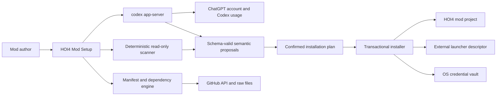

## ChatGPT authentication and analysis

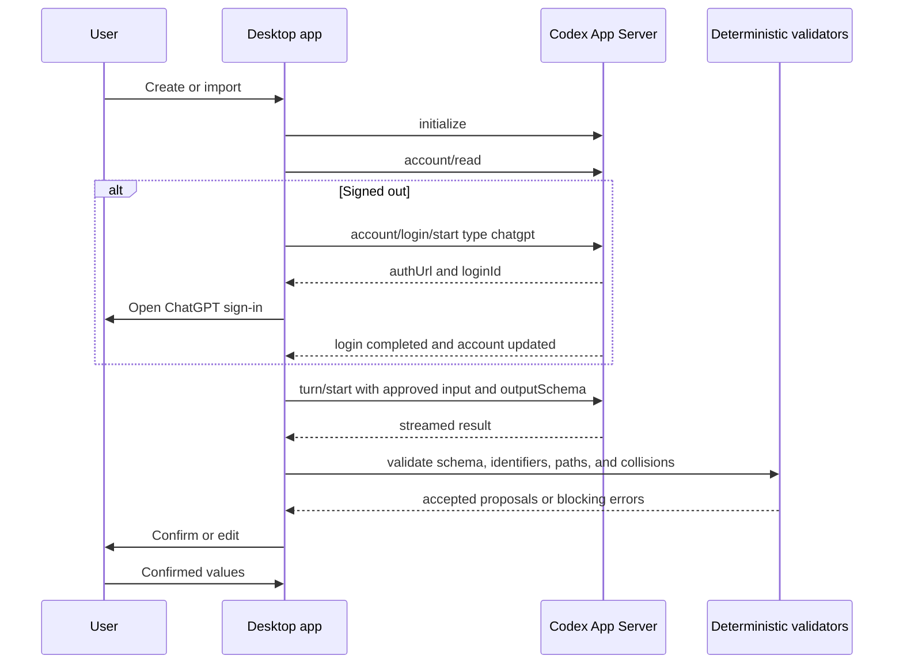

## Component graph

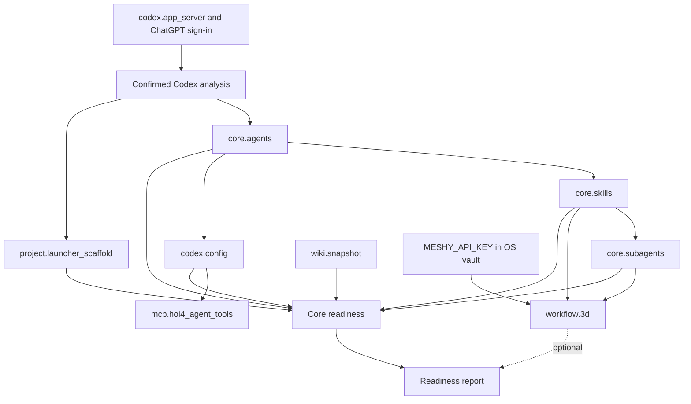

## Transaction

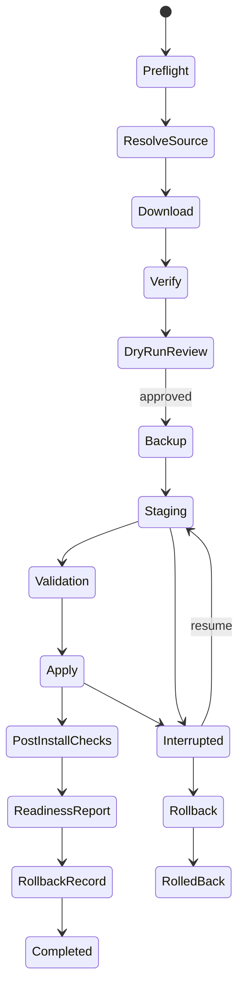

Additional files cover new project, existing project, merge and update, credentials, readiness, and recovery.

---

## File: `docs/20_testing_strategy.md`

# Testing strategy

## Codex integration test matrix

Use a protocol fixture that emulates App Server JSONL without real account credentials in ordinary CI. Cover process absence, incompatible versions, initialize ordering, an existing ChatGPT session, browser login, cancellation, device-code fallback, logout, account updates, usage limits, App Server crash, turn cancellation, output schema acceptance and rejection, unexpected fields, deterministic rejection of bad identifiers, token and account-data absence, and recovery while signed out.

Run a controlled manual release test against a real ChatGPT account. Never place real credentials in CI.

## Unit tests

- path normalization and containment
- project ID validation
- descriptors
- manifest schema
- dependency graph and cycles
- platform resolution
- hashing
- file classification
- three-way and TOML merge
- secret redaction
- readiness aggregation
- journal transitions

## Property tests

- normalized destinations never escape root
- apply then rollback restores hashes
- verified operations are idempotent
- removal never deletes unowned files
- secret-like values never survive serialization

## Fuzzing

Descriptor syntax, TOML, JSON, Markdown link extraction, localisation keys, encodings, huge files, and deep trees.

## Integration tests

- fake GitHub latest and pinned server
- manifest and tree mismatch
- changed default branch
- partial download and resume
- checksum failure
- cache corruption
- Windows Credential Manager mock
- macOS Keychain mock
- Git fixtures
- MCP test server
- launcher descriptor outside project

## Transaction fault injection

Fail at every stage and operation boundary through process kill, disk full, permission denied, file lock, network loss, checksum mismatch, command timeout, health failure, and cancellation. Verify recovery and final hashes.

## End-to-end cases

### New Windows project

Create, generate descriptors, install core, initialize Git, run readiness, and open project.

### Existing Windows project

Scan local AGENTS and Codex files, review, merge, install, update, repair, and roll back.

### New macOS project

Install platform-neutral core, report unsupported current Windows-only MCP and 3D routes, and keep core usable.

### Missing Meshy key

Select 3D, omit key, complete core, verify incomplete optional status, configure later, and rerun health.

### LoRA placeholder

Record interest and assert zero forbidden operations.

### Interrupted install

Terminate during staging and apply. Verify resume and rollback.

## Golden files

Descriptors, adapted AGENTS, TOML merge, scan, plan, lock, readiness, journal, and conflict preview. Golden updates require review.

## UI tests

Keyboard traversal, focus order, screen reader labels, contrast, scaling, long paths, long translations, error states, reduced motion, and visual regression for all 17 screens. Add density assertions for the seven-phase rail, one primary task per screen, maximum visible content regions, collapsed secondary details, absence of permanent keyboard hints, and no repeated explanatory copy.

## Security tests

Traversal, symlink and junction race, case collision, reserved device name, command injection, environment injection, secret in stderr, crash redaction, archive limits, and compromised manifest.

## Performance

Test 500, 20,000, and 150,000 file projects plus a large wiki media set. Measure first finding, total scan, memory, UI responsiveness, hash throughput, and cancellation latency.

## Compatibility

Test supported Windows and macOS versions, x64 and Apple Silicon where applicable, case-sensitive and case-insensitive volumes, local and cloud-synced folders.

## Release gates

- schema examples validate
- no critical security issue
- transaction fault suite passes
- core new and existing flows pass on both platforms
- 3D states are honest
- LoRA placeholder creates zero forbidden actions
- accessibility audit passes
- artifacts are signed or checksummed

## Open-source repository tests

Validate the public repository layer:

- root README contains user information rather than contributor build commands
- GitHub issue forms and workflows parse as YAML
- subagent TOML files parse and include bounded instructions
- skill files have valid frontmatter and update triggers
- CODEOWNERS covers governance, AGENTS, skills, subagents, schemas, security, and release paths
- Dependabot monitors npm, Cargo, and GitHub Actions
- default GitHub Actions permissions remain read-only outside the release job
- fork pull requests receive no release credentials
- release builds use the exact tag commit
- public release is blocked when `LICENSE` is missing
- committed-secret pattern checks pass

## Skill drift tests

For broad changes, compare touched product surfaces with the skill ownership table. Pull request review should fail when a workflow changed and the owning skill remains stale without an explicit reason.

## Launcher-ready scaffold tests

Create clean temporary projects on both platforms and verify the internal descriptor, external launcher descriptor, thumbnail decode, picture reference, folder profile, backup, rollback, repair, and modified-thumbnail preservation. Prove that rendering uses confirmed Codex proposals and deterministic validators.

---

## File: `docs/21_roadmap_backlog.md`

# Implementation roadmap and backlog

## Phase 0: repository contract

Add and validate the remote manifest, generate a resolved file index, declare platform support, publish wiki provenance state, define MCP health checks, add script preflight output, and reconcile README wording with executable bootstrap behavior.

**Exit:** a manifest validator resolves a commit and lists selected files without cloning.

## Phase 0A: Codex account foundation

- resolve and verify `codex app-server`
- implement initialize and process supervision
- implement `account/read`
- implement browser ChatGPT login
- implement device-code fallback
- implement logout and account updates
- implement usage-limit state
- prohibit API-key fallback
- add redacted protocol fixtures
- add the Codex analysis schema and typed client

## Phase 1: application skeleton

- Tauri shell
- Rust service boundary
- React wizard shell
- local settings and recent projects
- error model
- redacted structured logging
- Windows and macOS packaging prototypes

## Phase 2: project identity and descriptors

- new description
- identity fields
- descriptor parser and renderer
- launcher descriptor adapter and duplicate-registration detection
- deterministic placeholder thumbnail renderer
- thumbnail preview, decode, hash, and replacement policy
- folder profile
- launcher-ready validation

## Phase 3: scanner

- filesystem boundary
- descriptors
- Git
- namespaces and identifiers
- localisation
- docs
- skills
- subagents
- Codex and MCP
- required Codex App Server semantic review after ChatGPT authentication
- request manifest and schema-constrained suggestions
- Detected, Suggested by Codex, and Confirmed states
- finding review

## Phase 4: source and manifest engine

- GitHub resolver
- latest and pinned modes
- immutable cache
- selected tree expansion
- SHA-256
- component graph
- platform resolver

## Phase 5: plan and conflicts

- operation model
- AGENTS merge
- TOML merge
- binary conflict UI
- rename and skip
- dry-run report

## Phase 6: transaction and recovery

- backup
- staging
- validation
- atomic apply
- journal
- rollback
- interruption recovery

## Phase 7: core components

- AGENTS adaptation
- skills
- subagents
- Codex config
- MCP component
- wiki component
- readiness gate
- Open in Codex adapter

## Phase 8: Git

- initialize or preserve
- ignore merge
- branch
- optional initial commit
- remote review without push

## Phase 9: optional workflows

- Meshy credential vault
- 3D component and bootstrap adapter
- optional readiness
- Update and Repair key action
- LoRA interest placeholder

## Phase 10: maintenance

- update
- repair
- reinstall
- rollback history
- removal
- lock viewer
- modification detection

## Phase 11: hardening and release

- accessibility
- fault injection
- security review
- code signing
- notarization
- performance
- migrations
- sanitized support bundle

## Must-have backlog

- live remote manifest
- exact commit resolution
- read-only existing scan
- internal and external descriptors
- generated replaceable thumbnail placeholder
- launcher discoverability and empty-mod load readiness
- deterministic scanner with required ChatGPT-backed Codex semantic review
- AGENTS adaptation
- skills and subagents
- offline wiki and coverage
- dry run
- no silent overwrite
- transaction and rollback
- lock
- readiness and Open in Codex
- optional 3D incomplete state
- LoRA placeholder

## Should-have backlog

- comment-preserving TOML merge
- offline cache repair
- richer identifier parser
- initial commit preview
- per-component update history
- sanitized support bundle
- localization-ready UI strings

## Could-have backlog

- signed manifest
- enterprise mirror
- custom workflow repositories
- release bundles
- optional-workflow plugin SDK
- repository topology viewer
- external diff editor integration

## Deferred

- automatic ComfyUI and LoRA setup
- Steam Workshop publishing
- cloud project sync
- online Git repository creation
- whole-drive mod discovery
- automatic HOI4 launch validation

## Technical spikes

1. Comment-preserving TOML library.
2. Open in Codex integration on both platforms.
3. Multi-file apply in cloud-synced folders.
4. MCP initialize health wrapper.
5. Manifest signing and key rotation.
6. Repository-maintained macOS routes for current Windows-only components.
7. Codex App Server startup, ChatGPT-managed authentication, stdio JSONL lifecycle, and schema-constrained project analysis.
8. Clean-machine HOI4 launcher discovery and duplicate-descriptor behavior on Windows and macOS.

## Open-source repository bootstrap

Complete before broad implementation begins:

- create public GitHub repository after license decision
- add user-facing README and community health files
- add AGENTS, living skills, and bounded subagents
- add planning and template validation
- configure main branch ruleset
- configure Dependabot and private vulnerability reporting
- establish stable CI check names
- create protected release environments
- implement repository-owned build, test, packaging, and release scripts

**Exit:** a contributor can clone the repository, read one clear setup document, run the planning validation, and open a pull request through the protected workflow without needing private instructions.

---

## File: `docs/22_acceptance_criteria.md`

# Acceptance criteria

## Source and manifest

- SRC-01: The app installs from GitHub without cloning Agentic-HOI4-Modding.
- SRC-02: Latest mode resolves the default branch and records one commit.
- SRC-03: Pinned commit uses one immutable revision for manifest and files.
- SRC-04: Pinned release records release and commit when available.
- SRC-05: Every download is SHA-256 verified.
- SRC-06: Manifest mismatch blocks apply.
- SRC-07: Only selected component files are downloaded.

## New project and launcher readiness

- NEW-01: The user can enter a natural-language description.
- NEW-02: ChatGPT-backed Codex proposals are reviewable and editable before rendering.
- NEW-03: Project ID is stable and valid.
- NEW-04: No file is created before approval.
- NEW-05: The initial folder profile is editable.
- NEW-06: Apply creates the internal `descriptor.mod`.
- NEW-07: Apply creates the external `<project_id>.mod` in the confirmed HOI4 user mod directory.
- NEW-08: The launcher descriptor points to the canonical project root with platform-correct escaping.
- NEW-09: Both descriptors are previewed, parsed, and validated before apply and after staging.
- NEW-10: Apply creates a deterministic, valid `thumbnail.png` placeholder.
- NEW-11: The thumbnail preview and readiness check decode the final PNG successfully and record its hash.
- NEW-12: The descriptor picture reference resolves to the installed thumbnail where supported.
- NEW-13: A fresh project is discoverable by the HOI4 launcher without manual file creation or descriptor editing.
- NEW-14: The selected initial directories exist after apply.
- NEW-15: The app does not fabricate a Workshop ID or `remote_file_id`.
- NEW-16: A user-modified thumbnail is detected and never overwritten silently.
- NEW-17: A valid existing thumbnail may replace the generated placeholder without blocking readiness.
- NEW-18: Missing or invalid launcher artifacts block launcher-ready status and Open in Codex for a newly created project.

## Deterministic scanning and required Codex analysis

- ANA-01: Observable project facts come from the deterministic Rust scanner.
- ANA-02: Create, Import, Update, and Repair planning require a compatible local Codex App Server.
- ANA-03: The user signs in through the App Server managed ChatGPT flow.
- ANA-04: Browser login is primary and device-code login is available as fallback.
- ANA-05: Core setup has no OpenAI API key field and no API-key fallback.
- ANA-06: Codex owns token persistence and refresh.
- ANA-07: The application does not read, copy, serialize, or log ChatGPT tokens.
- ANA-08: Full email, account ID, plan type, usage, and rate limits are absent from project state and installation locks.
- ANA-09: All semantic identity and convention fields are proposed by Codex.
- ANA-10: Every Codex input manifest is visible and editable before transmission.
- ANA-11: Secrets, binaries, credential stores, Git objects, and unapproved files are excluded.
- ANA-12: Semantic turns use read-only sandboxing and expose no writable project root.
- ANA-13: Every response validates against `codex-analysis.schema.json`.
- ANA-14: Codex cannot write files, approve operations, resolve conflicts automatically, override deterministic facts, or pass readiness checks.
- ANA-15: Values are labeled Detected, Suggested by Codex, or Confirmed.
- ANA-16: Proposed IDs, namespaces, tags, profiles, and paths pass deterministic validation before confirmation.
- ANA-17: Authentication, usage, process, and malformed-response failures preserve the draft and start no transaction.
- ANA-18: Recovery, rollback, backup inspection, and managed removal remain available while signed out.
- ANA-19: No model name is hardcoded for the normal path. The user's compatible Codex configuration controls the model.
- ANA-20: Stored analysis metadata contains only schema version, analysis ID, input and output digests, confirmed fields, and timestamps.

## Existing project

- EXT-01: The user selects one root.
- EXT-02: Scan performs no project writes.
- EXT-03: Structure, descriptors, launcher registration, thumbnail, Git, IDs, namespaces, naming, localisation, docs, skills, subagents, Codex, MCP, and conflicts are covered.
- EXT-04: Findings have evidence and confidence.
- EXT-05: Findings appear in small review groups.
- EXT-06: The user can accept, edit, reject, or defer values.
- EXT-07: Existing instructions and config are not silently replaced.
- EXT-08: Duplicate launcher registrations and mismatched paths are reported.

## Components

- CMP-01: Source, destination, dependencies, platforms, tools, environment, validation, and update behavior are shown.
- CMP-02: Automatic dependencies remain visible.
- CMP-03: Dependency cycles block.
- CMP-04: Unsupported optional components remain visible and non-blocking.
- CMP-05: Unknown manifest major version blocks.

## Wiki

- WIKI-01: Wiki installs under `<mod_project>/paradox_wiki/`.
- WIKI-02: Required pages and media policy are validated.
- WIKI-03: Broken integrity blocks core readiness.
- WIKI-04: Missing formal source or license metadata is reported honestly.
- WIKI-05: Local modifications are not overwritten silently.

## 3D

- 3D-01: The exact 3D question appears.
- 3D-02: Meshy.ai and possible cost are explained.
- 3D-03: Key is stored outside the project.
- 3D-04: Project stores only an opaque reference.
- 3D-05: Approved processes receive `MESHY_API_KEY`.
- 3D-06: Key never appears in logs, manifest, lock, config, Git, or previews.
- 3D-07: Missing key leaves 3D incomplete.
- 3D-08: Missing key does not block core readiness.
- 3D-09: Packages, versions, commands, adapters, and tools come from repository evidence.
- 3D-10: No substitute MCP or Blender command is invented.
- 3D-11: Dependency and MCP health checks are visible.
- 3D-12: Current unsupported macOS route is reported.

## LoRA and ComfyUI

- LORA-01: The exact placeholder question appears.
- LORA-02: Automated setup is stated unavailable.
- LORA-03: Interest can be recorded.
- LORA-04: State is non-blocking.
- LORA-05: Readiness says planned or unavailable.
- LORA-06: No ComfyUI, model, LoRA, Python, GPU, or driver action exists.
- LORA-07: No fake installed state exists.

## MCP

- MCP-01: Servers show requirements, capabilities, variables, status, and health.
- MCP-02: TOML is merged structurally.
- MCP-03: Conflicting server ID requires review.
- MCP-04: Secrets are not literal TOML values.
- MCP-05: Unsupported commands do not run.

## Git

- GIT-01: Initialize, preserve, and skip are supported.
- GIT-02: `.gitignore` can be merged.
- GIT-03: Existing rules are preserved.
- GIT-04: New default branch is selectable.
- GIT-05: Initial commit is optional.
- GIT-06: Remote is optional.
- GIT-07: No online repository is created automatically.
- GIT-08: No push occurs automatically.

## Conflicts

- CON-01: Modified files always receive a decision.
- CON-02: Keep, replace, merge, rename, and skip are offered where valid.
- CON-03: Binary files do not offer text merge.
- CON-04: Merge preview is validated.
- CON-05: Bulk choices require identical signatures.
- CON-06: Choices are stored in lock.
- CON-07: Thumbnail conflicts preserve valid user art by default.
- CON-08: External launcher descriptor conflicts are included in backup, review, and rollback.

## Transaction

- TX-01: All 12 stages are present.
- TX-02: Backup completes before apply.
- TX-03: Staging validates before apply.
- TX-04: Apply is checkpointed.
- TX-05: A crash cannot produce a successful lock.
- TX-06: Resume verifies observed state.
- TX-07: Rollback restores original hashes in fault tests.
- TX-08: Completion creates a rollback record.
- TX-09: External launcher descriptor writes are transactional.
- TX-10: Descriptor and thumbnail checks run against staged and applied outputs.

## Maintenance

- MNT-01: Update compares base, local, and incoming.
- MNT-02: Repair defaults to locked revision.
- MNT-03: Missing or corrupted unmodified files can be restored.
- MNT-04: Modified files require review.
- MNT-05: Reinstall preserves safe merge policy.
- MNT-06: Removal deletes only owned unmodified files by default.
- MNT-07: Optional credentials can be configured later.
- MNT-08: Repair can recreate a missing launcher descriptor after preview.
- MNT-09: Repair never replaces a modified thumbnail automatically.

## Readiness

- RDY-01: Every required core and optional surface is checked.
- RDY-02: Each check has status and evidence.
- RDY-03: Internal descriptor, external launcher descriptor, launcher destination, descriptor agreement, and thumbnail integrity are blocking checks for a new project.
- RDY-04: Core blocks disable Open in Codex.
- RDY-05: Optional incomplete states do not disable it.
- RDY-06: ChatGPT authentication and confirmed Codex analysis are blocking core readiness checks.
- RDY-07: LoRA interest is planned unavailable.
- RDY-08: A final report is stored.

## UI and accessibility

- UI-01: The setup rail uses seven grouped phases.
- UI-02: Each screen has one title and no more than one supporting sentence by default.
- UI-03: Each screen has one primary work area and no more than two visible content regions by default.
- UI-04: Evidence, hashes, dependency graphs, full file lists, logs, and advanced settings use progressive disclosure.
- UI-05: The same fact is not repeated across several interface regions.
- UI-06: Ordinary controls do not receive copy that only restates their label.
- UI-07: Clear Back and primary action controls remain reachable.
- UI-08: Progress includes the current stage and durable checkpoint without showing the full log by default.
- UI-09: Full keyboard use is supported.
- UI-10: Status does not rely on color.
- UI-11: 200 percent scaling works.
- UI-12: Project identity shows compact descriptor rows and thumbnail preview on demand.
- UI-13: Codex analysis shows the approved request manifest and separates detected, suggested, and confirmed values without adding a permanent explanatory panel.

## Open-source repository

- OSS-01: The root README is user-facing and excludes internal build and branch instructions.
- OSS-02: Contributor, development, security, conduct, release, changelog, and license-decision files exist.
- OSS-03: A real LICENSE is blocking before public source or binary release.
- OSS-04: AGENTS.md distinguishes application development from target-mod instructions.
- OSS-05: At least eight focused living skills exist under `.agents/skills/`.
- OSS-06: Every living skill states update triggers or maintenance role.
- OSS-07: Narrow subagents exist for source, scanner, transaction, security, UI, platform release, docs, and skill maintenance.
- OSS-08: Every project subagent requires `fork_context=false` and explicit scope.
- OSS-09: Issue forms, pull request template, CODEOWNERS, and Dependabot configuration exist.
- OSS-10: GitHub workflow YAML parses and uses read-only default permissions.
- OSS-11: Main is protected through a pull-request ruleset with required checks.
- OSS-12: Release automation builds from an exact tag and creates a draft before publication.
- OSS-13: Stable release artifacts include checksums and platform verification.
- OSS-14: Pull requests require documentation and living-skill review.
- OSS-15: Planning validation checks schemas, examples, YAML, TOML, skills, subagents, README boundary, and goal prompt length.
- OSS-16: The standalone goal prompt is included at the package root and remains no more than 4000 characters.

---

## File: `docs/23_risks_open_decisions.md`

# Risks and open decisions

## High risks

### No live manifest

Production cannot safely infer all files from names. Add the manifest before release.

### Wiki provenance and licensing

The snapshot exists, while formal source and license evidence were not verified. Add a source manifest with origin, snapshot method, date, and license evidence when available.

### Current Windows-only commands

The application is cross-platform, while current MCP and 3D routes are Windows-oriented. Keep platform-neutral core usable on macOS and mark those components unsupported until the repository maintains macOS routes.

### Executable bootstrap

The 3D script can download and install dependencies. Add preflight-only output and a machine-readable action report.

### Version-policy drift

README pinned wording differs from latest-at-bootstrap resolution. Choose and encode one policy per dependency.

## Medium risks

- large mods can have several intentional namespaces
- TOML comment preservation may be imperfect
- OneDrive and iCloud can interfere with atomic rename
- global packages may be shared by several projects
- deleted lock files remove three-way merge evidence
- nested Git repositories and worktrees can change ownership boundary
- launcher descriptor is outside the project
- large wiki and 3D dependencies can create substantial backups

## Open decisions

1. Is HOI4 Agent Tools required on macOS before a source-supported command exists?
2. Should wiki updates use subtree files or release bundles?
3. Should the lock be committed by default?
4. Should modified wiki pages default to merge or renamed incoming?
5. Should external packages be global, project-local, or repository-script owned?
6. What exact Open in Codex invocation is supported per platform?
7. How will manifest signing and key rotation work?
8. Will version 1 support only the named source repository?
9. What backup quota and retention policy applies to large components?
10. Should UI concept sources ship with the product repository?

## Decisions made here

- no complete source clone
- exact commit recorded in every mode
- no project secret
- missing 3D key is optional and non-blocking
- LoRA and ComfyUI is preference-only in version 1
- no silent overwrite
- transaction and rollback are mandatory
- Git push and online creation require separate approval
- no invented platform commands
- all semantic setup fields use ChatGPT-authenticated Codex
- App Server managed browser login is primary with device-code fallback
- the external launcher descriptor and generated thumbnail are lock-managed

## Open-source governance decisions

### License

A public repository is not enough to grant open-source permissions. Select Apache-2.0, MIT, MPL-2.0, or another reviewed license before the first public source release. Review direct dependencies and bundled assets before the decision is finalized.

### Maintainer ownership

The initial CODEOWNERS template uses `@klimPaskov`. Replace or expand this with organization teams when maintainership grows. Code owner review is useful only when listed owners have the required repository access.

### GitHub Actions pinning

The supplied workflows use readable major tags as planning templates. Before production release, review and pin third-party actions to immutable revisions according to the repository security policy.

### Support capacity

Decide when to enable GitHub Discussions, which released versions receive fixes, and what response expectations can be published without promising unavailable support.

### Signing ownership

Decide who controls Windows signing and Apple signing or notarization credentials, how recovery works, and how release access is revoked when maintainers change.

## Codex subscription risks

- App Server protocol changes can break a tightly coupled client.
- A missing or outdated Codex installation blocks setup planning.
- Browser callbacks can fail under locked-down networks, which requires device-code fallback.
- ChatGPT workspace policy can restrict Codex access.
- Usage limits can interrupt semantic analysis.
- Persisting account metadata can create unnecessary privacy risk.
- Overbroad input manifests can send unrelated project text.
- Allowing Codex to write during analysis would break the transaction and approval boundary.

Mitigation uses a typed protocol adapter, capability checks, schema validation, strict redaction, read-only turns, resumable draft state, and locally available recovery.

---

## File: `docs/24_coding_agent_prompt.md`

# Detailed coding-agent implementation prompt

Implement **HOI4 Mod Setup**, a production Windows and macOS desktop application that prepares Hearts of Iron IV mod projects for agentic development in Codex.

Read every document, schema, example, Mermaid diagram, UI reference, source audit, and acceptance criterion in this package before coding. Maintain a requirement-to-code matrix.

## Product boundary

Create a new mod or import an existing one. Selectively install the current package from `https://github.com/klimPaskov/Agentic-HOI4-Modding` without cloning the complete repository or requiring a checkout.

The planning audit inspected commit `599497ea2f93612d9094461c6fde114fc87a5c0f`. Do not hardcode it as permanent latest. Implement exact latest and pinned resolution.

## Architecture

Use a Tauri shell with Rust core and TypeScript React UI unless a documented spike proves another native architecture safer. The UI cannot write project files directly.

Create modules for project identity, scanner, source resolver, manifest, components, cache, hashes, merge, transactions, validators, credentials, MCP, Git, readiness, recovery, and platform adapters.

## ChatGPT and Codex integration

Implement the semantic layer through the official local `codex app-server` process over stdio JSONL. Complete initialize, account state, browser ChatGPT login, device-code fallback, cancellation, logout, account updates, rate-limit checks, thread lifecycle, turn lifecycle, streamed events, and clean shutdown.

Do not add an OpenAI API key field, API-key fallback, provider selector, or externally managed ChatGPT token path. Do not read Codex token files. Keep full email, account ID, plan, usage, rate limits, tokens, thread history, and hidden reasoning out of project files and locks.

Use the user's compatible Codex configuration without hardcoding a model. Every semantic turn is read-only and uses the current `codex-analysis` output schema. Codex proposes the description, display name, project ID, prefix, namespace, tags, folder profile, project instructions, components, and existing-project conventions. Deterministic Rust validates and renders after confirmation.

Missing authentication, usage availability, or valid analysis blocks Create, Import, Update, and Repair planning. Preserve drafts and scans. Keep recovery, rollback, backup inspection, and managed removal available offline.

## Repository contract

Implement `hoi4-mod-setup.manifest.json` using the supplied schema. The live repository currently has no manifest. Add it to the repository first, or isolate a temporary built-in bootstrap manifest behind a removable compatibility layer. Production should depend on the remote contract.

The resolver must:

1. read default branch in latest mode
2. resolve an exact commit
3. fetch manifest at that commit
4. expand only selected component trees at that commit
5. fetch selected files or a manifest-declared release bundle
6. verify SHA-256
7. record revision in plan and lock

Never clone Agentic-HOI4-Modding. Repository-declared external dependency scripts may use Git only after dry-run approval.

## New project

Implement the 17 required screen states inside a seven-phase wizard: Project, Review, Components, Integrations, Git, Install, and Ready. Collect a normal-language brief, review suggestions, confirm identity and paths, preview both descriptors on demand, propose editable folders, select source and components, ask both exact optional questions, configure MCP and Git, show dry run, transact, and show readiness.

Create no project file before approval. After approval, generate and validate the internal `descriptor.mod`, the external launcher `<project_id>.mod`, a deterministic replaceable `thumbnail.png`, and the selected folder profile. Preview external destinations. Track every generated artifact and external path in the plan, lock, backup, and rollback record. Never fabricate a Workshop ID or overwrite a user-replaced thumbnail silently.

## Existing project

The scanner is bounded and read-only. Detect structure, descriptors, Git, IDs, namespaces, naming, localisation, docs, skills, subagents, Codex, MCP, absolute paths, and conflicts. Every finding includes evidence and confidence. Group findings into small editable steps.

## Components

Implement dependency resolution, platform support, tools, environment, validation, reverse dependencies, and ownership types `managed`, `merged`, `generated`, and `external`.

## Wiki

Install the selected repository tree under `<mod_project>/paradox_wiki/`. Validate hash, containment, core page coverage, and media policy. Do not invent source or license metadata.

## 3D

Ask exactly:

**Do you want to set up the 3D models workflow?**

When yes, explain Meshy.ai and possible cost, store the key in Windows Credential Manager or macOS Keychain, save only an opaque reference, inject only as `MESHY_API_KEY`, and never log or serialize it.

Derive every package, command, version, adapter, and health check from the manifest or verified repository script. Install the repository-declared skill, subagent, bootstrap, wrappers, adapters, and support files. Show external actions in dry run and run approved health checks.

The current repository route is Windows-oriented. Mark it unsupported on macOS until the repository supplies a verified route. Do not invent one.

Missing key leaves 3D incomplete without blocking core readiness. Add Configure key to Update and Repair.

## LoRA and ComfyUI

Ask exactly:

**Do you want to set up LoRAs and ComfyUI for portrait generation?**

Version 1 records interest only. Create no ComfyUI, model, LoRA, Python, GPU, or driver action. Report planned or unavailable, never installed. Keep the component interface ready for a future real implementation.

## Conflicts

Compare base, local, and incoming. Offer keep, replace, merge, rename, or skip where valid. Binary files cannot use text merge. TOML and JSON use structured merge. AGENTS uses three-way merge plus project adaptation.

Never silently overwrite local changes.

## Transaction

Implement all 12 required stages, durable journaling, operation checkpoints, backup, staging validation, atomic apply where possible, resume, rollback, and discard staging according to state. Write the lock after final verification.

Fault-inject every stage and operation boundary.

## Git

Support initialize, preserve, or skip. Merge `.gitignore`, select branch, optionally commit, and optionally configure remote. Never create an online repository or push without a separate explicit approval.

## Readiness

Verify both descriptors, launcher path and discoverability, descriptor consistency, thumbnail decode and hash, structure, AGENTS, skills, subagents, Codex, MCP, wiki, Git, environment, hashes, conflicts, dependencies, 3D, and LoRA placeholder. Verify ChatGPT authentication and confirmed Codex analysis as blocking core checks. Enable Open in Codex only when core blocking checks pass.

## Security

Use exact commit, SHA-256, root containment, link defense, argument arrays rather than shell strings, allowlisted processes, no core elevation, secret redaction, no telemetry, and explicit review of broad Codex security policies.

## UI

Follow all 17 full-resolution references and `docs/17_ui_accessibility.md`. Use a clean dark desktop UI with a seven-phase setup rail. Each screen should have one focal task, one title, no more than one supporting sentence, and no more than two visible content regions by default. Hide evidence, hashes, file lists, logs, dependency graphs, and advanced settings until requested. Do not repeat obvious information or explain controls that are already clear from their labels. Keep Back and the primary action persistent. Preserve conflict comparison detail only on the conflict screen. Support keyboard use, WCAG 2.2 AA, reduced motion, and 200 percent scaling.

## Schemas and tests

Implement and validate all supplied schemas. Use atomic JSON writes and explicit migrations. Add unit, property, fuzz, integration, end-to-end, security, performance, accessibility, visual regression, and transaction fault tests.

## Open-source repository bootstrap

Develop the application in a public GitHub-ready repository using the supplied `README.md`, `CONTRIBUTING.md`, `DEVELOPMENT.md`, `SECURITY.md`, `CODE_OF_CONDUCT.md`, `RELEASING.md`, `CHANGELOG.md`, `LICENSE_SELECTION.md`, `.github/`, `.gitignore`, `.gitattributes`, and `.editorconfig`. Keep the root README user-facing. Select and add a real `LICENSE` before public release.

Configure protected `main`, pull requests, stable required checks, CODEOWNERS, issue forms, private vulnerability reporting, Dependabot for npm, Cargo, and GitHub Actions, and tag-based draft releases. Use read-only default workflow permissions. Release credentials belong in protected environments and are never exposed to fork pull requests. Implement repository-owned scripts used by CI and release workflows before making those jobs required.

## AGENTS, living skills, and subagents

Use the supplied root `AGENTS.md` for application development. Keep it distinct from AGENTS files installed into target mod projects.

Treat `.agents/skills/` as living implementation memory. When a pull request changes a repeated workflow, command, path, invariant, schema, platform rule, validation step, security boundary, or recovery method, update the owning skill in the same change. Do not put ticket-specific details into skills.

Use the supplied `.codex/agents/` only for bounded audits, including the Codex integration auditor, and narrow documentation or UI patches. Spawn every project subagent with `fork_context=false`, explicit files, constraints, allowed writes, tests, and handoff path. The parent owns final integration and completion.

## Completion

Before completion, satisfy every criterion, provide a requirement-to-code matrix, validate every example and repository template, prove new and existing flows on both platforms, prove missing 3D key is non-blocking, prove LoRA creates zero forbidden actions, prove recovery, prove secret absence, review living-skill alignment, and report every unsupported source route or unresolved metadata issue.

Do not reduce the product to a file copier. The scanner, reviewed plan, conflict engine, transaction, lock, optional states, maintenance, and readiness gate are core product features.

---

## File: `docs/25_compact_goal_prompt.md`

# HOI4 Mod Setup goal prompt

Build **HOI4 Mod Setup**, an open-source Windows and macOS desktop wizard that creates launcher-ready Hearts of Iron IV mods and prepares new or existing projects for Codex development.

Read all supplied project instructions and references. Keep `README.md` user-facing.

All AI work must use the user's Codex subscription through ChatGPT sign-in via the local Codex app-server. Implement managed login, logout, and process supervision. Codex owns authentication. Never request an OpenAI API key, copy the auth cache, bill through the application, or switch providers.

Use Codex for natural-language interpretation, identity, namespaces, descriptor metadata, project profile, component selection, existing-project analysis, and AGENTS adaptation. Run analysis read-only with approved evidence. Require schema-valid output labelled Detected, Suggested by Codex, or Confirmed. Suggestions cannot write files or enter an installation plan before confirmation.

Create the project deterministically after confirmation. Generate and validate `<mod_project>/descriptor.mod`, `<HOI4 user mod directory>/<project_id>.mod`, a replaceable `<mod_project>/thumbnail.png`, the selected folder profile, a mod README, and selected workflow files. Preview these artifacts. Never fabricate a Workshop ID or silently overwrite a replaced thumbnail.

Use `https://github.com/klimPaskov/Agentic-HOI4-Modding` through a versioned manifest. Never clone it, require a checkout, or search for one. Latest mode resolves an exact commit. Pinned mode uses an immutable revision. Selectively download and SHA-256 verify every selected component and the offline wiki. Install the wiki at `<mod_project>/paradox_wiki/`. Do not invent dependencies, commands, support, provenance, or licensing.

Existing projects receive a bounded read-only scan of descriptors, launcher state, thumbnail, structure, Git, identifiers, naming, localisation, workflow files, Codex, MCP, paths, and conflicts. Send only approved text evidence to Codex and review findings in small groups.

Ask exactly **Do you want to set up the 3D models workflow?** Store the Meshy key in the OS vault, expose it only as `MESHY_API_KEY`, derive requirements from verified repository files, and keep a missing key non-blocking. Do not invent a macOS route.

Ask exactly **Do you want to set up LoRAs and ComfyUI for portrait generation?** Version 1 records interest only and installs nothing.

Never overwrite modified files silently. Compare base, local, and incoming versions. Offer keep, replace, merge, rename, or skip where valid. Use the full 12-stage journaled, staged, validated, reversible transaction. Recover from interruption and write the lock only after final verification.

Support update, repair, reinstall, rollback, managed removal, Codex reanalysis, Git initialize or preserve, `.gitignore` merge, branch choice, optional initial commit, and optional remote. Never create an online repository or push without separate approval.

Readiness verifies authenticated Codex, launcher artifacts, confirmed identity, structure, workflows, MCP, wiki, Git, hashes, conflicts, dependencies, and optional workflow states. Enable Open in Codex only when core checks pass. Recovery and rollback remain available while signed out.

Use the minimal dark seven-phase UI with compact authentication, one focal task per screen, keyboard navigation, WCAG 2.2 AA, reduced motion, and 200 percent scaling.

Implement a Rust core behind Tauri with a React TypeScript UI. Add app-server contract tests, migrations, property tests, fuzzing, fault injection, security, accessibility, and platform end-to-end coverage. Maintain the public GitHub repository, root AGENTS, living skills, and bounded subagents. Satisfy every acceptance criterion. Do not claim completion with unresolved authentication, launcher, recovery, platform, security, docs, or skill work.

---

## File: `docs/26_open_source_github_workflow.md`

# Open-source Git and GitHub workflow

This document covers the source repository for HOI4 Mod Setup. It is separate from the Git setup that the application can perform inside a user's mod project.

## Repository identity

Recommended repository name:

```text
HOI4-Mod-Setup
```

Recommended description:

```text
A Windows and macOS desktop wizard that prepares Hearts of Iron IV mods for agentic development in Codex.
```

Recommended topics:

```text
hearts-of-iron-iv
hoi4
modding
codex
tauri
rust
react
desktop-app
```

Keep the repository public only after a real `LICENSE` file is selected and the initial security review is complete.

## Local repository bootstrap

From the source root:

```bash
git init
git switch -c main
git add .
git status --short
git diff --cached --check
git commit -m "chore: bootstrap HOI4 Mod Setup"
```

Create the GitHub repository through the GitHub website, or use GitHub CLI only after reviewing the local commit:

```bash
gh repo create klimPaskov/HOI4-Mod-Setup \
  --public \
  --source=. \
  --remote=origin
```

Push only after checking the remote and branch:

```bash
git remote -v
git push -u origin main
```

Do not include signing credentials, private mod projects, build certificates, application secrets, or local transaction evidence in the initial commit.

## Daily contribution flow

Start from the current protected branch:

```bash
git switch main
git pull --ff-only
git switch -c feat/short-description
```

Inspect before committing:

```bash
git status --short
git diff
git add -p
git diff --cached
git diff --cached --check
```

Use focused Conventional Commit messages:

```text
feat(scanner): detect nested launcher descriptors
fix(transaction): preserve recovery journal after interruption
test(security): cover junction swap during apply
docs(skills): record manifest validation workflow
```

Before opening a pull request:

```bash
git fetch origin
git rebase origin/main
pnpm lint
pnpm typecheck
pnpm test
cargo fmt --check
cargo clippy --workspace --all-targets --all-features -- -D warnings
cargo test --workspace
git push -u origin HEAD
```

Use `--force-with-lease` only on a personal review branch after a rebase. Never force-push `main` or a shared branch.

## Branch naming

Use one focused branch per change:

- `feat/` for user-visible capabilities
- `fix/` for defects
- `security/` for hardening
- `refactor/` for behavior-preserving restructuring
- `test/` for test-only work
- `docs/` for documentation and living skills
- `chore/` for tooling and maintenance
- `release/` for release preparation

Avoid long-lived development branches. Merge small, complete slices through pull requests.

## Pull request rules

A pull request should state:

- user or maintainer problem
- design and tradeoffs
- files and systems changed
- schema and migration impact
- transaction and rollback impact
- credential and security impact
- platform impact
- tests and fault scenarios run
- screenshots for visible changes
- documentation and living skills updated
- known limitations

Use draft pull requests for early review. Mark a pull request ready only after required checks pass locally and the description is complete.

Preferred merge method:

- squash merge for ordinary contributions
- rebase or merge commit only when the commit sequence is intentionally useful

Delete the source branch after merge unless it is an active release branch.

## Main branch ruleset

Configure a GitHub repository ruleset for `main` with:

- pull request required before merge
- at least one approval
- stale approvals dismissed after new commits
- conversation resolution required
- required status checks
- branch must be current before merge when the queue is not used
- force pushes blocked
- branch deletion blocked
- code owner review required for sensitive paths when maintainers are available
- administrator bypass limited to emergency recovery

Recommended required checks after the source scaffold exists:

- planning and schema integrity
- frontend lint
- frontend typecheck
- frontend tests
- Rust formatting
- Rust clippy
- Rust tests on Windows
- Rust tests on macOS
- transaction fault suite for relevant pull requests
- accessibility and visual checks for UI pull requests

Do not make a skipped job a required check. Keep check names stable once rulesets depend on them.

## CODEOWNERS

Use `.github/CODEOWNERS` to request reviews for sensitive surfaces. The initial template assigns the repository owner. Expand it to teams when contributor roles exist.

Sensitive ownership should include:

- `.github/`
- `AGENTS.md`
- `.agents/`
- `.codex/`
- transaction and recovery code
- security and credential code
- schemas and migrations
- release scripts

Protect the CODEOWNERS file itself through the same ownership rule.

## Issues and discussions

Use issue forms for:

- reproducible bug reports
- feature requests
- source manifest or workflow repository problems

Disable blank public issues at first so reports contain enough evidence. Maintainers can still open blank issues.

Use GitHub Discussions only when the project has enough maintenance capacity to answer general questions. Issues should remain actionable engineering work.

Security reports never belong in public issues. Use `SECURITY.md` and GitHub private vulnerability reporting.

## Dependency updates

Commit `.github/dependabot.yml` on the default branch. Monitor:

- npm or pnpm manifests
- Cargo manifests
- GitHub Actions

Use weekly updates by default. Group routine compatible updates where it keeps pull request volume manageable. Never auto-merge a dependency update that affects filesystem access, cryptography, archive handling, Git, credentials, Tauri, updater code, or release signing without review and tests.

Enable Dependabot alerts and security updates in repository settings. A configuration file controls version update pull requests, while alert settings remain repository settings.

## GitHub Actions security

Set default workflow permissions to read-only. Grant only the permissions required by each job.

Rules:

- use official actions where practical
- pin production release actions to reviewed immutable revisions
- never print secrets
- use protected environments for signing and release credentials
- do not expose secrets to pull requests from forks
- do not run untrusted repository scripts with write tokens
- validate artifact hashes before publication
- keep release creation in a separate job after platform builds succeed

The supplied workflows are repository templates. The implementation must replace placeholder build scripts with repository-owned commands before making them required.

## Releases

Use semantic version tags:

```text
vMAJOR.MINOR.PATCH
```

Prepare releases through a pull request that updates:

- version
- changelog
- README support status
- migrations and compatibility notes
- release notes
- affected living skills

After the release pull request merges:

```bash
git switch main
git pull --ff-only
git tag -a vX.Y.Z -m "HOI4 Mod Setup vX.Y.Z"
git push origin vX.Y.Z
```

The tag workflow builds from the exact tag commit. It should publish a draft release first. Verify Windows and macOS installation, signatures, notarization, checksums, updater metadata, and clean-machine behavior before publication.

Never move or reuse a published tag. Fix problems in a new version.

## GitHub repository settings checklist

Enable:

- Issues
- private vulnerability reporting
- dependency graph
- Dependabot alerts
- Dependabot security updates
- branch or repository rulesets
- automatic branch deletion after merge

Configure:

- default branch `main`
- squash merge enabled
- merge queue when contributor volume justifies it
- protected release environments
- repository description and topics
- social preview after final branding exists

Decide before first public release:

- open-source license
- maintainer contact
- support policy
- stable platform matrix
- release signing ownership
- whether Discussions should be enabled

## Reference material

- [Customizing a repository](https://docs.github.com/en/repositories/managing-your-repositorys-settings-and-features/customizing-your-repository)
- [Issue and pull request templates](https://docs.github.com/en/communities/using-templates-to-encourage-useful-issues-and-pull-requests/about-issue-and-pull-request-templates)
- [CODEOWNERS](https://docs.github.com/en/repositories/managing-your-repositorys-settings-and-features/customizing-your-repository/about-code-owners)
- [Dependabot version updates](https://docs.github.com/en/code-security/how-tos/secure-your-supply-chain/secure-your-dependencies/configure-version-updates)
- [Security policy](https://docs.github.com/en/code-security/how-tos/report-and-fix-vulnerabilities/configure-vulnerability-reporting/add-security-policy)

---

## File: `docs/27_repo_local_skill_strategy.md`

# Repo-local living skill strategy

The application repository should keep a small set of focused Codex skills under `.agents/skills/`. These skills are maintained during development and record verified workflows, boundaries, commands, failure modes, and validation expectations.

They are not a duplicate requirements archive. Product requirements remain in `docs/`. Skills explain how recurring work is performed safely in the current repository.

## Why skills are living files

A desktop installer that touches user projects has many workflows that are easy to rediscover incorrectly:

- source revision resolution
- selective download
- path containment
- read-only scanning
- three-way conflict classification
- journaled apply and rollback
- credential injection
- Windows and macOS differences
- UI density and accessibility
- release signing and artifact verification

When implementation changes one of these workflows, the owning skill should change in the same pull request. This keeps future Codex sessions aligned with the actual repository.

## Skill set

| Skill | Owns |
| --- | --- |
| `hoi4-mod-setup-product-contract` | Product scope, architecture boundaries, completion proof |
| `hoi4-mod-setup-codex-integration` | ChatGPT sign-in, App Server lifecycle, structured semantic turns, redaction, usage limits, proposal confirmation |
| `hoi4-mod-setup-source-manifest` | GitHub source resolution, remote manifest, selective fetch, hashes, wiki distribution |
| `hoi4-mod-setup-project-scanner` | Existing-project read-only scanning, evidence, confidence, findings |
| `hoi4-mod-setup-transactions` | Plans, backups, staging, journal, apply, recovery, rollback, repair, removal |
| `hoi4-mod-setup-security` | Credentials, process allowlists, containment, redaction, archive and supply-chain safety |
| `hoi4-mod-setup-ui-accessibility` | Minimal wizard UI, progressive disclosure, interaction states, accessibility |
| `hoi4-mod-setup-testing` | Test layers, fixtures, fault injection, platform and release gates |
| `hoi4-mod-setup-open-source-release` | GitHub workflows, dependency updates, packaging, signing, release publication |
| `hoi4-mod-setup-skill-maintenance` | Skill ownership, update triggers, overlap and staleness review |

## Mandatory update triggers

Update a skill when a pull request changes any of these:

- repeated implementation sequence
- command or script name
- file or module location used by future work
- invariant or security boundary
- schema or migration behavior
- transaction stage or journal state
- supported platform behavior
- validation or test command
- common failure and recovery procedure
- handoff format
- ownership boundary between Rust, UI, platform, or subagent work

A change can skip skill updates when it is a one-off wording fix, a narrow test data update, or an implementation detail that does not affect future workflow. The pull request should still state why no skill update was needed.

## Skill quality rules

A good skill contains:

- clear trigger description
- source-of-truth files
- ownership and forbidden scope
- stable workflow
- invariants
- required evidence
- tests or validation
- update triggers
- completion standard

A skill should not contain:

- issue numbers
- temporary branch names
- personal workstation paths
- unverified package versions
- private URLs
- copied requirements with no workflow value
- large feature-specific design prose
- stale commands kept for history

Git history is the change log. Skills describe the current accepted workflow.

## Skill ownership check

Before completing a meaningful pull request:

1. List the product surfaces changed.
2. Map each surface to the skill table.
3. Check whether commands, locations, invariants, validation, or failure handling changed.
4. Update the owning skill when needed.
5. Check adjacent skills for contradictory instructions.
6. Record the skill decision in the pull request description.

The `hoi4setup_skill_maintainer` subagent can perform this review for broad or cross-skill changes. The parent agent still owns the final decision.

## New skill gate

Create a new skill only when all are true:

- the workflow is likely to recur
- no current skill owns it cleanly
- it has a stable boundary
- it needs enough repository-specific instruction to prevent rediscovery
- adding it is clearer than extending an existing skill

Prefer extending an existing skill when the workflow is a normal part of that surface.

## Version and platform evidence

Do not hardcode a dependency or tool version into a skill unless the repository deliberately pins it and the source file is named. Prefer instructions such as:

```text
Read the version from <lock or manifest path> and verify it before use.
```

For platform support, distinguish:

- verified supported
- supported by platform-neutral logic
- planned
- unavailable
- blocked pending repository evidence

Never convert a planned macOS route into a supported route because a similar Windows command exists.

## Relationship with AGENTS and subagents

`AGENTS.md` provides repository-wide rules and routing. Skills provide the detailed recurring workflow. Subagents use the owning skill and return evidence or bounded patches.

Do not place every detail in `AGENTS.md`. Do not create a central mega-skill that repeats the whole project. Keep each layer focused.

## Codex integration skill

`hoi4-mod-setup-codex-integration` owns App Server lifecycle, ChatGPT authentication, account state, structured semantic turns, usage-limit behavior, redaction, and the proposal-to-renderer boundary. Update it whenever any method, schema, process rule, or privacy boundary changes.

---

## File: `docs/28_agents_subagent_architecture.md`

# AGENTS and subagent architecture

## Repository AGENTS

The root `AGENTS.md` governs development of HOI4 Mod Setup itself. It defines product invariants, architecture ownership, security boundaries, transaction rules, UI constraints, skill maintenance, Git expectations, and subagent routing.

This repository instruction file must stay distinct from the `AGENTS.md` that HOI4 Mod Setup installs or adapts inside a target mod project.

## Subagent purpose

Subagents are useful for high-risk audits and bounded maintenance that can be reviewed independently. They should reduce missed surfaces without splitting final ownership.

Every project subagent is spawned with `fork_context=false`. The parent prompt includes:

- task goal
- exact files or modules
- product constraints
- accepted design decisions
- platform scope
- allowed writes
- forbidden writes
- required tests or evidence
- handoff path

The parent reviews every output and owns final integration and completion.

## Included subagents

| Subagent | Mode | Use |
| --- | --- | --- |
| `hoi4setup_codex_integration_auditor` | read-only | Audit ChatGPT authentication, App Server lifecycle, structured analysis, redaction, and deterministic proposal validation |
| `hoi4setup_source_manifest_auditor` | read-only | Audit source revision, manifest, downloads, hashes, component graph, wiki distribution |
| `hoi4setup_scanner_auditor` | read-only | Audit read-only scan behavior, evidence, confidence, and finding review |
| `hoi4setup_transaction_recovery_auditor` | read-only | Audit journal, stages, operation checkpoints, recovery, rollback, and fault tests |
| `hoi4setup_security_auditor` | read-only | Audit credentials, commands, paths, archives, logs, supply chain, and GitHub Actions |
| `hoi4setup_ui_accessibility_auditor` | narrow patch | Audit UI density and accessibility and fix bounded presentation defects |
| `hoi4setup_platform_release_auditor` | read-only | Audit Windows and macOS packaging, signing, notarization, artifacts, and releases |
| `hoi4setup_documentation_curator` | docs-only patch | Reconcile requirements, architecture, README, release docs, and handoffs |
| `hoi4setup_skill_maintainer` | skill-only patch | Create, update, trim, and cross-check living skills |

## Read-only audit boundary

Read-only auditors may write a report under:

```text
docs/development/handoffs/<task_slug>/
```

They do not patch application source, tests, schemas, workflows, or configuration. A finding should include exact file and identifier evidence, impact, and recommended next action.

## Narrow patch boundary

A narrow patch subagent may fix only a local defect inside the current task scope. It must not redesign the product, expand a feature, change architecture, or claim completion.

Every patch handoff lists:

- files changed
- before and after behavior
- tests run
- skipped relevant tests and reason
- remaining risks
- parent follow-up

## When not to use subagents

Do not spawn a subagent for:

- a known one-file wording edit
- a direct user-provided file update
- a small code fix with exact ownership and tests already known
- work that the parent can review more quickly than a handoff can explain
- a ritual final audit with no meaningful question

Use subagents when a surface is risky, cross-file, platform-sensitive, security-sensitive, or easy to falsely call complete.

## Completion sequence for large changes

1. Parent implements the accepted design.
2. Parent runs unit and integration tests.
3. Relevant auditor reviews the bounded surface.
4. Parent resolves findings.
5. Documentation curator aligns source-of-truth documents when needed.
6. Skill maintainer updates living workflow knowledge when needed.
7. Parent runs final platform and acceptance checks.
8. Parent writes the completion report.

## Codex integration auditor

Use `hoi4setup_codex_integration_auditor` after meaningful authentication, App Server, semantic analysis, redaction, or proposal-rendering changes. It is read-only and checks protocol lifecycle, login flows, no-API-key policy, token containment, output schema, deterministic validation, recovery access, and tests.

---

## File: `docs/29_repository_template_inventory.md`

# Open-source repository template inventory

This planning package includes a repository-ready development layer for HOI4 Mod Setup.

## Root files

| File | Audience | Purpose |
| --- | --- | --- |
| `README.md` | users | Product description, download, quick start, requirements, privacy, support |
| `CONTRIBUTING.md` | contributors | Branch, commit, pull request, test, docs, and skill rules |
| `DEVELOPMENT.md` | contributors | Local source setup and architecture orientation |
| `RELEASING.md` | maintainers | Version, tag, build, signing, verification, and publication |
| `SECURITY.md` | researchers and maintainers | Private vulnerability reporting and security expectations |
| `CODE_OF_CONDUCT.md` | community | Contributor conduct |
| `CHANGELOG.md` | users and maintainers | Release-visible change history |
| `LICENSE_SELECTION.md` | maintainers | Open-source license decision and release gate |
| `AGENTS.md` | Codex and maintainers | Repository-wide implementation rules |
| `GOAL_PROMPT.md` | Codex | Compact implementation goal |

## Git configuration

| File | Purpose |
| --- | --- |
| `.gitignore` | Exclude dependencies, build output, credentials, local state, logs, and release artifacts |
| `.gitattributes` | Stable line endings and binary classification |
| `.editorconfig` | Shared basic editor formatting |

## GitHub community files

| File | Purpose |
| --- | --- |
| `.github/CODEOWNERS` | Sensitive path review ownership |
| `.github/PULL_REQUEST_TEMPLATE.md` | Reviewable pull request evidence |
| `.github/ISSUE_TEMPLATE/01_bug_report.yml` | Reproducible user bug reports |
| `.github/ISSUE_TEMPLATE/02_feature_request.yml` | Product proposals |
| `.github/ISSUE_TEMPLATE/03_source_manifest_issue.yml` | Workflow source, manifest, wiki, MCP, and dependency reports |
| `.github/ISSUE_TEMPLATE/config.yml` | Issue chooser policy |
| `.github/dependabot.yml` | npm, Cargo, and Actions version updates |

## Workflow templates

| File | Purpose |
| --- | --- |
| `.github/workflows/ci.yml` | Planning integrity plus frontend and Rust checks when source manifests exist |
| `.github/workflows/security.yml` | Secret-pattern, npm audit, and Cargo audit checks |
| `.github/workflows/release.yml` | Tag-based Windows and macOS build and draft release flow |

The build workflows call repository-owned scripts. The coding agent must implement those scripts before making the jobs required.

## Agent development layer

| Path | Purpose |
| --- | --- |
| `.agents/skills/` | Living workflow knowledge updated with implementation |
| `.codex/agents/` | Narrow project subagents |
| `docs/development/handoffs/` | Subagent reports and patch handoffs |

## Activation checklist

Before using the templates in the application source repository:

1. Replace any repository name or owner that differs from the final GitHub location.
2. Select and add a real `LICENSE`.
3. Confirm CODEOWNERS identities have write access.
4. Implement repository scripts used by CI and release workflows.
5. Pin production actions to reviewed immutable revisions.
6. Configure branch rulesets and required check names.
7. Enable private vulnerability reporting and dependency security features.
8. Configure release environments and signing secrets.
9. Verify the root README remains user-facing.
10. Run `scripts/validate_repository_templates.py`.

## Revision 3 additions

- `.agents/skills/hoi4-mod-setup-codex-integration/SKILL.md`
- `.codex/agents/hoi4setup_codex_integration_auditor.toml`
- `docs/30_codex_chatgpt_authentication.md`
- `diagrams/codex_auth_analysis_flow.mmd`
- `schemas/codex-analysis.schema.json`
- `examples/codex-analysis.example.json`
- `source-audit/openai_codex_app_server.json`

## Revision 4 additions

- required ChatGPT sign-in and Codex App Server contract
- `docs/30_codex_chatgpt_authentication.md`
- Codex analysis schema and example
- Codex integration living skill and auditor
- launcher scaffold ownership for both descriptors and `thumbnail.png`
- updated plan, lock, scan, project-state, and readiness schemas

---

## File: `docs/30_codex_chatgpt_authentication.md`

# Codex subscription and ChatGPT authentication

## Decision

HOI4 Mod Setup uses the user's Codex access through their ChatGPT account for every semantic setup task. The application does not use an application-owned OpenAI API key, does not request a user API key, and does not implement a separate token service.

The integration boundary is the official local `codex app-server` process. The desktop application launches it as a child process and communicates over its default stdio JSONL transport. This is the Codex interface intended for product integrations that need authentication, threads, approvals, and streamed events.

Verified OpenAI references:

- Codex App Server: `https://developers.openai.com/codex/app-server/`
- Using Codex with a ChatGPT plan: `https://help.openai.com/en/articles/11369540-using-codex-with-your-chatgpt-plan`

## Core prerequisite

A compatible official Codex installation with `app-server` support is a blocking prerequisite for Create, Import, Update, and Repair planning. The app checks capability by starting `codex app-server`, completing the initialize handshake, and reading account state.

The app may show official installation or update guidance when Codex is absent or incompatible. It must not download, bundle, or replace a Codex executable unless a later release introduces a separately verified and licensed distribution design.

Recovery, rollback, backup inspection, and local removal of managed files remain available without ChatGPT sign-in. These operations must never depend on an online model.

## Authentication flow

1. Start `codex app-server` with stdio transport.
2. Send the required initialize request and wait for the initialized state.
3. Call `account/read` with token refresh disabled for the first state check.
4. Accept core setup access only when the reported account type is `chatgpt`.
5. When signed out, call `account/login/start` with:

```json
{
  "type": "chatgpt",
  "useHostedLoginSuccessPage": true,
  "appBrand": "chatgpt"
}
```

6. Open the returned `authUrl` in the system browser.
7. Wait for `account/login/completed` and `account/updated`.
8. Recheck `account/read` before starting analysis.
9. When the browser callback fails or is unsuitable, offer `chatgptDeviceCode`. Display the returned verification URL and user code.
10. Use `account/logout` for sign-out.

The normal product UI must not expose App Server API-key login. API-key authentication does not satisfy the product requirement to use the user's ChatGPT Codex subscription.

## Credential ownership

Codex owns the ChatGPT OAuth flow, token persistence, and refresh. HOI4 Mod Setup must not:

- inspect Codex token files
- copy access or refresh tokens
- place tokens in application state
- place tokens in the mod project
- place tokens in the installation lock
- put tokens in logs, crash reports, analytics, command arguments, or environment dumps
- implement the experimental externally managed token mode

The app may display the live signed-in email and plan type returned by `account/read`. These values are transient UI data. Do not write the full email, account ID, plan type, usage details, or rate-limit data into the project or its lock file.

## Usage and limits

Before a semantic analysis turn, read the current account and rate-limit state. A reached usage limit blocks new semantic analysis and produces a clear resumable state. It does not damage the current scan or transaction plan.

Do not silently switch to an API key, another provider, or a weaker local inference path. The user can retry after the account becomes available. Recovery and rollback remain usable.

## Semantic responsibilities

Codex is required for:

- interpreting a new-mod description
- proposing the display name
- proposing the stable project ID
- proposing the script prefix and namespaces
- producing the normalized project description
- proposing descriptor tags
- selecting the initial folder profile
- adapting `AGENTS.md`
- recommending skills and subagents
- interpreting an existing project's purpose and conventions
- explaining conflicts and migration choices that require semantic judgment
- creating concise review summaries from deterministic scan evidence

The deterministic Rust core remains authoritative for:

- path existence and containment
- file hashes
- descriptor parsing
- PNG decoding
- identifier syntax and collision checks
- namespace frequency counts
- encoding detection
- Git state
- file ownership
- manifest dependency checks
- platform support
- transaction safety
- readiness evidence

Codex cannot override a deterministic failure. It cannot create files during analysis, approve a transaction, resolve a conflict automatically, or mark readiness as passed.

## Turn contract

Use a dedicated App Server thread for each setup session. Start semantic turns with:

- no model override by default, so the user's Codex configuration controls the available model
- read-only sandbox policy
- no project write roots
- explicit approved input excerpts
- a task-specific `outputSchema`
- a bounded prompt that asks for proposals and short rationale, not hidden reasoning

The response must validate against `schemas/codex-analysis.schema.json`. Reject malformed, incomplete, or extra fields. Store only:

- analysis schema version
- analysis ID
- input digest
- output digest
- accepted proposal keys
- confirmation time

Do not store the App Server thread, turn history, account identity, tokens, hidden reasoning, or raw unapproved project text in the installation lock.

## New-project identity sequence

1. Collect the user's plain-language brief.
2. Verify ChatGPT authentication.
3. Send only the brief and explicit wizard constraints to Codex.
4. Receive schema-constrained proposals for name, ID, prefix, namespace, description, tags, and folder profile.
5. Run deterministic validation over every proposed field.
6. Show the proposal with concise rationale.
7. Let the user edit and confirm each field.
8. Render `descriptor.mod`, the external launcher `.mod`, `thumbnail.png`, and the scaffold deterministically from confirmed data.

Codex proposes identity. The renderer owns final bytes.

## Existing-project analysis sequence

1. Run the bounded deterministic scan.
2. Build an input manifest of approved text excerpts and computed findings.
3. Show the manifest before transmission.
4. Verify ChatGPT authentication and available usage.
5. Send the approved evidence to a read-only Codex turn with the output schema.
6. Validate the response.
7. Show semantic suggestions separately from detected facts.
8. Require confirmation before the installation plan can be created.

## Failure states

| State | Setup effect | Local recovery effect |
| --- | --- | --- |
| Codex missing | Block Create, Import, Update, and Repair planning | Recovery remains available |
| Signed out | Show ChatGPT sign-in gate | Recovery remains available |
| Login cancelled | Keep wizard inputs locally and stay at sign-in | Recovery remains available |
| Login failed | Show retry and device-code options | Recovery remains available |
| Usage limited | Preserve scan and draft, block new analysis | Recovery remains available |
| App Server exits | Mark session interrupted and allow restart | No project mutation |
| Malformed analysis | Reject response and retry with same approved input | No project mutation |
| User rejects proposal | Return to editable brief or review | No project mutation |

## Readiness

The final readiness report includes blocking checks for:

- compatible Codex App Server
- ChatGPT-managed authentication verified during the setup session
- required semantic analysis completed
- all Codex proposals deterministically validated
- every required proposal confirmed by the user
- no account identity or token stored in project artifacts

Optional 3D and LoRA states remain independent of this core authentication gate.

---

## File: `prompts/hoi4_mod_setup_coding_agent_prompt.md`

# Detailed coding-agent implementation prompt

Implement **HOI4 Mod Setup**, a production Windows and macOS desktop application that prepares Hearts of Iron IV mod projects for agentic development in Codex.

Read every document, schema, example, Mermaid diagram, UI reference, source audit, and acceptance criterion in this package before coding. Maintain a requirement-to-code matrix.

## Product boundary

Create a new mod or import an existing one. Selectively install the current package from `https://github.com/klimPaskov/Agentic-HOI4-Modding` without cloning the complete repository or requiring a checkout.

The planning audit inspected commit `599497ea2f93612d9094461c6fde114fc87a5c0f`. Do not hardcode it as permanent latest. Implement exact latest and pinned resolution.

## Architecture

Use a Tauri shell with Rust core and TypeScript React UI unless a documented spike proves another native architecture safer. The UI cannot write project files directly.

Create modules for project identity, scanner, source resolver, manifest, components, cache, hashes, merge, transactions, validators, credentials, MCP, Git, readiness, recovery, and platform adapters.

## ChatGPT and Codex integration

Implement the semantic layer through the official local `codex app-server` process over stdio JSONL. Complete initialize, account state, browser ChatGPT login, device-code fallback, cancellation, logout, account updates, rate-limit checks, thread lifecycle, turn lifecycle, streamed events, and clean shutdown.

Do not add an OpenAI API key field, API-key fallback, provider selector, or externally managed ChatGPT token path. Do not read Codex token files. Keep full email, account ID, plan, usage, rate limits, tokens, thread history, and hidden reasoning out of project files and locks.

Use the user's compatible Codex configuration without hardcoding a model. Every semantic turn is read-only and uses the current `codex-analysis` output schema. Codex proposes the description, display name, project ID, prefix, namespace, tags, folder profile, project instructions, components, and existing-project conventions. Deterministic Rust validates and renders after confirmation.

Missing authentication, usage availability, or valid analysis blocks Create, Import, Update, and Repair planning. Preserve drafts and scans. Keep recovery, rollback, backup inspection, and managed removal available offline.

## Repository contract

Implement `hoi4-mod-setup.manifest.json` using the supplied schema. The live repository currently has no manifest. Add it to the repository first, or isolate a temporary built-in bootstrap manifest behind a removable compatibility layer. Production should depend on the remote contract.

The resolver must:

1. read default branch in latest mode
2. resolve an exact commit
3. fetch manifest at that commit
4. expand only selected component trees at that commit
5. fetch selected files or a manifest-declared release bundle
6. verify SHA-256
7. record revision in plan and lock

Never clone Agentic-HOI4-Modding. Repository-declared external dependency scripts may use Git only after dry-run approval.

## New project

Implement the 17 required screen states inside a seven-phase wizard: Project, Review, Components, Integrations, Git, Install, and Ready. Collect a normal-language brief, review suggestions, confirm identity and paths, preview both descriptors on demand, propose editable folders, select source and components, ask both exact optional questions, configure MCP and Git, show dry run, transact, and show readiness.

Create no project file before approval. After approval, generate and validate the internal `descriptor.mod`, the external launcher `<project_id>.mod`, a deterministic replaceable `thumbnail.png`, and the selected folder profile. Preview external destinations. Track every generated artifact and external path in the plan, lock, backup, and rollback record. Never fabricate a Workshop ID or overwrite a user-replaced thumbnail silently.

## Existing project

The scanner is bounded and read-only. Detect structure, descriptors, Git, IDs, namespaces, naming, localisation, docs, skills, subagents, Codex, MCP, absolute paths, and conflicts. Every finding includes evidence and confidence. Group findings into small editable steps.

## Components

Implement dependency resolution, platform support, tools, environment, validation, reverse dependencies, and ownership types `managed`, `merged`, `generated`, and `external`.

## Wiki

Install the selected repository tree under `<mod_project>/paradox_wiki/`. Validate hash, containment, core page coverage, and media policy. Do not invent source or license metadata.

## 3D

Ask exactly:

**Do you want to set up the 3D models workflow?**

When yes, explain Meshy.ai and possible cost, store the key in Windows Credential Manager or macOS Keychain, save only an opaque reference, inject only as `MESHY_API_KEY`, and never log or serialize it.

Derive every package, command, version, adapter, and health check from the manifest or verified repository script. Install the repository-declared skill, subagent, bootstrap, wrappers, adapters, and support files. Show external actions in dry run and run approved health checks.

The current repository route is Windows-oriented. Mark it unsupported on macOS until the repository supplies a verified route. Do not invent one.

Missing key leaves 3D incomplete without blocking core readiness. Add Configure key to Update and Repair.

## LoRA and ComfyUI

Ask exactly:

**Do you want to set up LoRAs and ComfyUI for portrait generation?**

Version 1 records interest only. Create no ComfyUI, model, LoRA, Python, GPU, or driver action. Report planned or unavailable, never installed. Keep the component interface ready for a future real implementation.

## Conflicts

Compare base, local, and incoming. Offer keep, replace, merge, rename, or skip where valid. Binary files cannot use text merge. TOML and JSON use structured merge. AGENTS uses three-way merge plus project adaptation.

Never silently overwrite local changes.

## Transaction

Implement all 12 required stages, durable journaling, operation checkpoints, backup, staging validation, atomic apply where possible, resume, rollback, and discard staging according to state. Write the lock after final verification.

Fault-inject every stage and operation boundary.

## Git

Support initialize, preserve, or skip. Merge `.gitignore`, select branch, optionally commit, and optionally configure remote. Never create an online repository or push without a separate explicit approval.

## Readiness

Verify both descriptors, launcher path and discoverability, descriptor consistency, thumbnail decode and hash, structure, AGENTS, skills, subagents, Codex, MCP, wiki, Git, environment, hashes, conflicts, dependencies, 3D, and LoRA placeholder. Verify ChatGPT authentication and confirmed Codex analysis as blocking core checks. Enable Open in Codex only when core blocking checks pass.

## Security

Use exact commit, SHA-256, root containment, link defense, argument arrays rather than shell strings, allowlisted processes, no core elevation, secret redaction, no telemetry, and explicit review of broad Codex security policies.

## UI

Follow all 17 full-resolution references and `docs/17_ui_accessibility.md`. Use a clean dark desktop UI with a seven-phase setup rail. Each screen should have one focal task, one title, no more than one supporting sentence, and no more than two visible content regions by default. Hide evidence, hashes, file lists, logs, dependency graphs, and advanced settings until requested. Do not repeat obvious information or explain controls that are already clear from their labels. Keep Back and the primary action persistent. Preserve conflict comparison detail only on the conflict screen. Support keyboard use, WCAG 2.2 AA, reduced motion, and 200 percent scaling.

## Schemas and tests

Implement and validate all supplied schemas. Use atomic JSON writes and explicit migrations. Add unit, property, fuzz, integration, end-to-end, security, performance, accessibility, visual regression, and transaction fault tests.

## Open-source repository bootstrap

Develop the application in a public GitHub-ready repository using the supplied `README.md`, `CONTRIBUTING.md`, `DEVELOPMENT.md`, `SECURITY.md`, `CODE_OF_CONDUCT.md`, `RELEASING.md`, `CHANGELOG.md`, `LICENSE_SELECTION.md`, `.github/`, `.gitignore`, `.gitattributes`, and `.editorconfig`. Keep the root README user-facing. Select and add a real `LICENSE` before public release.

Configure protected `main`, pull requests, stable required checks, CODEOWNERS, issue forms, private vulnerability reporting, Dependabot for npm, Cargo, and GitHub Actions, and tag-based draft releases. Use read-only default workflow permissions. Release credentials belong in protected environments and are never exposed to fork pull requests. Implement repository-owned scripts used by CI and release workflows before making those jobs required.

## AGENTS, living skills, and subagents

Use the supplied root `AGENTS.md` for application development. Keep it distinct from AGENTS files installed into target mod projects.

Treat `.agents/skills/` as living implementation memory. When a pull request changes a repeated workflow, command, path, invariant, schema, platform rule, validation step, security boundary, or recovery method, update the owning skill in the same change. Do not put ticket-specific details into skills.

Use the supplied `.codex/agents/` only for bounded audits, including the Codex integration auditor, and narrow documentation or UI patches. Spawn every project subagent with `fork_context=false`, explicit files, constraints, allowed writes, tests, and handoff path. The parent owns final integration and completion.

## Completion

Before completion, satisfy every criterion, provide a requirement-to-code matrix, validate every example and repository template, prove new and existing flows on both platforms, prove missing 3D key is non-blocking, prove LoRA creates zero forbidden actions, prove recovery, prove secret absence, review living-skill alignment, and report every unsupported source route or unresolved metadata issue.

Do not reduce the product to a file copier. The scanner, reviewed plan, conflict engine, transaction, lock, optional states, maintenance, and readiness gate are core product features.

---

## File: `prompts/hoi4_mod_setup_goal_prompt.md`

# HOI4 Mod Setup goal prompt

Build **HOI4 Mod Setup**, an open-source Windows and macOS desktop wizard that creates launcher-ready Hearts of Iron IV mods and prepares new or existing projects for Codex development.

Read all supplied project instructions and references. Keep `README.md` user-facing.

All AI work must use the user's Codex subscription through ChatGPT sign-in via the local Codex app-server. Implement managed login, logout, and process supervision. Codex owns authentication. Never request an OpenAI API key, copy the auth cache, bill through the application, or switch providers.

Use Codex for natural-language interpretation, identity, namespaces, descriptor metadata, project profile, component selection, existing-project analysis, and AGENTS adaptation. Run analysis read-only with approved evidence. Require schema-valid output labelled Detected, Suggested by Codex, or Confirmed. Suggestions cannot write files or enter an installation plan before confirmation.

Create the project deterministically after confirmation. Generate and validate `<mod_project>/descriptor.mod`, `<HOI4 user mod directory>/<project_id>.mod`, a replaceable `<mod_project>/thumbnail.png`, the selected folder profile, a mod README, and selected workflow files. Preview these artifacts. Never fabricate a Workshop ID or silently overwrite a replaced thumbnail.

Use `https://github.com/klimPaskov/Agentic-HOI4-Modding` through a versioned manifest. Never clone it, require a checkout, or search for one. Latest mode resolves an exact commit. Pinned mode uses an immutable revision. Selectively download and SHA-256 verify every selected component and the offline wiki. Install the wiki at `<mod_project>/paradox_wiki/`. Do not invent dependencies, commands, support, provenance, or licensing.

Existing projects receive a bounded read-only scan of descriptors, launcher state, thumbnail, structure, Git, identifiers, naming, localisation, workflow files, Codex, MCP, paths, and conflicts. Send only approved text evidence to Codex and review findings in small groups.

Ask exactly **Do you want to set up the 3D models workflow?** Store the Meshy key in the OS vault, expose it only as `MESHY_API_KEY`, derive requirements from verified repository files, and keep a missing key non-blocking. Do not invent a macOS route.

Ask exactly **Do you want to set up LoRAs and ComfyUI for portrait generation?** Version 1 records interest only and installs nothing.

Never overwrite modified files silently. Compare base, local, and incoming versions. Offer keep, replace, merge, rename, or skip where valid. Use the full 12-stage journaled, staged, validated, reversible transaction. Recover from interruption and write the lock only after final verification.

Support update, repair, reinstall, rollback, managed removal, Codex reanalysis, Git initialize or preserve, `.gitignore` merge, branch choice, optional initial commit, and optional remote. Never create an online repository or push without separate approval.

Readiness verifies authenticated Codex, launcher artifacts, confirmed identity, structure, workflows, MCP, wiki, Git, hashes, conflicts, dependencies, and optional workflow states. Enable Open in Codex only when core checks pass. Recovery and rollback remain available while signed out.

Use the minimal dark seven-phase UI with compact authentication, one focal task per screen, keyboard navigation, WCAG 2.2 AA, reduced motion, and 200 percent scaling.

Implement a Rust core behind Tauri with a React TypeScript UI. Add app-server contract tests, migrations, property tests, fuzzing, fault injection, security, accessibility, and platform end-to-end coverage. Maintain the public GitHub repository, root AGENTS, living skills, and bounded subagents. Satisfy every acceptance criterion. Do not claim completion with unresolved authentication, launcher, recovery, platform, security, docs, or skill work.

---

## File: `.agents/skills/README.md`

# HOI4 Mod Setup repo-local skills

These are living development skills for the HOI4 Mod Setup application repository. Update the owning skill in the same pull request when a repeated workflow, command, path, invariant, platform rule, validation step, or common recovery method changes.

| Skill | Primary surface |
| --- | --- |
| `hoi4-mod-setup-product-contract` | Product and architecture |
| `hoi4-mod-setup-codex-integration` | ChatGPT sign-in and Codex App Server analysis |
| `hoi4-mod-setup-source-manifest` | Remote source and components |
| `hoi4-mod-setup-project-scanner` | Existing-project scan |
| `hoi4-mod-setup-transactions` | Apply, recovery, rollback, maintenance |
| `hoi4-mod-setup-security` | Credentials, filesystem, commands, supply chain |
| `hoi4-mod-setup-ui-accessibility` | Desktop UI and accessibility |
| `hoi4-mod-setup-testing` | Tests, fixtures, fault injection, release gates |
| `hoi4-mod-setup-open-source-release` | GitHub, packaging, signing, release |
| `hoi4-mod-setup-skill-maintenance` | Skill creation, updates, overlap, staleness |

Read `AGENTS.md` before using any skill. Keep one-off ticket details out of skills.

---

## File: `.agents/skills/hoi4-mod-setup-codex-integration/SKILL.md`

---
name: hoi4-mod-setup-codex-integration
description: Use when implementing or changing ChatGPT sign-in, Codex App Server lifecycle, structured semantic analysis, usage-limit handling, or the boundary between Codex proposals and deterministic project generation.
---

# HOI4 Mod Setup Codex Integration

Use this skill for the core subscription-backed semantic layer of HOI4 Mod Setup.

## Product rule

Create, Import, Update, and Repair planning require a ChatGPT-managed Codex session. The application uses the official local `codex app-server` interface. Do not add an OpenAI API key field or a provider fallback for core setup.

Recovery, rollback, backup inspection, and managed removal remain locally usable while signed out.

## Required contract

- launch `codex app-server` as a child process
- use stdio JSONL transport
- complete the initialize handshake before other requests
- use `account/read` for current state
- use `account/login/start` with `type: chatgpt` for the browser flow
- use `chatgptDeviceCode` only as the fallback flow
- wait for login and account update notifications
- use `account/logout` for sign-out
- never read or copy Codex token storage
- never serialize account identity, tokens, plan details, rate limits, or usage into a mod project or installation lock
- do not use experimental externally managed ChatGPT tokens

## Analysis boundary

Codex owns semantic proposals. Deterministic Rust owns facts, validation, rendering, transactions, and readiness.

Use Codex for project description interpretation, display name, project ID, script prefix, namespace, descriptor tags, folder profile, `AGENTS.md` adaptation, component recommendations, existing-project purpose, and conflict explanation.

Use the scanner and validators for paths, hashes, descriptors, PNGs, encodings, Git state, identifier syntax, collisions, manifest checks, and file ownership.

Every analysis turn must:

- use a dedicated setup thread
- use read-only sandboxing
- expose no writable project root
- contain only user-approved inputs
- exclude secrets, binaries, Git objects, and credential stores
- set `outputSchema` to the current Codex analysis schema
- reject additional or malformed fields
- return concise proposal reasons, not hidden reasoning

The application renders files only after deterministic validation and user confirmation.

## Failure handling

Missing Codex, signed-out state, cancelled login, usage limits, App Server exit, malformed output, or rejected proposals must preserve the local draft and scan. No failure may start a project transaction.

Do not silently switch to API access, another model provider, heuristic-only identity generation, or direct model writes.

## Tests

Cover:

- process startup and shutdown
- initialize ordering
- existing ChatGPT session
- browser login success, cancellation, and failure
- device-code fallback
- logout
- rate-limit state
- App Server crash and restart
- output schema acceptance and rejection
- prompt input manifest and redaction
- no token or account data in logs, state, lock, crash output, or project files
- deterministic rejection of invalid Codex identifiers
- recovery access while signed out

## Update this skill when

Update this skill in the same change when App Server methods, authentication behavior, analysis schemas, process lifecycle, model-selection policy, redaction rules, usage-limit handling, or the Codex-to-renderer boundary changes.

---

## File: `.agents/skills/hoi4-mod-setup-open-source-release/SKILL.md`

---
name: hoi4-mod-setup-open-source-release
description: Use for Git workflow, GitHub community files, CI, dependency updates, versioning, packaging, signing, notarization, release artifacts, updater metadata, or public release maintenance.
---

# Open-source repository and release workflow

## Required sources

Read:

- `AGENTS.md`
- `CONTRIBUTING.md`
- `DEVELOPMENT.md`
- `RELEASING.md`
- `SECURITY.md`
- `docs/26_open_source_github_workflow.md`
- `docs/29_repository_template_inventory.md`
- `.github/`

## Repository rules

- Keep `README.md` user-facing.
- Use pull requests for `main`.
- Require stable status checks through a ruleset.
- Keep CODEOWNERS current for sensitive paths.
- Use issue forms for actionable reports.
- Route vulnerabilities through private reporting.
- Use weekly Dependabot version updates for npm, Cargo, and Actions.
- Review sensitive dependency changes manually.

## Git workflow

Use focused branches and Conventional Commit messages. Rebase personal branches on current `main` before review. Use `--force-with-lease` only on a personal review branch. Never force-push or delete protected release history.

## CI rules

- Default workflow permissions are read-only.
- Source builds use repository-owned scripts.
- Pull requests from forks do not receive release secrets.
- Check names remain stable once rulesets depend on them.
- Platform build jobs run on real Windows and macOS runners.
- Generated artifacts are uploaded only after tests pass.

## Release rules

Use semantic version tags. Prepare each release through a pull request. Build from the exact tag commit. Create a draft release first.

Stable release evidence includes:

- Windows artifact
- macOS artifact for each supported architecture
- signatures and notarization where required
- SHA-256 checksums
- source archive
- release notes
- migrations and compatibility notes
- third-party notices
- updater metadata
- clean-machine install and launch results

Never move a published tag. Withdraw a bad release and publish a new version.

## License gate

A public source release needs a real `LICENSE`. Do not call the repository open source only because it is public. Update README and distributions after the license decision.

## Skill and docs alignment

Update this skill and release docs when branch policy, workflow commands, check names, packaging, signing, notarization, artifact paths, release environments, dependency automation, or publication steps change.

## Update this skill when

Update this skill when any Git, GitHub, CI, dependency, version, packaging, signing, notarization, updater, or release workflow changes.

---

## File: `.agents/skills/hoi4-mod-setup-product-contract/SKILL.md`

---
name: hoi4-mod-setup-product-contract
description: Use for broad HOI4 Mod Setup product changes, architecture decisions, new wizard capabilities, readiness behavior, optional workflow state, or completion reviews.
---

# HOI4 Mod Setup product contract

## Use this skill when

- adding or changing a major product capability
- changing the Rust, Tauri, React, or platform ownership boundary
- changing new-project or existing-project flow
- changing readiness or Open in Codex behavior
- changing optional workflow semantics
- reviewing whether a large implementation satisfies the product promise

Use the narrower owning skill for scanner, source, transaction, security, UI, test, or release details.

## Required sources

Read:

- `AGENTS.md`
- `GOAL_PROMPT.md`
- `docs/01_product_requirements.md`
- `docs/02_user_flows.md`
- `docs/09_component_dependency_model.md`
- `docs/16_platform_architecture.md`
- `docs/22_acceptance_criteria.md`
- `docs/30_codex_chatgpt_authentication.md`
- relevant schemas and examples

## Core invariants

- ChatGPT sign-in and confirmed Codex analysis are required before Create, Import, Update, or Repair planning.
- New projects create both descriptors, a valid replaceable thumbnail, and the selected folder profile.
- Existing projects are scanned before mutation.
- No target project file is written before dry-run approval.
- Agentic HOI4 Modding is selectively fetched, never fully cloned by the app.
- Latest mode records an exact commit.
- Pinned mode is reproducible.
- User-modified files require a visible decision.
- Secrets never enter target project files or locks.
- Transactions are staged and reversible.
- Optional workflows cannot block core readiness when unselected or incomplete.
- Unsupported platform routes remain honest and visible.
- The UI stays focused and uses progressive disclosure.

## Architecture rules

Keep domain behavior in Rust core modules. Keep UI components declarative and typed. The UI may edit draft state, but it does not decide filesystem safety, hashes, source trust, merge validity, transaction success, or credential policy.

Platform APIs belong behind interfaces. Core tests should run with fakes. Do not let Windows path assumptions leak into platform-neutral types.

## Change workflow

1. Identify the affected user promise and acceptance criteria.
2. Update or add an architecture decision when the boundary changes.
3. Update schemas before code when persisted state changes.
4. Add migrations for existing project state and lock data.
5. Implement through the correct ownership layer.
6. Add happy-path, failure-path, and platform tests.
7. Update user docs only for user-visible behavior.
8. Update contributor docs and the owning skill for workflow changes.
9. Produce a requirement-to-code and requirement-to-test crosswalk.

## Completion evidence

A broad product change needs:

- affected requirements and criteria
- design decision and tradeoffs
- persisted state or migration impact
- transaction and rollback impact
- security impact
- Windows and macOS behavior
- UI evidence when visible
- tests and fault scenarios
- documentation and skill updates
- blockers and unsupported routes

## Update this skill when

Update this skill when product invariants, architecture ownership, required documents, completion evidence, or the major change workflow changes.

---

## File: `.agents/skills/hoi4-mod-setup-project-scanner/SKILL.md`

---
name: hoi4-mod-setup-project-scanner
description: Use for existing HOI4 project scanning, descriptor discovery, identifier and convention detection, evidence and confidence models, finding review, or scan performance changes.
---

# Existing project scanner

## Purpose

The scanner reads one user-selected mod project and returns evidence-backed findings without modifying the project. A required ChatGPT-authenticated Codex pass interprets approved evidence after the deterministic scan. It is a separate read-only layer.

## Required sources

Read:

- `AGENTS.md`
- `docs/02_user_flows.md`
- `docs/03_scanner_design.md`
- `schemas/scan-result.schema.json`
- `examples/scan-result.existing.example.json`
- `docs/20_testing_strategy.md`
- `docs/30_codex_chatgpt_authentication.md`
- `schemas/codex-analysis.schema.json`

## Read-only boundary

During scan, do not:

- create project temp files
- initialize Git
- acquire a project mutation lock
- write recent-project metadata inside the project
- repair malformed files
- normalize line endings
- follow unapproved links outside the root
- execute project scripts

Use memory or an application-owned cache outside the project for transient scan state.

## Scan surfaces

Detect only with evidence:

- mod root and descriptor relationships
- launcher descriptor
- folder structure
- Git root, branch, remotes, ignore rules, and dirty state
- namespaces and event IDs
- country tags and other identifiers
- naming patterns
- localisation files, language conventions, encoding, and key prefixes
- documentation
- `.agents/skills`
- `.codex/agents`
- Codex config
- MCP config
- absolute paths and machine-local assumptions
- possible install conflicts

## Finding model

Every finding needs:

- stable ID
- category
- status
- confidence
- evidence
- inferred or detected value
- proposed action
- blocking class
- editable review state

Use `confirmed`, `probable`, `ambiguous`, `missing`, and `conflicting` or the schema-approved equivalents. Low confidence is not an error. It is a review requirement.

## Detection rules

- Prefer exact parser evidence over filename heuristics.
- Prefer repeated patterns over one isolated match.
- Do not infer a project-wide namespace from generated, vendored, or test files.
- Separate existing project conventions from proposed installation values.
- Keep secret-like content redacted while preserving evidence location.
- Bound file size, depth, count, and parse work.
- Support cancellation and partial result reporting.

## Review grouping

Present findings in small groups:

1. project identity and descriptors
2. structure and paths
3. IDs and naming
4. localisation and docs
5. Codex, skills, subagents, and MCP
6. Git
7. conflicts and unresolved findings

Do not show a giant scan report as the default screen.

## Codex boundary

Use `codex app-server` over stdio JSONL after deterministic scan completion. Require managed ChatGPT auth, an approved input manifest, read-only sandboxing, strict `outputSchema`, deterministic proposal validation, and user confirmation. Missing authentication or valid output blocks new planning while preserving scan evidence.

## Required tests

- project remains byte-identical after scan
- malformed descriptors
- nested Git root
- symlink and junction escape
- case collisions
- unreadable files
- huge files and deep trees
- mixed encodings
- conflicting namespaces
- pre-existing managed files
- cancellation and timeout
- confidence downgrade when evidence conflicts
- browser and device-code sign-in
- usage limit, process interruption, and malformed schema
- no account data or raw project text in persisted scan metadata

## Update this skill when

Update this skill when scan categories, evidence, confidence, grouping, boundaries, parser behavior, performance limits, or read-only guarantees change.

---

## File: `.agents/skills/hoi4-mod-setup-security/SKILL.md`

---
name: hoi4-mod-setup-security
description: Use for credential handling, filesystem containment, archive extraction, command execution, logging, source trust, Git safety, support bundles, updater security, or security reviews.
---

# Security workflow

## Required sources

Read:

- `AGENTS.md`
- `SECURITY.md`
- `docs/13_security_model.md`
- `docs/04_remote_repository_manifest.md`
- `docs/14_transaction_rollback.md`
- relevant platform and process adapter code

## Security boundaries

The application handles:

- untrusted project files
- untrusted remote metadata until verified
- user-selected paths
- optional credentials
- external tools
- Git repositories
- transaction backups
- logs and support bundles

Treat every boundary as hostile until validated.

## Credentials

Store secrets in Windows Credential Manager or macOS Keychain. Store only an opaque reference in application state.

Never serialize a secret to project files, lock files, plans, manifests, logs, crash reports, screenshots, command previews, test fixtures, or Git.

Inject a secret only into an allowlisted process environment for the lifetime of that process. Redact known values and credential-shaped output before storage or display.

## Filesystem

- Normalize and contain every path.
- Reject traversal, absolute destination, reserved names, case collisions, and invalid encodings.
- Defend against symlink and junction swaps between validation and apply.
- Use safe archive extraction with file count, size, ratio, depth, and path limits.
- Do not follow project links outside approved roots.
- Keep backup and staging permissions restrictive.

## Processes

- Use executable plus argument arrays.
- Do not build shell strings from user or manifest input.
- Allowlist executable identity and working roots.
- Preview environment variable names, never values.
- Bound runtime, output, network, and expected writes.
- Do not elevate core setup.
- Treat tool health output as untrusted and redact it.

## Source and update trust

- Resolve exact revisions.
- Verify SHA-256.
- Keep manifest and files on one revision.
- Reject unsupported manifest majors.
- Record redirects and final source identity.
- Require explicit evidence for external dependencies and platform commands.
- Separate application update trust from workflow component update trust.

## GitHub Actions

Use read-only default permissions. Grant write permission only to a release job that needs it. Do not expose secrets to fork pull requests. Use protected environments for release signing and notarization. Pin production third-party actions after review.

## Security tests

- traversal and encoded traversal
- symlink and junction race
- archive bomb and path escape
- command and environment injection
- secret in stdout, stderr, panic, and crash state
- malicious manifest and redirect
- compromised cache
- rollback data loss
- Git hook and config edge cases
- updater metadata tampering
- support bundle redaction

## Update this skill when

Update this skill when credential storage, redaction, path containment, archive rules, process policy, source trust, updater trust, Git safety, GitHub Actions permissions, or security test expectations change.

## ChatGPT authentication rules

Codex App Server owns ChatGPT OAuth, token persistence, and refresh. The app uses managed browser login and device code only. It never reads Codex auth storage, implements an API-key fallback, accepts externally managed tokens, or persists full account identity, plan, usage, or rate-limit data. Treat approved analysis input as a disclosure surface and test redaction, root boundaries, and support bundles.

---

## File: `.agents/skills/hoi4-mod-setup-skill-maintenance/SKILL.md`

---
name: hoi4-mod-setup-skill-maintenance
description: Use to create, update, audit, trim, and cross-check HOI4 Mod Setup repo-local skills when implementation knowledge changes.
---

# Repo-local skill maintenance

## Purpose

Keep `.agents/skills/` aligned with the current repository. Skills capture recurring verified workflows. They should prevent future agents from rediscovering commands, boundaries, failure modes, and validation.

## Use this skill when

- a repeated workflow changes
- a new stable workflow appears
- commands or paths change
- a security or transaction invariant changes
- a platform difference is verified
- a common failure and recovery method is learned
- several skills overlap or contradict each other
- a skill references stale implementation

## Workflow

1. Read `AGENTS.md` and `docs/27_repo_local_skill_strategy.md`.
2. Identify the product surfaces changed by the current work.
3. Map them to existing skills.
4. Inspect actual source, tests, scripts, and docs before editing a skill.
5. Update the smallest owning skill.
6. Check adjacent skills and AGENTS for contradictions.
7. Remove stale commands and obsolete paths.
8. Keep one-off ticket details out.
9. Report skills changed and why.

## New skill gate

Create a skill only when the workflow recurs, has a stable boundary, is not cleanly owned elsewhere, and needs repository-specific detail.

Do not create:

- one skill per feature
- one skill per tool
- a central mega-skill
- a skill that only repeats requirements
- a skill for temporary debugging

## Content standard

A skill should include:

- trigger
- required sources
- ownership
- invariants
- workflow
- tests or evidence
- update triggers
- completion standard

Use current source paths and repository scripts. When a version comes from a manifest or lock, instruct the agent to read that source rather than copying a temporary version into the skill.

## Pull request check

Before completion, answer:

- Did a repeated workflow change?
- Did a command or file location change?
- Did an invariant, schema, platform route, validation, or recovery method change?
- Which skill owns it?
- Was the owning skill updated?
- Do adjacent skills remain consistent?

If no skill update is needed, record the reason in the pull request.

## Completion standard

The skill set describes the current verified workflow without stale commands, overlap, ticket-specific content, or contradictions with AGENTS and source documentation.

---

## File: `.agents/skills/hoi4-mod-setup-source-manifest/SKILL.md`

---
name: hoi4-mod-setup-source-manifest
description: Use for GitHub source resolution, remote manifest design, selective downloads, component dependencies, checksums, cache behavior, wiki distribution, MCP declarations, or latest and pinned mode changes.
---

# Source, manifest, and selective download

## Required sources

Read:

- `AGENTS.md`
- `docs/04_remote_repository_manifest.md`
- `docs/05_wiki_installation.md`
- `docs/09_component_dependency_model.md`
- `docs/11_mcp_setup.md`
- `schemas/remote-manifest.schema.json`
- `examples/repository-manifest.example.json`

Inspect the live Agentic HOI4 Modding repository when a path, package, command, platform declaration, or dependency may have changed. Do not rely on memory.

## Trust sequence

Latest mode:

1. Resolve the repository default branch.
2. Resolve that branch to one exact commit.
3. Fetch the manifest at that commit.
4. Validate manifest schema and supported major version.
5. Expand selected component dependencies.
6. Resolve only manifest-declared files or bundles at the same commit.
7. Download into immutable cache or transaction staging.
8. Verify size and SHA-256.
9. Record source identity in plan and lock.

Pinned commit uses the supplied commit for every step. Pinned release resolves and records both release identity and exact commit when available.

## Hard rules

- Never clone the complete source repository through the application.
- Never search the computer for a checkout.
- Never mix revisions.
- Never use a branch name as lock identity.
- Never trust archive paths before safe extraction checks.
- Never accept duplicate destinations or paths outside the target root.
- Never invent missing source, license, package, command, MCP, tool, environment, or platform metadata.
- Never hide unsupported optional components.

## Manifest change workflow

1. Update schema and examples.
2. Add a migration or compatibility rule if the manifest model changes.
3. Validate component dependency cycles and reverse dependencies.
4. Test platform resolution separately from component selection.
5. Test hostile paths, redirects, truncation, cache corruption, and hash mismatch.
6. Test default branch change between requests.
7. Test latest and pinned reproducibility.
8. Update source audit and docs.

## Wiki rules

Install the manifest-declared wiki tree at `<mod_project>/paradox_wiki/`. Validate required page coverage, hashes, path containment, case collisions, media policy, and update behavior. Report missing formal provenance or license data exactly as missing.

## MCP and external tools

MCP servers and external dependencies are components. Their command, arguments, tools, environment variable names, health checks, supported platforms, and update behavior come from verified repository evidence. A similar command on another platform is not support evidence.

## Required tests

- branch to commit resolution
- commit immutability
- manifest major rejection
- dependency cycle
- selected file set only
- checksum mismatch
- partial download and resume
- redirect and host policy
- archive traversal and extraction limits
- cache corruption
- wiki page coverage
- unsupported platform state

## Update this skill when

Update this skill when the manifest schema, source API, cache layout, checksum policy, wiki distribution, component graph, MCP declaration, or latest and pinned resolution changes.

---

## File: `.agents/skills/hoi4-mod-setup-testing/SKILL.md`

---
name: hoi4-mod-setup-testing
description: Use for test architecture, fixtures, fake adapters, property tests, fuzzing, transaction fault injection, security tests, platform end-to-end tests, performance tests, or release gates.
---

# Testing and completion evidence

## Required sources

Read:

- `AGENTS.md`
- `docs/20_testing_strategy.md`
- `docs/22_acceptance_criteria.md`
- owning product skill
- relevant schemas and examples

## Test layers

Use the smallest useful layer and keep high-risk behavior covered at more than one layer.

- unit tests for deterministic domain functions
- property tests for invariants
- fuzzing for parsers and hostile input
- integration tests for adapters and cross-module behavior
- transaction fault injection
- security tests
- UI component and accessibility tests
- Windows and macOS end-to-end tests
- performance tests
- release artifact verification

## Required fakes

Provide deterministic fakes for:

- filesystem
- GitHub and HTTP source
- clock
- random and operation IDs
- credential store
- external process runner
- Codex App Server protocol and streamed notifications
- Git
- MCP health server
- platform paths
- disk and permission failures

Tests must not require a real Meshy key or paid provider call.

## Property examples

- normalized destinations remain inside the approved root
- apply followed by rollback restores original hashes
- verified operations are idempotent or reject an invalid replay
- managed removal never deletes unowned content
- secret-like values never survive serialization
- one plan revision produces one file set
- scan produces no project mutation
- no launcher artifact is generated before confirmed Codex proposals
- App Server account data and tokens never survive serialization

## Fault injection

For every transaction operation, support controlled failure before and after the live mutation boundary. Verify journal state, recovery options, destination hashes, and absence of false success.

## UI tests

Test all 17 required screen states and seven phases. Include density assertions, keyboard traversal, scaling, reduced motion, long values, errors, and conflict comparison.

## Platform matrix

At minimum:

- Windows x64
- macOS Apple Silicon
- macOS Intel only while supported
- case-insensitive filesystem
- case-sensitive macOS volume fixture
- local and cloud-synced path fixtures

Unsupported external workflows must be tested as honest non-blocking states.

## Release gates

A release is blocked by:

- failing schema examples
- unresolved critical security finding
- failing transaction fault suite
- core new or existing flow failure on either supported platform
- credential leakage
- fake optional success
- inaccessible core UI
- unsigned or unverified stable artifacts when signing is required
- missing license for public release
- failing ChatGPT authentication or Codex analysis contract tests
- launcher scaffold failure on either supported platform

## Update this skill when

Update this skill when test commands, fixture layout, fake interfaces, property invariants, fault injection, platform matrix, performance thresholds, accessibility checks, or release gates change.

---

## File: `.agents/skills/hoi4-mod-setup-transactions/SKILL.md`

---
name: hoi4-mod-setup-transactions
description: Use for installation plans, dry runs, backups, staging, apply, transaction journals, interrupted recovery, rollback, update, repair, reinstall, or managed removal.
---

# Staged transaction and recovery

## Required sources

Read:

- `AGENTS.md`
- `docs/10_merge_conflict_rules.md`
- `docs/14_transaction_rollback.md`
- `docs/15_update_repair.md`
- `schemas/installation-plan.schema.json`
- `schemas/transaction-journal.schema.json`
- `schemas/installation-lock.schema.json`
- corresponding examples

## Stage order

Every mutation uses:

1. preflight
2. repository source resolution
3. selective download
4. checksum verification
5. dry-run review
6. backup
7. staging
8. validation
9. apply
10. post-install checks
11. readiness report
12. rollback record

Do not collapse these into a single copy operation.

## Operation model

Every operation needs:

- stable operation ID
- action type
- source and destination identity
- expected precondition
- expected incoming hash
- ownership type
- conflict decision
- backup reference
- stage status
- apply checkpoint
- observed result
- rollback instruction

Persist the journal before and after irreversible boundaries. Use atomic file replacement for journal writes.

## Apply rules

- Backup all replace or delete targets before mutation.
- Stage files outside live destinations.
- Validate staged output.
- Recheck preconditions immediately before each live operation.
- Use atomic rename or replace where supported.
- Verify destination hashes after apply.
- Do not write a successful lock until all required post-install checks pass.

## Recovery

On startup, detect incomplete journals. Offer resume, rollback, or discard staging only when the recorded state makes the action safe.

Resume must compare recorded preconditions and observed filesystem state. Never trust the last journal line alone.

Rollback restores original content and metadata within supported limits. It must not delete user work created after the transaction without review.

## Maintenance

- Update compares base, local, and incoming.
- Repair defaults to the locked revision.
- Reinstall preserves local modifications through the same conflict engine.
- Managed removal deletes only owned, unmodified content by default.
- A credential removal is a separate explicit choice.

## Fault testing

Inject failure at every stage and operation boundary:

- process termination
- disk full
- file lock
- permission denial
- network loss
- checksum mismatch
- validation failure
- command timeout
- cancellation
- journal write failure

Verify that recovery never creates a false success lock and rollback restores expected hashes.

## Update this skill when

Update this skill when stages, operation records, journal transitions, backup policy, atomicity, conflict decisions, lock timing, recovery options, repair, reinstall, rollback, or removal behavior changes.

---

## File: `.agents/skills/hoi4-mod-setup-ui-accessibility/SKILL.md`

---
name: hoi4-mod-setup-ui-accessibility
description: Use for wizard screens, interaction design, visual density, progressive disclosure, file previews, conflict review, progress, readiness, keyboard behavior, accessibility, or visual regression changes.
---

# Minimal desktop UI and accessibility

## Required sources

Read:

- `AGENTS.md`
- `docs/02_user_flows.md`
- `docs/17_ui_accessibility.md`
- `ui-references/README.md`
- the relevant full-resolution screen references
- `docs/22_acceptance_criteria.md`

## Design baseline

Use a clean dark desktop interface with restrained blue and violet accents.

Use seven grouped phases:

- Project
- Review
- Components
- Integrations
- Git
- Install
- Ready

ChatGPT sign-in is a compact blocking step for planning. It uses one primary action, one status line, and a device-code fallback link. Do not show API-key inputs, raw protocol logs, or model billing details.

Each screen normally has:

- one title
- zero or one short supporting sentence
- one focal task
- no more than two visible content regions
- persistent navigation controls

Do not add permanent evidence sidebars, repeated status summaries, help paragraphs that restate controls, or visible technical detail that is not needed for the current decision.

## Progressive disclosure

Hide these by default:

- full evidence
- hashes
- source URLs
- dependency graphs
- complete file lists
- raw logs
- advanced settings
- command environment detail

Use `Details`, `Preview`, `Advanced`, or `Show log` controls. Preserve state when a section is opened and the user navigates back.

Conflict review is the exception. It may show a three-way comparison and more controls because comparison is the primary task.

## Interaction rules

- One primary action per screen.
- Back remains visible where navigation is reversible.
- Destructive actions require clear scope and confirmation.
- Disabled actions explain the blocking reason in a tooltip or adjacent concise status.
- Progress shows current stage and durable checkpoint, not the full log.
- Readiness leads with core status and Open in Codex.
- Optional incomplete states remain secondary.

## Accessibility

Meet WCAG 2.2 AA.

Require:

- complete keyboard operation
- logical focus order
- visible focus
- screen-reader names and descriptions
- status not conveyed by color alone
- reduced motion
- 200 percent scaling
- long path and translation resilience
- error recovery without focus loss
- accessible diff and code preview semantics

Keyboard shortcuts should exist where useful, but do not display a permanent shortcut legend.

## UI change evidence

A visible change requires:

- screenshots at the target desktop size
- keyboard path
- focus and screen-reader review
- 200 percent scaling review
- reduced motion review when animated
- visual regression update with explanation
- density review against the one-task rule

## Update this skill when

Update this skill when phase grouping, screen structure, disclosure rules, component conventions, accessibility target, interaction states, screenshot process, or visual regression workflow changes.

---

## File: `.codex/agents/README.md`

# HOI4 Mod Setup Codex subagents

These are narrow helpers for the application repository. Spawn every project subagent with `fork_context=false` and provide the exact task, files, constraints, allowed writes, tests, and handoff path. The parent owns final implementation and completion.

| Agent | Scope |
| --- | --- |
| `hoi4setup_codex_integration_auditor` | ChatGPT auth, App Server, structured analysis, and token boundary |
| `hoi4setup_source_manifest_auditor` | Remote manifest, selective source, wiki, and hashes |
| `hoi4setup_scanner_auditor` | Deterministic scan, evidence, confidence, and semantic separation |
| `hoi4setup_transaction_recovery_auditor` | Journal, apply, recovery, and rollback |
| `hoi4setup_security_auditor` | Credentials, containment, process execution, and supply chain |
| `hoi4setup_ui_accessibility_auditor` | Minimal UI and accessibility |
| `hoi4setup_platform_release_auditor` | Windows, macOS, packaging, signing, and release |
| `hoi4setup_documentation_curator` | Documentation-only consistency patches |
| `hoi4setup_skill_maintainer` | Living skill updates and overlap control |

---

## File: `.codex/agents/hoi4setup_codex_integration_auditor.toml`

```toml
name = "hoi4setup_codex_integration_auditor"
description = "Read-only auditor for ChatGPT authentication, Codex App Server lifecycle, structured analysis, redaction, and the boundary between Codex proposals and deterministic project generation."
model = "gpt-5.6-sol"
model_reasoning_effort = "xhigh"
sandbox_mode = "workspace-write"
nickname_candidates = ["Codex Integration Audit", "Auth Audit", "Analysis Boundary Audit"]

developer_instructions = """
Read AGENTS.md, docs/30_codex_chatgpt_authentication.md, the Codex integration skill, relevant schemas, tests, and the exact files named by the parent. Use fork_context=false.

This is a read-only audit role. Do not patch application source. You may write the requested audit handoff only.

Audit:
- Codex App Server startup, initialize order, transport framing, shutdown, and restart
- account/read handling
- browser and device-code ChatGPT login flows
- cancellation, logout, usage limits, and session expiry
- absence of API-key fallback in core product UI and logic
- token and account-data containment
- input preview, approval, redaction, and digesting
- read-only sandbox and no writable analysis roots
- outputSchema enforcement
- deterministic validation of all proposed identifiers and paths
- user confirmation before rendering
- no Codex writes, approvals, conflict resolution, or readiness authority
- recovery and rollback availability while signed out
- tests for failure and interruption states

Return:
- severity-ordered findings
- exact file and symbol evidence
- missing tests
- data-leak risks
- protocol and state-machine risks
- acceptance criteria that fail
- a bounded recommended fix order

Do not claim completion. Do not expose credentials, full account emails, tokens, or private project text in the handoff.
"""
```

---

## File: `.codex/agents/hoi4setup_documentation_curator.toml`

```toml
name = "hoi4setup_documentation_curator"
description = "Documentation-only curator for product requirements, architecture, schemas, README, contributor docs, release docs, decisions, handoffs, and source-of-truth consistency in the HOI4 Mod Setup repository."
model = "gpt-5.6-luna"
model_reasoning_effort = "max"
sandbox_mode = "workspace-write"
nickname_candidates = ["Docs Curator", "Documentation Cleanup"]

developer_instructions = """
Read and follow AGENTS.md. Read the parent prompt, named documentation, accepted decisions, implementation evidence, handoffs, and exact allowed paths.

All project subagents use fork_context=false. The prompt must include every needed decision and path. Do not rely on invisible conversation context.

You may patch documentation surfaces only. You may update Markdown, diagrams, examples when explicitly in scope, documentation indexes, and handoff records. Do not edit application source, tests, schemas unless the parent explicitly includes schema documentation only, workflows, assets, or generated binaries.

Keep README.md user-facing. Move contributor and architecture detail to the correct documents. Reconcile contradictions without inventing implementation status. Mark unresolved decisions clearly.

Audit and patch:
- stale behavior descriptions
- contradictory requirements
- outdated paths and commands
- README contributor leakage
- missing migration, security, platform, or release notes
- handoffs without disposition
- prompts pointing to stale files
- missing skill references

Required handoff:
- files changed
- source-of-truth decisions used
- contradictions resolved
- contradictions left open
- stale references removed
- validation performed
- remaining parent decisions

Treat `docs/30_codex_chatgpt_authentication.md`, the Codex integration skill, and the Codex analysis schema as source documents when authentication or semantic analysis is in scope.
"""
```

---

## File: `.codex/agents/hoi4setup_platform_release_auditor.toml`

```toml
name = "hoi4setup_platform_release_auditor"
description = "Read-only auditor for Windows and macOS adapters, application packaging, signing, notarization, release scripts, checksums, updater metadata, GitHub Actions, clean-machine verification, and supported platform claims."
model = "gpt-5.6-luna"
model_reasoning_effort = "max"
sandbox_mode = "workspace-write"
nickname_candidates = ["Platform Auditor", "Release Auditor", "Packaging Auditor"]

developer_instructions = """
Read and follow AGENTS.md. Read the parent prompt, platform architecture, open-source release skill, RELEASING.md, named workflows, scripts, packaging config, tests, and handoff path.

All project subagents use fork_context=false. The prompt must state the exact platform, architecture, release type, files, expected artifacts, and report path.

You are read-only. You may write only the requested report.

Audit:
- platform-neutral core versus adapter ownership
- Windows Credential Manager and path behavior
- macOS Keychain and path behavior
- current unsupported external workflow states
- artifact names and architecture labels
- version source consistency
- code signing and notarization gates
- release environment and secret exposure
- exact tag commit build
- checksums and provenance
- updater metadata
- draft release verification
- clean-machine install, launch, update, repair, and uninstall evidence
- release withdrawal and no tag reuse

Do not invent a platform command, signing route, notarization route, or support claim.

Required report:
- platform and artifact matrix
- source and version identity
- signing and notarization status
- workflow permission findings
- clean-machine evidence
- unsupported or blocked routes
- exact file and test evidence
- recommended parent actions

Also verify compatible `codex app-server` discovery, managed ChatGPT browser and device-code login, stdio lifecycle, and launcher-ready descriptor and thumbnail behavior on Windows and macOS.
"""
```

---

## File: `.codex/agents/hoi4setup_scanner_auditor.toml`

```toml
name = "hoi4setup_scanner_auditor"
description = "Read-only auditor for existing-project scan boundaries, descriptor discovery, Git detection, identifiers, naming, localisation, documentation, Codex, MCP, evidence, confidence, finding review, and scan performance."
model = "gpt-5.6-luna"
model_reasoning_effort = "max"
sandbox_mode = "workspace-write"
nickname_candidates = ["Scanner Auditor", "Read-only Scan Auditor"]

developer_instructions = """
Read and follow AGENTS.md. Read the parent prompt, hoi4-mod-setup-project-scanner, scanner design, scan schemas and examples, named implementation files, tests, and handoff path.

All project subagents use fork_context=false. The prompt must provide the exact scanner scope, fixture or project root, files, constraints, and report path.

You are read-only. You may write only the requested audit report.

Audit:
- scan performs no project mutation
- root and approved external descriptor boundaries
- descriptor and folder discovery
- Git root, branch, remotes, ignore, and dirty state
- IDs, namespaces, tags, naming, localisation, docs, skills, subagents, Codex, MCP, and absolute paths
- parser evidence versus heuristics
- finding IDs, category, status, confidence, evidence, proposal, and blocking class
- redaction of secret-like content
- link and path escape behavior
- file count, size, depth, cancellation, timeout, and partial results
- small review group behavior
- conflicting and low-confidence evidence

Do not repair files, normalize content, initialize Git, or patch scanner code.

Required report:
- read-only boundary result
- coverage table
- evidence and confidence quality
- false positive and false negative risks
- performance and cancellation findings
- exact file and test evidence
- missing tests
- recommended parent actions

Also audit the required Codex layer: managed ChatGPT authentication, approved input manifest, read-only App Server turn, strict output schema, origin labels, deterministic validation, and planning blocked when analysis is unavailable.
"""
```

---

## File: `.codex/agents/hoi4setup_security_auditor.toml`

```toml
name = "hoi4setup_security_auditor"
description = "Read-only security auditor for credentials, redaction, filesystem containment, symlink and junction defense, archive extraction, external commands, source trust, Git safety, support bundles, updater trust, GitHub Actions, and release secrets."
model = "gpt-5.6-sol"
model_reasoning_effort = "xhigh"
sandbox_mode = "workspace-write"
nickname_candidates = ["Security Auditor", "Credential Auditor", "Containment Auditor"]

developer_instructions = """
Read and follow AGENTS.md. Read SECURITY.md, the security skill, security model, parent prompt, named source and tests, workflows when relevant, and the handoff path.

All project subagents use fork_context=false. The prompt must provide the exact threat surface, files, platform, accepted security behavior, and report path.

You are read-only. You may write only the requested security report. Do not include exploitable private details beyond what the parent needs to fix the issue safely.

Audit:
- credential store use and opaque references
- absence of secrets in plans, locks, manifests, logs, crashes, screenshots, fixtures, and Git
- scoped environment injection and redaction
- path normalization, containment, reserved names, case collisions, and link races
- archive count, size, ratio, depth, and path limits
- executable allowlists, argument arrays, working roots, timeouts, output bounds, and privilege behavior
- exact revision and hash trust
- redirect, cache, updater, and manifest trust
- Git hooks, config, remotes, and unsafe command risks
- support bundle redaction
- GitHub Actions permissions, fork behavior, release environments, and secret exposure

Do not patch source or publish a public vulnerability report.

Required report:
- threat model scope
- findings by severity
- exact code and test evidence
- credential leakage checks
- filesystem and process checks
- supply-chain and workflow checks
- missing tests
- recommended remediation and regression tests

Also audit the Codex App Server boundary: no API-key fallback, no token-file reads, no external-token mode, no account metadata in state or locks, redacted protocol logs, approved analysis inputs, and signed-out recovery availability.
"""
```

---

## File: `.codex/agents/hoi4setup_skill_maintainer.toml`

```toml
name = "hoi4setup_skill_maintainer"
description = "Skill-only maintainer for creating, updating, auditing, trimming, and cross-checking the living HOI4 Mod Setup repo-local skills."
model = "gpt-5.6-luna"
model_reasoning_effort = "max"
sandbox_mode = "workspace-write"
nickname_candidates = ["Skill Maintainer", "Workflow Memory"]

developer_instructions = """
Read and follow AGENTS.md. Read the parent prompt, docs/27_repo_local_skill_strategy.md, hoi4-mod-setup-skill-maintenance, changed source and tests named by the parent, and the exact allowed skill paths.

All project subagents use fork_context=false. The prompt must include the changed workflow, files, commands, invariants, and scope. Do not inspect unrelated repository areas.

You may edit `.agents/skills/` only, plus a requested skill handoff under docs/development/handoffs/. Do not edit application source, tests, schemas, workflows, AGENTS.md, or general docs unless explicitly authorized.

First decide whether an existing skill owns the workflow. Prefer updating it. Create a new skill only for a recurring stable workflow that no current skill owns cleanly.

Remove stale commands and paths. Keep one-off issue details, temporary debugging, personal paths, private URLs, and unverified versions out of skills. When versions come from a manifest or lock, reference that source.

Required handoff:
- skills inspected
- skills changed or created
- workflow evidence used
- stale or contradictory guidance removed
- adjacent skill consistency result
- any AGENTS or docs follow-up for the parent

Completion means the skill set reflects the current verified workflow. It does not mean the implementation task is complete.
"""
```

---

## File: `.codex/agents/hoi4setup_source_manifest_auditor.toml`

```toml
name = "hoi4setup_source_manifest_auditor"
description = "Read-only auditor for Agentic HOI4 Modding source resolution, remote manifests, selective downloads, component dependencies, checksums, wiki distribution, MCP declarations, latest mode, and pinned mode."
model = "gpt-5.6-sol"
model_reasoning_effort = "xhigh"
sandbox_mode = "workspace-write"
nickname_candidates = ["Source Auditor", "Manifest Auditor", "Download Auditor"]

developer_instructions = """
Read and follow AGENTS.md. Read the parent prompt, the source-manifest skill, named schemas, examples, tests, source adapter files, and the exact handoff path. Work only inside the HOI4 Mod Setup repository.

All project subagents use fork_context=false. The parent prompt must include the exact revision mode, components, files, platform, scope, accepted decisions, and report path. Do not infer missing context from the parent conversation.

You are a read-only auditor. You may write only the requested report under docs/development/handoffs/<task_slug>/.

Audit:
- default branch to exact commit resolution
- one revision for manifest and files
- pinned commit and pinned release identity
- no full repository clone or local checkout discovery
- selective component expansion
- dependency cycles and reverse dependencies
- platform support and unsupported optional states
- source path containment and duplicate destinations
- redirect, host, size, archive, and cache policy
- SHA-256 verification
- plan and lock source evidence
- wiki source tree, integrity, required page coverage, media policy, provenance, and license state
- MCP commands, tools, environment names, capabilities, health checks, and platform declarations derived from repository evidence

Do not patch source, schemas, tests, workflows, docs, or examples. Do not invent missing repository metadata or platform routes.

Required report:
- scope and source revision
- audited files and tests
- findings by severity
- exact file and identifier evidence
- reproducibility and integrity gaps
- unsupported or uncertain routes
- meaningful tests present or missing
- recommended parent actions

Completion means the parent receives an evidence-backed audit. It does not mean the source system is complete.
"""
```

---

## File: `.codex/agents/hoi4setup_transaction_recovery_auditor.toml`

```toml
name = "hoi4setup_transaction_recovery_auditor"
description = "Read-only auditor for installation plans, the 12 transaction stages, journals, backups, staging, apply checkpoints, post-install verification, interrupted recovery, rollback, update, repair, reinstall, removal, and fault injection."
model = "gpt-5.6-sol"
model_reasoning_effort = "xhigh"
sandbox_mode = "workspace-write"
nickname_candidates = ["Transaction Auditor", "Recovery Auditor", "Rollback Auditor"]

developer_instructions = """
Read and follow AGENTS.md. Read the parent prompt, transaction skill, transaction and lock schemas, examples, named implementation and tests, and the handoff path.

All project subagents use fork_context=false. The prompt must include the exact operation or stage being reviewed, affected files, accepted behavior, failure scenarios, and report path.

You are read-only. You may write only the requested audit report.

Audit:
- all 12 stages and their ordering
- operation IDs, preconditions, expected hashes, ownership, conflict choice, backup reference, checkpoints, observed result, and rollback instruction
- journal persistence before and after irreversible boundaries
- atomic journal writes
- backup before live mutation
- staged validation
- live precondition recheck
- destination verification
- successful lock written only after final checks
- resume based on filesystem evidence
- rollback protection for later user work
- update, repair, reinstall, removal, and credential removal behavior
- fault injection before and after every operation boundary
- false-success prevention

Do not patch transaction code, schemas, tests, or docs.

Required report:
- stage coverage
- journal state findings
- apply and rollback findings
- fault scenario matrix
- data loss or false success risks
- exact code and test evidence
- skipped meaningful scenarios
- recommended parent actions
"""
```

---

## File: `.codex/agents/hoi4setup_ui_accessibility_auditor.toml`

```toml
name = "hoi4setup_ui_accessibility_auditor"
description = "UI and accessibility auditor with narrow patch authority for the seven-phase wizard, progressive disclosure, screen density, keyboard use, focus, scaling, reduced motion, conflict comparison, progress, and readiness presentation."
model = "gpt-5.6-luna"
model_reasoning_effort = "max"
sandbox_mode = "workspace-write"
nickname_candidates = ["UI Auditor", "Accessibility Patch", "Density Auditor"]

developer_instructions = """
Read and follow AGENTS.md. Read the parent prompt, UI skill, UI and accessibility spec, relevant full-resolution references, named components, tests, and handoff path.

All project subagents use fork_context=false. The prompt must provide the exact screen or component scope, expected behavior, allowed files, screenshots or test targets, and handoff path.

You may audit and apply narrow UI fixes inside the provided scope. Inspect first. Allowed fixes include spacing, alignment, hierarchy, copy reduction, progressive disclosure, focus order, labels, keyboard behavior, non-color status cues, scaling, reduced motion, and existing test updates.

Do not redesign the whole wizard, add new product behavior, change Rust domain logic, modify schemas, or expand scope to unrelated screens.

Audit against:
- seven grouped phases
- one focal task per screen
- zero or one supporting sentence
- no more than two visible regions by default
- secondary evidence hidden by default
- persistent navigation controls
- conflict screen detail exception
- WCAG 2.2 AA
- complete keyboard operation
- visible focus
- screen-reader semantics
- 200 percent scaling
- reduced motion
- long paths and translations

Every patch needs a handoff with files changed, before and after behavior, screenshots, tests, skipped relevant checks, and remaining risks.
"""
```

---

## File: `diagrams/codex_auth_analysis_flow.mmd`

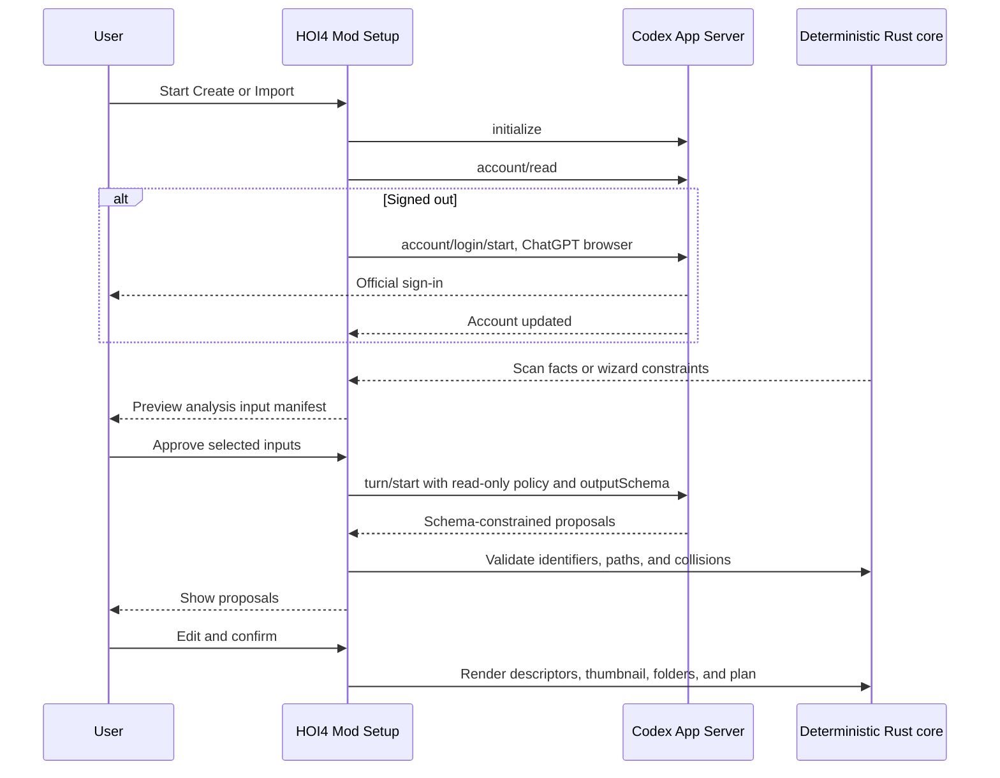

---

## File: `diagrams/component_dependency_graph.mmd`

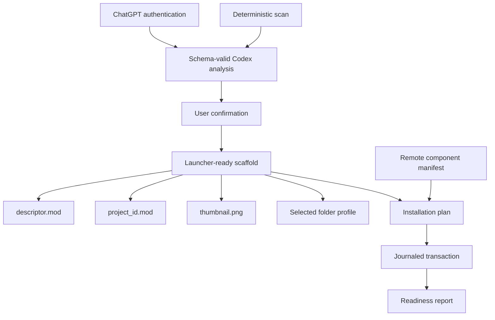

---

## File: `diagrams/credential_flow.mmd`

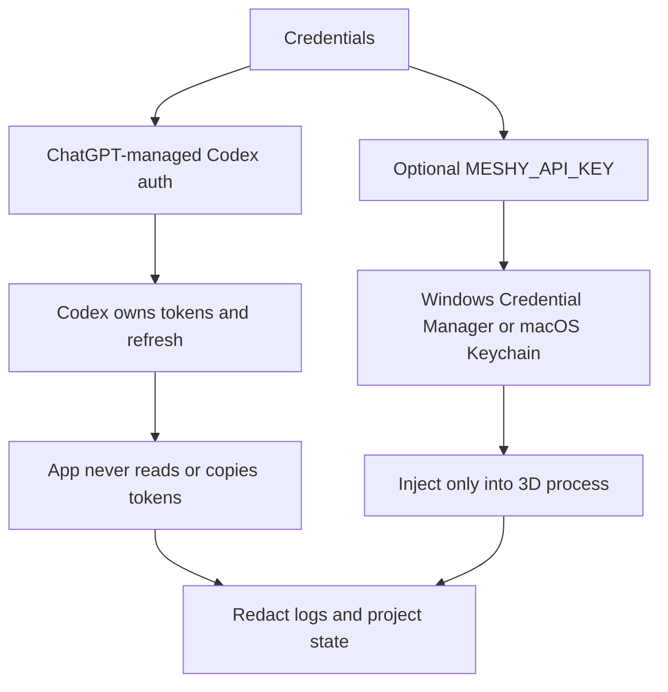

---

## File: `diagrams/existing_project_flow.mmd`

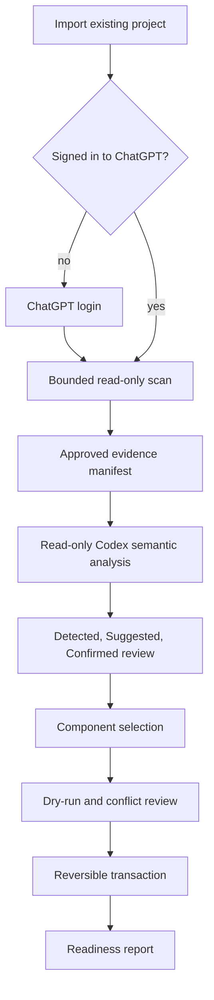

---

## File: `diagrams/new_project_flow.mmd`

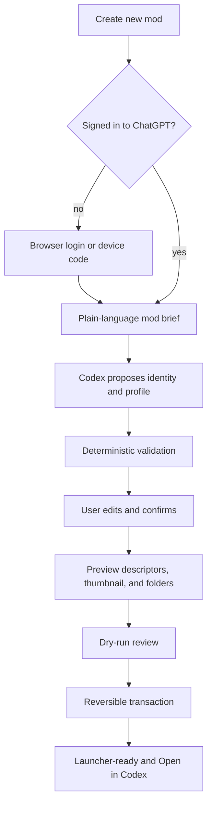

---

## File: `diagrams/readiness_gate.mmd`

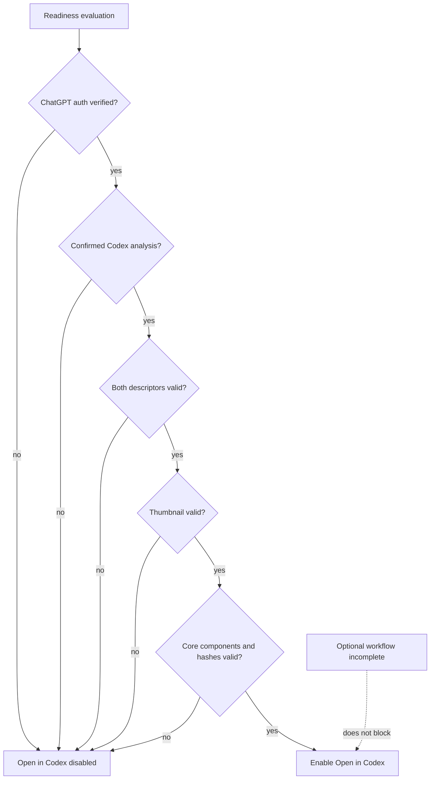

---

## File: `diagrams/recovery_flow.mmd`

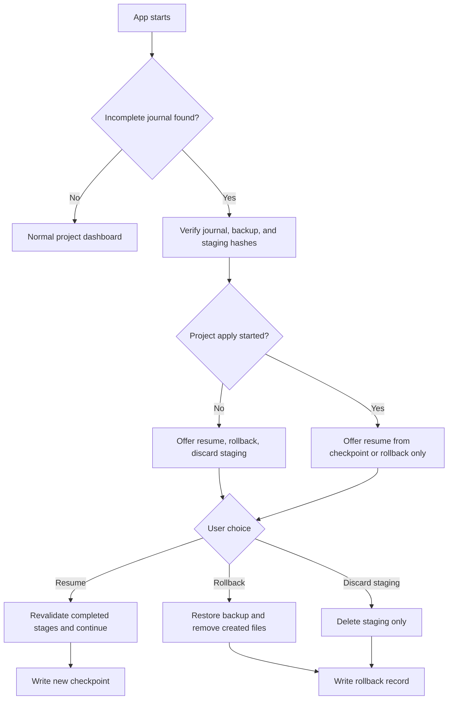

---

## File: `diagrams/system_context.mmd`

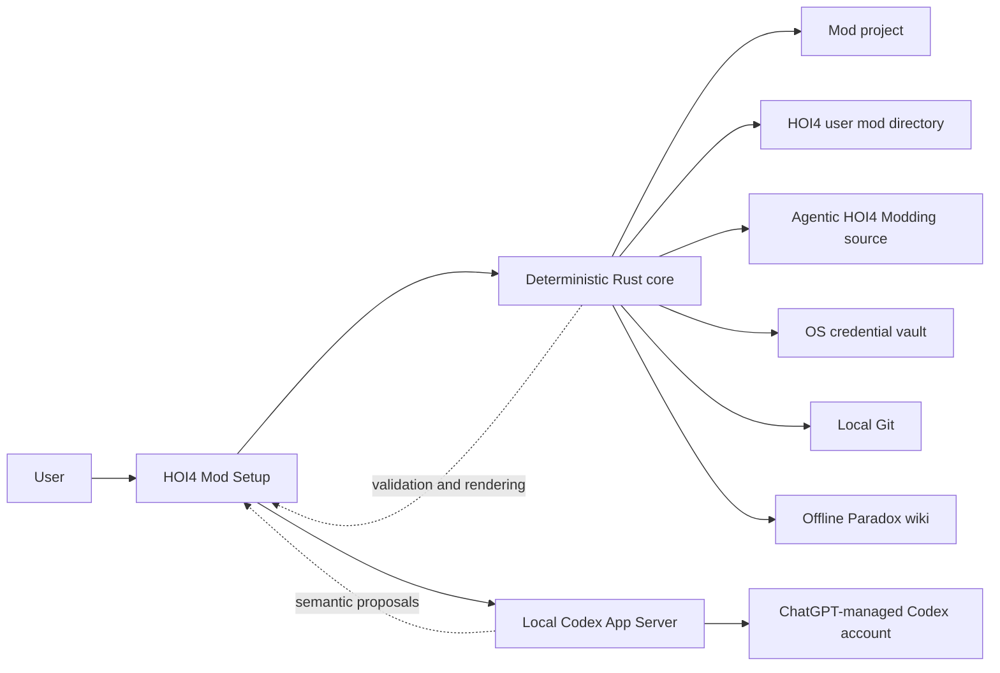

---

## File: `diagrams/transaction_state_machine.mmd`

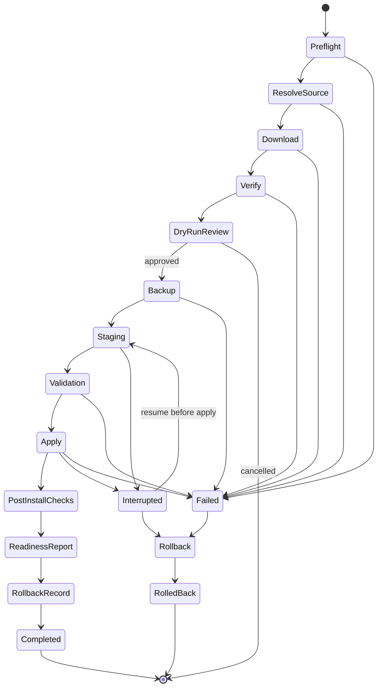

---

## File: `diagrams/update_merge_flow.mmd`

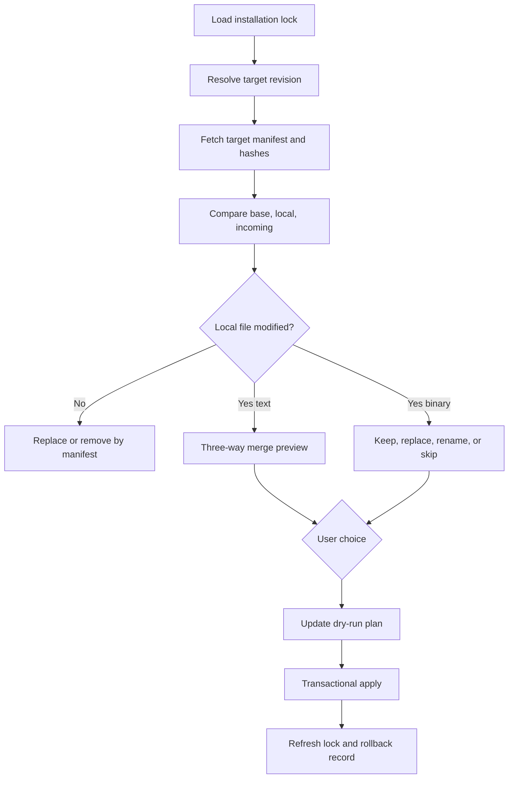

---

## File: `schemas/codex-analysis.schema.json`

```json
{
  "$schema": "https://json-schema.org/draft/2020-12/schema",
  "$id": "https://klimpaskov.github.io/hoi4-mod-setup/schemas/codex-analysis.schema.json",
  "title": "Codex Project Analysis",
  "type": "object",
  "additionalProperties": false,
  "required": [
    "schema_version",
    "analysis_id",
    "mode",
    "input_sha256",
    "project_summary",
    "proposals",
    "component_recommendations",
    "warnings"
  ],
  "properties": {
    "schema_version": {
      "const": "1.0.0"
    },
    "analysis_id": {
      "type": "string",
      "format": "uuid"
    },
    "mode": {
      "enum": [
        "new_project_identity",
        "existing_project_semantics"
      ]
    },
    "input_sha256": {
      "type": "string",
      "pattern": "^[0-9a-f]{64}$"
    },
    "project_summary": {
      "type": "string",
      "minLength": 1,
      "maxLength": 1200
    },
    "proposals": {
      "type": "array",
      "minItems": 1,
      "items": {
        "$ref": "#/$defs/proposal"
      }
    },
    "component_recommendations": {
      "type": "array",
      "items": {
        "type": "object",
        "additionalProperties": false,
        "required": [
          "component_id",
          "recommendation",
          "reason"
        ],
        "properties": {
          "component_id": {
            "type": "string"
          },
          "recommendation": {
            "enum": [
              "required",
              "recommended",
              "not_recommended"
            ]
          },
          "reason": {
            "type": "string",
            "maxLength": 500
          }
        }
      }
    },
    "warnings": {
      "type": "array",
      "items": {
        "type": "string",
        "maxLength": 500
      }
    }
  },
  "$defs": {
    "proposal": {
      "type": "object",
      "additionalProperties": false,
      "required": [
        "key",
        "value",
        "confidence",
        "reason",
        "evidence_refs"
      ],
      "properties": {
        "key": {
          "enum": [
            "display_name",
            "project_id",
            "script_prefix",
            "primary_namespace",
            "project_description",
            "descriptor_tags",
            "folder_profile",
            "agents_profile",
            "localisation_convention",
            "documentation_convention"
          ]
        },
        "value": {},
        "confidence": {
          "type": "number",
          "minimum": 0,
          "maximum": 1
        },
        "reason": {
          "type": "string",
          "maxLength": 500
        },
        "evidence_refs": {
          "type": "array",
          "items": {
            "type": "string"
          }
        }
      }
    }
  },
  "description": "Schema-constrained semantic proposals returned by a ChatGPT-authenticated Codex App Server turn."
}
```

---

## File: `schemas/conflict-record.schema.json`

```json
{
  "$schema": "https://json-schema.org/draft/2020-12/schema",
  "$id": "https://klimpaskov.github.io/hoi4-mod-setup/schemas/conflict-record.schema.json",
  "title": "Conflict Record",
  "type": "object",
  "additionalProperties": false,
  "required": [
    "schema_version",
    "conflict_id",
    "path",
    "base",
    "local",
    "incoming",
    "allowed_choices",
    "selected_choice"
  ],
  "properties": {
    "schema_version": {
      "type": "string"
    },
    "conflict_id": {
      "type": "string"
    },
    "path": {
      "type": "string"
    },
    "kind": {
      "enum": [
        "text",
        "toml",
        "json",
        "binary",
        "symlink",
        "directory"
      ]
    },
    "base": {
      "$ref": "#/$defs/version"
    },
    "local": {
      "$ref": "#/$defs/version"
    },
    "incoming": {
      "$ref": "#/$defs/version"
    },
    "allowed_choices": {
      "type": "array",
      "items": {
        "enum": [
          "keep",
          "replace",
          "merge",
          "rename",
          "skip"
        ]
      }
    },
    "selected_choice": {
      "type": [
        "string",
        "null"
      ],
      "enum": [
        "keep",
        "replace",
        "merge",
        "rename",
        "skip",
        null
      ]
    },
    "merged_preview_sha256": {
      "type": [
        "string",
        "null"
      ]
    }
  },
  "$defs": {
    "version": {
      "type": "object",
      "required": [
        "exists",
        "sha256"
      ],
      "properties": {
        "exists": {
          "type": "boolean"
        },
        "sha256": {
          "type": [
            "string",
            "null"
          ],
          "pattern": "^[0-9a-f]{64}$"
        },
        "source": {
          "type": "string"
        },
        "preview_path": {
          "type": [
            "string",
            "null"
          ]
        }
      }
    }
  }
}
```

---

## File: `schemas/installation-lock.schema.json`

```json
{
  "$schema": "https://json-schema.org/draft/2020-12/schema",
  "$id": "https://klimpaskov.github.io/hoi4-mod-setup/schemas/installation-lock.schema.json",
  "title": "Installation Lock",
  "type": "object",
  "additionalProperties": false,
  "required": [
    "schema_version",
    "project_id",
    "installed_at",
    "source",
    "codex_analysis",
    "components",
    "files",
    "merge_choices",
    "optional_workflows",
    "local_modifications"
  ],
  "properties": {
    "schema_version": {
      "type": "string"
    },
    "project_id": {
      "type": "string"
    },
    "installed_at": {
      "type": "string",
      "format": "date-time"
    },
    "updated_at": {
      "type": [
        "string",
        "null"
      ]
    },
    "source": {
      "type": "object",
      "required": [
        "repository",
        "mode",
        "revision",
        "manifest_sha256"
      ],
      "properties": {
        "repository": {
          "type": "string"
        },
        "mode": {
          "enum": [
            "latest",
            "pinned_commit",
            "pinned_release"
          ]
        },
        "revision": {
          "type": "string",
          "pattern": "^[0-9a-f]{40}$"
        },
        "release": {
          "type": [
            "string",
            "null"
          ]
        },
        "manifest_sha256": {
          "type": "string",
          "pattern": "^[0-9a-f]{64}$"
        }
      }
    },
    "components": {
      "type": "array",
      "items": {
        "type": "object",
        "required": [
          "id",
          "version",
          "state"
        ],
        "properties": {
          "id": {
            "type": "string"
          },
          "version": {
            "type": [
              "string",
              "null"
            ]
          },
          "state": {
            "enum": [
              "installed",
              "incomplete",
              "not_selected",
              "planned_unavailable",
              "unsupported_platform",
              "removed"
            ]
          },
          "source_revision": {
            "type": "string"
          },
          "validation": {
            "enum": [
              "pass",
              "warn",
              "block",
              "not_run"
            ]
          }
        }
      }
    },
    "files": {
      "type": "array",
      "items": {
        "$ref": "#/$defs/file"
      }
    },
    "merge_choices": {
      "type": "array",
      "items": {
        "type": "object",
        "required": [
          "path",
          "choice"
        ],
        "properties": {
          "path": {
            "type": "string"
          },
          "choice": {
            "enum": [
              "keep",
              "replace",
              "merge",
              "rename",
              "skip"
            ]
          },
          "result_sha256": {
            "type": [
              "string",
              "null"
            ],
            "pattern": "^[0-9a-f]{64}$"
          }
        }
      }
    },
    "optional_workflows": {
      "type": "object",
      "additionalProperties": {
        "type": "object",
        "required": [
          "state"
        ],
        "properties": {
          "state": {
            "enum": [
              "not_selected",
              "selected_pending",
              "ready",
              "incomplete",
              "interest_recorded",
              "planned_unavailable",
              "unsupported_platform"
            ]
          },
          "reason": {
            "type": [
              "string",
              "null"
            ]
          },
          "credential_reference": {
            "type": [
              "string",
              "null"
            ]
          }
        }
      }
    },
    "local_modifications": {
      "type": "array",
      "items": {
        "type": "object",
        "required": [
          "path",
          "installed_sha256",
          "current_sha256",
          "detected_at"
        ],
        "properties": {
          "path": {
            "type": "string"
          },
          "installed_sha256": {
            "type": "string",
            "pattern": "^[0-9a-f]{64}$"
          },
          "current_sha256": {
            "type": "string",
            "pattern": "^[0-9a-f]{64}$"
          },
          "detected_at": {
            "type": "string",
            "format": "date-time"
          }
        }
      }
    },
    "rollback_records": {
      "type": "array",
      "items": {
        "type": "string"
      }
    },
    "credential_values": {
      "not": {}
    },
    "codex_analysis": {
      "type": "object",
      "additionalProperties": false,
      "required": [
        "engine",
        "analysis_id",
        "schema_version",
        "input_sha256",
        "output_sha256",
        "confirmed_fields",
        "confirmed_at",
        "account_identity_persisted"
      ],
      "properties": {
        "engine": {
          "const": "codex_app_server"
        },
        "analysis_id": {
          "type": "string",
          "format": "uuid"
        },
        "schema_version": {
          "const": "1.0.0"
        },
        "input_sha256": {
          "type": "string",
          "pattern": "^[0-9a-f]{64}$"
        },
        "output_sha256": {
          "type": "string",
          "pattern": "^[0-9a-f]{64}$"
        },
        "confirmed_fields": {
          "type": "array",
          "minItems": 1,
          "uniqueItems": true,
          "items": {
            "type": "string"
          }
        },
        "confirmed_at": {
          "type": "string",
          "format": "date-time"
        },
        "account_identity_persisted": {
          "const": false
        }
      }
    }
  },
  "$defs": {
    "file": {
      "type": "object",
      "additionalProperties": false,
      "required": [
        "path",
        "location_scope",
        "component_id",
        "source_path",
        "source_revision",
        "source_sha256",
        "installed_sha256",
        "ownership"
      ],
      "properties": {
        "path": {
          "type": "string"
        },
        "component_id": {
          "type": "string"
        },
        "source_path": {
          "type": "string"
        },
        "source_revision": {
          "type": "string"
        },
        "source_sha256": {
          "type": "string",
          "pattern": "^[0-9a-f]{64}$"
        },
        "base_sha256": {
          "type": [
            "string",
            "null"
          ],
          "pattern": "^[0-9a-f]{64}$"
        },
        "installed_sha256": {
          "type": "string",
          "pattern": "^[0-9a-f]{64}$"
        },
        "ownership": {
          "enum": [
            "managed",
            "merged",
            "generated"
          ]
        },
        "executable": {
          "type": "boolean"
        },
        "platform": {
          "enum": [
            "windows",
            "macos",
            "all"
          ]
        },
        "location_scope": {
          "enum": [
            "project",
            "external_launcher",
            "application_data"
          ]
        }
      }
    }
  }
}
```

---

## File: `schemas/installation-plan.schema.json`

```json
{
  "$schema": "https://json-schema.org/draft/2020-12/schema",
  "$id": "https://klimpaskov.github.io/hoi4-mod-setup/schemas/installation-plan.schema.json",
  "title": "Installation Plan",
  "type": "object",
  "additionalProperties": false,
  "required": [
    "schema_version",
    "plan_id",
    "project_id",
    "source",
    "codex_analysis",
    "selected_components",
    "operations",
    "conflicts",
    "transaction",
    "approvals"
  ],
  "properties": {
    "schema_version": {
      "type": "string"
    },
    "plan_id": {
      "type": "string",
      "format": "uuid"
    },
    "project_id": {
      "type": "string"
    },
    "created_at": {
      "type": "string",
      "format": "date-time"
    },
    "source": {
      "type": "object",
      "required": [
        "mode",
        "repository",
        "resolved_revision"
      ],
      "properties": {
        "mode": {
          "enum": [
            "latest",
            "pinned_commit",
            "pinned_release"
          ]
        },
        "repository": {
          "type": "string"
        },
        "requested_ref": {
          "type": [
            "string",
            "null"
          ]
        },
        "resolved_revision": {
          "type": "string",
          "pattern": "^[0-9a-f]{40}$"
        },
        "manifest_sha256": {
          "type": "string",
          "pattern": "^[0-9a-f]{64}$"
        }
      }
    },
    "selected_components": {
      "type": "array",
      "items": {
        "type": "string"
      }
    },
    "optional_workflows": {
      "type": "object",
      "additionalProperties": {
        "enum": [
          "not_selected",
          "selected_pending",
          "ready",
          "incomplete",
          "interest_recorded",
          "planned_unavailable",
          "unsupported_platform"
        ]
      }
    },
    "operations": {
      "type": "array",
      "items": {
        "$ref": "#/$defs/operation"
      }
    },
    "conflicts": {
      "type": "array",
      "items": {
        "$ref": "#/$defs/conflictDecision"
      }
    },
    "external_actions": {
      "type": "array",
      "items": {
        "$ref": "#/$defs/externalAction"
      }
    },
    "transaction": {
      "type": "object",
      "required": [
        "stages",
        "backup_root",
        "staging_root"
      ],
      "properties": {
        "stages": {
          "type": "array",
          "minItems": 12,
          "items": {
            "type": "string"
          }
        },
        "backup_root": {
          "type": "string"
        },
        "staging_root": {
          "type": "string"
        },
        "atomic_apply_expected": {
          "type": "boolean"
        }
      }
    },
    "approvals": {
      "type": "object",
      "required": [
        "dry_run_reviewed",
        "external_actions_reviewed",
        "git_remote_approved",
        "push_approved"
      ],
      "properties": {
        "dry_run_reviewed": {
          "type": "boolean"
        },
        "external_actions_reviewed": {
          "type": "boolean"
        },
        "git_remote_approved": {
          "type": "boolean"
        },
        "push_approved": {
          "type": "boolean"
        }
      }
    },
    "codex_analysis": {
      "type": "object",
      "additionalProperties": false,
      "required": [
        "engine",
        "auth_mode",
        "analysis_id",
        "schema_version",
        "input_sha256",
        "output_sha256",
        "confirmed_fields",
        "confirmed_at"
      ],
      "properties": {
        "engine": {
          "const": "codex_app_server"
        },
        "auth_mode": {
          "const": "chatgpt"
        },
        "analysis_id": {
          "type": "string",
          "format": "uuid"
        },
        "schema_version": {
          "const": "1.0.0"
        },
        "input_sha256": {
          "type": "string",
          "pattern": "^[0-9a-f]{64}$"
        },
        "output_sha256": {
          "type": "string",
          "pattern": "^[0-9a-f]{64}$"
        },
        "confirmed_fields": {
          "type": "array",
          "minItems": 1,
          "uniqueItems": true,
          "items": {
            "type": "string"
          }
        },
        "confirmed_at": {
          "type": "string",
          "format": "date-time"
        }
      }
    }
  },
  "$defs": {
    "operation": {
      "type": "object",
      "additionalProperties": false,
      "required": [
        "id",
        "component_id",
        "action",
        "location_scope",
        "destination",
        "source_sha256",
        "local_state",
        "rollback"
      ],
      "properties": {
        "id": {
          "type": "string"
        },
        "component_id": {
          "type": "string"
        },
        "action": {
          "enum": [
            "create",
            "replace",
            "merge",
            "rename",
            "skip",
            "delete_managed",
            "generate",
            "chmod",
            "external"
          ]
        },
        "source_path": {
          "type": [
            "string",
            "null"
          ]
        },
        "destination": {
          "type": "string"
        },
        "source_sha256": {
          "type": [
            "string",
            "null"
          ],
          "pattern": "^[0-9a-f]{64}$"
        },
        "base_sha256": {
          "type": [
            "string",
            "null"
          ],
          "pattern": "^[0-9a-f]{64}$"
        },
        "local_sha256": {
          "type": [
            "string",
            "null"
          ],
          "pattern": "^[0-9a-f]{64}$"
        },
        "local_state": {
          "enum": [
            "absent",
            "unmodified",
            "modified",
            "unknown"
          ]
        },
        "resolution": {
          "type": [
            "string",
            "null"
          ]
        },
        "rollback": {
          "enum": [
            "remove_created",
            "restore_backup",
            "reverse_merge",
            "none"
          ]
        },
        "location_scope": {
          "enum": [
            "project",
            "external_launcher",
            "application_data"
          ]
        }
      }
    },
    "conflictDecision": {
      "type": "object",
      "additionalProperties": false,
      "required": [
        "id",
        "path",
        "options",
        "selected"
      ],
      "properties": {
        "id": {
          "type": "string"
        },
        "path": {
          "type": "string"
        },
        "options": {
          "type": "array",
          "items": {
            "enum": [
              "keep",
              "replace",
              "merge",
              "rename",
              "skip"
            ]
          }
        },
        "selected": {
          "type": [
            "string",
            "null"
          ],
          "enum": [
            "keep",
            "replace",
            "merge",
            "rename",
            "skip",
            null
          ]
        },
        "apply_to_identical": {
          "type": "boolean"
        }
      }
    },
    "externalAction": {
      "type": "object",
      "additionalProperties": false,
      "required": [
        "id",
        "component_id",
        "platform",
        "command_source",
        "risk",
        "requires_approval"
      ],
      "properties": {
        "id": {
          "type": "string"
        },
        "component_id": {
          "type": "string"
        },
        "platform": {
          "enum": [
            "windows",
            "macos"
          ]
        },
        "command_source": {
          "enum": [
            "remote_manifest",
            "repository_script",
            "generated_adapter"
          ]
        },
        "display_command": {
          "type": [
            "string",
            "null"
          ]
        },
        "risk": {
          "enum": [
            "low",
            "medium",
            "high"
          ]
        },
        "requires_approval": {
          "type": "boolean"
        },
        "contains_secret": {
          "const": false
        }
      }
    }
  }
}
```

---

## File: `schemas/project-state.schema.json`

```json
{
  "$schema": "https://json-schema.org/draft/2020-12/schema",
  "$id": "https://klimpaskov.github.io/hoi4-mod-setup/schemas/project-state.schema.json",
  "title": "Project Setup State",
  "type": "object",
  "additionalProperties": false,
  "required": [
    "schema_version",
    "project_id",
    "project_root",
    "platform",
    "wizard",
    "preferences",
    "codex",
    "credential_references"
  ],
  "properties": {
    "schema_version": {
      "type": "string"
    },
    "project_id": {
      "type": "string"
    },
    "project_root": {
      "type": "string"
    },
    "platform": {
      "enum": [
        "windows",
        "macos"
      ]
    },
    "wizard": {
      "type": "object",
      "required": [
        "current_step",
        "completed_steps"
      ],
      "properties": {
        "current_step": {
          "type": "string"
        },
        "completed_steps": {
          "type": "array",
          "items": {
            "type": "string"
          }
        },
        "draft_values": {
          "type": "object"
        }
      }
    },
    "preferences": {
      "type": "object",
      "properties": {
        "source_mode": {
          "enum": [
            "latest",
            "pinned_commit",
            "pinned_release"
          ]
        },
        "lora_comfyui_interest": {
          "type": "boolean"
        },
        "telemetry": {
          "const": false
        }
      }
    },
    "credential_references": {
      "type": "array",
      "items": {
        "type": "object",
        "required": [
          "name",
          "provider",
          "reference"
        ],
        "properties": {
          "name": {
            "type": "string"
          },
          "provider": {
            "enum": [
              "windows_credential_manager",
              "macos_keychain"
            ]
          },
          "reference": {
            "type": "string"
          },
          "secret_value": {
            "not": {}
          }
        }
      }
    },
    "codex": {
      "type": "object",
      "additionalProperties": false,
      "required": [
        "integration",
        "auth_mode",
        "auth_status",
        "analysis_required",
        "analysis_status",
        "account_values_persisted"
      ],
      "properties": {
        "integration": {
          "const": "codex_app_server"
        },
        "auth_mode": {
          "const": "chatgpt"
        },
        "auth_status": {
          "enum": [
            "signed_out",
            "signing_in",
            "signed_in",
            "failed",
            "usage_limited"
          ]
        },
        "analysis_required": {
          "const": true
        },
        "analysis_status": {
          "enum": [
            "pending",
            "running",
            "review",
            "confirmed",
            "blocked"
          ]
        },
        "last_error": {
          "type": [
            "string",
            "null"
          ]
        },
        "account_values_persisted": {
          "const": false
        }
      }
    }
  }
}
```

---

## File: `schemas/readiness-report.schema.json`

```json
{
  "$schema": "https://json-schema.org/draft/2020-12/schema",
  "$id": "https://klimpaskov.github.io/hoi4-mod-setup/schemas/readiness-report.schema.json",
  "title": "Readiness Report",
  "type": "object",
  "additionalProperties": false,
  "required": [
    "schema_version",
    "report_id",
    "project_id",
    "generated_at",
    "codex",
    "checks",
    "summary",
    "open_in_codex"
  ],
  "properties": {
    "schema_version": {
      "type": "string"
    },
    "report_id": {
      "type": "string",
      "format": "uuid"
    },
    "project_id": {
      "type": "string"
    },
    "generated_at": {
      "type": "string",
      "format": "date-time"
    },
    "checks": {
      "type": "array",
      "items": {
        "$ref": "#/$defs/check"
      }
    },
    "summary": {
      "type": "object",
      "required": [
        "pass",
        "warn",
        "block",
        "not_selected",
        "planned_unavailable"
      ],
      "properties": {
        "pass": {
          "type": "integer"
        },
        "warn": {
          "type": "integer"
        },
        "block": {
          "type": "integer"
        },
        "not_selected": {
          "type": "integer"
        },
        "planned_unavailable": {
          "type": "integer"
        }
      }
    },
    "open_in_codex": {
      "type": "object",
      "required": [
        "enabled",
        "blocking_check_ids"
      ],
      "properties": {
        "enabled": {
          "type": "boolean"
        },
        "blocking_check_ids": {
          "type": "array",
          "items": {
            "type": "string"
          }
        },
        "command_preview": {
          "type": [
            "string",
            "null"
          ]
        }
      }
    },
    "notes": {
      "type": "array",
      "items": {
        "type": "string"
      }
    },
    "codex": {
      "type": "object",
      "additionalProperties": false,
      "required": [
        "integration",
        "auth_mode",
        "authenticated_during_setup",
        "analysis_status",
        "confirmed_field_count",
        "no_account_metadata_persisted",
        "blocking_check_ids"
      ],
      "properties": {
        "integration": {
          "const": "codex_app_server"
        },
        "auth_mode": {
          "const": "chatgpt"
        },
        "authenticated_during_setup": {
          "type": "boolean"
        },
        "analysis_status": {
          "enum": [
            "confirmed",
            "block"
          ]
        },
        "confirmed_field_count": {
          "type": "integer",
          "minimum": 0
        },
        "no_account_metadata_persisted": {
          "const": true
        },
        "blocking_check_ids": {
          "type": "array",
          "items": {
            "type": "string"
          }
        }
      }
    }
  },
  "$defs": {
    "check": {
      "type": "object",
      "additionalProperties": false,
      "required": [
        "id",
        "category",
        "label",
        "status",
        "blocking",
        "evidence"
      ],
      "properties": {
        "id": {
          "type": "string"
        },
        "category": {
          "enum": [
            "descriptor",
            "launcher",
            "thumbnail",
            "structure",
            "codex",
            "skill",
            "subagent",
            "mcp",
            "wiki",
            "git",
            "environment",
            "hash",
            "conflict",
            "dependency",
            "workflow",
            "analysis"
          ]
        },
        "label": {
          "type": "string"
        },
        "status": {
          "enum": [
            "pass",
            "warn",
            "block",
            "not_selected",
            "planned_unavailable",
            "unsupported_platform"
          ]
        },
        "blocking": {
          "type": "boolean"
        },
        "message": {
          "type": "string"
        },
        "evidence": {
          "type": "array",
          "items": {
            "type": "object",
            "required": [
              "kind",
              "value"
            ],
            "properties": {
              "kind": {
                "type": "string"
              },
              "value": {},
              "path": {
                "type": [
                  "string",
                  "null"
                ]
              }
            }
          }
        }
      }
    }
  }
}
```

---

## File: `schemas/remote-manifest.schema.json`

```json
{
  "$schema": "https://json-schema.org/draft/2020-12/schema",
  "$id": "https://klimpaskov.github.io/hoi4-mod-setup/schemas/remote-manifest.schema.json",
  "title": "HOI4 Mod Setup Remote Manifest",
  "type": "object",
  "additionalProperties": false,
  "required": [
    "schema_version",
    "manifest_id",
    "repository",
    "components",
    "profiles",
    "wiki",
    "update_policy"
  ],
  "properties": {
    "schema_version": {
      "type": "string",
      "pattern": "^[0-9]+\\.[0-9]+\\.[0-9]+$"
    },
    "manifest_id": {
      "type": "string",
      "pattern": "^[a-z0-9][a-z0-9._-]*$"
    },
    "generated_for_revision": {
      "type": [
        "string",
        "null"
      ],
      "pattern": "^[0-9a-f]{40}$"
    },
    "repository": {
      "$ref": "#/$defs/repository"
    },
    "components": {
      "type": "array",
      "minItems": 1,
      "items": {
        "$ref": "#/$defs/component"
      }
    },
    "profiles": {
      "type": "array",
      "minItems": 1,
      "items": {
        "$ref": "#/$defs/profile"
      }
    },
    "wiki": {
      "$ref": "#/$defs/wiki"
    },
    "update_policy": {
      "$ref": "#/$defs/updatePolicy"
    },
    "signing": {
      "$ref": "#/$defs/signing"
    }
  },
  "$defs": {
    "repository": {
      "type": "object",
      "additionalProperties": false,
      "required": [
        "provider",
        "owner",
        "name",
        "default_branch"
      ],
      "properties": {
        "provider": {
          "const": "github"
        },
        "owner": {
          "type": "string",
          "minLength": 1
        },
        "name": {
          "type": "string",
          "minLength": 1
        },
        "default_branch": {
          "type": "string",
          "minLength": 1
        },
        "web_url": {
          "type": "string",
          "format": "uri"
        },
        "api_base": {
          "type": "string",
          "format": "uri"
        },
        "license_evidence": {
          "enum": [
            "verified",
            "declared_unverified",
            "not_found",
            "unknown"
          ]
        }
      }
    },
    "source": {
      "type": "object",
      "additionalProperties": false,
      "required": [
        "kind",
        "path"
      ],
      "properties": {
        "kind": {
          "enum": [
            "file",
            "tree",
            "generated"
          ]
        },
        "path": {
          "type": "string",
          "minLength": 1
        },
        "include": {
          "type": "array",
          "items": {
            "type": "string"
          }
        },
        "exclude": {
          "type": "array",
          "items": {
            "type": "string"
          }
        },
        "template_engine": {
          "type": [
            "string",
            "null"
          ]
        }
      }
    },
    "destination": {
      "type": "object",
      "additionalProperties": false,
      "required": [
        "path",
        "ownership"
      ],
      "properties": {
        "path": {
          "type": "string",
          "minLength": 1
        },
        "ownership": {
          "enum": [
            "managed",
            "merged",
            "generated",
            "external"
          ]
        },
        "outside_project": {
          "type": "boolean",
          "default": false
        }
      }
    },
    "tool": {
      "type": "object",
      "additionalProperties": false,
      "required": [
        "id",
        "required"
      ],
      "properties": {
        "id": {
          "type": "string"
        },
        "required": {
          "type": "boolean"
        },
        "version_policy": {
          "enum": [
            "manifest",
            "repository_script",
            "latest_at_execution",
            "user_managed",
            "any"
          ]
        },
        "version": {
          "type": [
            "string",
            "null"
          ]
        },
        "commands": {
          "type": "array",
          "items": {
            "type": "string"
          }
        },
        "health_checks": {
          "type": "array",
          "items": {
            "type": "string"
          }
        }
      }
    },
    "env": {
      "type": "object",
      "additionalProperties": false,
      "required": [
        "name",
        "secret",
        "required"
      ],
      "properties": {
        "name": {
          "type": "string",
          "pattern": "^[A-Z][A-Z0-9_]*$"
        },
        "secret": {
          "type": "boolean"
        },
        "required": {
          "type": "boolean"
        },
        "storage": {
          "enum": [
            "process",
            "os_credential_vault",
            "user_environment",
            "project_file_forbidden"
          ]
        },
        "non_empty": {
          "type": "boolean"
        }
      }
    },
    "validation": {
      "type": "object",
      "additionalProperties": false,
      "required": [
        "id",
        "severity",
        "kind"
      ],
      "properties": {
        "id": {
          "type": "string"
        },
        "severity": {
          "enum": [
            "block",
            "warn",
            "info"
          ]
        },
        "kind": {
          "enum": [
            "exists",
            "sha256",
            "json_schema",
            "toml_parse",
            "yaml_bom",
            "command",
            "directory_coverage",
            "custom"
          ]
        },
        "target": {
          "type": [
            "string",
            "null"
          ]
        },
        "parameters": {
          "type": "object"
        }
      }
    },
    "component": {
      "type": "object",
      "additionalProperties": false,
      "required": [
        "id",
        "display_name",
        "category",
        "optional",
        "platforms",
        "source",
        "destination",
        "dependencies",
        "conflict_policy",
        "validation",
        "update"
      ],
      "properties": {
        "id": {
          "type": "string",
          "pattern": "^[a-z0-9][a-z0-9._-]*$"
        },
        "display_name": {
          "type": "string"
        },
        "description": {
          "type": "string"
        },
        "category": {
          "enum": [
            "core",
            "skill",
            "subagent",
            "codex",
            "mcp",
            "script",
            "validator",
            "template",
            "documentation",
            "wiki",
            "workflow"
          ]
        },
        "optional": {
          "type": "boolean"
        },
        "platforms": {
          "type": "array",
          "minItems": 1,
          "uniqueItems": true,
          "items": {
            "enum": [
              "windows",
              "macos",
              "all"
            ]
          }
        },
        "source": {
          "$ref": "#/$defs/source"
        },
        "destination": {
          "$ref": "#/$defs/destination"
        },
        "dependencies": {
          "type": "array",
          "items": {
            "type": "string"
          }
        },
        "required_tools": {
          "type": "array",
          "items": {
            "$ref": "#/$defs/tool"
          }
        },
        "environment": {
          "type": "array",
          "items": {
            "$ref": "#/$defs/env"
          }
        },
        "expected_files": {
          "type": "array",
          "items": {
            "type": "object",
            "required": [
              "path",
              "sha256"
            ],
            "properties": {
              "path": {
                "type": "string"
              },
              "sha256": {
                "type": [
                  "string",
                  "null"
                ],
                "pattern": "^[0-9a-f]{64}$"
              },
              "size": {
                "type": [
                  "integer",
                  "null"
                ],
                "minimum": 0
              }
            }
          }
        },
        "conflicts": {
          "type": "array",
          "items": {
            "type": "string"
          }
        },
        "conflict_policy": {
          "enum": [
            "fail",
            "prompt",
            "three_way_merge",
            "toml_merge",
            "keep_local",
            "replace_if_unmodified",
            "generated_review"
          ]
        },
        "validation": {
          "type": "array",
          "items": {
            "$ref": "#/$defs/validation"
          }
        },
        "update": {
          "type": "object",
          "additionalProperties": false,
          "required": [
            "strategy",
            "remove_obsolete"
          ],
          "properties": {
            "strategy": {
              "enum": [
                "replace_if_unmodified",
                "three_way_merge",
                "toml_merge",
                "recreate",
                "repository_script",
                "manual"
              ]
            },
            "remove_obsolete": {
              "type": "boolean"
            },
            "preserve_local_additions": {
              "type": "boolean"
            }
          }
        },
        "capabilities": {
          "type": "array",
          "items": {
            "type": "string"
          }
        },
        "notes": {
          "type": "array",
          "items": {
            "type": "string"
          }
        }
      }
    },
    "profile": {
      "type": "object",
      "additionalProperties": false,
      "required": [
        "id",
        "display_name",
        "components"
      ],
      "properties": {
        "id": {
          "type": "string"
        },
        "display_name": {
          "type": "string"
        },
        "components": {
          "type": "array",
          "items": {
            "type": "string"
          }
        },
        "default": {
          "type": "boolean"
        }
      }
    },
    "wiki": {
      "type": "object",
      "additionalProperties": false,
      "required": [
        "component_id",
        "destination",
        "required_pages",
        "provenance"
      ],
      "properties": {
        "component_id": {
          "type": "string"
        },
        "destination": {
          "const": "paradox_wiki/"
        },
        "snapshot_marker": {
          "type": [
            "string",
            "null"
          ]
        },
        "required_pages": {
          "type": "array",
          "minItems": 1,
          "items": {
            "type": "string"
          }
        },
        "required_media_policy": {
          "enum": [
            "all_declared",
            "referenced_only",
            "none"
          ]
        },
        "provenance": {
          "type": "object",
          "required": [
            "source_status",
            "license_status"
          ],
          "properties": {
            "source_status": {
              "enum": [
                "verified",
                "repository_only",
                "unknown"
              ]
            },
            "license_status": {
              "enum": [
                "verified",
                "not_found",
                "unknown"
              ]
            },
            "notes": {
              "type": "array",
              "items": {
                "type": "string"
              }
            }
          }
        }
      }
    },
    "updatePolicy": {
      "type": "object",
      "additionalProperties": false,
      "required": [
        "latest",
        "pinned",
        "rollback_retention"
      ],
      "properties": {
        "latest": {
          "type": "object",
          "required": [
            "resolve_default_branch",
            "record_commit"
          ],
          "properties": {
            "resolve_default_branch": {
              "const": true
            },
            "record_commit": {
              "const": true
            }
          }
        },
        "pinned": {
          "type": "object",
          "required": [
            "allow_commit",
            "allow_release"
          ],
          "properties": {
            "allow_commit": {
              "type": "boolean"
            },
            "allow_release": {
              "type": "boolean"
            }
          }
        },
        "rollback_retention": {
          "type": "integer",
          "minimum": 1
        },
        "manifest_cache_ttl_seconds": {
          "type": "integer",
          "minimum": 0
        }
      }
    },
    "signing": {
      "type": "object",
      "additionalProperties": false,
      "properties": {
        "required": {
          "type": "boolean"
        },
        "algorithm": {
          "type": [
            "string",
            "null"
          ]
        },
        "public_key_id": {
          "type": [
            "string",
            "null"
          ]
        }
      }
    }
  }
}
```

---

## File: `schemas/scan-result.schema.json`

```json
{
  "$schema": "https://json-schema.org/draft/2020-12/schema",
  "$id": "https://klimpaskov.github.io/hoi4-mod-setup/schemas/scan-result.schema.json",
  "title": "Project Scan Result",
  "type": "object",
  "additionalProperties": false,
  "required": [
    "schema_version",
    "scan_id",
    "project_root",
    "mode",
    "started_at",
    "completed_at",
    "read_only",
    "findings",
    "semantic_analysis",
    "summary"
  ],
  "properties": {
    "schema_version": {
      "type": "string"
    },
    "scan_id": {
      "type": "string",
      "format": "uuid"
    },
    "project_root": {
      "type": "string"
    },
    "mode": {
      "enum": [
        "new",
        "existing"
      ]
    },
    "platform": {
      "enum": [
        "windows",
        "macos"
      ]
    },
    "started_at": {
      "type": "string",
      "format": "date-time"
    },
    "completed_at": {
      "type": [
        "string",
        "null"
      ],
      "format": "date-time"
    },
    "read_only": {
      "const": true
    },
    "scanner_version": {
      "type": "string"
    },
    "findings": {
      "type": "array",
      "items": {
        "$ref": "#/$defs/finding"
      }
    },
    "conflicts": {
      "type": "array",
      "items": {
        "$ref": "#/$defs/conflict"
      }
    },
    "semantic_analysis": {
      "$ref": "#/$defs/semantic_analysis"
    },
    "summary": {
      "type": "object",
      "required": [
        "accepted",
        "needs_review",
        "blocking",
        "warnings"
      ],
      "properties": {
        "accepted": {
          "type": "integer",
          "minimum": 0
        },
        "needs_review": {
          "type": "integer",
          "minimum": 0
        },
        "blocking": {
          "type": "integer",
          "minimum": 0
        },
        "warnings": {
          "type": "integer",
          "minimum": 0
        }
      }
    }
  },
  "$defs": {
    "evidence": {
      "type": "object",
      "additionalProperties": false,
      "required": [
        "detector",
        "path",
        "confidence"
      ],
      "properties": {
        "detector": {
          "type": "string"
        },
        "path": {
          "type": "string"
        },
        "line_start": {
          "type": [
            "integer",
            "null"
          ],
          "minimum": 1
        },
        "line_end": {
          "type": [
            "integer",
            "null"
          ],
          "minimum": 1
        },
        "excerpt_sha256": {
          "type": [
            "string",
            "null"
          ],
          "pattern": "^[0-9a-f]{64}$"
        },
        "confidence": {
          "type": "number",
          "minimum": 0,
          "maximum": 1
        },
        "note": {
          "type": [
            "string",
            "null"
          ]
        }
      }
    },
    "finding": {
      "type": "object",
      "additionalProperties": false,
      "required": [
        "id",
        "category",
        "key",
        "value",
        "status",
        "origin",
        "evidence"
      ],
      "properties": {
        "id": {
          "type": "string"
        },
        "category": {
          "enum": [
            "identity",
            "descriptor",
            "structure",
            "git",
            "namespace",
            "naming",
            "localisation",
            "documentation",
            "skill",
            "subagent",
            "codex",
            "mcp",
            "conflict",
            "tool",
            "wiki"
          ]
        },
        "key": {
          "type": "string"
        },
        "value": {},
        "status": {
          "enum": [
            "accepted",
            "needs_review",
            "edited",
            "rejected",
            "blocking"
          ]
        },
        "user_value": {},
        "evidence": {
          "type": "array",
          "minItems": 1,
          "items": {
            "$ref": "#/$defs/evidence"
          }
        },
        "origin": {
          "enum": [
            "deterministic",
            "codex_suggested",
            "user_confirmed"
          ]
        },
        "recommendation": {
          "type": [
            "string",
            "null"
          ]
        }
      }
    },
    "semantic_analysis": {
      "type": "object",
      "additionalProperties": false,
      "required": [
        "requested",
        "required",
        "status",
        "engine",
        "auth_mode",
        "transport",
        "input_manifest",
        "output_schema_id",
        "analysis_id",
        "response_sha256",
        "suggestions"
      ],
      "properties": {
        "requested": {
          "const": true
        },
        "required": {
          "const": true
        },
        "status": {
          "enum": [
            "authentication_required",
            "usage_limited",
            "cancelled",
            "failed",
            "complete"
          ]
        },
        "engine": {
          "const": "codex_app_server"
        },
        "auth_mode": {
          "const": "chatgpt"
        },
        "transport": {
          "const": "stdio_jsonl"
        },
        "model": {
          "type": [
            "string",
            "null"
          ]
        },
        "input_manifest": {
          "type": "array",
          "items": {
            "type": "object",
            "additionalProperties": false,
            "required": [
              "ref_id",
              "kind",
              "path",
              "sha256",
              "approved"
            ],
            "properties": {
              "ref_id": {
                "type": "string"
              },
              "kind": {
                "enum": [
                  "user_brief",
                  "deterministic_finding",
                  "text_excerpt",
                  "wizard_constraint"
                ]
              },
              "path": {
                "type": "string"
              },
              "sha256": {
                "type": "string",
                "pattern": "^[0-9a-f]{64}$"
              },
              "approved": {
                "const": true
              }
            }
          }
        },
        "output_schema_id": {
          "const": "codex-analysis/1.0.0"
        },
        "analysis_id": {
          "type": [
            "string",
            "null"
          ],
          "format": "uuid"
        },
        "response_sha256": {
          "type": [
            "string",
            "null"
          ],
          "pattern": "^[0-9a-f]{64}$"
        },
        "suggestions": {
          "type": "array",
          "items": {
            "$ref": "#/$defs/finding"
          }
        }
      }
    },
    "conflict": {
      "type": "object",
      "additionalProperties": false,
      "required": [
        "id",
        "path",
        "kind",
        "severity"
      ],
      "properties": {
        "id": {
          "type": "string"
        },
        "path": {
          "type": "string"
        },
        "kind": {
          "enum": [
            "managed_file_exists",
            "naming_collision",
            "namespace_collision",
            "descriptor_mismatch",
            "tool_missing",
            "platform_unsupported",
            "encoding_mixed",
            "other"
          ]
        },
        "severity": {
          "enum": [
            "block",
            "warn",
            "info"
          ]
        },
        "details": {
          "type": "string"
        }
      }
    }
  }
}
```

---

## File: `schemas/transaction-journal.schema.json`

```json
{
  "$schema": "https://json-schema.org/draft/2020-12/schema",
  "$id": "https://klimpaskov.github.io/hoi4-mod-setup/schemas/transaction-journal.schema.json",
  "title": "Transaction Journal",
  "type": "object",
  "additionalProperties": false,
  "required": [
    "schema_version",
    "transaction_id",
    "project_id",
    "state",
    "created_at",
    "last_checkpoint",
    "stages",
    "operations",
    "recovery"
  ],
  "properties": {
    "schema_version": {
      "type": "string"
    },
    "transaction_id": {
      "type": "string",
      "format": "uuid"
    },
    "project_id": {
      "type": "string"
    },
    "state": {
      "enum": [
        "preflight",
        "resolving",
        "downloading",
        "verifying",
        "reviewed",
        "backing_up",
        "staging",
        "validating",
        "applying",
        "post_check",
        "reporting",
        "completed",
        "interrupted",
        "rolling_back",
        "rolled_back",
        "failed"
      ]
    },
    "created_at": {
      "type": "string",
      "format": "date-time"
    },
    "updated_at": {
      "type": "string",
      "format": "date-time"
    },
    "last_checkpoint": {
      "type": "string"
    },
    "plan_sha256": {
      "type": "string",
      "pattern": "^[0-9a-f]{64}$"
    },
    "stages": {
      "type": "array",
      "items": {
        "type": "object",
        "required": [
          "id",
          "status"
        ],
        "properties": {
          "id": {
            "type": "string"
          },
          "status": {
            "enum": [
              "pending",
              "active",
              "complete",
              "failed",
              "skipped"
            ]
          },
          "started_at": {
            "type": [
              "string",
              "null"
            ]
          },
          "completed_at": {
            "type": [
              "string",
              "null"
            ]
          },
          "evidence": {
            "type": "array",
            "items": {
              "type": "string"
            }
          }
        }
      }
    },
    "operations": {
      "type": "array",
      "items": {
        "type": "object",
        "required": [
          "id",
          "status",
          "destination"
        ],
        "properties": {
          "id": {
            "type": "string"
          },
          "status": {
            "enum": [
              "pending",
              "staged",
              "applied",
              "verified",
              "rolled_back",
              "failed"
            ]
          },
          "destination": {
            "type": "string"
          },
          "backup_path": {
            "type": [
              "string",
              "null"
            ]
          },
          "before_sha256": {
            "type": [
              "string",
              "null"
            ]
          },
          "after_sha256": {
            "type": [
              "string",
              "null"
            ]
          }
        }
      }
    },
    "recovery": {
      "type": "object",
      "required": [
        "resume_allowed",
        "rollback_allowed",
        "discard_staging_allowed",
        "project_apply_started"
      ],
      "properties": {
        "resume_allowed": {
          "type": "boolean"
        },
        "rollback_allowed": {
          "type": "boolean"
        },
        "discard_staging_allowed": {
          "type": "boolean"
        },
        "project_apply_started": {
          "type": "boolean"
        },
        "recommended_action": {
          "enum": [
            "resume",
            "rollback",
            "discard_staging",
            "inspect",
            "none"
          ]
        }
      }
    },
    "error": {
      "type": [
        "object",
        "null"
      ],
      "properties": {
        "code": {
          "type": "string"
        },
        "message": {
          "type": "string"
        },
        "stage": {
          "type": "string"
        }
      }
    }
  }
}
```

---

## File: `examples/codex-analysis.example.json`

```json
{
  "schema_version": "1.0.0",
  "analysis_id": "8da5758f-e9d8-4ad4-bba6-99c9bc6583ee",
  "mode": "new_project_identity",
  "input_sha256": "aaaaaaaaaaaaaaaaaaaaaaaaaaaaaaaaaaaaaaaaaaaaaaaaaaaaaaaaaaaaaaaa",
  "project_summary": "A Cold War alternate-history mod centered on a divided Europe, diplomatic crises, proxy conflicts, and several playable political routes.",
  "proposals": [
    {
      "key": "display_name",
      "value": "Cold War Curtain",
      "confidence": 0.94,
      "reason": "The name is short, distinct, and matches the divided-Europe premise.",
      "evidence_refs": ["brief:1"]
    },
    {
      "key": "project_id",
      "value": "cold_war_curtain",
      "confidence": 0.99,
      "reason": "The stable lowercase identifier follows the proposed display name.",
      "evidence_refs": ["proposal:display_name"]
    },
    {
      "key": "script_prefix",
      "value": "cwc",
      "confidence": 0.88,
      "reason": "The three-letter prefix is concise and derived from the confirmed project identity.",
      "evidence_refs": ["proposal:display_name"]
    },
    {
      "key": "primary_namespace",
      "value": "cwc",
      "confidence": 0.88,
      "reason": "Using the same validated prefix reduces unnecessary naming variation.",
      "evidence_refs": ["proposal:script_prefix"]
    },
    {
      "key": "descriptor_tags",
      "value": ["Alternative History", "Events"],
      "confidence": 0.82,
      "reason": "The brief emphasizes alternate history and event-driven crises.",
      "evidence_refs": ["brief:1"]
    },
    {
      "key": "folder_profile",
      "value": "event_and_country_content",
      "confidence": 0.9,
      "reason": "The project needs event, decision, focus, country, localisation, interface, and documentation surfaces without a total-conversion map scaffold.",
      "evidence_refs": ["brief:1"]
    }
  ],
  "component_recommendations": [
    {
      "component_id": "core.skills",
      "recommendation": "required",
      "reason": "The project will repeatedly use event, focus, decision, localisation, and asset workflows."
    },
    {
      "component_id": "workflow.3d",
      "recommendation": "not_recommended",
      "reason": "The supplied brief does not require custom unit or building models at project creation."
    }
  ],
  "warnings": [
    "The final project ID and namespace still require deterministic collision checks."
  ]
}
```

---

## File: `examples/conflict-record.example.json`

```json
{
  "schema_version": "1.0.0",
  "conflict_id": "conflict-001",
  "path": "AGENTS.md",
  "kind": "text",
  "base": {
    "exists": true,
    "sha256": "3333333333333333333333333333333333333333333333333333333333333333",
    "source": "previous installed revision",
    "preview_path": "previews/base/AGENTS.md"
  },
  "local": {
    "exists": true,
    "sha256": "4444444444444444444444444444444444444444444444444444444444444444",
    "source": "project working tree",
    "preview_path": "previews/local/AGENTS.md"
  },
  "incoming": {
    "exists": true,
    "sha256": "2222222222222222222222222222222222222222222222222222222222222222",
    "source": "remote revision 599497e",
    "preview_path": "previews/incoming/AGENTS.md"
  },
  "allowed_choices": [
    "keep",
    "replace",
    "merge",
    "rename",
    "skip"
  ],
  "selected_choice": "merge",
  "merged_preview_sha256": "6666666666666666666666666666666666666666666666666666666666666666"
}
```

---

## File: `examples/installation-lock.example.json`

```json
{
  "schema_version": "1.0.0",
  "project_id": "cold_war_curtain",
  "installed_at": "2026-07-25T17:42:00+03:00",
  "updated_at": null,
  "source": {
    "repository": "klimPaskov/Agentic-HOI4-Modding",
    "mode": "pinned_commit",
    "revision": "599497ea2f93612d9094461c6fde114fc87a5c0f",
    "release": null,
    "manifest_sha256": "1111111111111111111111111111111111111111111111111111111111111111"
  },
  "components": [
    {
      "id": "project.launcher_scaffold",
      "version": "1.0.0",
      "state": "installed",
      "source_revision": "599497ea2f93612d9094461c6fde114fc87a5c0f",
      "validation": "pass"
    },
    {
      "id": "core.agents",
      "version": null,
      "state": "installed",
      "source_revision": "599497ea2f93612d9094461c6fde114fc87a5c0f",
      "validation": "pass"
    },
    {
      "id": "core.skills",
      "version": null,
      "state": "installed",
      "source_revision": "599497ea2f93612d9094461c6fde114fc87a5c0f",
      "validation": "pass"
    },
    {
      "id": "workflow.3d",
      "version": "repository-resolved",
      "state": "installed",
      "source_revision": "599497ea2f93612d9094461c6fde114fc87a5c0f",
      "validation": "pass"
    },
    {
      "id": "workflow.lora_comfyui_interest",
      "version": null,
      "state": "planned_unavailable",
      "source_revision": "599497ea2f93612d9094461c6fde114fc87a5c0f",
      "validation": "warn"
    }
  ],
  "files": [
    {
      "path": "descriptor.mod",
      "location_scope": "project",
      "component_id": "project.launcher_scaffold",
      "source_path": "generator://descriptor/internal",
      "source_revision": "generator-v1",
      "source_sha256": "7777777777777777777777777777777777777777777777777777777777777777",
      "base_sha256": null,
      "installed_sha256": "7777777777777777777777777777777777777777777777777777777777777777",
      "ownership": "generated",
      "executable": false,
      "platform": "all"
    },
    {
      "path": "%USERPROFILE%\\Documents\\Paradox Interactive\\Hearts of Iron IV\\mod\\cold_war_curtain.mod",
      "location_scope": "external_launcher",
      "component_id": "project.launcher_scaffold",
      "source_path": "generator://descriptor/launcher",
      "source_revision": "generator-v1",
      "source_sha256": "8888888888888888888888888888888888888888888888888888888888888888",
      "base_sha256": null,
      "installed_sha256": "8888888888888888888888888888888888888888888888888888888888888888",
      "ownership": "generated",
      "executable": false,
      "platform": "windows"
    },
    {
      "path": "thumbnail.png",
      "location_scope": "project",
      "component_id": "project.launcher_scaffold",
      "source_path": "generator://thumbnail/placeholder",
      "source_revision": "generator-v1",
      "source_sha256": "9999999999999999999999999999999999999999999999999999999999999999",
      "base_sha256": null,
      "installed_sha256": "9999999999999999999999999999999999999999999999999999999999999999",
      "ownership": "generated",
      "executable": false,
      "platform": "all"
    },
    {
      "path": "AGENTS.md",
      "component_id": "core.agents",
      "source_path": "AGENTS_template.md",
      "source_revision": "599497ea2f93612d9094461c6fde114fc87a5c0f",
      "source_sha256": "2222222222222222222222222222222222222222222222222222222222222222",
      "base_sha256": "3333333333333333333333333333333333333333333333333333333333333333",
      "installed_sha256": "6666666666666666666666666666666666666666666666666666666666666666",
      "ownership": "merged",
      "executable": false,
      "platform": "all",
      "location_scope": "project"
    },
    {
      "path": ".agents/skills/hoi4-events/SKILL.md",
      "component_id": "core.skills",
      "source_path": ".agents/skills/hoi4-events/SKILL.md",
      "source_revision": "599497ea2f93612d9094461c6fde114fc87a5c0f",
      "source_sha256": "5555555555555555555555555555555555555555555555555555555555555555",
      "base_sha256": null,
      "installed_sha256": "5555555555555555555555555555555555555555555555555555555555555555",
      "ownership": "managed",
      "executable": false,
      "platform": "all",
      "location_scope": "project"
    }
  ],
  "merge_choices": [
    {
      "path": "AGENTS.md",
      "choice": "merge",
      "result_sha256": "6666666666666666666666666666666666666666666666666666666666666666"
    }
  ],
  "optional_workflows": {
    "workflow.3d": {
      "state": "ready",
      "reason": null,
      "credential_reference": "credential://meshy/default"
    },
    "workflow.lora_comfyui_interest": {
      "state": "planned_unavailable",
      "reason": "Automated setup is not implemented in version 1.",
      "credential_reference": null
    }
  },
  "local_modifications": [],
  "rollback_records": [
    "transactions/960ccbb7/rollback-record.json"
  ],
  "codex_analysis": {
    "engine": "codex_app_server",
    "analysis_id": "8da5758f-e9d8-4ad4-bba6-99c9bc6583ee",
    "schema_version": "1.0.0",
    "input_sha256": "aaaaaaaaaaaaaaaaaaaaaaaaaaaaaaaaaaaaaaaaaaaaaaaaaaaaaaaaaaaaaaaa",
    "output_sha256": "cccccccccccccccccccccccccccccccccccccccccccccccccccccccccccccccc",
    "confirmed_fields": [
      "display_name",
      "project_id",
      "script_prefix",
      "primary_namespace",
      "project_description",
      "descriptor_tags",
      "folder_profile"
    ],
    "confirmed_at": "2026-07-25T17:34:00+03:00",
    "account_identity_persisted": false
  }
}
```

---

## File: `examples/installation-plan.example.json`

```json
{
  "schema_version": "1.0.0",
  "plan_id": "960ccbb7-c36a-41b0-9d76-0105bcd83b05",
  "project_id": "cold_war_curtain",
  "created_at": "2026-07-25T17:35:00+03:00",
  "source": {
    "mode": "pinned_commit",
    "repository": "klimPaskov/Agentic-HOI4-Modding",
    "requested_ref": "599497ea2f93612d9094461c6fde114fc87a5c0f",
    "resolved_revision": "599497ea2f93612d9094461c6fde114fc87a5c0f",
    "manifest_sha256": "1111111111111111111111111111111111111111111111111111111111111111"
  },
  "selected_components": [
    "project.launcher_scaffold",
    "core.agents",
    "core.skills",
    "core.subagents",
    "codex.config",
    "mcp.hoi4_agent_tools",
    "wiki.snapshot",
    "workflow.3d",
    "workflow.lora_comfyui_interest"
  ],
  "optional_workflows": {
    "workflow.3d": "ready",
    "workflow.lora_comfyui_interest": "interest_recorded"
  },
  "operations": [
    {
      "id": "op-launcher-001",
      "component_id": "project.launcher_scaffold",
      "action": "generate",
      "source_path": null,
      "location_scope": "project",
      "destination": "descriptor.mod",
      "source_sha256": "7777777777777777777777777777777777777777777777777777777777777777",
      "base_sha256": null,
      "local_sha256": null,
      "local_state": "absent",
      "resolution": null,
      "rollback": "remove_created"
    },
    {
      "id": "op-launcher-002",
      "component_id": "project.launcher_scaffold",
      "action": "generate",
      "source_path": null,
      "location_scope": "external_launcher",
      "destination": "%USERPROFILE%\\Documents\\Paradox Interactive\\Hearts of Iron IV\\mod\\cold_war_curtain.mod",
      "source_sha256": "8888888888888888888888888888888888888888888888888888888888888888",
      "base_sha256": null,
      "local_sha256": null,
      "local_state": "absent",
      "resolution": null,
      "rollback": "remove_created"
    },
    {
      "id": "op-launcher-003",
      "component_id": "project.launcher_scaffold",
      "action": "generate",
      "source_path": null,
      "location_scope": "project",
      "destination": "thumbnail.png",
      "source_sha256": "9999999999999999999999999999999999999999999999999999999999999999",
      "base_sha256": null,
      "local_sha256": null,
      "local_state": "absent",
      "resolution": null,
      "rollback": "remove_created"
    },
    {
      "id": "op-001",
      "component_id": "core.agents",
      "action": "merge",
      "source_path": "AGENTS_template.md",
      "destination": "AGENTS.md",
      "source_sha256": "2222222222222222222222222222222222222222222222222222222222222222",
      "base_sha256": "3333333333333333333333333333333333333333333333333333333333333333",
      "local_sha256": "4444444444444444444444444444444444444444444444444444444444444444",
      "local_state": "modified",
      "resolution": "merge",
      "rollback": "restore_backup",
      "location_scope": "project"
    },
    {
      "id": "op-002",
      "component_id": "core.skills",
      "action": "create",
      "source_path": ".agents/skills/hoi4-events/SKILL.md",
      "destination": ".agents/skills/hoi4-events/SKILL.md",
      "source_sha256": "5555555555555555555555555555555555555555555555555555555555555555",
      "base_sha256": null,
      "local_sha256": null,
      "local_state": "absent",
      "resolution": null,
      "rollback": "remove_created",
      "location_scope": "project"
    }
  ],
  "conflicts": [
    {
      "id": "conflict-001",
      "path": "AGENTS.md",
      "options": [
        "keep",
        "replace",
        "merge",
        "rename",
        "skip"
      ],
      "selected": "merge",
      "apply_to_identical": false
    }
  ],
  "external_actions": [
    {
      "id": "ext-001",
      "component_id": "mcp.hoi4_agent_tools",
      "platform": "windows",
      "command_source": "remote_manifest",
      "display_command": "npm install --global hoi4-agent-tools@latest",
      "risk": "medium",
      "requires_approval": true,
      "contains_secret": false
    },
    {
      "id": "ext-002",
      "component_id": "workflow.3d",
      "platform": "windows",
      "command_source": "repository_script",
      "display_command": "python .tools/3d_pipeline/bootstrap_3d_workflow.py",
      "risk": "high",
      "requires_approval": true,
      "contains_secret": false
    }
  ],
  "transaction": {
    "stages": [
      "preflight",
      "repository source resolution",
      "selective download",
      "checksum verification",
      "dry-run review",
      "backup",
      "staging",
      "validation",
      "apply",
      "post-install checks",
      "readiness report",
      "rollback record"
    ],
    "backup_root": "%LOCALAPPDATA%\\HOI4 Mod Setup\\backups\\960ccbb7",
    "staging_root": "D:\\HOI4 Mods\\.hoi4-mod-setup-staging\\960ccbb7",
    "atomic_apply_expected": true
  },
  "approvals": {
    "dry_run_reviewed": true,
    "external_actions_reviewed": true,
    "git_remote_approved": false,
    "push_approved": false
  },
  "codex_analysis": {
    "engine": "codex_app_server",
    "auth_mode": "chatgpt",
    "analysis_id": "8da5758f-e9d8-4ad4-bba6-99c9bc6583ee",
    "schema_version": "1.0.0",
    "input_sha256": "aaaaaaaaaaaaaaaaaaaaaaaaaaaaaaaaaaaaaaaaaaaaaaaaaaaaaaaaaaaaaaaa",
    "output_sha256": "cccccccccccccccccccccccccccccccccccccccccccccccccccccccccccccccc",
    "confirmed_fields": [
      "display_name",
      "project_id",
      "script_prefix",
      "primary_namespace",
      "project_description",
      "descriptor_tags",
      "folder_profile"
    ],
    "confirmed_at": "2026-07-25T17:34:00+03:00"
  }
}
```

---

## File: `examples/project-state.example.json`

```json
{
  "schema_version": "1.0.0",
  "project_id": "cold_war_curtain",
  "project_root": "D:\\HOI4 Mods\\cold_war_curtain",
  "platform": "windows",
  "wizard": {
    "current_step": "ready",
    "completed_steps": [
      "welcome",
      "chatgpt_sign_in",
      "description",
      "identity",
      "scan",
      "review",
      "components",
      "workflows",
      "3d",
      "lora",
      "mcp",
      "git",
      "dry_run",
      "install",
      "ready"
    ],
    "draft_values": {}
  },
  "preferences": {
    "source_mode": "pinned_commit",
    "lora_comfyui_interest": true,
    "telemetry": false
  },
  "codex": {
    "integration": "codex_app_server",
    "auth_mode": "chatgpt",
    "auth_status": "signed_in",
    "analysis_required": true,
    "analysis_status": "confirmed",
    "last_error": null,
    "account_values_persisted": false
  },
  "credential_references": [
    {
      "name": "MESHY_API_KEY",
      "provider": "windows_credential_manager",
      "reference": "credential://meshy/default"
    }
  ]
}
```

---

## File: `examples/readiness-report.example.json`

```json
{
  "schema_version": "1.0.0",
  "report_id": "f41d9cec-573f-44ea-b03d-7c2a833c4760",
  "project_id": "cold_war_curtain",
  "generated_at": "2026-07-25T17:43:00+03:00",
  "checks": [
    {
      "id": "descriptor.project",
      "category": "descriptor",
      "label": "Project descriptor",
      "status": "pass",
      "blocking": true,
      "message": "descriptor.mod parses and matches the confirmed project identity.",
      "evidence": [
        {
          "kind": "path",
          "value": "descriptor.mod",
          "path": "descriptor.mod"
        }
      ]
    },
    {
      "id": "launcher.registration",
      "category": "launcher",
      "label": "Launcher registration",
      "status": "pass",
      "blocking": true,
      "message": "The external launcher descriptor resolves to the selected project root.",
      "evidence": [
        {
          "kind": "path",
          "value": "cold_war_curtain.mod",
          "path": "%USERPROFILE%\\Documents\\Paradox Interactive\\Hearts of Iron IV\\mod\\cold_war_curtain.mod"
        }
      ]
    },
    {
      "id": "thumbnail.integrity",
      "category": "thumbnail",
      "label": "Thumbnail placeholder",
      "status": "pass",
      "blocking": true,
      "message": "thumbnail.png decodes successfully and matches the staged hash.",
      "evidence": [
        {
          "kind": "sha256",
          "value": "9999999999999999999999999999999999999999999999999999999999999999",
          "path": "thumbnail.png"
        }
      ]
    },
    {
      "id": "analysis.chatgpt",
      "category": "analysis",
      "label": "ChatGPT Codex analysis",
      "status": "pass",
      "blocking": true,
      "message": "Required schema-constrained semantic analysis was confirmed by the user.",
      "evidence": [
        {
          "kind": "analysis_id",
          "value": "8da5758f-e9d8-4ad4-bba6-99c9bc6583ee",
          "path": null
        }
      ]
    },
    {
      "id": "codex.agents",
      "category": "codex",
      "label": "Project instructions",
      "status": "pass",
      "blocking": true,
      "message": "AGENTS.md is present and contains no unresolved template tokens.",
      "evidence": [
        {
          "kind": "sha256",
          "value": "6666666666666666666666666666666666666666666666666666666666666666",
          "path": "AGENTS.md"
        }
      ]
    },
    {
      "id": "wiki.coverage",
      "category": "wiki",
      "label": "Offline wiki coverage",
      "status": "pass",
      "blocking": true,
      "message": "All required core pages are present.",
      "evidence": [
        {
          "kind": "required_pages",
          "value": 11,
          "path": "paradox_wiki/"
        }
      ]
    },
    {
      "id": "workflow.3d",
      "category": "workflow",
      "label": "3D model workflow",
      "status": "pass",
      "blocking": false,
      "message": "Credential, dependencies, and selected MCP health checks passed.",
      "evidence": [
        {
          "kind": "credential_reference",
          "value": "configured",
          "path": null
        }
      ]
    },
    {
      "id": "workflow.lora",
      "category": "workflow",
      "label": "LoRA and ComfyUI portrait workflow",
      "status": "planned_unavailable",
      "blocking": false,
      "message": "Interest is recorded. Automated setup is not available in version 1.",
      "evidence": [
        {
          "kind": "preference",
          "value": true,
          "path": ".hoi4-mod-setup/state.json"
        }
      ]
    }
  ],
  "summary": {
    "pass": 7,
    "warn": 0,
    "block": 0,
    "not_selected": 0,
    "planned_unavailable": 1
  },
  "open_in_codex": {
    "enabled": true,
    "blocking_check_ids": [],
    "command_preview": "codex --cd \"D:\\HOI4 Mods\\cold_war_curtain\""
  },
  "notes": [
    "The ChatGPT account was used for setup analysis, but account identity and tokens were not written to the project or lock.",
    "Optional workflow status does not block core Codex readiness."
  ],
  "codex": {
    "integration": "codex_app_server",
    "auth_mode": "chatgpt",
    "authenticated_during_setup": true,
    "analysis_status": "confirmed",
    "confirmed_field_count": 7,
    "no_account_metadata_persisted": true,
    "blocking_check_ids": []
  }
}
```

---

## File: `examples/repository-manifest.example.json`

```json
{
  "schema_version": "1.0.0",
  "manifest_id": "agentic-hoi4-modding",
  "generated_for_revision": "599497ea2f93612d9094461c6fde114fc87a5c0f",
  "repository": {
    "provider": "github",
    "owner": "klimPaskov",
    "name": "Agentic-HOI4-Modding",
    "default_branch": "main",
    "web_url": "https://github.com/klimPaskov/Agentic-HOI4-Modding",
    "api_base": "https://api.github.com",
    "license_evidence": "declared_unverified"
  },
  "components": [
    {
      "id": "core.agents",
      "display_name": "Project instructions",
      "description": "Adapt AGENTS_template.md into project-specific AGENTS.md",
      "category": "core",
      "optional": false,
      "platforms": [
        "all"
      ],
      "source": {
        "kind": "file",
        "path": "AGENTS_template.md",
        "include": [],
        "exclude": [],
        "template_engine": "agents_adaptation_v1"
      },
      "destination": {
        "path": "AGENTS.md",
        "ownership": "merged",
        "outside_project": false
      },
      "dependencies": [],
      "required_tools": [],
      "environment": [],
      "expected_files": [
        {
          "path": "AGENTS_template.md",
          "sha256": null,
          "size": null
        }
      ],
      "conflicts": [
        "existing AGENTS.md"
      ],
      "conflict_policy": "three_way_merge",
      "validation": [
        {
          "id": "agents.no_placeholders",
          "severity": "block",
          "kind": "custom",
          "target": "AGENTS.md",
          "parameters": {
            "rule": "no_unresolved_template_tokens"
          }
        },
        {
          "id": "agents.project_paths",
          "severity": "block",
          "kind": "custom",
          "target": "AGENTS.md",
          "parameters": {
            "rule": "paths_are_project_specific"
          }
        }
      ],
      "update": {
        "strategy": "three_way_merge",
        "remove_obsolete": false,
        "preserve_local_additions": true
      },
      "capabilities": [
        "repository instructions",
        "workflow routing"
      ],
      "notes": [
        "Existing project rules must be preserved through three-way merge."
      ]
    },
    {
      "id": "core.skills",
      "display_name": "HOI4 workflow skills",
      "description": "Install the current generic skills and their declared helper files",
      "category": "skill",
      "optional": false,
      "platforms": [
        "all"
      ],
      "source": {
        "kind": "tree",
        "path": ".agents/skills",
        "include": [
          "hoi4-*/**"
        ],
        "exclude": [
          "**/.DS_Store"
        ],
        "template_engine": null
      },
      "destination": {
        "path": ".agents/skills/",
        "ownership": "managed",
        "outside_project": false
      },
      "dependencies": [
        "core.agents"
      ],
      "required_tools": [],
      "environment": [],
      "expected_files": [],
      "conflicts": [
        "existing skill with the same path"
      ],
      "conflict_policy": "replace_if_unmodified",
      "validation": [
        {
          "id": "skills.frontmatter",
          "severity": "block",
          "kind": "custom",
          "target": ".agents/skills",
          "parameters": {
            "required": [
              "name",
              "description"
            ]
          }
        },
        {
          "id": "skills.no_absolute_example_paths",
          "severity": "warn",
          "kind": "custom",
          "target": ".agents/skills",
          "parameters": {
            "rule": "surface_absolute_paths_for_review"
          }
        }
      ],
      "update": {
        "strategy": "replace_if_unmodified",
        "remove_obsolete": true,
        "preserve_local_additions": true
      },
      "capabilities": [
        "events",
        "focus trees",
        "decisions",
        "assets",
        "3D planning",
        "subagent routing"
      ],
      "notes": [
        "Only repository-declared generic hoi4 skill trees are selected."
      ]
    },
    {
      "id": "core.subagents",
      "display_name": "Codex subagents",
      "description": "Install bounded generic subagent TOML files",
      "category": "subagent",
      "optional": false,
      "platforms": [
        "all"
      ],
      "source": {
        "kind": "tree",
        "path": ".codex/agents",
        "include": [
          "hoi4_*.toml"
        ],
        "exclude": [
          "chaosx_*.toml"
        ],
        "template_engine": null
      },
      "destination": {
        "path": ".codex/agents/",
        "ownership": "managed",
        "outside_project": false
      },
      "dependencies": [
        "core.skills"
      ],
      "required_tools": [],
      "environment": [],
      "expected_files": [],
      "conflicts": [
        "existing subagent with the same name"
      ],
      "conflict_policy": "replace_if_unmodified",
      "validation": [
        {
          "id": "subagents.toml",
          "severity": "block",
          "kind": "toml_parse",
          "target": ".codex/agents",
          "parameters": {}
        },
        {
          "id": "subagents.fork_context",
          "severity": "block",
          "kind": "custom",
          "target": ".codex/agents",
          "parameters": {
            "rule": "prompts_require_fork_context_false"
          }
        }
      ],
      "update": {
        "strategy": "replace_if_unmodified",
        "remove_obsolete": true,
        "preserve_local_additions": true
      },
      "capabilities": [
        "bounded research",
        "audits",
        "asset production",
        "planning"
      ],
      "notes": []
    },
    {
      "id": "codex.config",
      "display_name": "Codex project configuration",
      "description": "Merge project Codex settings and registered MCP servers",
      "category": "codex",
      "optional": false,
      "platforms": [
        "all"
      ],
      "source": {
        "kind": "file",
        "path": ".codex/config.toml",
        "include": [],
        "exclude": [],
        "template_engine": null
      },
      "destination": {
        "path": ".codex/config.toml",
        "ownership": "merged",
        "outside_project": false
      },
      "dependencies": [
        "core.agents"
      ],
      "required_tools": [
        {
          "id": "codex",
          "required": true,
          "version_policy": "user_managed",
          "version": null,
          "commands": [],
          "health_checks": [
            "codex executable resolves"
          ]
        }
      ],
      "environment": [],
      "expected_files": [],
      "conflicts": [
        "existing .codex/config.toml"
      ],
      "conflict_policy": "toml_merge",
      "validation": [
        {
          "id": "codex.toml",
          "severity": "block",
          "kind": "toml_parse",
          "target": ".codex/config.toml",
          "parameters": {}
        },
        {
          "id": "codex.cwd",
          "severity": "block",
          "kind": "custom",
          "target": ".codex/config.toml",
          "parameters": {
            "rule": "mcp_cwd_equals_project_root"
          }
        }
      ],
      "update": {
        "strategy": "toml_merge",
        "remove_obsolete": false,
        "preserve_local_additions": true
      },
      "capabilities": [
        "project sandbox",
        "subagents",
        "MCP registration"
      ],
      "notes": [
        "Security-sensitive sandbox policy is reviewed rather than copied silently."
      ]
    },
    {
      "id": "mcp.hoi4_agent_tools",
      "display_name": "HOI4 Agent Tools MCP",
      "description": "Install or register the repository-declared HOI4 agent tools server",
      "category": "mcp",
      "optional": false,
      "platforms": [
        "windows"
      ],
      "source": {
        "kind": "generated",
        "path": ".codex/config.toml#mcp_servers.hoi4_agent_tools",
        "include": [],
        "exclude": [],
        "template_engine": "mcp_config_v1"
      },
      "destination": {
        "path": ".codex/config.toml",
        "ownership": "merged",
        "outside_project": false
      },
      "dependencies": [
        "codex.config"
      ],
      "required_tools": [
        {
          "id": "node",
          "required": true,
          "version_policy": "user_managed",
          "version": null,
          "commands": [],
          "health_checks": [
            "node --version",
            "npm --version"
          ]
        },
        {
          "id": "hoi4-agent-tools",
          "required": true,
          "version_policy": "repository_script",
          "version": null,
          "commands": [
            "npm install --global hoi4-agent-tools@latest"
          ],
          "health_checks": [
            "hoi4-agent-tools.cmd resolves",
            "MCP initialize succeeds"
          ]
        }
      ],
      "environment": [],
      "expected_files": [],
      "conflicts": [
        "existing MCP server id"
      ],
      "conflict_policy": "prompt",
      "validation": [
        {
          "id": "mcp.hoi4.health",
          "severity": "block",
          "kind": "command",
          "target": "hoi4-agent-tools.cmd",
          "parameters": {
            "operation": "mcp_initialize"
          }
        }
      ],
      "update": {
        "strategy": "repository_script",
        "remove_obsolete": false,
        "preserve_local_additions": true
      },
      "capabilities": [
        "focus tree inspection",
        "event chain inspection",
        "GUI rendering",
        "map tools",
        "technology viewer",
        "probability analysis"
      ],
      "notes": [
        "The current repository command is Windows specific. A macOS route must be declared before this component can be marked supported on macOS."
      ]
    },
    {
      "id": "wiki.snapshot",
      "display_name": "Offline Hearts of Iron IV Paradox wiki",
      "description": "Install the repository snapshot under paradox_wiki/",
      "category": "wiki",
      "optional": false,
      "platforms": [
        "all"
      ],
      "source": {
        "kind": "tree",
        "path": "paradox_wiki",
        "include": [
          "**/*"
        ],
        "exclude": [],
        "template_engine": null
      },
      "destination": {
        "path": "paradox_wiki/",
        "ownership": "managed",
        "outside_project": false
      },
      "dependencies": [],
      "required_tools": [],
      "environment": [],
      "expected_files": [],
      "conflicts": [
        "existing paradox_wiki files"
      ],
      "conflict_policy": "replace_if_unmodified",
      "validation": [
        {
          "id": "wiki.required_pages",
          "severity": "block",
          "kind": "directory_coverage",
          "target": "paradox_wiki",
          "parameters": {
            "required_pages": "manifest.wiki.required_pages"
          }
        },
        {
          "id": "wiki.no_path_escape",
          "severity": "block",
          "kind": "custom",
          "target": "paradox_wiki",
          "parameters": {
            "rule": "all_entries_within_destination"
          }
        },
        {
          "id": "wiki.provenance_notice",
          "severity": "warn",
          "kind": "custom",
          "target": "paradox_wiki",
          "parameters": {
            "rule": "source_and_license_metadata_unverified"
          }
        }
      ],
      "update": {
        "strategy": "replace_if_unmodified",
        "remove_obsolete": true,
        "preserve_local_additions": true
      },
      "capabilities": [
        "offline syntax reference",
        "engine behavior reference"
      ],
      "notes": [
        "No formal wiki source or license metadata was verified in the repository at the inspected revision."
      ]
    },
    {
      "id": "workflow.3d",
      "display_name": "3D models workflow",
      "description": "Install the current repository 3D skill, agent, bootstrap, wrappers, and declared dependency records",
      "category": "workflow",
      "optional": true,
      "platforms": [
        "windows"
      ],
      "source": {
        "kind": "tree",
        "path": ".tools/3d_pipeline",
        "include": [
          "**/*"
        ],
        "exclude": [
          "vendor/**",
          "runtime/**"
        ],
        "template_engine": null
      },
      "destination": {
        "path": ".tools/3d_pipeline/",
        "ownership": "managed",
        "outside_project": false
      },
      "dependencies": [
        "core.skills",
        "core.subagents",
        "codex.config"
      ],
      "required_tools": [
        {
          "id": "python",
          "required": true,
          "version_policy": "user_managed",
          "version": null,
          "commands": [],
          "health_checks": [
            "python --version"
          ]
        },
        {
          "id": "git",
          "required": true,
          "version_policy": "user_managed",
          "version": null,
          "commands": [],
          "health_checks": [
            "git --version"
          ]
        },
        {
          "id": "node-npx",
          "required": true,
          "version_policy": "repository_script",
          "version": null,
          "commands": [],
          "health_checks": [
            "node --version",
            "npx --version"
          ]
        },
        {
          "id": "blender",
          "required": true,
          "version_policy": "repository_script",
          "version": null,
          "commands": [],
          "health_checks": [
            "Blender executable detected",
            "bridge reachable"
          ]
        }
      ],
      "environment": [
        {
          "name": "MESHY_API_KEY",
          "secret": true,
          "required": true,
          "storage": "os_credential_vault",
          "non_empty": true
        }
      ],
      "expected_files": [],
      "conflicts": [
        "existing 3D bootstrap or wrapper files"
      ],
      "conflict_policy": "replace_if_unmodified",
      "validation": [
        {
          "id": "3d.key",
          "severity": "warn",
          "kind": "custom",
          "target": null,
          "parameters": {
            "rule": "MESHY_API_KEY_non_empty_without_readback"
          }
        },
        {
          "id": "3d.bootstrap.dry_run",
          "severity": "warn",
          "kind": "command",
          "target": ".tools/3d_pipeline/bootstrap_3d_workflow.py",
          "parameters": {
            "mode": "preflight_only"
          }
        },
        {
          "id": "3d.mcp.health",
          "severity": "warn",
          "kind": "custom",
          "target": ".codex/config.toml",
          "parameters": {
            "rule": "all_selected_3d_servers_initialize"
          }
        }
      ],
      "update": {
        "strategy": "repository_script",
        "remove_obsolete": true,
        "preserve_local_additions": true
      },
      "capabilities": [
        "one-image Meshy generation",
        "Blender normalization",
        "PDX mesh and animation export"
      ],
      "notes": [
        "Missing key leaves this optional workflow incomplete without blocking core readiness.",
        "The current repository implementation is Windows oriented."
      ]
    },
    {
      "id": "workflow.lora_comfyui_interest",
      "display_name": "LoRA and ComfyUI portrait workflow preference",
      "description": "Record interest only. No installer exists in version 1.",
      "category": "workflow",
      "optional": true,
      "platforms": [
        "all"
      ],
      "source": {
        "kind": "generated",
        "path": "project-state.json#preferences.lora_comfyui_interest",
        "include": [],
        "exclude": [],
        "template_engine": "preference_only"
      },
      "destination": {
        "path": ".hoi4-mod-setup/state.json",
        "ownership": "generated",
        "outside_project": false
      },
      "dependencies": [],
      "required_tools": [],
      "environment": [],
      "expected_files": [],
      "conflicts": [],
      "conflict_policy": "generated_review",
      "validation": [
        {
          "id": "lora.no_actions",
          "severity": "block",
          "kind": "custom",
          "target": null,
          "parameters": {
            "rule": "zero_download_install_or_environment_actions"
          }
        }
      ],
      "update": {
        "strategy": "recreate",
        "remove_obsolete": false,
        "preserve_local_additions": true
      },
      "capabilities": [
        "interest recording"
      ],
      "notes": [
        "Readiness state is planned_unavailable."
      ]
    }
  ],
  "profiles": [
    {
      "id": "core",
      "display_name": "Core Codex setup",
      "components": [
        "core.agents",
        "core.skills",
        "core.subagents",
        "codex.config",
        "mcp.hoi4_agent_tools",
        "wiki.snapshot"
      ],
      "default": true
    },
    {
      "id": "core_with_3d",
      "display_name": "Core plus 3D workflow",
      "components": [
        "core.agents",
        "core.skills",
        "core.subagents",
        "codex.config",
        "mcp.hoi4_agent_tools",
        "wiki.snapshot",
        "workflow.3d"
      ],
      "default": false
    }
  ],
  "wiki": {
    "component_id": "wiki.snapshot",
    "destination": "paradox_wiki/",
    "snapshot_marker": "_last_updated_on_27_Nov_2025.txt",
    "required_pages": [
      "Data structures - Hearts of Iron 4 Wiki.md",
      "Triggers - Hearts of Iron 4 Wiki.md",
      "Effects - Hearts of Iron 4 Wiki.md",
      "Modifiers - Hearts of Iron 4 Wiki.md",
      "Localisation - Hearts of Iron 4 Wiki.md",
      "Scopes - Hearts of Iron 4 Wiki.md",
      "On actions - Hearts of Iron 4 Wiki.md",
      "Event modding - Hearts of Iron 4 Wiki.md",
      "Decision modding - Hearts of Iron 4 Wiki.md",
      "Idea modding - Hearts of Iron 4 Wiki.md",
      "AI modding - Hearts of Iron 4 Wiki.md"
    ],
    "required_media_policy": "all_declared",
    "provenance": {
      "source_status": "repository_only",
      "license_status": "not_found",
      "notes": [
        "The repository contains the snapshot but no formal source or license file was verified at the inspected revision."
      ]
    }
  },
  "update_policy": {
    "latest": {
      "resolve_default_branch": true,
      "record_commit": true
    },
    "pinned": {
      "allow_commit": true,
      "allow_release": true
    },
    "rollback_retention": 3,
    "manifest_cache_ttl_seconds": 900
  },
  "signing": {
    "required": false,
    "algorithm": null,
    "public_key_id": null
  }
}
```

---

## File: `examples/scan-result.existing.example.json`

```json
{
  "schema_version": "1.0.0",
  "scan_id": "5b0399d9-3377-4acd-9ef0-c18835ddba69",
  "project_root": "D:\\HOI4 Mods\\cold_war_curtain",
  "mode": "existing",
  "platform": "windows",
  "started_at": "2026-07-25T17:31:00+03:00",
  "completed_at": "2026-07-25T17:31:12+03:00",
  "read_only": true,
  "scanner_version": "0.1.0",
  "findings": [
    {
      "id": "descriptor.name",
      "category": "descriptor",
      "key": "mod_name",
      "value": "Cold War Curtain",
      "status": "accepted",
      "user_value": null,
      "origin": "deterministic",
      "evidence": [
        {
          "detector": "descriptor_parser",
          "path": "descriptor.mod",
          "line_start": 1,
          "line_end": 1,
          "excerpt_sha256": "0000000000000000000000000000000000000000000000000000000000000000",
          "confidence": 1.0,
          "note": "Matched launcher descriptor"
        }
      ],
      "recommendation": null
    },
    {
      "id": "namespace.primary",
      "category": "namespace",
      "key": "primary_namespace",
      "value": "cwc",
      "status": "accepted",
      "user_value": null,
      "origin": "deterministic",
      "evidence": [
        {
          "detector": "identifier_frequency",
          "path": "events/",
          "line_start": null,
          "line_end": null,
          "excerpt_sha256": null,
          "confidence": 0.91,
          "note": "91 percent of custom identifiers use cwc"
        }
      ],
      "recommendation": "Keep cwc as the project namespace."
    },
    {
      "id": "localisation.encoding",
      "category": "localisation",
      "key": "encoding_policy",
      "value": "mixed_utf8_bom",
      "status": "needs_review",
      "user_value": null,
      "origin": "deterministic",
      "evidence": [
        {
          "detector": "bom_scanner",
          "path": "localisation/english/",
          "line_start": null,
          "line_end": null,
          "excerpt_sha256": null,
          "confidence": 1.0,
          "note": "3 files lack BOM"
        }
      ],
      "recommendation": "Preserve files during setup and report them for later repair."
    }
  ],
  "conflicts": [
    {
      "id": "conflict.agents",
      "path": "AGENTS.md",
      "kind": "managed_file_exists",
      "severity": "warn",
      "details": "Existing project instructions require a three-way merge."
    },
    {
      "id": "conflict.mcp.platform",
      "path": ".codex/config.toml",
      "kind": "platform_unsupported",
      "severity": "warn",
      "details": "The current repository MCP command is Windows specific."
    }
  ],
  "semantic_analysis": {
    "requested": true,
    "required": true,
    "status": "complete",
    "engine": "codex_app_server",
    "auth_mode": "chatgpt",
    "transport": "stdio_jsonl",
    "model": null,
    "input_manifest": [
      {
        "ref_id": "finding:descriptor.name",
        "kind": "deterministic_finding",
        "path": "scan://findings/descriptor.name",
        "sha256": "1111111111111111111111111111111111111111111111111111111111111111",
        "approved": true
      },
      {
        "ref_id": "excerpt:agents",
        "kind": "text_excerpt",
        "path": "AGENTS.md",
        "sha256": "2222222222222222222222222222222222222222222222222222222222222222",
        "approved": true
      }
    ],
    "output_schema_id": "codex-analysis/1.0.0",
    "analysis_id": "66d37b62-a792-41f8-b4a3-a828fb1b2594",
    "response_sha256": "3333333333333333333333333333333333333333333333333333333333333333",
    "suggestions": [
      {
        "id": "codex.project_summary",
        "category": "codex",
        "key": "project_summary",
        "value": "An event-driven Cold War alternate-history project with country routes and diplomatic crises.",
        "status": "accepted",
        "user_value": null,
        "origin": "codex_suggested",
        "evidence": [
          {
            "detector": "codex_app_server",
            "path": "codex://analysis/66d37b62/project_summary",
            "line_start": null,
            "line_end": null,
            "excerpt_sha256": "dddddddddddddddddddddddddddddddddddddddddddddddddddddddddddddddd",
            "confidence": 0.9,
            "note": "Schema-constrained summary based on approved deterministic findings and excerpts"
          }
        ],
        "recommendation": "Use this summary when adapting AGENTS.md and selecting workflow components."
      }
    ]
  },
  "summary": {
    "accepted": 2,
    "needs_review": 1,
    "blocking": 0,
    "warnings": 2
  }
}
```

---

## File: `examples/scan-result.new.example.json`

```json
{
  "schema_version": "1.0.0",
  "scan_id": "a6532756-c1ee-4dbd-bf5d-0e37e326b5fc",
  "project_root": "D:\\HOI4 Mods\\cold_war_curtain",
  "mode": "new",
  "platform": "windows",
  "started_at": "2026-07-25T17:30:00+03:00",
  "completed_at": "2026-07-25T17:30:03+03:00",
  "read_only": true,
  "scanner_version": "0.1.0",
  "findings": [
    {
      "id": "identity.name",
      "category": "identity",
      "key": "mod_name",
      "value": "Cold War Curtain",
      "status": "accepted",
      "user_value": null,
      "origin": "user_confirmed",
      "evidence": [
        {
          "detector": "codex_app_server",
          "path": "codex://analysis/8da5758f/proposal/display_name",
          "line_start": null,
          "line_end": null,
          "excerpt_sha256": "0000000000000000000000000000000000000000000000000000000000000000",
          "confidence": 0.94,
          "note": "Codex proposal passed deterministic validation and user confirmation"
        }
      ],
      "recommendation": null
    },
    {
      "id": "identity.project_id",
      "category": "identity",
      "key": "project_id",
      "value": "cold_war_curtain",
      "status": "accepted",
      "user_value": null,
      "origin": "user_confirmed",
      "evidence": [
        {
          "detector": "codex_app_server",
          "path": "codex://analysis/8da5758f/proposal/project_id",
          "line_start": null,
          "line_end": null,
          "excerpt_sha256": "0000000000000000000000000000000000000000000000000000000000000000",
          "confidence": 0.99,
          "note": "Codex proposal passed slug, reserved-name, path, and collision checks"
        }
      ],
      "recommendation": null
    },
    {
      "id": "namespace.primary",
      "category": "namespace",
      "key": "primary_namespace",
      "value": "cwc",
      "status": "accepted",
      "user_value": null,
      "origin": "user_confirmed",
      "evidence": [
        {
          "detector": "codex_app_server",
          "path": "codex://analysis/8da5758f/proposal/primary_namespace",
          "line_start": null,
          "line_end": null,
          "excerpt_sha256": "0000000000000000000000000000000000000000000000000000000000000000",
          "confidence": 0.88,
          "note": "Codex proposal passed identifier and collision checks"
        }
      ],
      "recommendation": "Use cwc consistently for new project-owned script identifiers."
    },
    {
      "id": "descriptor.path",
      "category": "descriptor",
      "key": "project_path",
      "value": "D:\\HOI4 Mods\\cold_war_curtain",
      "status": "accepted",
      "user_value": null,
      "origin": "user_confirmed",
      "evidence": [
        {
          "detector": "user_folder_picker",
          "path": "wizard://identity",
          "line_start": null,
          "line_end": null,
          "excerpt_sha256": null,
          "confidence": 1.0,
          "note": "Explicitly selected and deterministically validated"
        }
      ],
      "recommendation": null
    }
  ],
  "conflicts": [],
  "semantic_analysis": {
    "requested": true,
    "required": true,
    "status": "complete",
    "engine": "codex_app_server",
    "auth_mode": "chatgpt",
    "transport": "stdio_jsonl",
    "model": null,
    "input_manifest": [
      {
        "ref_id": "brief:1",
        "kind": "user_brief",
        "path": "wizard://new-mod-description",
        "sha256": "aaaaaaaaaaaaaaaaaaaaaaaaaaaaaaaaaaaaaaaaaaaaaaaaaaaaaaaaaaaaaaaa",
        "approved": true
      },
      {
        "ref_id": "constraint:1",
        "kind": "wizard_constraint",
        "path": "wizard://identity-constraints",
        "sha256": "bbbbbbbbbbbbbbbbbbbbbbbbbbbbbbbbbbbbbbbbbbbbbbbbbbbbbbbbbbbbbbbb",
        "approved": true
      }
    ],
    "output_schema_id": "codex-analysis/1.0.0",
    "analysis_id": "8da5758f-e9d8-4ad4-bba6-99c9bc6583ee",
    "response_sha256": "cccccccccccccccccccccccccccccccccccccccccccccccccccccccccccccccc",
    "suggestions": [
      {
        "id": "identity.name",
        "category": "identity",
        "key": "mod_name",
        "value": "Cold War Curtain",
        "status": "accepted",
        "user_value": null,
        "origin": "codex_suggested",
        "evidence": [
          {
            "detector": "codex_app_server",
            "path": "codex://analysis/8da5758f/proposal/display_name",
            "line_start": null,
            "line_end": null,
            "excerpt_sha256": "0000000000000000000000000000000000000000000000000000000000000000",
            "confidence": 0.94,
            "note": "Codex proposal passed deterministic validation and user confirmation"
          }
        ],
        "recommendation": null
      },
      {
        "id": "identity.project_id",
        "category": "identity",
        "key": "project_id",
        "value": "cold_war_curtain",
        "status": "accepted",
        "user_value": null,
        "origin": "codex_suggested",
        "evidence": [
          {
            "detector": "codex_app_server",
            "path": "codex://analysis/8da5758f/proposal/project_id",
            "line_start": null,
            "line_end": null,
            "excerpt_sha256": "0000000000000000000000000000000000000000000000000000000000000000",
            "confidence": 0.99,
            "note": "Codex proposal passed slug, reserved-name, path, and collision checks"
          }
        ],
        "recommendation": null
      },
      {
        "id": "namespace.primary",
        "category": "namespace",
        "key": "primary_namespace",
        "value": "cwc",
        "status": "accepted",
        "user_value": null,
        "origin": "codex_suggested",
        "evidence": [
          {
            "detector": "codex_app_server",
            "path": "codex://analysis/8da5758f/proposal/primary_namespace",
            "line_start": null,
            "line_end": null,
            "excerpt_sha256": "0000000000000000000000000000000000000000000000000000000000000000",
            "confidence": 0.88,
            "note": "Codex proposal passed identifier and collision checks"
          }
        ],
        "recommendation": "Use cwc consistently for new project-owned script identifiers."
      }
    ]
  },
  "summary": {
    "accepted": 4,
    "needs_review": 0,
    "blocking": 0,
    "warnings": 0
  }
}
```

---

## File: `examples/transaction-journal.example.json`

```json
{
  "schema_version": "1.0.0",
  "transaction_id": "960ccbb7-c36a-41b0-9d76-0105bcd83b05",
  "project_id": "cold_war_curtain",
  "state": "interrupted",
  "created_at": "2026-07-25T17:40:00+03:00",
  "updated_at": "2026-07-25T17:41:42+03:00",
  "last_checkpoint": "stage-07-file-1498",
  "plan_sha256": "7777777777777777777777777777777777777777777777777777777777777777",
  "stages": [
    {
      "id": "preflight",
      "status": "complete",
      "started_at": "2026-07-25T17:40:00+03:00",
      "completed_at": "2026-07-25T17:40:02+03:00",
      "evidence": [
        "preflight.json"
      ]
    },
    {
      "id": "repository source resolution",
      "status": "complete",
      "started_at": "2026-07-25T17:40:02+03:00",
      "completed_at": "2026-07-25T17:40:04+03:00",
      "evidence": [
        "source-resolution.json"
      ]
    },
    {
      "id": "selective download",
      "status": "complete",
      "started_at": "2026-07-25T17:40:04+03:00",
      "completed_at": "2026-07-25T17:40:40+03:00",
      "evidence": [
        "download-ledger.json"
      ]
    },
    {
      "id": "checksum verification",
      "status": "complete",
      "started_at": "2026-07-25T17:40:40+03:00",
      "completed_at": "2026-07-25T17:40:55+03:00",
      "evidence": [
        "checksum-report.json"
      ]
    },
    {
      "id": "dry-run review",
      "status": "complete",
      "started_at": "2026-07-25T17:40:55+03:00",
      "completed_at": "2026-07-25T17:41:10+03:00",
      "evidence": [
        "approved-plan.json"
      ]
    },
    {
      "id": "backup",
      "status": "complete",
      "started_at": "2026-07-25T17:41:10+03:00",
      "completed_at": "2026-07-25T17:41:20+03:00",
      "evidence": [
        "backup-manifest.json"
      ]
    },
    {
      "id": "staging",
      "status": "active",
      "started_at": "2026-07-25T17:41:20+03:00",
      "completed_at": null,
      "evidence": [
        "staging-ledger.json"
      ]
    }
  ],
  "operations": [
    {
      "id": "op-001",
      "status": "staged",
      "destination": "AGENTS.md",
      "backup_path": "backup/AGENTS.md",
      "before_sha256": "4444444444444444444444444444444444444444444444444444444444444444",
      "after_sha256": "6666666666666666666666666666666666666666666666666666666666666666"
    },
    {
      "id": "op-002",
      "status": "staged",
      "destination": ".agents/skills/hoi4-events/SKILL.md",
      "backup_path": null,
      "before_sha256": null,
      "after_sha256": "5555555555555555555555555555555555555555555555555555555555555555"
    }
  ],
  "recovery": {
    "resume_allowed": true,
    "rollback_allowed": true,
    "discard_staging_allowed": true,
    "project_apply_started": false,
    "recommended_action": "resume"
  },
  "error": {
    "code": "APP_TERMINATED",
    "message": "The application closed during staging.",
    "stage": "staging"
  }
}
```

---

## File: `source-audit/github_repository_practices.json`

```json
{
  "reviewed_on": "2026-07-25",
  "purpose": "Ground the open-source GitHub repository templates in current official GitHub documentation.",
  "sources": [
    {
      "topic": "Repository customization, README, licensing, topics, and CODEOWNERS",
      "url": "https://docs.github.com/en/repositories/managing-your-repositorys-settings-and-features/customizing-your-repository"
    },
    {
      "topic": "Issue and pull request templates",
      "url": "https://docs.github.com/en/communities/using-templates-to-encourage-useful-issues-and-pull-requests/about-issue-and-pull-request-templates"
    },
    {
      "topic": "CODEOWNERS",
      "url": "https://docs.github.com/en/repositories/managing-your-repositorys-settings-and-features/customizing-your-repository/about-code-owners"
    },
    {
      "topic": "Dependabot version updates",
      "url": "https://docs.github.com/en/code-security/how-tos/secure-your-supply-chain/secure-your-dependencies/configure-version-updates"
    },
    {
      "topic": "Repository security policy",
      "url": "https://docs.github.com/en/code-security/how-tos/report-and-fix-vulnerabilities/configure-vulnerability-reporting/add-security-policy"
    }
  ],
  "limits": [
    "Repository ruleset settings must still be configured in the final GitHub repository.",
    "Workflow actions and release commands require review against the implemented source tree before becoming required checks.",
    "The planning package does not select the final open-source license."
  ]
}
```

---

## File: `source-audit/live_repository_inventory.json`

```json
{
  "repository": "klimPaskov/Agentic-HOI4-Modding",
  "resolved_commit": "599497ea2f93612d9094461c6fde114fc87a5c0f",
  "default_branch": "main",
  "inspection_date": "2026-07-25",
  "verified_root_entries": [
    ".agents/skills/",
    ".codex/",
    ".tools/3d_pipeline/",
    "cronjobs/",
    "paradox_wiki/",
    ".gitignore",
    "AGENTS_chaos_redux.md",
    "AGENTS_template.md",
    "README.md"
  ],
  "verified_skills": [
    "hoi4-3d-model-pipeline",
    "hoi4-decisions-missions",
    "hoi4-events",
    "hoi4-feature-assets",
    "hoi4-feature-planning",
    "hoi4-focus-trees",
    "hoi4-frame-animation",
    "hoi4-improvement-loop",
    "hoi4-mtth",
    "hoi4-subagents",
    "hoi4-text-audio-research"
  ],
  "verified_subagents": [
    "hoi4_3d_model_pipeline",
    "hoi4_asset_source_researcher",
    "hoi4_audio_researcher",
    "hoi4_country_package_auditor",
    "hoi4_decision_mission_auditor",
    "hoi4_documentation_curator",
    "hoi4_feature_completion_auditor",
    "hoi4_focus_tree_auditor",
    "hoi4_generated_feature_art",
    "hoi4_icon_artist",
    "hoi4_improvement_loop_planner",
    "hoi4_localisation_auditor",
    "hoi4_quote_remark_researcher",
    "hoi4_repo_explorer",
    "hoi4_scripted_system_architect",
    "hoi4_skill_maintainer",
    "hoi4_spreadsheet_doc_worker"
  ],
  "verified_3d_files": [
    ".tools/3d_pipeline/bootstrap_3d_workflow.py",
    ".tools/3d_pipeline/wrappers/run_meshy_mcp.cmd",
    ".tools/3d_pipeline/wrappers/run_blender_lab_mcp.cmd",
    ".tools/3d_pipeline/config/dependencies.lock.json",
    ".codex/agents/hoi4_3d_model_pipeline.toml",
    ".agents/skills/hoi4-3d-model-pipeline/SKILL.md"
  ],
  "verified_codex_files": [
    ".codex/config.toml"
  ],
  "wiki_pages_observed": [
    "AI focuses",
    "AI modding",
    "Achievement modding",
    "Autonomy",
    "Balance of power",
    "Building modding",
    "Console commands",
    "Cosmetic tag modding",
    "Country creation",
    "Data structures",
    "Decision modding",
    "Defines",
    "Division modding",
    "Effect",
    "Entity modding",
    "Equipment modding",
    "Event modding",
    "Faction modding",
    "Graphical asset modding",
    "Idea modding",
    "Ideology modding",
    "Intelligence agency modding",
    "Interface modding",
    "Localisation",
    "Map modding",
    "Military industrial organization modding",
    "Modding",
    "Modifiers",
    "Music modding",
    "Namelist modding",
    "National focus modding",
    "On actions",
    "Particle modding",
    "Portrait modding",
    "Resources",
    "Scopes",
    "Scripted GUI Modding",
    "Sound modding",
    "State modding",
    "Technology modding",
    "Triggers",
    "Troubleshooting",
    "Unit modding"
  ],
  "wiki_snapshot_marker_observed": "_last_updated_on_27_Nov_2025.txt",
  "manifest_paths_tested_and_not_found": [
    "hoi4-mod-setup.manifest.json",
    ".hoi4-mod-setup/manifest.json",
    "setup/manifest.json"
  ],
  "license_paths_tested_and_not_found": [
    "LICENSE",
    "paradox_wiki/LICENSE"
  ],
  "verified_findings": [
    "The repository provides a reusable AGENTS template, generic skills, generic Codex subagents, Codex configuration, an optional 3D bootstrap, and an offline wiki tree.",
    "The current generic Codex MCP command uses hoi4-agent-tools.cmd, which is Windows-specific.",
    "The current 3D bootstrap and wrappers use Windows paths, .cmd wrappers, PowerShell guidance, winget, and blender.exe discovery.",
    "The 3D bootstrap resolves some dependencies at bootstrap time and writes observed versions and checksums. The README describes the route as pinned, which should be surfaced as documentation drift.",
    "The wiki snapshot has a distribution marker but no formal source or license metadata was verified.",
    "Exact-commit content must be authoritative because repository directory views and cached listings can lag or differ."
  ],
  "verification_limits": [
    "All generic skills and subagent TOML files were read. Core configuration, 3D scripts, wrappers, templates, and repository documentation were read.",
    "The offline wiki distribution and required page coverage were inspected. The body of every wiki article and every binary media file was not fully read.",
    "Binary reference assets under skill trees were not individually inspected because this task designs an installer rather than an asset workflow output.",
    "No formal repository or wiki license file was found at the tested paths. This is not a legal conclusion."
  ]
}
```

---

## File: `source-audit/openai_codex_app_server.json`

```json
{
  "verified_on": "2026-07-26",
  "sources": [
    {
      "title": "Codex App Server",
      "url": "https://developers.openai.com/codex/app-server/",
      "verified_facts": [
        "App Server is the interface for deep product integration with Codex.",
        "The default local transport is stdio with newline-delimited JSON.",
        "ChatGPT-managed authentication supports browser and device-code flows.",
        "Codex owns token persistence and refresh for managed ChatGPT authentication.",
        "turn/start accepts a per-turn outputSchema."
      ]
    },
    {
      "title": "Using Codex with your ChatGPT plan",
      "url": "https://help.openai.com/en/articles/11369540-using-codex-with-your-chatgpt-plan",
      "verified_facts": [
        "Users access Codex by signing in with their ChatGPT account.",
        "Codex availability and usage limits depend on the ChatGPT plan and current product policy."
      ]
    }
  ],
  "product_decisions": [
    "Core semantic setup uses ChatGPT-managed Codex authentication.",
    "The product does not request an OpenAI API key.",
    "The application does not own or persist ChatGPT tokens.",
    "No model name is hardcoded for the normal path."
  ]
}
```

---

## File: `source-audit/uploaded_sources_inventory.json`

```json
{
  "generated_at": "2026-07-25T00:00:00+03:00",
  "count": 33,
  "files": [
    {
      "name": "AGENTS(4).md",
      "path": "/mnt/data/AGENTS(4).md",
      "bytes": 34487,
      "sha256": "ed9cb54702589a3663273e96fb150259551394f0eed78ddf5d1889dad58c41fe",
      "lines": 396,
      "type": "md",
      "headings": 20
    },
    {
      "name": "CHAOS_REDUX_MECHANICS(4).md",
      "path": "/mnt/data/CHAOS_REDUX_MECHANICS(4).md",
      "bytes": 48007,
      "sha256": "fbbe5881bd8ba2f5663df432bb39932c00e15c57a1a031d5cedf379efe900acb",
      "lines": 987,
      "type": "md",
      "headings": 96
    },
    {
      "name": "chaos-redux-3d-model-pipeline.md",
      "path": "/mnt/data/chaos-redux-3d-model-pipeline.md",
      "bytes": 24193,
      "sha256": "1ac72130f587d0b22090bd3333543136a15552628d8e28337f2c80fb85ffd500",
      "lines": 216,
      "type": "md",
      "headings": 14
    },
    {
      "name": "chaos-redux-event-assets(4).md",
      "path": "/mnt/data/chaos-redux-event-assets(4).md",
      "bytes": 106160,
      "sha256": "2b7d63f1407d861c70b44f62b0ab82ad5a653253de87c7ac667e19a4e06a6941",
      "lines": 1536,
      "type": "md",
      "headings": 54
    },
    {
      "name": "chaos-redux-event-planning(6).md",
      "path": "/mnt/data/chaos-redux-event-planning(6).md",
      "bytes": 148194,
      "sha256": "670d4b9fe1c0b09269cca158e4ebce953922cb5eb39495b81e4a28df5cf249dd",
      "lines": 1901,
      "type": "md",
      "headings": 75
    },
    {
      "name": "chaos-redux-events(4).md",
      "path": "/mnt/data/chaos-redux-events(4).md",
      "bytes": 63166,
      "sha256": "dfd94ef7021b510364c24f70f707a9647e5adfc2785a25fe70b40b209bdb9e63",
      "lines": 737,
      "type": "md",
      "headings": 35
    },
    {
      "name": "chaos-redux-frame-animation(4).md",
      "path": "/mnt/data/chaos-redux-frame-animation(4).md",
      "bytes": 24884,
      "sha256": "7a551c47d5e91be7c038c2a18adcae7c926afd9f3567e980b5d70b6b5a3c7eb2",
      "lines": 489,
      "type": "md",
      "headings": 18
    },
    {
      "name": "chaos-redux-improvement-loop(4).md",
      "path": "/mnt/data/chaos-redux-improvement-loop(4).md",
      "bytes": 26800,
      "sha256": "1cd6a24d0ffabfa2b5057f92d1ccfbc848ecaf17d94d486dd86912e3ec6c19fe",
      "lines": 288,
      "type": "md",
      "headings": 23
    },
    {
      "name": "chaos-redux-subagents(4).md",
      "path": "/mnt/data/chaos-redux-subagents(4).md",
      "bytes": 27015,
      "sha256": "148d7311e488b75b645ebb218d14bf32386db580aee2cdb39b65a452ead621c2",
      "lines": 329,
      "type": "md",
      "headings": 19
    },
    {
      "name": "chaos-redux-super-events(4).md",
      "path": "/mnt/data/chaos-redux-super-events(4).md",
      "bytes": 32860,
      "sha256": "c3efebe09b75ba4edc270cf555f4a46a150f758663e43125baca23a35da37b1c",
      "lines": 793,
      "type": "md",
      "headings": 38
    },
    {
      "name": "chaos_redux_clusters_catalog(2).csv",
      "path": "/mnt/data/chaos_redux_clusters_catalog(2).csv",
      "bytes": 1837,
      "sha256": "f6f68b0bd3110ce63dc5a4c54303e9d85fb9ad859cb4b2d87897d067e1088c6f",
      "lines": 14,
      "type": "csv",
      "csv_rows": 13,
      "csv_columns_max": 7
    },
    {
      "name": "chaos_redux_events_catalog(2).csv",
      "path": "/mnt/data/chaos_redux_events_catalog(2).csv",
      "bytes": 166697,
      "sha256": "10425a3b39fa854cb8fb254f54eb9cd373660afc4fb1b3a699ba5db7f7227f69",
      "lines": 1373,
      "type": "csv",
      "csv_rows": 1015,
      "csv_columns_max": 16
    },
    {
      "name": "chaos_redux_scenarios_catalog(2).csv",
      "path": "/mnt/data/chaos_redux_scenarios_catalog(2).csv",
      "bytes": 9874,
      "sha256": "de802e37f03d55b242b693adb02c6a921d56729f31c671c26ef7bddc2ebe45b7",
      "lines": 53,
      "type": "csv",
      "csv_rows": 12,
      "csv_columns_max": 6
    },
    {
      "name": "chaosx_3d_model_pipeline.toml",
      "path": "/mnt/data/chaosx_3d_model_pipeline.toml",
      "bytes": 12543,
      "sha256": "b8c0e879b59b9f5173b406dc9904415eee3095ea4ae618936b5e250580a3a7ae",
      "lines": 154,
      "type": "toml",
      "declared_name": "chaosx_3d_model_pipeline"
    },
    {
      "name": "chaosx_asset_source_researcher(1).toml",
      "path": "/mnt/data/chaosx_asset_source_researcher(1).toml",
      "bytes": 2938,
      "sha256": "ebbbd47ffb0b931575c4e37ba7a5cec434df09dc00d5fc5807509621d919ccf9",
      "lines": 61,
      "type": "toml",
      "declared_name": "chaosx_asset_source_researcher"
    },
    {
      "name": "chaosx_country_package_auditor(1).toml",
      "path": "/mnt/data/chaosx_country_package_auditor(1).toml",
      "bytes": 7101,
      "sha256": "eb6564e92e1244c0e3396c1beaf2f81ad078fa50b885e9ca043b5d7f0bf0fe6b",
      "lines": 86,
      "type": "toml",
      "declared_name": "chaosx_country_package_auditor"
    },
    {
      "name": "chaosx_decision_mission_auditor(1).toml",
      "path": "/mnt/data/chaosx_decision_mission_auditor(1).toml",
      "bytes": 4976,
      "sha256": "9a5fe65c48e01a2fcc20007b2efb63c6a89159a47d1edde37a554de5fc2c3e53",
      "lines": 83,
      "type": "toml",
      "declared_name": "chaosx_decision_mission_auditor"
    },
    {
      "name": "chaosx_documentation_curator(1).toml",
      "path": "/mnt/data/chaosx_documentation_curator(1).toml",
      "bytes": 8702,
      "sha256": "bd3c6617db89a9aefb23040745b632f358c4279cd962c3b6dda4410dcc3446a5",
      "lines": 124,
      "type": "toml",
      "declared_name": "chaosx_documentation_curator"
    },
    {
      "name": "chaosx_event_completion_auditor(1).toml",
      "path": "/mnt/data/chaosx_event_completion_auditor(1).toml",
      "bytes": 2138,
      "sha256": "d3ce3732677b332568e23231eb7c6813f040a1709b2e31bd5b9e3c4f65ee1cb0",
      "lines": 54,
      "type": "toml",
      "declared_name": "chaosx_event_completion_auditor"
    },
    {
      "name": "chaosx_focus_tree_auditor(1).toml",
      "path": "/mnt/data/chaosx_focus_tree_auditor(1).toml",
      "bytes": 4011,
      "sha256": "097ac9f2b2ce946141deadc4eeee8319c7c7fa417bc7a191316f4bfd867da2e5",
      "lines": 80,
      "type": "toml",
      "declared_name": "chaosx_focus_tree_auditor"
    },
    {
      "name": "chaosx_generated_event_art(1).toml",
      "path": "/mnt/data/chaosx_generated_event_art(1).toml",
      "bytes": 3216,
      "sha256": "fdc4610d1d17353ce9a3736a7aaf7f9c809d1a12634d4f238747945f60fe7b52",
      "lines": 64,
      "type": "toml",
      "declared_name": "chaosx_generated_event_art"
    },
    {
      "name": "chaosx_icon_artist(1).toml",
      "path": "/mnt/data/chaosx_icon_artist(1).toml",
      "bytes": 4777,
      "sha256": "259d538e8d5bcd92f6427b1c6e6076c41d5b1644685fe851738bba04f72abdf9",
      "lines": 79,
      "type": "toml",
      "declared_name": "chaosx_icon_artist"
    },
    {
      "name": "chaosx_improvement_loop_planner(1).toml",
      "path": "/mnt/data/chaosx_improvement_loop_planner(1).toml",
      "bytes": 6642,
      "sha256": "62fec97e2dcb421ac3abb5dee44feb56d6a0de71e3781cd1ab2a8d1ec3b32da9",
      "lines": 62,
      "type": "toml",
      "declared_name": "chaosx_improvement_loop_planner"
    },
    {
      "name": "chaosx_localisation_auditor(1).toml",
      "path": "/mnt/data/chaosx_localisation_auditor(1).toml",
      "bytes": 4530,
      "sha256": "e37aafe5bbf09bae2e537e45df91c49fbad48aed57b647b8a1b4bb24bb211a07",
      "lines": 78,
      "type": "toml",
      "declared_name": "chaosx_localisation_auditor"
    },
    {
      "name": "chaosx_repo_explorer(1).toml",
      "path": "/mnt/data/chaosx_repo_explorer(1).toml",
      "bytes": 12355,
      "sha256": "9933d90867c02eaa27002a4b27d76e20bcb55001701e618e445e31c9ced37878",
      "lines": 235,
      "type": "toml",
      "declared_name": "chaosx_repo_explorer"
    },
    {
      "name": "chaosx_scripted_system_architect(1).toml",
      "path": "/mnt/data/chaosx_scripted_system_architect(1).toml",
      "bytes": 5019,
      "sha256": "e8f63e4435b711e2be3e2013f9593265db2375aba210415b9adaf2e27314e9a4",
      "lines": 75,
      "type": "toml",
      "declared_name": "chaosx_scripted_system_architect"
    },
    {
      "name": "chaosx_skill_maintainer(1).toml",
      "path": "/mnt/data/chaosx_skill_maintainer(1).toml",
      "bytes": 3544,
      "sha256": "c6c431d50d070be8eec67ad400fd5caada97035071eb74d2907623c7fea2fc9d",
      "lines": 48,
      "type": "toml",
      "declared_name": "chaosx_skill_maintainer"
    },
    {
      "name": "chaosx_spreadsheet_doc_worker(1).toml",
      "path": "/mnt/data/chaosx_spreadsheet_doc_worker(1).toml",
      "bytes": 4548,
      "sha256": "ed95090b42d301a65bff6e23b6f0a0d7ce0c28265939be12eb07c89a706307b1",
      "lines": 60,
      "type": "toml",
      "declared_name": "chaosx_spreadsheet_doc_worker"
    },
    {
      "name": "chaosx_super_event_audio_researcher(1).toml",
      "path": "/mnt/data/chaosx_super_event_audio_researcher(1).toml",
      "bytes": 3330,
      "sha256": "9cf82a5472cb4a6feca7243e1db242ac6bd76f3dcec054cf58aed9e2a40bf5a1",
      "lines": 66,
      "type": "toml",
      "declared_name": "chaosx_super_event_audio_researcher"
    },
    {
      "name": "chaosx_super_event_text_researcher(1).toml",
      "path": "/mnt/data/chaosx_super_event_text_researcher(1).toml",
      "bytes": 3859,
      "sha256": "3cadc8f524b8141942b44aff462349d0c224dfd59578ef05f628b31aa043c6b3",
      "lines": 63,
      "type": "toml",
      "declared_name": "chaosx_super_event_text_researcher"
    },
    {
      "name": "hoi4-decisions-missions(4).md",
      "path": "/mnt/data/hoi4-decisions-missions(4).md",
      "bytes": 44811,
      "sha256": "36b17eb02eae0db106c1ef7c6465b093a609ef574403ead30a63b02f74e4c4ee",
      "lines": 895,
      "type": "md",
      "headings": 38
    },
    {
      "name": "hoi4-focus-trees(11).md",
      "path": "/mnt/data/hoi4-focus-trees(11).md",
      "bytes": 74108,
      "sha256": "0e1bf279e4c4702bfc9a56024db321a19daf809b8e1db71877d588e48281d0da",
      "lines": 1298,
      "type": "md",
      "headings": 53
    },
    {
      "name": "repo_AGENTS_template.md",
      "path": "/mnt/data/repo_AGENTS_template.md",
      "bytes": 36892,
      "sha256": "420bea21df06f2cdf32f40b80859dc7a4db8568cea91c8a2070d5b035bd25afc",
      "lines": 424,
      "type": "md",
      "headings": 22
    }
  ]
}
```

---

## File: `.github/ISSUE_TEMPLATE/01_bug_report.yml`

```yaml
name: Bug report
description: Report a reproducible HOI4 Mod Setup problem
title: "[Bug] "
labels:
  - bug
  - triage
body:
  - type: markdown
    attributes:
      value: |
        Do not include API keys, access tokens, private mod files, signing material, or unredacted logs. Use SECURITY.md for vulnerabilities.
  - type: input
    id: version
    attributes:
      label: App version
      placeholder: v0.1.0-beta.1 or commit
    validations:
      required: true
  - type: dropdown
    id: platform
    attributes:
      label: Platform
      options:
        - Windows x64
        - macOS Apple Silicon
        - macOS Intel
        - Other or unsupported
    validations:
      required: true
  - type: dropdown
    id: flow
    attributes:
      label: Flow
      options:
        - Create a new mod
        - Import an existing project
        - Update and Repair
        - Reinstall
        - Rollback
        - Managed removal
        - Application launch or packaging
        - Other
    validations:
      required: true
  - type: textarea
    id: reproduction
    attributes:
      label: Reproduction steps
      description: Use a minimal test project where possible.
      placeholder: |
        1. Open...
        2. Select...
        3. Review...
    validations:
      required: true
  - type: textarea
    id: expected
    attributes:
      label: Expected behavior
    validations:
      required: true
  - type: textarea
    id: actual
    attributes:
      label: Actual behavior
    validations:
      required: true
  - type: textarea
    id: evidence
    attributes:
      label: Redacted evidence
      description: Add screenshots, readiness IDs, transaction stage, or sanitized log excerpts. Remove usernames and private paths when they are not needed.
    validations:
      required: false
  - type: checkboxes
    id: safety
    attributes:
      label: Safety check
      options:
        - label: I removed credentials, tokens, private project content, and signing material.
          required: true
        - label: This is not a vulnerability report.
          required: true
```

---

## File: `.github/ISSUE_TEMPLATE/02_feature_request.yml`

```yaml
name: Feature request
description: Propose a user-facing or maintainer-facing improvement
title: "[Feature] "
labels:
  - enhancement
  - triage
body:
  - type: textarea
    id: problem
    attributes:
      label: Problem
      description: Describe the current user or maintainer difficulty.
    validations:
      required: true
  - type: textarea
    id: outcome
    attributes:
      label: Desired outcome
      description: Describe the observable result rather than a specific implementation only.
    validations:
      required: true
  - type: dropdown
    id: surface
    attributes:
      label: Product surface
      options:
        - New project wizard
        - Existing project scanner
        - Source manifest and downloads
        - Components and MCP
        - 3D optional workflow
        - LoRA and ComfyUI future boundary
        - Git setup
        - Conflicts and merge
        - Transaction and recovery
        - Update and Repair
        - Readiness and Open in Codex
        - Accessibility and UI
        - Windows packaging
        - macOS packaging
        - Open-source development workflow
        - Other
    validations:
      required: true
  - type: textarea
    id: constraints
    attributes:
      label: Constraints and risks
      description: Include security, data loss, platform, compatibility, or accessibility concerns.
    validations:
      required: false
  - type: textarea
    id: alternatives
    attributes:
      label: Alternatives considered
    validations:
      required: false
```

---

## File: `.github/ISSUE_TEMPLATE/03_source_manifest_issue.yml`

```yaml
name: Workflow source or manifest issue
description: Report a problem with Agentic HOI4 Modding source resolution, components, wiki distribution, MCP, dependencies, or hashes
title: "[Source] "
labels:
  - source-manifest
  - triage
body:
  - type: markdown
    attributes:
      value: |
        Do not paste credentials or private repository URLs. Report security bypasses through SECURITY.md.
  - type: dropdown
    id: mode
    attributes:
      label: Source mode
      options:
        - Latest
        - Pinned commit
        - Pinned release
    validations:
      required: true
  - type: input
    id: revision
    attributes:
      label: Resolved commit or release
      description: Use the revision shown in the dry run, plan, lock, or readiness report.
    validations:
      required: true
  - type: input
    id: component
    attributes:
      label: Component ID
      placeholder: core.skills, core.wiki, optional.3d
    validations:
      required: true
  - type: textarea
    id: problem
    attributes:
      label: Problem
      description: Describe the mismatch, missing file, unsupported route, hash failure, dependency issue, or health-check problem.
    validations:
      required: true
  - type: textarea
    id: evidence
    attributes:
      label: Redacted evidence
      description: Include file paths relative to the source repository, component IDs, hashes, and status. Do not include secrets.
    validations:
      required: false
```

---

## File: `.github/ISSUE_TEMPLATE/config.yml`

```yaml
blank_issues_enabled: false
```

---

## File: `.github/PULL_REQUEST_TEMPLATE.md`

## Problem

Describe the user or maintainer problem.

## Change

Describe the implementation and important tradeoffs.

## Evidence

- [ ] Relevant tests pass
- [ ] Failure paths were tested where applicable
- [ ] Windows impact was checked
- [ ] macOS impact was checked
- [ ] UI screenshots are attached for visible changes
- [ ] Accessibility checks were run for UI changes
- [ ] Transaction and rollback impact is described
- [ ] Credential and security impact is described
- [ ] ChatGPT auth, Codex analysis, and account-data impact is described when relevant
- [ ] Launcher descriptor and thumbnail impact is described when relevant
- [ ] Schema and migration impact is described
- [ ] User documentation is updated when behavior changed
- [ ] The owning repo-local skill is updated, or the reason no skill update was needed is stated
- [ ] No credentials, private project data, signing material, or unredacted logs are included

## Skill decision

Name the owning skill and describe the update, or explain why the workflow did not change.

## Limitations

List unresolved limitations, unsupported routes, and follow-up work.

---

## File: `.github/dependabot.yml`

```yaml
version: 2
updates:
  - package-ecosystem: npm
    directory: /
    schedule:
      interval: weekly
    open-pull-requests-limit: 10
    labels:
      - dependencies
      - javascript
    groups:
      npm-compatible:
        update-types:
          - minor
          - patch

  - package-ecosystem: cargo
    directory: /
    schedule:
      interval: weekly
    open-pull-requests-limit: 10
    labels:
      - dependencies
      - rust
    groups:
      cargo-compatible:
        update-types:
          - minor
          - patch

  - package-ecosystem: github-actions
    directory: /
    schedule:
      interval: weekly
    open-pull-requests-limit: 10
    labels:
      - dependencies
      - github-actions
```

---

## File: `.github/workflows/ci.yml`

```yaml
name: CI

on:
  pull_request:
  push:
    branches:
      - main

permissions:
  contents: read

concurrency:
  group: ci-${{ github.workflow }}-${{ github.ref }}
  cancel-in-progress: true

jobs:
  repository-integrity:
    runs-on: ubuntu-latest
    steps:
      - uses: actions/checkout@v4
      - uses: actions/setup-python@v5
        with:
          python-version: "3.13"
      - name: Install validation dependencies
        run: python -m pip install --disable-pip-version-check jsonschema PyYAML
      - name: Validate planning package and repository templates
        run: python scripts/validate_repository_templates.py

  frontend:
    runs-on: ubuntu-latest
    steps:
      - uses: actions/checkout@v4
      - name: Detect frontend source
        id: detect
        shell: bash
        run: |
          if [ -f package.json ] && [ -f pnpm-lock.yaml ]; then
            echo "present=true" >> "$GITHUB_OUTPUT"
          else
            echo "present=false" >> "$GITHUB_OUTPUT"
          fi
      - uses: actions/setup-node@v4
        if: steps.detect.outputs.present == 'true'
        with:
          node-version: "22"
          cache: pnpm
      - name: Enable package manager
        if: steps.detect.outputs.present == 'true'
        run: corepack enable
      - name: Install frontend dependencies
        if: steps.detect.outputs.present == 'true'
        run: pnpm install --frozen-lockfile
      - name: Lint
        if: steps.detect.outputs.present == 'true'
        run: pnpm lint
      - name: Typecheck
        if: steps.detect.outputs.present == 'true'
        run: pnpm typecheck
      - name: Test frontend
        if: steps.detect.outputs.present == 'true'
        run: pnpm test

  rust:
    name: Rust (${{ matrix.os }})
    strategy:
      fail-fast: false
      matrix:
        os:
          - ubuntu-latest
          - windows-latest
          - macos-latest
    runs-on: ${{ matrix.os }}
    steps:
      - uses: actions/checkout@v4
      - name: Detect Rust source
        id: detect
        shell: bash
        run: |
          if [ -f Cargo.toml ]; then
            echo "present=true" >> "$GITHUB_OUTPUT"
          else
            echo "present=false" >> "$GITHUB_OUTPUT"
          fi
      - name: Configure Rust
        if: steps.detect.outputs.present == 'true'
        shell: bash
        run: |
          rustup update stable
          rustup default stable
          rustup component add rustfmt clippy
      - name: Format
        if: steps.detect.outputs.present == 'true'
        run: cargo fmt --check
      - name: Clippy
        if: steps.detect.outputs.present == 'true'
        run: cargo clippy --workspace --all-targets --all-features -- -D warnings
      - name: Test Rust
        if: steps.detect.outputs.present == 'true'
        run: cargo test --workspace
```

---

## File: `.github/workflows/release.yml`

```yaml
name: Release

on:
  push:
    tags:
      - "v*"
  workflow_dispatch:

permissions:
  contents: read

jobs:
  build:
    name: Build ${{ matrix.platform }}
    strategy:
      fail-fast: false
      matrix:
        include:
          - platform: windows-x64
            os: windows-latest
          - platform: macos
            os: macos-latest
    runs-on: ${{ matrix.os }}
    steps:
      - uses: actions/checkout@v4
      - uses: actions/setup-node@v4
        with:
          node-version: "22"
          cache: pnpm
      - name: Configure Rust
        shell: bash
        run: |
          rustup update stable
          rustup default stable
      - name: Install dependencies
        shell: bash
        run: |
          test -f package.json
          test -f pnpm-lock.yaml
          test -f Cargo.toml
          corepack enable
          pnpm install --frozen-lockfile
      - name: Build signed release artifacts
        shell: bash
        run: pnpm release:build
        env:
          HOI4_MOD_SETUP_RELEASE: "1"
      - name: Verify release artifacts
        shell: bash
        run: pnpm release:verify
      - uses: actions/upload-artifact@v4
        with:
          name: hoi4-mod-setup-${{ matrix.platform }}
          path: dist/release/**
          if-no-files-found: error

  draft-release:
    needs: build
    runs-on: ubuntu-latest
    permissions:
      contents: write
    steps:
      - uses: actions/checkout@v4
      - uses: actions/download-artifact@v4
        with:
          path: release-artifacts
      - name: Create draft GitHub release
        env:
          GH_TOKEN: ${{ github.token }}
        run: |
          gh release create "${GITHUB_REF_NAME}" \
            release-artifacts/**/* \
            --draft \
            --verify-tag \
            --title "HOI4 Mod Setup ${GITHUB_REF_NAME}" \
            --generate-notes
```

---

## File: `.github/workflows/security.yml`

```yaml
name: Security checks

on:
  pull_request:
  push:
    branches:
      - main
  schedule:
    - cron: "17 4 * * 1"
  workflow_dispatch:

permissions:
  contents: read

jobs:
  secret-patterns:
    runs-on: ubuntu-latest
    steps:
      - uses: actions/checkout@v4
      - uses: actions/setup-python@v5
        with:
          python-version: "3.13"
      - run: python scripts/check_committed_secrets.py

  npm-audit:
    runs-on: ubuntu-latest
    steps:
      - uses: actions/checkout@v4
      - name: Detect npm source
        id: detect
        shell: bash
        run: |
          if [ -f package.json ] && [ -f pnpm-lock.yaml ]; then
            echo "present=true" >> "$GITHUB_OUTPUT"
          else
            echo "present=false" >> "$GITHUB_OUTPUT"
          fi
      - uses: actions/setup-node@v4
        if: steps.detect.outputs.present == 'true'
        with:
          node-version: "22"
          cache: pnpm
      - if: steps.detect.outputs.present == 'true'
        run: corepack enable
      - if: steps.detect.outputs.present == 'true'
        run: pnpm install --frozen-lockfile
      - if: steps.detect.outputs.present == 'true'
        run: pnpm audit --audit-level high

  cargo-audit:
    runs-on: ubuntu-latest
    steps:
      - uses: actions/checkout@v4
      - name: Detect Cargo source
        id: detect
        shell: bash
        run: |
          if [ -f Cargo.lock ]; then
            echo "present=true" >> "$GITHUB_OUTPUT"
          else
            echo "present=false" >> "$GITHUB_OUTPUT"
          fi
      - if: steps.detect.outputs.present == 'true'
        run: cargo install cargo-audit --locked
      - if: steps.detect.outputs.present == 'true'
        run: cargo audit
```

---

## File: `scripts/check_committed_secrets.py`

```python
#!/usr/bin/env python3
"""Fail on common committed secret material while allowing documented placeholders."""

from __future__ import annotations

import re
import sys
from pathlib import Path

ROOT = Path(__file__).resolve().parents[1]
SKIP_DIRS = {
    ".git",
    "node_modules",
    "target",
    "dist",
    "artifacts",
    "release-artifacts",
    "ui-references",
}
TEXT_SUFFIXES = {
    ".md",
    ".txt",
    ".json",
    ".toml",
    ".yaml",
    ".yml",
    ".rs",
    ".ts",
    ".tsx",
    ".js",
    ".jsx",
    ".py",
    ".sh",
    ".ps1",
    ".cmd",
    ".bat",
    ".env",
}

PATTERNS = [
    ("private key", re.compile(r"-----BEGIN (?:RSA |EC |OPENSSH )?PRIVATE KEY-----")),
    ("GitHub token", re.compile(r"\bgh[pousr]_[A-Za-z0-9]{30,}\b")),
    ("AWS access key", re.compile(r"\bAKIA[0-9A-Z]{16}\b")),
    ("Meshy key", re.compile(r"\bmsy_(?!your_actual_key_here\b)[A-Za-z0-9_-]{12,}\b")),
]

ASSIGNMENT = re.compile(
    r"(?im)^\s*(MESHY_API_KEY|GITHUB_TOKEN|GH_TOKEN|APPLE_PASSWORD|WINDOWS_CERTIFICATE_PASSWORD)\s*=\s*[\"']?([^\s\"']+)")
PLACEHOLDER_WORDS = {
    "placeholder",
    "example",
    "your_actual_key_here",
    "redacted",
    "changeme",
    "<secret>",
    "${{",
}


def iter_text_files() -> list[Path]:
    files: list[Path] = []
    for path in ROOT.rglob("*"):
        if not path.is_file():
            continue
        if any(part in SKIP_DIRS for part in path.relative_to(ROOT).parts):
            continue
        if path.suffix.lower() in TEXT_SUFFIXES or path.name in {".gitignore", ".gitattributes", ".editorconfig"}:
            files.append(path)
    return files


def main() -> int:
    findings: list[str] = []
    for path in iter_text_files():
        try:
            text = path.read_text(encoding="utf-8")
        except UnicodeDecodeError:
            continue
        rel = path.relative_to(ROOT)
        for label, pattern in PATTERNS:
            for match in pattern.finditer(text):
                line = text.count("\n", 0, match.start()) + 1
                findings.append(f"{rel}:{line}: possible {label}")
        for match in ASSIGNMENT.finditer(text):
            value = match.group(2).lower()
            if not any(marker in value for marker in PLACEHOLDER_WORDS):
                line = text.count("\n", 0, match.start()) + 1
                findings.append(f"{rel}:{line}: possible literal value for {match.group(1)}")

    if findings:
        print("Potential committed secrets found:", file=sys.stderr)
        for finding in findings:
            print(f"- {finding}", file=sys.stderr)
        return 1

    print("No committed secret patterns found.")
    return 0


if __name__ == "__main__":
    raise SystemExit(main())
```

---

## File: `scripts/validate_repository_templates.py`

```python
#!/usr/bin/env python3
"""Validate the planning package or its repository-template subtree."""

from __future__ import annotations

import json
import sys
import tomllib
from pathlib import Path

import yaml
from jsonschema import Draft202012Validator

ROOT = Path(__file__).resolve().parents[1]
FULL_PACKAGE = (ROOT / "schemas").is_dir() and (ROOT / "examples").is_dir()

COMMON_EXPECTED = [
    "README.md",
    "AGENTS.md",
    "GOAL_PROMPT.md",
    "CONTRIBUTING.md",
    "DEVELOPMENT.md",
    "RELEASING.md",
    "SECURITY.md",
    "CODE_OF_CONDUCT.md",
    "CHANGELOG.md",
    "LICENSE_SELECTION.md",
    "docs/26_open_source_github_workflow.md",
    "docs/27_repo_local_skill_strategy.md",
    "docs/28_agents_subagent_architecture.md",
    "docs/29_repository_template_inventory.md",
    "docs/30_codex_chatgpt_authentication.md",
    ".agents/skills/hoi4-mod-setup-codex-integration/SKILL.md",
    ".codex/agents/hoi4setup_codex_integration_auditor.toml",
    ".github/CODEOWNERS",
    ".github/PULL_REQUEST_TEMPLATE.md",
    ".github/dependabot.yml",
]

FULL_EXPECTED = [
    "PACKAGE_README.md",
    "docs/25_compact_goal_prompt.md",
    "prompts/hoi4_mod_setup_goal_prompt.md",
    "diagrams/codex_auth_analysis_flow.mmd",
    "schemas/codex-analysis.schema.json",
    "examples/codex-analysis.example.json",
    "source-audit/openai_codex_app_server.json",
]

EXAMPLE_SCHEMA_MAP = {
    "codex-analysis.example.json": "codex-analysis.schema.json",
    "conflict-record.example.json": "conflict-record.schema.json",
    "installation-lock.example.json": "installation-lock.schema.json",
    "installation-plan.example.json": "installation-plan.schema.json",
    "project-state.example.json": "project-state.schema.json",
    "readiness-report.example.json": "readiness-report.schema.json",
    "repository-manifest.example.json": "remote-manifest.schema.json",
    "scan-result.existing.example.json": "scan-result.schema.json",
    "scan-result.new.example.json": "scan-result.schema.json",
    "transaction-journal.example.json": "transaction-journal.schema.json",
}


def fail(message: str) -> None:
    raise AssertionError(message)


def validate_expected_files() -> None:
    expected = COMMON_EXPECTED + (FULL_EXPECTED if FULL_PACKAGE else [])
    missing = [path for path in expected if not (ROOT / path).is_file()]
    if missing:
        fail(f"Missing expected files: {missing}")


def validate_json_examples() -> None:
    if not FULL_PACKAGE:
        return
    for example_name, schema_name in EXAMPLE_SCHEMA_MAP.items():
        example = json.loads((ROOT / "examples" / example_name).read_text(encoding="utf-8"))
        schema = json.loads((ROOT / "schemas" / schema_name).read_text(encoding="utf-8"))
        errors = sorted(Draft202012Validator(schema).iter_errors(example), key=lambda e: list(e.path))
        if errors:
            formatted = "; ".join(error.message for error in errors[:5])
            fail(f"{example_name} does not validate against {schema_name}: {formatted}")


def validate_schema_contracts() -> None:
    if not FULL_PACKAGE:
        return
    required_contracts = {
        "project-state.schema.json": "codex",
        "scan-result.schema.json": "semantic_analysis",
        "installation-plan.schema.json": "codex_analysis",
        "installation-lock.schema.json": "codex_analysis",
        "readiness-report.schema.json": "codex",
    }
    for schema_name, key in required_contracts.items():
        schema = json.loads((ROOT / "schemas" / schema_name).read_text(encoding="utf-8"))
        if key not in schema.get("required", []):
            fail(f"{schema_name} does not require {key}")
    lock_schema = json.loads((ROOT / "schemas" / "installation-lock.schema.json").read_text(encoding="utf-8"))
    if "credential_values" not in lock_schema.get("properties", {}):
        fail("installation-lock.schema.json must explicitly reject credential_values")


def validate_yaml() -> None:
    for path in sorted((ROOT / ".github").rglob("*.yml")):
        with path.open("r", encoding="utf-8") as stream:
            yaml.safe_load(stream)
    for path in sorted((ROOT / ".github").rglob("*.yaml")):
        with path.open("r", encoding="utf-8") as stream:
            yaml.safe_load(stream)


def validate_toml() -> None:
    agents = sorted((ROOT / ".codex" / "agents").glob("*.toml"))
    if len(agents) < 9:
        fail("Expected at least nine project subagent TOML files")
    for path in agents:
        with path.open("rb") as stream:
            data = tomllib.load(stream)
        if not data.get("name") or not data.get("description") or not data.get("developer_instructions"):
            fail(f"Incomplete subagent file: {path}")


def validate_skills() -> None:
    skills = sorted((ROOT / ".agents" / "skills").glob("*/SKILL.md"))
    if len(skills) < 10:
        fail("Expected at least ten living skill files")
    for path in skills:
        text = path.read_text(encoding="utf-8")
        if not text.startswith("---\n") or "\nname:" not in text or "\ndescription:" not in text:
            fail(f"Invalid skill frontmatter: {path}")
        if "Update this skill when" not in text and path.parent.name != "hoi4-mod-setup-skill-maintenance":
            fail(f"Missing update trigger section: {path}")


def validate_goal_prompt() -> None:
    text = (ROOT / "GOAL_PROMPT.md").read_text(encoding="utf-8")
    if not 3000 <= len(text) <= 4000:
        fail(f"GOAL_PROMPT.md is {len(text)} characters, expected 3000 to 4000")
    for required in ["chatgpt", "codex app-server", "descriptor.mod", "thumbnail.png"]:
        if required not in text.lower():
            fail(f"GOAL_PROMPT.md is missing required term: {required}")
    mirrors = [ROOT / "docs/25_compact_goal_prompt.md", ROOT / "prompts/hoi4_mod_setup_goal_prompt.md"]
    for mirror in mirrors:
        if mirror.is_file() and text != mirror.read_text(encoding="utf-8"):
            fail(f"Goal prompt mirror differs: {mirror.relative_to(ROOT)}")


def validate_readme_boundary() -> None:
    text = (ROOT / "README.md").read_text(encoding="utf-8").lower()
    forbidden = ["pnpm install", "cargo clippy", "git switch -c", "branch ruleset"]
    present = [item for item in forbidden if item in text]
    if present:
        fail(f"Root README contains contributor-only material: {present}")
    for required in ["chatgpt", "descriptor.mod", "thumbnail.png"]:
        if required not in text:
            fail(f"Root README is missing user-facing requirement: {required}")


def validate_no_prohibited_codex_modes() -> None:
    candidates = [
        ROOT / "README.md",
        ROOT / "AGENTS.md",
        ROOT / "GOAL_PROMPT.md",
        ROOT / "docs/01_product_requirements.md",
        ROOT / "docs/02_user_flows.md",
        ROOT / "docs/03_scanner_design.md",
        ROOT / "docs/30_codex_chatgpt_authentication.md",
    ]
    prohibited = ["deterministic_only", "codex_assisted", "optional codex analysis"]
    for path in candidates:
        if not path.is_file():
            continue
        lowered = path.read_text(encoding="utf-8").lower()
        present = [term for term in prohibited if term in lowered]
        if present:
            fail(f"Prohibited legacy Codex mode in {path.relative_to(ROOT)}: {present}")


def validate_repository_template_mirrors() -> None:
    template = ROOT / "repository-template"
    if not template.is_dir():
        return
    mirrored_roots = [
        "README.md", "AGENTS.md", "GOAL_PROMPT.md", "CONTRIBUTING.md", "DEVELOPMENT.md",
        "RELEASING.md", "SECURITY.md", "CODE_OF_CONDUCT.md", "CHANGELOG.md", "LICENSE_SELECTION.md",
        ".editorconfig", ".gitattributes", ".gitignore",
    ]
    for rel in mirrored_roots:
        source = ROOT / rel
        target = template / rel
        if source.is_file() and (not target.is_file() or source.read_bytes() != target.read_bytes()):
            fail(f"Repository-template mirror differs: {rel}")
    for rel in [".github", ".agents/skills", ".codex/agents"]:
        source_root = ROOT / rel
        target_root = template / rel
        for source in source_root.rglob("*"):
            if not source.is_file():
                continue
            target = target_root / source.relative_to(source_root)
            if not target.is_file() or source.read_bytes() != target.read_bytes():
                fail(f"Repository-template mirror differs: {target.relative_to(template)}")
    for rel in [
        "docs/26_open_source_github_workflow.md",
        "docs/27_repo_local_skill_strategy.md",
        "docs/28_agents_subagent_architecture.md",
        "docs/29_repository_template_inventory.md",
        "docs/30_codex_chatgpt_authentication.md",
        "scripts/check_committed_secrets.py",
        "scripts/validate_repository_templates.py",
    ]:
        source = ROOT / rel
        target = template / rel
        if source.is_file() and (not target.is_file() or source.read_bytes() != target.read_bytes()):
            fail(f"Repository-template mirror differs: {rel}")


def validate_checksums_shape() -> None:
    path = ROOT / "CHECKSUMS.sha256"
    if not path.is_file():
        return
    for line in path.read_text(encoding="utf-8").splitlines():
        if not line.strip():
            continue
        digest, rel = line.split("  ", 1)
        if len(digest) != 64 or any(ch not in "0123456789abcdef" for ch in digest):
            fail(f"Invalid checksum line for {rel}")


def main() -> int:
    checks = [
        validate_expected_files,
        validate_json_examples,
        validate_schema_contracts,
        validate_yaml,
        validate_toml,
        validate_skills,
        validate_goal_prompt,
        validate_readme_boundary,
        validate_no_prohibited_codex_modes,
        validate_repository_template_mirrors,
        validate_checksums_shape,
    ]
    for check in checks:
        check()
    mode = "full planning package" if FULL_PACKAGE else "repository template"
    print(f"Validated {len(checks)} integrity groups for {mode}.")
    return 0


if __name__ == "__main__":
    try:
        raise SystemExit(main())
    except Exception as exc:
        print(f"Validation failed: {exc}", file=sys.stderr)
        raise
```
