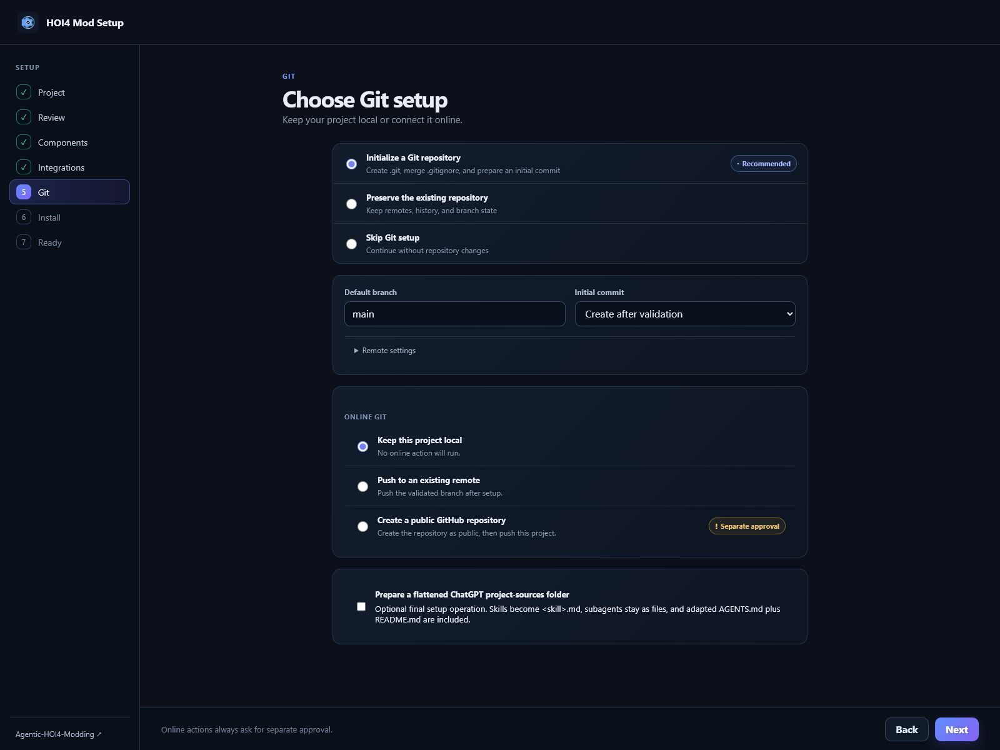
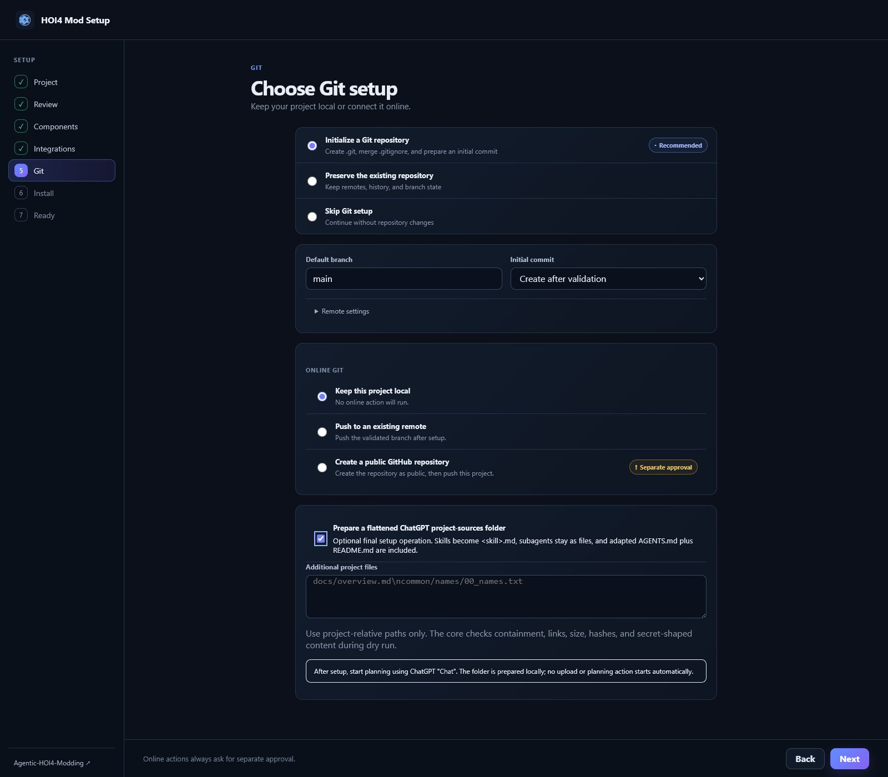

# HOI4 Mod Setup

HOI4 Mod Setup is a Windows and macOS desktop wizard that prepares a new or
existing Hearts of Iron IV mod for agentic development. It creates launcher
files, project structure, verified workflow files, and a readiness report
without silently replacing user work.

> **Current release:** [HOI4 Mod Setup 0.1.0](https://github.com/klimPaskov/HOI4-Mod-Setup/releases/tag/0.1.0) is a public prerelease with Windows and macOS installers.

## Install

The public source repository is [klimPaskov/HOI4-Mod-Setup](https://github.com/klimPaskov/HOI4-Mod-Setup).

### Downloads

- Windows: [HOI4-Mod-Setup-windows-x64-setup.exe](https://github.com/klimPaskov/HOI4-Mod-Setup/releases/download/0.1.0/HOI4-Mod-Setup-windows-x64-setup.exe)
- Mac (Apple silicon): [HOI4-Mod-Setup-macos-arm64.dmg](https://github.com/klimPaskov/HOI4-Mod-Setup/releases/download/0.1.0/HOI4-Mod-Setup-macos-arm64.dmg)
- Mac (Intel): [HOI4-Mod-Setup-macos-x64.dmg](https://github.com/klimPaskov/HOI4-Mod-Setup/releases/download/0.1.0/HOI4-Mod-Setup-macos-x64.dmg)
- [Release details and checksums](https://github.com/klimPaskov/HOI4-Mod-Setup/releases/tag/0.1.0)

This prerelease is source-built from one public commit. Windows or macOS may
ask for a platform security confirmation because stable publisher signing and
notarization are separate release gates. Before installing, verify the
included provenance and SHA-256 files against the public source commit. Do not
download installers from unverified mirrors.

## Use the wizard, phase by phase

The wizard has seven phases. Work from top to bottom; each Next button moves
reviewed state forward, and the Back button keeps earlier choices editable.
Screenshots below are arranged in the same order as the workflow.

### 1. Project — choose what you are preparing

Choose **Create new mod** for a fresh launcher-ready scaffold or **Existing
mod** for a bounded, read-only scan. Codex is the default planning provider;
the provider selection view lets you choose Claude, Kimi, GLM, DeepSeek, a
local model, or another explicitly configured route before analysis begins.

For an existing mod, choose **Import existing mod** or use **Manage an existing
project** to check a setup already created by the wizard.

The selected profile shapes conventions and instructions, but it never writes
files or approves the transaction.

### 2. Review — describe the mod and confirm its identity

For a new mod, enter only a name and a short natural-language brief. The app
immediately fills the project ID, script prefix, primary namespace, descriptor
tags, and starter folders. Review or edit them; manual edits stay preserved if
the description or provider proposal changes.

For an existing mod, the same phase shows scan findings with evidence,
confidence, proposed action, and an editable decision. The scan does not create
temporary files or alter the project. If the project already has a valid HOI4
Mod Setup lock, the review shows **Repair or add workflows**. Use it later to
restore managed files or add the 3D workflow without starting over.

### 3. Components — select verified workflow material

Select the components you want. The app expands declared dependencies, resolves
latest mode to one exact commit (or uses your pinned commit/release), downloads
only manifest-declared files, and shows hashes before installation. Unselected
components are not fetched.

### 4. Integrations — handle optional workflows honestly

The 3D question is exactly **Do you want to set up the 3D models workflow?**.
Its Meshy key stays in the OS credential vault and is injected only when the
allowlisted workflow needs `MESHY_API_KEY`. A missing key leaves 3D incomplete
without blocking core setup. The LoRA question records interest only in
version 1; it does not install ComfyUI, models, Python, GPU software, or
drivers.

MCP and provider credentials are reviewed here. Secrets are never placed in
the project, installation lock, logs, or screenshots.

### 5. Git — preserve the project and optionally make Chat sources

Choose whether to initialize, preserve, or skip Git; review `.gitignore`,
branch, initial commit, and remote choices. The app never creates an online
repository or pushes without separate approval.

When Codex is selected, the optional final setup choice prepares
`chatgpt_project_sources/` for ChatGPT **Chat**. It flattens skills to
`<skill>.md`, includes the adapted `AGENTS.md`, created `README.md`, selected
subagents, and only the extra project-relative files you name. It appears only
for Codex and leaves the normal source tree intact.

### 6. Install — inspect the dry run before applying

Read the planned files, source revision, hashes, conflicts, external commands,
Git actions, and optional workflows. After approval the transaction runs
preflight, selective download, checksum verification, backup, staging,
validation, apply, post-install checks, readiness, and rollback-record steps.
Modified files are compared as base/local/incoming content; only valid keep,
replace, merge, rename, or skip actions are offered.

### 7. Ready — use the verified result

The final report checks descriptors, launcher destination, structure, installed
agent files, provider configuration, MCP, wiki integrity, Git, hashes,
dependencies, optional workflow state, and conflicts. **Open in Codex** is
enabled only when blocking core checks pass. If you selected flattened Chat
sources, the final message only recommends: **After setup, start planning using
ChatGPT "Chat".**

The browser screenshots are UI guidance, not native-package evidence. The
preview intentionally shows honest unavailable states when a Tauri process or
remote manifest is not present; native package verification and desktop launch
smoke run on the Windows and macOS GitHub Actions runners.

## Choose a planning provider

Codex is the default. The first screen lets you choose:

- Codex through the official local Codex App Server and ChatGPT sign-in;
- Claude through an Anthropic-compatible endpoint and an API key in the OS
  credential vault;
- Kimi, GLM, or DeepSeek through a user-supplied OpenAI-compatible HTTPS
  endpoint and vault key;
- a local model through a user-supplied loopback HTTP endpoint; or
- another OpenAI-compatible provider through its explicit HTTPS endpoint and
  vault key.

The selected model and provider profile shape the analysis prompt, adapted
`AGENTS.md`, project `README.md`, and maintenance review. The app does not
invent provider URLs, OAuth routes, commands, packages, or model names. Rust
validates every provider response against the same review schema before the
user can approve a plan.

## Create or import a mod

For a new project, enter a mod name and describe it in plain language. The app
immediately fills an editable project ID, script prefix, namespace, descriptor
tags, and starter folders; the selected provider can refine those suggestions
before review. You do not need to invent naming conventions from scratch. For
an existing project, a
bounded read-only scan records evidence for descriptors, launcher state,
structure, Git, identifiers, naming, localisation, docs, skills, subagents,
Codex/MCP files, paths, and conflicts before semantic review.

After review and dry-run approval, the app can create and validate:

- `descriptor.mod`, the launcher descriptor, and a replaceable `thumbnail.png`;
- the selected HOI4 folder scaffold;
- adapted `AGENTS.md`, `README.md`, skills, subagents, Codex/MCP files;
- selected scripts, validators, templates, docs, and
  `<mod_project>/paradox_wiki/`; and
- `.hoi4-mod-setup/install.lock.json` after final verification.

## Optional ChatGPT sources folder

When Codex is selected, the Git phase offers an optional final checkbox to
prepare `<mod_project>/chatgpt_project_sources/`. It includes the adapted
`AGENTS.md`, created `README.md`, every skill as `<skill>.md`, every selected
subagent, and only the additional project-relative files the user names. The
normal source trees remain intact. The app checks containment, links, hashes,
collisions, file sizes, and secret-shaped content through the transaction.

The final screen only recommends: **After setup, start planning using ChatGPT
"Chat".** No upload, conversation, or planning action starts automatically.

## Safe installation and updates

Every mutation uses preflight, exact source resolution, selective download,
SHA-256 verification, dry-run review, backup, staging, validation, apply,
post-install checks, readiness, and a rollback record. Modified files receive
base/local/incoming comparison and only valid keep, replace, merge, rename, or
skip choices. Update, repair, reinstall, rollback, and managed removal remain
available with honest incomplete or unsupported states.

## Optional workflows

The app asks exactly **Do you want to set up the 3D models workflow?** A Meshy
key is stored in Windows Credential Manager or macOS Keychain and injected only
as `MESHY_API_KEY`. A missing key leaves 3D incomplete without blocking core
setup; Windows-oriented repository steps are not translated into invented
macOS commands.

It also asks exactly **Do you want to set up LoRAs and ComfyUI for portrait
generation?** Version 1 records interest only. It does not install or modify
ComfyUI, models, LoRAs, Python, GPU software, or drivers.

## Privacy and security

The app has no telemetry in version 1. Provider keys and ChatGPT tokens never
enter project files, plans, locks, logs, or screenshots. Only approved evidence
is sent for semantic analysis. Source files are resolved to one exact manifest
revision and SHA-256 checked. External actions appear in the dry run, and
user-modified files are never silently replaced.

Contributor setup, security reporting, and release maintenance are in
[CONTRIBUTING.md](CONTRIBUTING.md), [SECURITY.md](SECURITY.md),
[DEVELOPMENT.md](DEVELOPMENT.md), and [RELEASING.md](RELEASING.md).

## License

HOI4 Mod Setup is released under the [Apache License 2.0](LICENSE).
