# HOI4 Mod Setup

HOI4 Mod Setup is a desktop wizard for preparing a Hearts of Iron IV mod for
AI-assisted development. Start a new mod from its name and description, or
choose an existing mod to add, update, or repair its development setup.

The app supports Codex, Claude, Kimi, GLM, DeepSeek, local models, and custom
providers. Codex is selected by default.

## Download

- Windows: [Download the `.exe` installer](https://github.com/klimPaskov/HOI4-Mod-Setup/releases/latest/download/HOI4-Mod-Setup-windows-x64-setup.exe)
- Mac with Apple silicon: [Download the `.dmg`](https://github.com/klimPaskov/HOI4-Mod-Setup/releases/latest/download/HOI4-Mod-Setup-macos-arm64.dmg)
- Mac with Intel: [Download the `.dmg`](https://github.com/klimPaskov/HOI4-Mod-Setup/releases/latest/download/HOI4-Mod-Setup-macos-x64.dmg)

[View the latest release](https://github.com/klimPaskov/HOI4-Mod-Setup/releases/latest)

On Windows, run the downloaded setup file. On Mac, open the disk image and
move HOI4 Mod Setup to Applications. Your computer may occasionally flag a new
community build as harmful falsely. The project is safe and open source.

## Using the app

The wizard has seven short phases. Nothing is added to the mod until you have
reviewed the changes and started installation.

### 1. Choose a project and AI provider

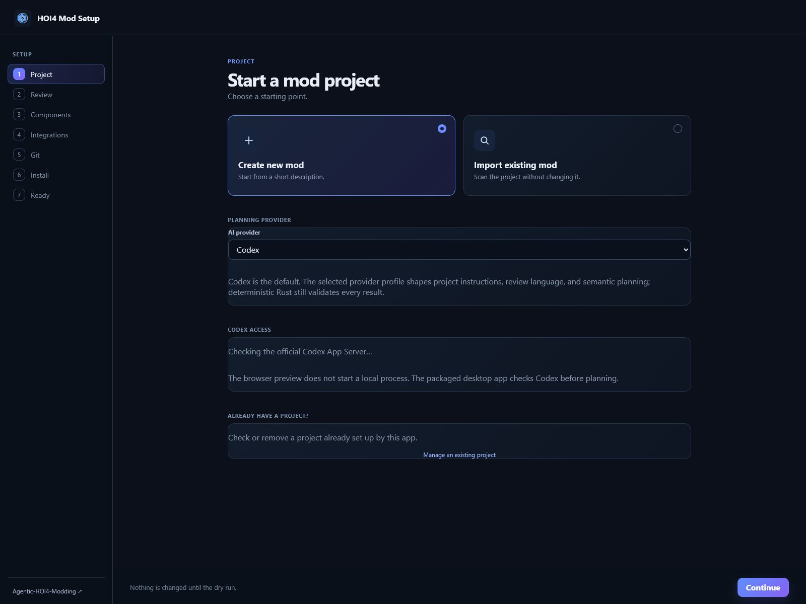

Choose **Create new mod** or **Import existing mod**. For Codex, sign in with
ChatGPT. For Claude, Kimi, GLM, or DeepSeek, paste an API key from the provider;
the app fills the normal connection details automatically. Local and custom
models let you enter the address supplied by that model service.

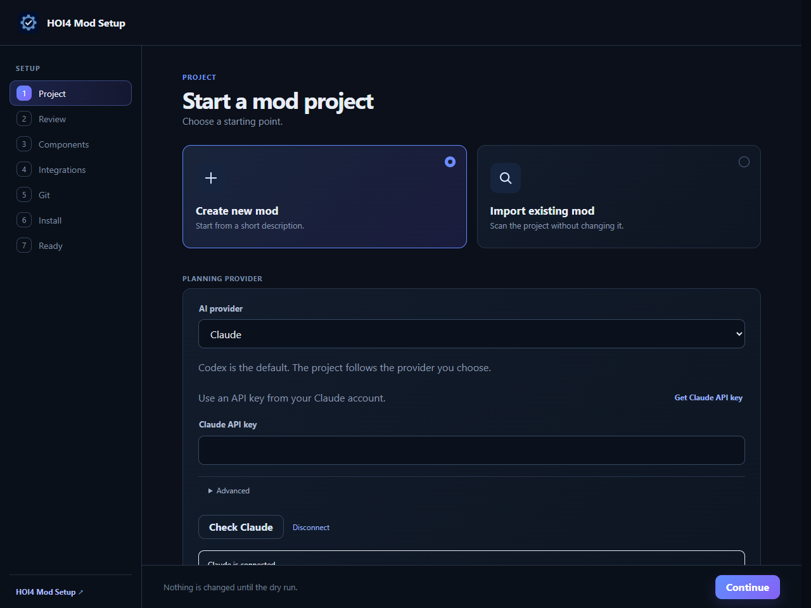

**Manage an existing project** scans any selected mod before changing it. If the
scan finds app-managed setup, the view also offers repair, update, optional
workflow, and removal actions. Choose the project folder; the app finds its
launcher file.

When the scan finds an `AGENTS.md`, flattened skill, or subagent, the scan
results and maintenance view offer **Package ChatGPT project
sources**. The package page defaults to the Downloads folder, keeps `AGENTS.md`,
`README.md`, every flattened skill, and every subagent selected, and lists root
Markdown files as optional unchecked entries. The ZIP is written outside the
mod project without changing it.

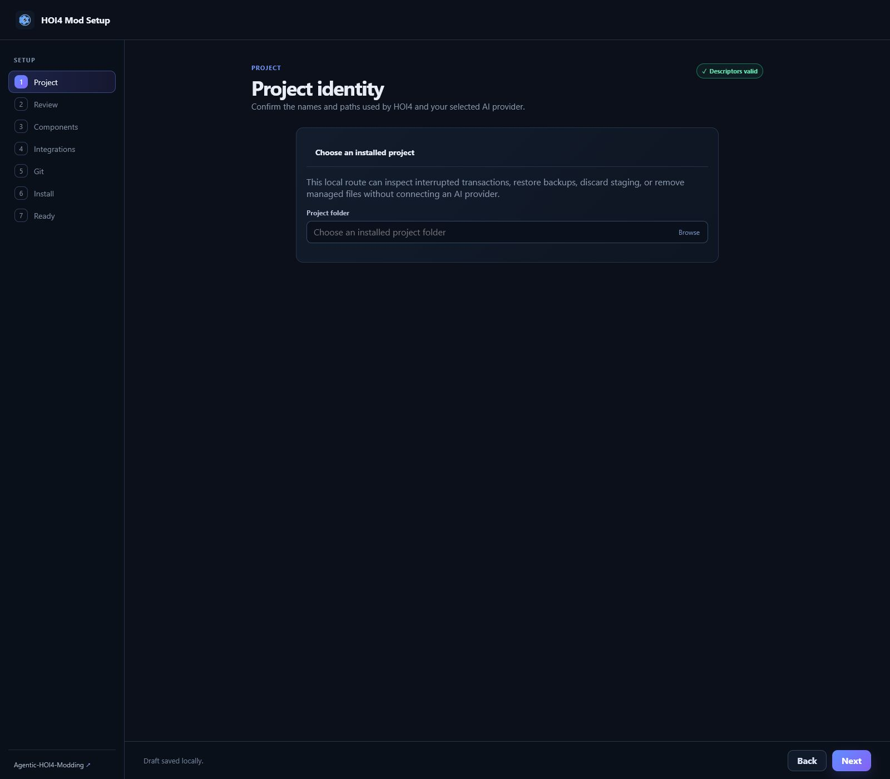

### 2. Describe the mod and review its details

For a new mod, enter its name and a short description.

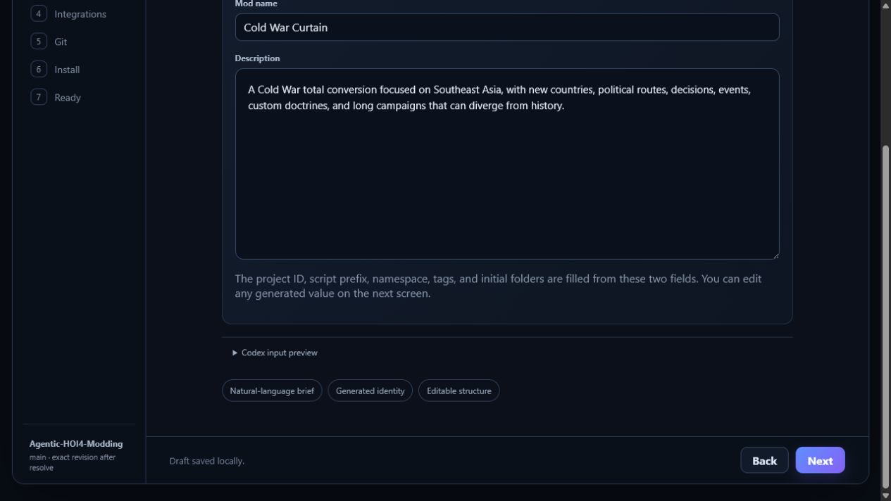

The app fills the project ID, script prefix, namespace, valid descriptor tags,
starter folders, standard HOI4 mod location, and launcher file. Every generated
value remains editable. It also prepares `descriptor.mod`, the launcher
descriptor, and a replaceable 600x600 black `thumbnail.png`.

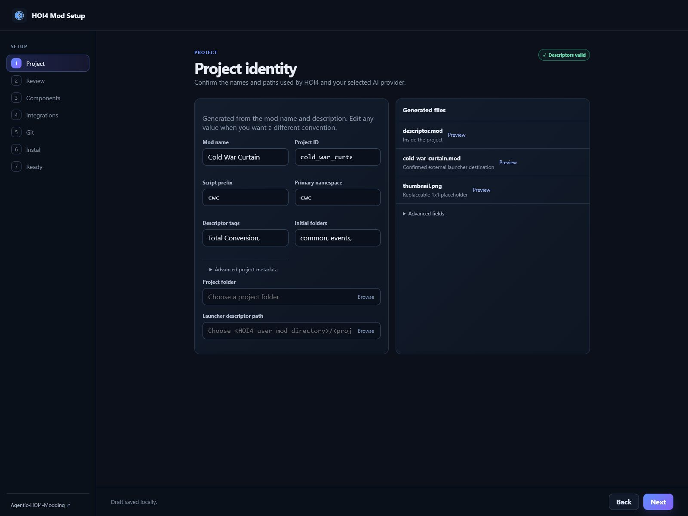

For an existing mod, a read-only scan checks the descriptors, project
instructions, skills, subagents, Codex/MCP configuration, managed setup state,
bounded Git evidence, and possible setup conflicts before any changes are
offered. It does not open or count ordinary gameplay, localisation, media, or
unrelated data dumps, so even very large mods stay within the setup scan.

### 3. Choose what to install

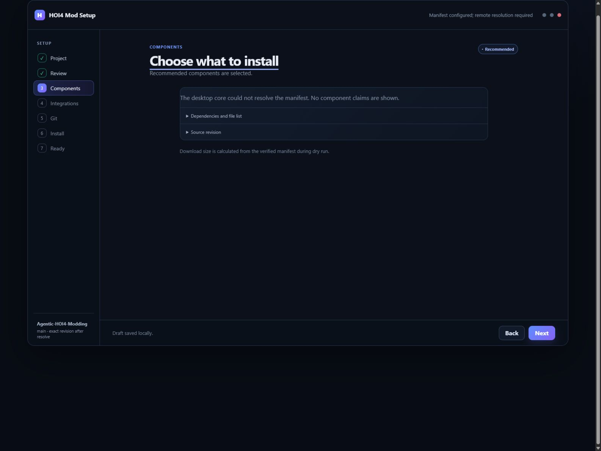

Select the instructions, skills, helpers, tools, and offline wiki you want.
Required items stay selected so the project remains usable.

When Codex is selected, **Prepare a flattened ChatGPT project-sources folder**
creates a separate folder with the adapted project guidance, README, selected
skills, and selected subagents. The offline wiki is not copied into this
folder. Its file list and sizes are shown before installation.

### 4. Add optional workflows

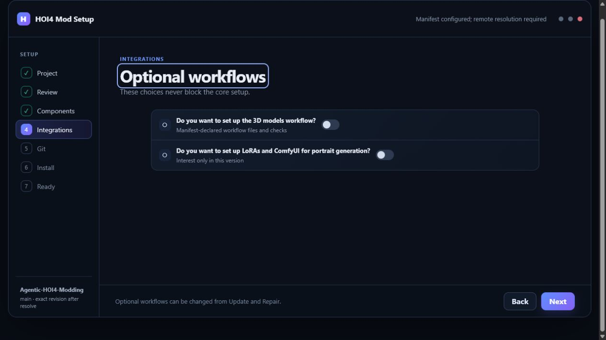

The 3D workflow is optional. If selected, a Meshy key can be stored in Windows
Credential Manager or macOS Keychain and is never written into the mod.

The optional Super Events workflow adds the reusable popup, templates,
examples, images, and supporting guidance needed to add more Super Events.
Installed runtime filenames use the confirmed mod script prefix; `hoi4ms_*`
remains only as the upstream source-package naming.

The optional ComfyUI portrait production workflow supports Comfy Cloud, Local
ComfyUI, RunPod, or Disabled for generic projects. Its expanded panel shows the
minimum requirement: **16 GB VRAM and 25 GB storage**. Only the selected
provider's instructions are installed. Sourced portraits use the pinned source
or processing workflow; non-sourced fictional or impossible portraits use
native ImageGen and never enter ComfyUI. See
[`docs/32_comfyui_portrait_pipeline.md`](docs/32_comfyui_portrait_pipeline.md)
for the current workflow and setup details.

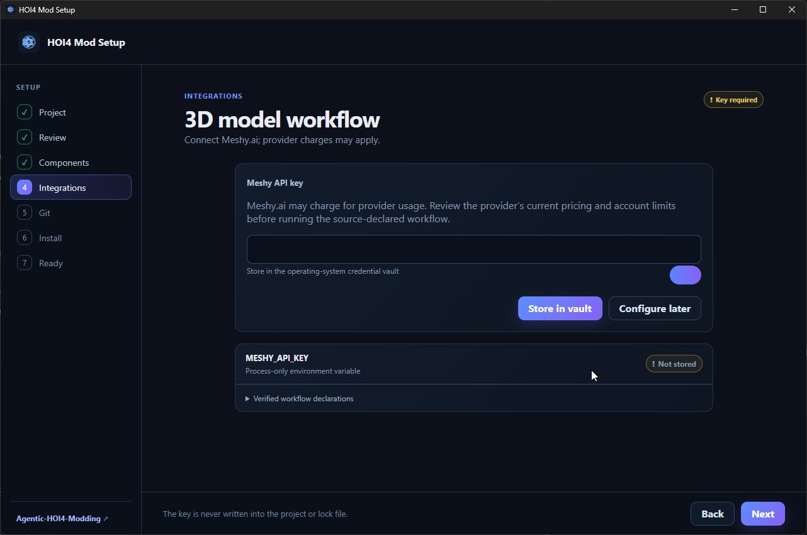

### 5. Choose Git setup

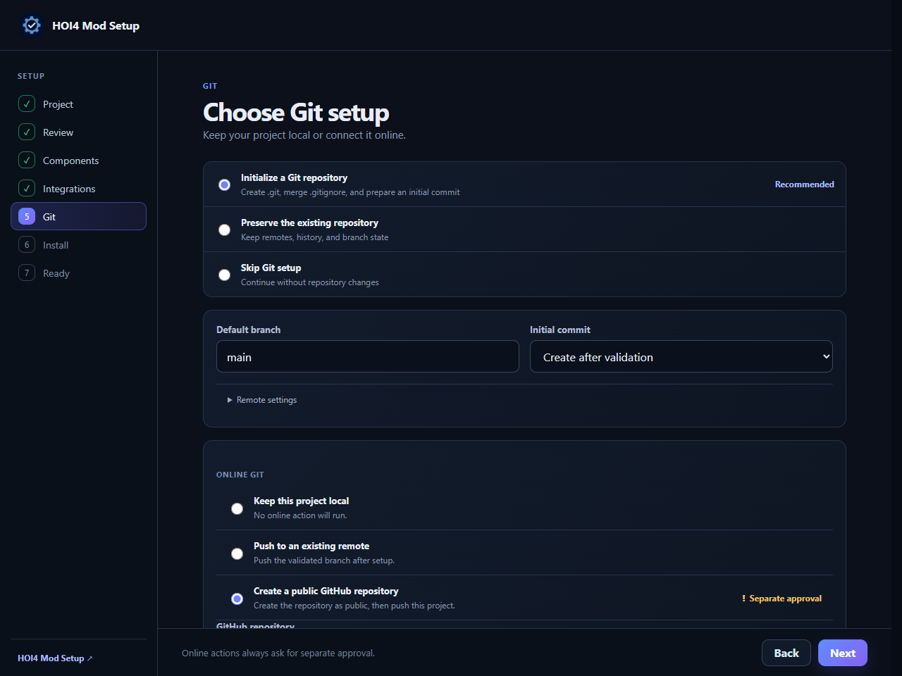

Initialize Git, preserve an existing repository, or skip Git. You can keep the
project local, connect an existing remote, or create a public GitHub repository.
Publishing and pushing always require a separate confirmation.

### 6. Review and install

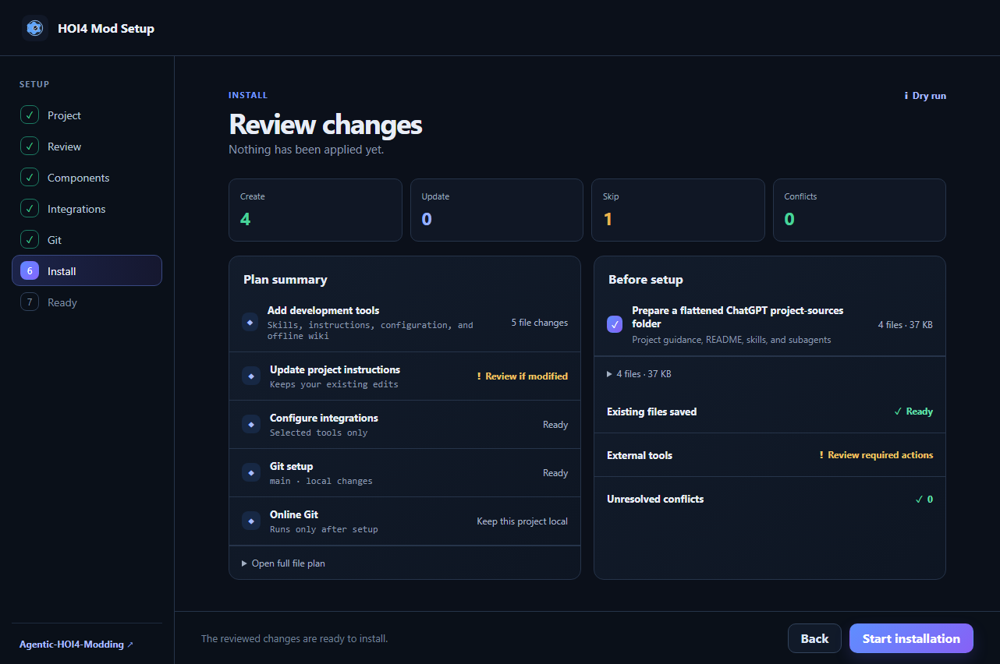

Review the files and folders that will be added or updated. If an existing file
was edited, the app asks whether to keep it, use the new version, merge it, keep
both, or skip the change when those choices are valid.

Installation shows live progress, completed file counts, percentages, and an
estimated time. If setup is interrupted, reopening the project offers the safe
recovery choices that still apply.

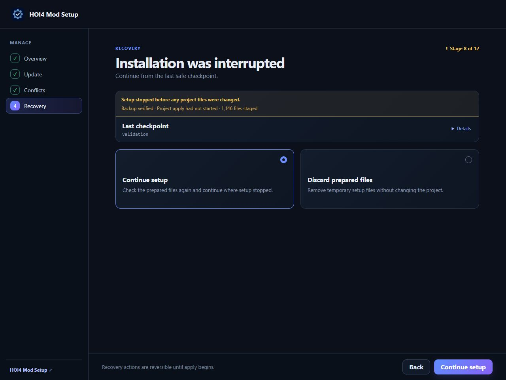

### 7. Open the prepared project

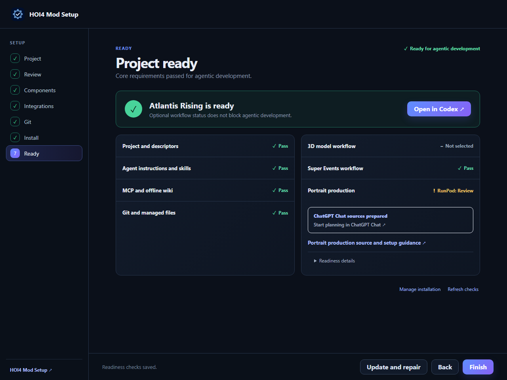

The Ready screen checks the project, instructions, selected tools, offline
wiki, Git state, and optional workflows. **Open in Codex** becomes available
when the required checks pass.

If flattened ChatGPT files were selected, the Ready screen links directly to
[ChatGPT Chat](https://chatgpt.com). When the optional portrait workflow is
enabled, it also shows its persisted Cloud, Local, or RunPod readiness and
canonical source guidance, or the explicit Disabled state. Chaos Redux uses
RunPod API-first; computer control is used only when explicitly requested.
Non-sourced fictional or impossible portraits use native ImageGen. Disabled
generic projects keep source-based portrait handling without ComfyUI-specific
project files. See
[`docs/32_comfyui_portrait_pipeline.md`](docs/32_comfyui_portrait_pipeline.md).

### Update, repair, or add a workflow later

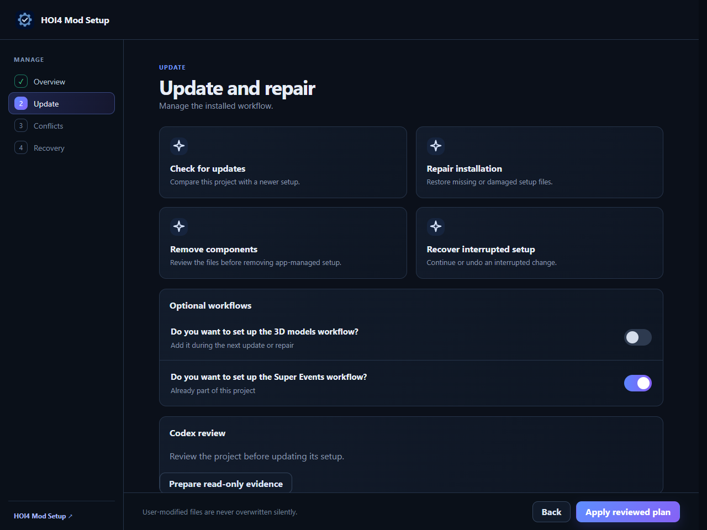

Open **Manage an existing project** to check for setup updates, repair missing
or damaged files, change the portrait provider, add the 3D or Super Events
workflow later, remove installed components, or recover an interrupted setup.
Changes are shown for review before they are applied.

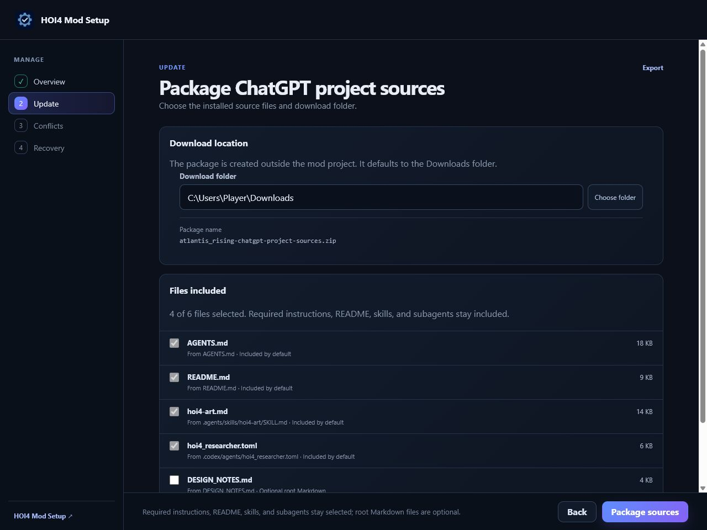

The source-package page shows the external download folder and the exact files
that will be included. Required flattened sources stay selected; root Markdown
files are optional and unchecked until chosen.

HOI4 Mod Setup checks for app updates when it opens. If a newer signed version
is found, the app shows the update immediately, downloads and verifies it,
replaces the current installation, and restarts into the new version. If the
update fails, the running version remains usable and a retry action appears.

## Privacy

HOI4 Mod Setup has no telemetry. Provider keys stay in Windows Credential
Manager or macOS Keychain. ChatGPT sign-in is handled by Codex, and secret
values are not written into the mod.

## License

HOI4 Mod Setup is released under the [Apache License 2.0](LICENSE).
