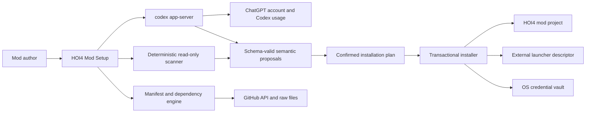
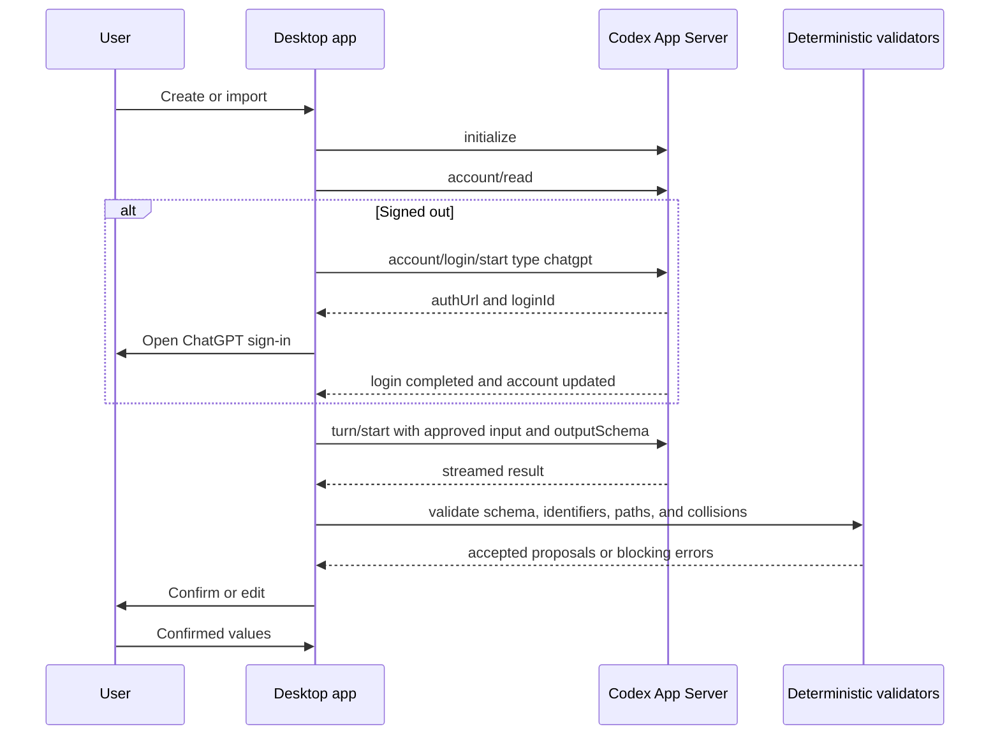
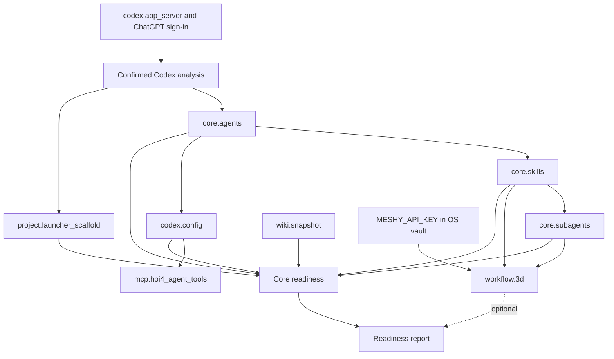
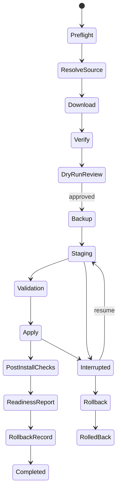

# Mermaid diagrams

Standalone Mermaid files are under `diagrams/`.

## System context

## ChatGPT authentication and analysis

## Component graph

## Transaction

Additional files cover new project, existing project, merge and update, credentials, readiness, and recovery.
